# Software Requirements Specification (SRS)
# Horse Racing Tournament Management System — HRTMS Phase 1

**Mã dự án:** SU26SWP03
**Ngày:** 28/06/2026
**Chuẩn áp dụng:** IEEE 29148:2018 / IEEE 830-1998 / UML 2.5

---

## 📌 ERRATA / ADDENDUM — Quyết định thay đổi scope (cập nhật sau ngày ban hành gốc)

> **Ngày quyết định:** (điền ngày cả nhóm chốt)
> **Quyết định:** Cả nhóm đồng thuận **loại bỏ hoàn toàn** tính năng **Family Relationship Declaration / Conflict of Interest (COI) Check / Jockey Independence Check** khỏi phạm vi Phase 1.
>
> **Lý do:** Đối chiếu thực tế các môn thể thao tương tự (bóng đá, v.v.), ràng buộc "không cho phép quan hệ gia đình giữa các bên tham gia" không phải thông lệ phổ biến — trường hợp thực tế gần nhất chỉ là quy định trọng tài không được điều hành trận đấu có đội tuyển quốc gia mình. Ngoài ra, audit kỹ thuật trước đó cho thấy cơ chế resolve định danh (`MatchConfidence`) chưa từng hoạt động đúng, khiến kiểm tra COI mang tính hình thức.
>
> **Phạm vi bị ảnh hưởng (đã xóa khỏi code, schema, và cần coi là lỗi thời trong tài liệu bên dưới):**
> - Bảng `FamilyRelationshipDeclarations` và toàn bộ Entity/DTO/Service/Controller liên quan (`FamilyDeclarationService`, `IdentityResolveService`, `IndependenceCheckService`)
> - Cột `IndependenceCheckStatus/CheckedByRefereeId/CheckedAt/ViolationReason` trên `RaceEntries`
> - Cột `CoiCheckStatus/CoiCheckedAt/CoiViolationReason` trên `RefereeAssignments` và `DoctorAssignments`
> - Business rule: **BR-06, BR-25, BR-32 (phần khai báo gia đình), BR-40 (phần "khai báo gia đình" trong chính sách xóa an toàn), BR-47, BR-61, BR-62**
> - Use case/UI liên quan: mục "Pha 4: Official Assignment & COI Clearance" (COI check vẫn giữ phần double-booking/Lead Referee, chỉ bỏ phần đối chiếu quan hệ gia đình), UI-S25/S27/S30 (tab khai báo gia đình), bước B2 đăng ký (khai báo gia đình cho Jockey/Referee), trang khai báo COI trong Profile (Jockey/Doctor/Referee)
> - ERD: bỏ bảng `FamilyRelationshipDeclarations` và các FK liên quan
>
> **Các phần khác của luồng nghiệp vụ (Pre-race weigh-in, xác minh danh tính ngựa, khám lâm sàng Fit/Unfit, phân công Referee/Doctor theo lịch trùng, đúng 1 Lead Referee/race) vẫn giữ nguyên — chỉ riêng phần đối chiếu quan hệ gia đình bị loại bỏ.**
>
> Các bảng/sơ đồ/mô tả use case bên dưới **chưa được rewrite toàn bộ** để phản ánh thay đổi này (tài liệu gốc rất dài, ~40 vị trí rải rác); mọi chỗ nhắc tới "Family Relationship Declaration", "COI Check", "Independence Check", BR-06/25/47/61/62 nên được hiểu là **đã lỗi thời / không còn áp dụng**.

---


---

---

## MỤC LỤC

### Chương 1 — Giới thiệu (Introduction)
- 1.1 Mục đích (Purpose)
- 1.2 Phạm vi (Scope)
  - 1.2.1 Tên sản phẩm
  - 1.2.2 Mô tả tổng quát & 6 Actor
  - 1.2.3 In-Scope — 17 Module A–Q
  - 1.2.4 Out-of-Scope
  - 1.2.5 Lợi ích & mục tiêu đo lường được
- 1.3 Định nghĩa, Ký hiệu & Viết tắt
- 1.4 Tài liệu tham khảo (References)
- 1.5 Tổng quan tài liệu (Document Overview)

### Chương 2 — Mô tả Tổng quan (Overall Description)
- 2.1 Product Perspective
  - 2.1.1 Tính độc lập & phạm vi hệ thống
  - 2.1.2 Context Diagram — tương tác hệ thống
  - 2.1.3 Out-of-Scope Technologies
  - 2.1.4 Môi trường triển khai & hạ tầng
- 2.2 Main Flows — 6 Pha nghiệp vụ (Swimlane)
  - 2.2.1–2.2.7 Pha 1 → Pha 6
  - 2.2.8 Swimlane Diagram toàn luồng
  - 2.2.9 Happy Path & Unhappy Cases
- 2.3 Actors & Features
  - 2.3.1 Danh sách 6 Actors
  - 2.3.2 17 Module chức năng A–Q
  - 2.3.3 Ma trận Actor × Module × Pha
- 2.4 User Characteristics
- 2.5 General Constraints
  - 2.5.1 Kỹ thuật | 2.5.2 Pháp lý & quy định | 2.5.3 Thời gian | 2.5.4 Dữ liệu
- 2.6 Assumptions & Dependencies

### Chương 3 — Yêu cầu Cụ thể (Specific Requirements)
- 3.1 User Interface Requirements — 35 màn hình, 6 workspace, UI flows, ma trận màn hình × vai trò
- 3.2 Functional Requirements — 112 FR theo 17 Module A–Q (REQ-F-ACC → REQ-F-SEC)
- 3.3 Non-Functional Requirements — Performance, Security, Reliability, Usability, Scalability, Compliance
- 3.4 Conceptual & Logical ERD — 25 thực thể, 1 Conceptual ERD + 6 Logical sub-diagram
- 3.5 Technical Requirements — 3-tier Layered Monolith, React 18 / .NET 8 / SQL Server 2022 / Docker / Redis
- 3.6 Data Requirements — Data Dictionary, validation rules, retention/backup, volume & indexing

### Phụ lục (Appendices)
- Phụ lục A — Use Case Diagram & Descriptions (49 UC, 6 Pha)
  - A.1 Actor Identification | A.2 UC Inventory | A.3 UC Diagrams (PlantUML, 7 diagram)
  - A.4 UC Summary Table | A.5 Traceability Matrices (UC→FR · UC→UI · UC→Actor)
  - A.6 Diagram Descriptions | A.7 Ghi chú & Khuyến nghị
- Phụ lục B — Design Decisions (17 quyết định thiết kế đã chốt)
- Phụ lục C — Thuật ngữ & Viết tắt (Glossary)

---

# 1. INTRODUCTION

## 1.1 Purpose

Tài liệu này là Đặc tả Yêu cầu Phần mềm (Software Requirements Specification – SRS) cho Hệ thống Quản lý Giải Đua Ngựa (Horse Racing Tournament Management System – HRTMS), thuộc dự án mã số SU26SWP03, áp dụng cho phạm vi triển khai Phase 1. Tài liệu được biên soạn theo chuẩn IEEE 29148:2018 nhằm cung cấp một đặc tả đầy đủ, không mơ hồ và có thể kiểm chứng về toàn bộ yêu cầu chức năng và phi chức năng của hệ thống, làm nền tảng cho các giai đoạn thiết kế kiến trúc, phát triển phần mềm và kiểm thử chất lượng.

Bối cảnh phát sinh nhu cầu: quy trình vận hành và quản lý giải đua ngựa hiện tại được thực hiện thủ công và thiếu đồng bộ giữa các bộ phận liên quan, dẫn đến chu kỳ xử lý kéo dài từ 4 đến 6 tuần tính từ thời điểm đăng ký đến công bố kết quả, đồng thời tiềm ẩn nguy cơ sai sót trong ghi nhận dữ liệu, tính toán tiền thưởng và xác nhận kết quả. HRTMS được xây dựng để số hóa và tập trung hóa toàn bộ quy trình vận hành giải đấu, phục vụ sáu nhóm tác nhân chính: Ban tổ chức (Admin), Chủ ngựa (Horse Owner), Nài ngựa (Jockey), Trọng tài (Race Referee), Bác sĩ thú y (Doctor), và Khán giả (Spectator).

Đối tượng chính của tài liệu bao gồm: giảng viên hướng dẫn và hội đồng phản biện (đối chiếu phạm vi dự án với định hướng ban đầu), nhà thiết kế hệ thống (làm căn cứ thiết kế kiến trúc và mô hình dữ liệu), lập trình viên (triển khai đúng logic nghiệp vụ và ranh giới tính năng), và kỹ sư kiểm thử (xây dựng kịch bản kiểm thử bám sát yêu cầu). Tài liệu SRS này liên kết trực tiếp với Business Requirements Document (BRD), Architecture Design Document, User Stories and Use Cases Document, và kết quả phân tích nghiệp vụ từ các buổi thu thập yêu cầu với stakeholder. Mọi chi tiết kỹ thuật về giao diện người dùng, hiệu năng và bảo mật được dành riêng cho Chương 3 (Specific Requirements); Chương 1 chỉ phát biểu ở mức bao quát.

## 1.2 Scope

### 1.2.1 Tên Sản Phẩm

**Tên đầy đủ:** Horse Racing Tournament Management System

**Tên viết tắt:** HRTMS

**Mã dự án:** SU26SWP03

**Phạm vi áp dụng:** Phase 1 (Quản lý vận hành cốt lõi và tương tác dự đoán phi tài chính)

### 1.2.2 Mô Tả Tổng Quát

HRTMS là một nền tảng web được thiết kế để tự động hóa và quản lý tập trung toàn bộ vòng đời vận hành của một giải đấu đua ngựa, từ khâu khởi tạo giải, đăng ký tham gia, lập lịch thi đấu, kiểm tra trước giờ đua, vận hành diễn biến cuộc đua trên sân, xử lý vi phạm/khiếu nại, cho đến công bố kết quả chính thức và phân bổ điểm dự đoán. Hệ thống thay thế hoàn toàn quy trình thủ công, thiếu đồng bộ hiện tại.

Hệ thống phục vụ sáu nhóm tác nhân (Actor) với vai trò và quyền hạn được phân tách rõ ràng theo cơ chế kiểm soát truy cập dựa trên vai trò (**Role-Based Access Control – RBAC**):

- **Admin:** Quản lý toàn hệ thống (khởi tạo giải, phê duyệt cấu hình, công bố kết quả chính thức)
- **Horse Owner:** Quản lý ngựa, đăng ký tham gia giải, ghép cặp Jockey
- **Jockey:** Quản lý chứng chỉ, tham gia thi đấu, nộp khiếu nại
- **Race Referee (Trọng tài):** Ghi nhận vi phạm, xử lý khiếu nại, xác nhận thứ hạng sơ bộ
- **Doctor (Bác sĩ thú y):** Kiểm tra y tế ngựa, Jockey; cân Jockey trước/sau đua
- **Spectator:** Theo dõi và đặt dự đoán (Prediction)

Phase 1 tập trung vào các nghiệp vụ cốt lõi, triển khai trên hạ tầng web tiêu chuẩn (React frontend, .NET backend, SQL Server) không tích hợp phần cứng thời gian thực (như camera vạch đích hay chip định vị GPS của ngựa) hoặc kết nối hệ thống kế toán/thú y bên ngoài.

Hệ thống HRTMS phục vụ sáu nhóm tác nhân chính, mỗi nhóm với vai trò, quyền hạn và trách nhiệm riêng biệt được quản lý thông qua RBAC:

| **Actor (Tác nhân)** | **Tên tiếng Anh** | **Mô tả Vai trò** | **Quyền hạn chính** |
| --- | --- | --- | --- |
| **Admin** | Administrator | Quản lý toàn bộ hệ thống, cấu hình giải đấu, phê duyệt hồ sơ, công bố kết quả chính thức. | Tạo/sửa/xóa giải đấu, duyệt hồ sơ, lập lịch, công bố kết quả, xuất báo cáo, quản lý người dùng. |
| **Horse Owner** | Chủ ngựa | Quản lý thông tin ngựa, đăng ký tham gia giải, ghép cặp Jockey, xác nhận lịch thi đấu, nộp khiếu nại. | Tạo/quản lý hồ sơ ngựa, đăng ký giải, mời Jockey, xác nhận tham gia, nộp khiếu nại về vi phạm. |
| **Jockey** | Nài ngựa | Khai báo chứng chỉ hành nghề, tham gia thi đấu, cân đo trước/sau giờ chạy, nhận phân công giải đấu, nộp khiếu nại. | Khai báo chứng chỉ, xem lịch thi đấu, nhận/từ chối lời mời thuê, nộp khiếu nại về vi phạm. |
| **Race Referee** | Trọng tài / Thanh tra viên | Ghi nhận vi phạm trực tiếp, xử lý khiếu nại, xác nhận thứ hạng sơ bộ, xác minh danh tính ngựa. | Ghi nhận vi phạm, xử lý khiếu nại, xác nhận kết quả sơ bộ, xác minh danh tính ngựa tại Paddock. |
| **Doctor** | Bác sĩ thú y | Kiểm tra y tế ngựa và Jockey, duyệt biên bản y tế, cân Jockey trước/sau đua. | Kiểm tra y tế ngựa, cân Jockey, phê duyệt tình trạng sức khỏe, xác nhận yêu cầu y tế. |
| **Spectator** | Khán giả / Người dự đoán | Theo dõi giải đấu, đặt dự đoán (Win), xem kết quả, nhận phần thưởng điểm ảo. | Xem thông tin giải đấu, đặt dự đoán, xem lịch thi đấu, xem kết quả và bảng xếp hạng, quản lý ví điểm ảo. |

### 1.2.3 In-Scope

Toàn bộ các nghiệp vụ sau đây thuộc phạm vi phát triển trong Phase 1 và được hệ thống thực hiện trực tiếp. Các module được sắp xếp theo trình tự thời gian vận hành thực tế của một giải đấu:

### Module A — Quản lý Tài khoản và Phân quyền

**Tác nhân (Actor):** Tất cả Actors (Admin, Horse Owner, Jockey, Race Referee, Doctor, Spectator)

- Cho phép người dùng thuộc năm vai trò tự đăng ký (Horse Owner, Jockey, Race Referee, Doctor, Spectator) đăng ký tài khoản trên hệ thống với các trường thông tin quy chuẩn của vai trò đó. Tài khoản Admin được khởi tạo riêng, không qua luồng tự đăng ký.
- **Không dùng `AutoEligible` ở cấp đăng ký tài khoản:** `AutoEligible` chỉ dùng cho `TournamentParticipants.ScreeningStatus` và horse screening, không dùng cho `Users.Status` hoặc `*Profiles.Status`.
- **Horse Owner:** sau khi nhập thông tin chung/định danh hợp lệ, hệ thống tạo `OwnerProfiles` và set `Users.Status = Active`; Owner không cần Admin duyệt onboarding.
- **Khai báo quan hệ gia đình tại bước B2 (phân biệt theo vai trò):** Jockey và Race Referee **bắt buộc** khai báo quan hệ gia đình ruột thịt ở bước B2 (phục vụ Independence Check / COI Check sau này). Doctor **không** khai báo quan hệ gia đình ở bước B2; Doctor thực hiện khai báo tại Doctor Dashboard (workspace UI-S30) sau khi tài khoản được duyệt `Active`. Horse Owner không khai báo quan hệ gia đình (Owner là phía được kiểm tra, không phải khai báo — xem EC-38).
- Admin có quyền tối cao quản lý danh sách tài khoản theo vai trò (tạo mới, cập nhật thông tin, vô hiệu hóa tài khoản).
- Xác thực người dùng thông qua cặp thông tin tài khoản và mật khẩu (username/password) **đã mã hóa.**
- Phân quyền chức năng nghiêm ngặt dựa hoàn toàn trên vai trò (Role), đảm bảo mỗi tác nhân chỉ truy cập và thao tác được các chức năng được cấp phép.
- **Khởi tạo ví Spectator nguyên tử (EC-47):** Khi tài khoản Spectator được tạo, hệ thống tạo ví điểm ảo (`Wallets`) **và** ghi đồng thời một dòng sổ cái `VirtualPointsTransactions` loại `SignUp Bonus` (+1000 điểm) trong **cùng một giao dịch** — đảm bảo bất biến `Balance = SUM(giao dịch)` đúng ngay từ lúc tạo ví (không dùng giá trị mặc định 1000 rời rạc khiến sổ cái lệch ngay từ gốc).
- **Onboarding Jockey/Referee/Doctor (EC-37):** Hồ sơ Jockey, Race Referee và Doctor khởi tạo ở trạng thái `Pending`; Admin phải duyệt onboarding để chuyển sang `Active`. Admin xem thông tin định danh/liên hệ/DOB, license/certification/medical license, dữ liệu chuyên môn theo role, khai báo quan hệ nếu có, cảnh báo trùng identity/email/phone và lịch sử reject/suspend. **Chỉ tài khoản/profile `Active`** mới được dùng để đăng ký giải, pairing hoặc phân công nhiệm vụ.

### Module B — Quản lý Giải đấu (Admin)

**Tác nhân (Actor):** Admin

- Admin tạo mới giải đấu bắt buộc phải thiết lập các thông số kỹ thuật đặc thù ngành đua ngựa chuyên nghiệp bên cạnh các thông tin cơ bản:
    - **Thông tin cơ bản:** Tên giải đấu, thời gian bắt đầu, thời gian kết thúc, quy mô giải.
    - **Giống ngựa cho phép (`AllowedBreed`):** Chọn từ danh mục chuẩn hóa (Thoroughbred, Arabian, Quarter Horse, Mixed) dưới dạng **single-select dropdown (chọn đúng 1 giống ngựa duy nhất cho mỗi giải)**. Không được để trống.
    - **Mặt đường chạy (`TrackType`):** Chọn loại mặt đường thi đấu (Turf – Đường cỏ, Dirt – Đường cát/đất nện, Synthetic – Đường tổng hợp).
    - **Khoảng cách đua (`RaceDistance`):** Thiết lập khoảng cách thi đấu tính bằng mét, cho phép Admin nhập số nguyên trong khoảng `>1200` và `<2400`; UI gợi ý các mốc phổ biến như 1600m/2000m để giảm nhập sai.
    - **Hạng mục thi đấu (`RaceCategory`):** Chọn phân hạng thi đấu của cuộc đua (Open – Giải mở, Classic – Giải tiêu chuẩn đỉnh cao, Maiden – Giải dành cho ngựa chưa từng thắng).
    - **Kinh nghiệm tối thiểu của Jockey (`MinJockeyExperienceYears`):** Quy định số năm kinh nghiệm tối thiểu nài ngựa phải có để đăng ký tham gia giải đấu này (ví dụ: giải quốc gia yêu cầu tối thiểu 5 năm, giải địa phương yêu cầu tối thiểu 1 năm).
    - **Lệ phí đăng ký tham gia (`EntryFeeAmount`):** Admin thiết lập mức lệ phí mà Horse Owner phải đóng khi đăng ký ngựa vào một cuộc đua cụ thể. Giá trị mặc định là `0` (miễn phí). Nếu `EntryFeeAmount = 0`, hệ thống tự động bỏ qua toàn bộ luồng xác nhận phí — xem Module C.
    - **Cấu hình tỷ lệ chia thưởng (`PrizeDistributions` — EC-33):** Admin nhập 5 tỷ lệ phần trăm cho các vị trí Top1–Top5; hệ thống lưu thành bảng cấu hình `PrizeDistributions` (mỗi vị trí một dòng) và **validate tổng = 100%** ngay khi lưu. Đây là nguồn dữ liệu thật để hệ thống tính phân bổ Purse khi công bố kết quả (Module K) — không dùng tỷ lệ cứng.
    - **Ngưỡng cảnh báo cân nặng (EC-39):** Admin cấu hình ngưỡng chênh lệch cân nặng trước đua (`PreRaceWeightThresholdKg`, mặc định 2.0kg) và sau đua (`PostRaceWeightDiffThresholdKg`, mặc định 1.0kg) cho mỗi giải — thay cho giá trị "ví dụ" cố định trong tài liệu cũ.
- Hỗ trợ lập cấu trúc giải đấu gồm các vòng đua (Vòng loại – Round, Bán kết, Chung kết) và các cuộc đua (Race) cụ thể trong từng vòng thi đấu.
- **Ràng buộc lập lịch & quỹ phân cấp (EC-34/EC-35):** Khi tạo Round/Race, hệ thống cưỡng chế `Tournament.StartDate ≤ Round.ScheduledDate ≤ Race.ScheduledTime ≤ Tournament.EndDate` và `Race.ScheduledTime > thời điểm hiện tại`; đồng thời tổng `Race.PurseAmount` của giải không được vượt `Tournament.PurseAmount`.
- **Vòng đời trạng thái giải đấu (EC-36):** `Tournaments.Status` chỉ quản lý vòng đời cấp giải: `Draft → Open Registration → Closed Registration → Completed` hoặc `Cancelled`. `Pre-Race`, `Live/In-Progress`, `Unofficial`, `Official` là trạng thái cấp `Race`, không lưu ở Tournament. Trạng thái giải đang diễn ra được suy ra từ các Race con; mỗi chuyển tiếp vẫn phải ghi AuditLog.
- Cho phép Admin quản lý, cập nhật thông tin hoặc hủy giải đấu trước khi giải đấu bắt đầu chính thức.
- **Luồng hủy giải (Tournament Cancellation Flow — EC-30/EC-32):** Khi Admin hủy một giải đã có dữ liệu phát sinh, hệ thống tự động thực hiện trong một giao dịch nhất quán: hủy mọi `RaceEntry` liên quan (`Cancelled`), hoàn lại điểm ảo cho mọi dự đoán đang chờ (`Prediction Refund`), **(EC-32) tự động chuyển lệ phí đã đóng sang `Refund Pending`** cho mọi entry có `EntryFeeAmount > 0`, vô hiệu hóa các Pairing/PursePayouts liên quan, gửi thông báo đến các Actor bị ảnh hưởng và ghi `AuditLog` (`Cancel_Tournament` + `Update_Entry_Fee_Status`).

### Module C — Quản lý Đăng ký Ngựa Thi đấu và Duyệt Hồ sơ

**Tác nhân (Actor):** Horse Owner (Khai báo), Admin (Phê duyệt)

- Horse Owner đăng ký ngựa tham gia giải đấu bắt buộc phải khai báo hồ sơ chi tiết bao gồm thông tin hành chính lẫn thông số thú y và y tế chuyên nghiệp:
    - **Thông tin hành chính:** Tên ngựa, năm sinh (`BirthYear` – hệ thống tự động tính tuổi bằng công thức `Năm hiện tại - BirthYear`), giới tính, màu sắc, huyết thống, trọng lượng, đặc điểm nhận dạng nổi bật.
    - **Thông số y tế chuyên sâu:** Giống ngựa (`Breed` – FK liên kết bảng giống ngựa), số tham chiếu biên bản tiêm phòng hợp lệ (`VaccinationRecordRef`), ngày kiểm tra doping gần nhất (`DopingTestDate`) và kết quả kiểm tra doping gần nhất (`DopingTestResult` gồm các trạng thái: `Clean`, `Pending`, `Failed`).
- Admin thực hiện xem xét và phê duyệt hoặc từ chối hồ sơ ngựa dựa trên tiêu chuẩn hợp lệ đã thiết lập:
    - **Tự động đối chiếu giống ngựa:** Hệ thống tự động so khớp `Horse.Breed` với giống ngựa duy nhất (`Tournament.AllowedBreed`, single-value) đã cấu hình của giải. Nếu không khớp -> Hệ thống tự động ngăn chặn phê duyệt (auto-reject) và báo lỗi cụ thể; Admin không thể override.
    - **Ràng buộc lý do từ chối:** Khi Admin click “Từ chối” (Reject) hồ sơ ngựa, hệ thống bắt buộc Admin phải nhập lý do từ chối (Trường `reason` là `NOT NULL` và có độ dài tối thiểu 10 ký tự). Hệ thống tự động gửi thông báo trực tiếp kèm lý do đến Horse Owner.
- **Cam kết pháp lý khi khai báo (ràng buộc hành chính - EC-22):** Trước khi gửi hồ sơ, Horse Owner bắt buộc tích vào điều khoản cam kết tính trung thực của thông tin y tế tự khai (`Breed`, `VaccinationRecordRef`, `DopingTestDate`, `DopingTestResult`) và chịu trách nhiệm pháp lý về tính chính xác. Khai báo gian dối là căn cứ để Admin vô hiệu hóa tài khoản và hủy kết quả liên quan. Trong Phase 1, hệ thống dùng cơ chế tự khai + cam kết pháp lý thay cho đối chiếu chứng từ tự động.
- **Re-validate sau phê duyệt (EC-23):** Sau khi hồ sơ ngựa đã `Approved`, nếu Horse Owner chỉnh sửa bất kỳ trường nhạy cảm nào (`DopingTestResult`, `Breed`, `VaccinationRecordRef`, `DopingTestDate`), hệ thống tự động đưa hồ sơ về trạng thái `Pending`, treo/hủy Pairing liên quan và chạy lại Auto-reject; Admin bắt buộc duyệt lại trước khi ngựa được đưa vào lập lịch.
- [!IMPORTANT] 
**Lưu ý về tách luồng (F1):** Bước duyệt hồ sơ ngựa ban đầu của Admin tại module này hoàn toàn độc lập và không bao gồm việc kiểm tra chứng chỉ hành nghề của Jockey đi kèm. Việc xác minh tính độc lập của Jockey (Jockey Independence Check) được trì hoãn và thực hiện tại giai đoạn chuẩn bị trước ngày thi đấu (xem Module G).
- **Luồng ghi nhận lệ phí Entry Fee (Phase 1 — Admin xác nhận thủ công):**
    - Khi Horse Owner gửi đăng ký ngựa tham gia cuộc đua, hệ thống tự động tạo bản ghi `RaceEntry` với `EntryFeeStatus = 'Unpaid'` (trừ khi `Tournament.EntryFeeAmount = 0` — khi đó tự động `Paid`, toàn bộ luồng bên dưới bị bỏ qua).
    - Horse Owner thực hiện thanh toán lệ phí theo phương thức ngoài hệ thống (chuyển khoản ngân hàng, nộp tiền mặt tại quầy) rồi thông báo cho Admin.
    - Admin xác nhận đã nhận phí, sau đó cập nhật `EntryFeeStatus = 'Paid'` trực tiếp trên hệ thống; hành động này ghi nhận `EntryFeeConfirmedBy` và `EntryFeeConfirmedAt` vào `RaceEntry` và tạo một mục `AuditLog` với action `Update_Entry_Fee_Status`.
    - **Ràng buộc Approve tại Node 2.5:** Nút "Phê duyệt" hồ sơ ngựa của Admin bị **khóa cứng (disabled)** khi `RaceEntry.EntryFeeStatus != 'Paid'`. Admin bắt buộc phải xác nhận phí trước khi có thể duyệt hồ sơ tham gia cuộc đua.
    - **Luồng hoàn phí tự động (EC-32):** Khi entry đã `Paid` bị Withdrawal (rút lui/quá hạn), Emergency Disqualification (loại tại Paddock) hoặc Tournament Cancellation, hệ thống **tự động** chuyển `EntryFeeStatus: Paid → Refund Pending` **ngay trong cùng giao dịch** của các luồng đó (không phụ thuộc trí nhớ Admin), kèm Notification cho Owner và Audit Log `Update_Entry_Fee_Status`. Admin sau đó xử lý hoàn trả ngoài hệ thống rồi chốt `Refunded`. Phase 1 không tích hợp cổng thanh toán tự động (Payment Gateway để Phase 2).
- [!TÍNH NĂNG **KHÔNG** BAO GỒM]
**Về thông tin sức khỏe ngựa (F3):** Toàn bộ dữ liệu sức khỏe, tiêm phòng và doping trong Phase 1 được **ghi nhận thủ công vào hệ thống** bởi người dùng có thẩm quyền dựa trên các biên bản giấy từ bác sĩ thú y tại sân; hệ thống không kết nối API với bất kỳ bệnh viện thú y hay phần mềm bên ngoài nào.

### Module D — Quản lý Nài ngựa (Jockey)

**Tác nhân (Actor):** Jockey (Khai báo), Admin (Phê duyệt), Horse Owner (Ghép cặp)

- Jockey đăng ký tài khoản bắt buộc phải khai báo các thông tin cơ bản: Tên, chứng chỉ hành nghề nài ngựa chuyên nghiệp, thông tin liên lạc và số năm kinh nghiệm làm việc thực tế (`ExperienceYears`).
- **Phê duyệt hồ sơ Jockey:** Hồ sơ khai báo của Jockey bắt buộc phải được **ADMIN phê duyệt trước** khi xuất hiện trên danh sách tìm kiếm hệ thống. Horse Owner chỉ được quyền gửi lời mời hợp tác đối với những Jockey đã ở trạng thái 'Active'.
- Horse Owner thực hiện tìm kiếm danh sách Jockey khả dụng trên hệ thống và gửi lời mời thuê Jockey cho các cuộc đua (Race) cụ thể.
- Jockey xem danh sách lời mời đang chờ phản hồi, thực hiện đồng ý hoặc từ chối lời mời.
- Khi Jockey đồng ý lời mời, Horse Owner hoàn tất việc xác nhận trên hệ thống để chính thức kết hợp cặp ngựa–Jockey.
- **Ràng buộc kiểm tra kinh nghiệm:** Hệ thống tự động kiểm tra số năm kinh nghiệm của Jockey (`Jockey.ExperienceYears`) với yêu cầu tối thiểu của giải (`Tournament.MinJockeyExperienceYears`). Nếu không đạt yêu cầu -> hệ thống ngăn chặn việc gửi lời mời hoặc ghép cặp cho giải đấu đó.
- **Thời điểm kiểm tra kinh nghiệm (EC-21):** Pairing phải gắn với một `TournamentId`; ràng buộc `Jockey.ExperienceYears ≥ Tournament.MinJockeyExperienceYears` được kiểm tra khi Owner gửi lời mời trong Tournament đó và **tái kiểm tra tại thời điểm tạo `RaceEntry`** để chặn dữ liệu cũ hoặc thay đổi điều kiện giải.
- **Cam kết khai báo quan hệ gia đình (ràng buộc hành chính - EC-18):** Jockey bắt buộc khai báo đầy đủ quan hệ gia đình ruột thịt với các Horse Owner/Jockey trong ngành và tích điều khoản cam kết trung thực phục vụ Jockey Independence Check. Khai báo thiếu hoặc sai sự thật là vi phạm hành chính, người khai chịu trách nhiệm pháp lý và Admin có quyền Suspend tài khoản. Phase 1 dựa trên cơ chế tự khai + cam kết pháp lý (không đối chiếu chứng từ tự động).

### Module E — Lập lịch Thi đấu, Bốc thăm và Sắp xếp Cuộc đua

**Tác nhân (Actor):** Admin (Lập lịch, Bốc thăm), Horse Owner (Xác nhận), Jockey (Tra cứu)

- Admin thực hiện phân bổ danh sách ngựa đã phê duyệt vào các cuộc đua cụ thể trong vòng đấu, thiết lập ngày giờ tổ chức thi đấu chi tiết.
- Hệ thống hỗ trợ Admin bốc thăm vị trí xuất phát (**Post Position Draw**) một cách ngẫu nhiên và công khai cho từng ngựa tham gia cuộc đua. Lịch thi đấu chính thức (chứa vị trí xuất phát) được hiển thị công khai cho tất cả tác nhân.
- Horse Owner xem lịch thi đấu và thực hiện nhấn **Xác nhận** tham gia cho ngựa của mình. Ngựa chỉ chính thức bước vào danh sách xuất phát sau khi Owner hoàn tất xác nhận này.
- **Thiết kế luồng rút lui đột xuất (Withdrawal Flow) sau khi bốc thăm:**
    - Hệ thống định nghĩa thời hạn chốt xác nhận tham gia cuộc đua (**Confirmation Cut-off Time** – mặc định là 24 giờ trước giờ chạy hoặc do Admin tùy chỉnh theo giải đấu).
    - Nếu quá thời hạn chốt xác nhận mà Horse Owner vẫn chưa bấm xác nhận trạng thái, hoặc Owner chủ động thực hiện xin rút lui trước giờ chạy vì lý do sức khỏe đột xuất của ngựa:
        - Trạng thái đăng ký cuộc đua của ngựa (`RaceEntry`) tự động chuyển thành hủy bỏ (`Cancelled`).
            - Hệ thống tự động gửi một thông báo khẩn cấp `URGENT` cho Admin để kịp thời điều phối phương án dự phòng, đồng thời lưu vết toàn bộ sự kiện này vào `AuditLog`.
            - Số cổng bốc thăm xuất phát (`Post Position`) của ngựa đó tự động được giải phóng thành trạng thái trống (`Vacant`).
            - **(EC-A6)** Spectator có dự đoán vào cặp đấu bị hủy được tự động hoàn lại toàn bộ điểm ảo (`Prediction Refund`), đồng bộ với mục giao dịch ở Module N.
- **Số lượng ngựa thi đấu (EC-16/EC-46):** Hệ thống không áp đặt số ngựa **tối thiểu** cho một cuộc đua; cuộc đua diễn ra với đúng số ngựa đã xác nhận hợp lệ tại thời điểm xuất phát ("ngựa bao nhiêu đua bấy nhiêu"). Việc phân bổ Purse khi số ngựa ít hơn số vị trí thưởng được xử lý theo quy tắc tại Module K. **(EC-46)** Ngược lại, số ngựa **tối đa** mỗi cuộc đua bị giới hạn bởi `Tournament.MaxHorses` (phạm vi per-Race): hệ thống chặn duyệt/tạo `RaceEntry` khi số entry hợp lệ của Race đã đạt `MaxHorses`, tránh bốc thăm vượt số cổng vật lý.
- **Chống một ngựa/Jockey trùng trong cùng một cuộc đua (EC-40):** Khi đưa cặp đấu vào `RaceEntry`, ngoài việc chống trùng lịch giữa các cuộc đua (EC-15), hệ thống còn chặn **một con ngựa (hoặc một Jockey) xuất hiện hai lần trong cùng một cuộc đua** qua hai cặp ghép khác nhau — một con ngựa không thể chạy hai lần với hai nài trong một lượt đua.
- **Ràng buộc thời gian lập lịch (EC-35):** `Race.ScheduledTime` phải nằm trong cửa sổ `[Tournament.StartDate, Tournament.EndDate]`, không sớm hơn `Round.ScheduledDate` và không nằm trong quá khứ — tránh các mốc Confirmation Cut-off/Protest deadline tính sai.
- **Đóng băng cấu hình cuộc đua sau khi mở cổng dự đoán (EC-48):** Sau khi đã bốc thăm vị trí xuất phát (`IsPostPositionDrawn = true`) hoặc đã có dự đoán của Spectator, hệ thống **khóa không cho sửa** các trường cấu hình nhạy cảm của cuộc đua (`ScheduledTime`, ghi đè khoảng cách `RaceDistanceOverride`, ghi đè mặt đường `TrackTypeOverride`) — vì đổi điều kiện đua sau khi người chơi đã dự đoán theo Form Score cũ là bất công và làm dịch chuyển các mốc thời gian. Nếu buộc phải thay đổi, hệ thống hủy cuộc đua và hoàn toàn bộ dự đoán liên quan (`Prediction Refund`) thay vì sửa tại chỗ.

### Module F — Phân công Trọng tài và Referee Conflict-of-Interest Check

**Tác nhân (Actor):** Admin (Phân công), Race Referee (Nhận phân công)

- Admin quản lý danh sách Trọng tài khả dụng và thực hiện phân công Ban Trọng tài cho từng cuộc đua (gồm 1 Trọng tài chính – Lead Referee và các Trọng tài phụ – Assistant Referees). **(EC-37)** Chỉ Trọng tài đã được Admin duyệt onboarding (`Active`) mới xuất hiện trong danh sách phân công. **(EC-45)** Hệ thống ràng buộc **mỗi cuộc đua có đúng một Lead Referee** (filtered UNIQUE), tránh mơ hồ ai là người ký chốt biên bản và phán quyết Protest.
- **Kiểm tra xung đột lợi ích (Referee COI Check):** Trước khi phân công, hệ thống tự động kiểm tra quan hệ nhân thân: Trọng tài được chỉ định không được là người thân trực hệ (cha, mẹ, vợ, chồng, con) của bất kỳ Horse Owner nào có ngựa tham gia cuộc đua đó.
- Lịch lịch sử phân công trọng tài phải được hoàn tất và lưu trữ trên hệ thống **ít nhất 5 ngày làm việc** trước ngày thi đấu chính thức. Thông báo phân công được tự động gửi tới các trọng tài liên quan.
- **Cam kết COI (ràng buộc hành chính - EC-18):** Trọng tài bắt buộc khai báo và tích điều khoản cam kết không có quan hệ nhân thân với các Horse Owner có ngựa trong cuộc đua được phân công; khai báo gian dối chịu trách nhiệm pháp lý. Phase 1 dựa trên cơ chế tự khai + cam kết (không đối chiếu chứng từ tự động).
- **Re-run COI khi dữ liệu thay đổi (EC-25):** Nếu quan hệ gia đình của Trọng tài thay đổi sau khi đã phân công, hệ thống tự động chạy lại COI Check cho mọi phân công đang hiệu lực; nếu phát hiện xung đột -> tự động đình chỉ phân công và gửi cảnh báo đến Admin để chọn trọng tài thay thế.

### Module G — Kiểm tra Trước Thi đấu: Jockey Independence Check và Xác nhận Ngựa

**Tác nhân (Actor):** Admin (Phân công Doctor — DoctorAssignments), Doctor (Cân Jockey, Xác minh danh tính ngựa, Khám lâm sàng Fit/Unfit), Race Referee (Kích hoạt Jockey Independence Check, Ghi nhận biên bản), Hệ thống (Thực thi Independence Check tự động)

- **Phân công Doctor và Doctor COI Check (EC-38):** Doctor là người ra quyết định `Fit/Unfit` và xác minh danh tính ngựa — quyền lực tương đương Referee, nên cũng phải được **Admin phân công tường minh** cho từng cuộc đua (bảng `DoctorAssignments`) và **chịu kiểm tra xung đột lợi ích (COI Check)**: Doctor không được khám cuộc đua có ngựa của người thân trực hệ. Backend chỉ chấp nhận thao tác cân/khám/`Unfit` của Doctor nếu Doctor đã được phân công cho Race đó. Khai báo quan hệ gia đình của Doctor thay đổi sau phân công → tự động re-run COI (đối xứng EC-25 của Referee).
- **Pre-Race Weigh-In (cân Jockey trước đua):** Doctor cân Jockey và ghi `PreRaceJockeyWeight`; đây là điều kiện bắt buộc trước khi cuộc đua được chuyển sang trạng thái `Live`. **(EC-39)** Hệ thống so sánh với cân nặng tự khai báo của Jockey (`SelfDeclaredWeight` — bắt buộc khai báo, không để trống); chênh lệch vượt **ngưỡng cấu hình theo giải** (`PreRaceWeightThresholdKg`, mặc định 2.0kg) → gắn cờ cảnh báo.
- **Kiểm tra y tế trước giờ chạy:** Ngay trước giờ đua (tại khu vực Paddock), Doctor tiến hành xác minh thủ công danh tính ngựa thi đấu (tên, mã số riêng biệt, đặc điểm nhận dạng nổi bật), khám lâm sàng và ghi nhận trạng thái y tế cứng vào hệ thống: đạt chuẩn (`Fit`) hoặc không đạt chuẩn (`Unfit`, bắt buộc kèm lý do tối thiểu 20 ký tự).
- **Kiểm tra tính độc lập của Jockey (Jockey Independence Check):** Hệ thống tự động xác minh Jockey điều khiển ngựa có chứng chỉ hành nghề hợp lệ và **không có quan hệ gia đình ruột thịt** (vợ, chồng, cha, mẹ, anh, chị, em ruột) với bất kỳ Horse Owner **đối thủ nào có ngựa tham gia trong cùng cuộc đua đó.**
- **Luồng xử lý loại ngựa khẩn cấp trước giờ chạy (Disqualification):**
    - Nếu Doctor đánh dấu trạng thái sức khỏe ngựa là `Unfit`, phát hiện sai lệch danh tính ngựa, hoặc hệ thống phát hiện vi phạm tính độc lập Jockey -> Cặp ngựa–Jockey thi đấu đó lập tức bị loại khỏi cuộc đua, trạng thái chuyển thành `Disqualified`.
    - Danh sách xuất phát chính thức của cuộc đua tự động cập nhật giảm số lượng ngựa thi đấu.
    - Hệ thống gửi **3 thông báo khẩn cấp đồng thời** đến: Horse Owner (chi tiết lý do loại), Jockey (thông báo bị loại) và Admin (cảnh báo thay đổi danh sách xuất phát để cập nhật biên bản).
    - **Tự động hoàn điểm dự đoán (Prediction Refund):** Đối với các khán giả (Spectator) đã gửi dự đoán vào ngựa bị loại khẩn cấp này, hệ thống tự động hoàn lại toàn bộ số điểm ảo đặt cược (`Refund virtual points`) vào tài khoản của họ trước khi cuộc đua bắt đầu, đảm bảo tính công bằng.
    - **Tính nguyên tử của loại ngựa khẩn cấp (EC-26):** Toàn bộ các bước loại khẩn cấp (chuyển `Disqualified`, cập nhật danh sách xuất phát, hoàn điểm Spectator, gửi 3 thông báo, ghi `AuditLog`) phải nằm trong **1 ACID transaction duy nhất**. Nếu bất kỳ bước nào lỗi -> ROLLBACK toàn bộ, `RaceEntry` giữ nguyên trạng thái trước đó để Doctor/Referee thao tác lại (không để tình trạng ví đã hoàn nhưng dự đoán chưa đánh dấu).

### Module H — Theo dõi Diễn biến Cuộc đua và Xử lý Vi phạm (Race Referee)

**Tác nhân (Actor):** Race Referee (Ghi nhận vi phạm, Xác nhận kết quả), Doctor (Post-Race Weigh-Out), Spectator (Theo dõi), Horse Owner/Jockey (Nộp khiếu nại), Hệ thống (Tự động khóa dự đoán)

- **Vòng đời trạng thái cuộc đua:** Cuộc đua được quản lý nghiêm ngặt qua chuỗi trạng thái một chiều: `Upcoming` (Chờ diễn ra) → `Live` (Đang diễn ra) **→** `Unofficial` (Kết thúc sơ bộ) → `Official` (Công bố chính thức).
- **Điều kiện tiên quyết chuyển `Live` (EC-17, EC-24):** Trước khi Race Referee được phép chuyển cuộc đua sang `Live`, hệ thống bắt buộc: (1) tự động hủy đồng bộ mọi `RaceEntry` còn ở trạng thái `Pending` (không phụ thuộc chu kỳ scheduler); (2) đảm bảo mọi cặp hợp lệ còn lại đều đã `Confirmed`, có `PreRaceJockeyWeight`, đã khám `Fit`, danh tính khớp và đạt Jockey Independence Check. Còn bất kỳ entry chưa đủ điều kiện -> hệ thống chặn thao tác chuyển `Live`.
- **Khóa cổng dự đoán tự động:** Ngay khi Race Referee thao tác chuyển trạng thái cuộc đua từ `Upcoming` sang `Live`, hệ thống tự động thực hiện đóng cổng dự đoán của Spectator.
- **Live Race Simulation Animation:**
    - Để giải quyết triệt để phê bình thiếu tính trực quan, màn hình Spectator khi cuộc đua ở trạng thái `Live` phải hiển thị **Animation mô phỏng cuộc đua trực quan**.
    - Mỗi ngựa tham gia được biểu diễn bằng một “chip” đồ họa di chuyển trên mô hình đường chạy (Canvas/SVG).
    - Vị trí của các chip ngựa thay đổi liên tục theo thuật toán giả lập ngẫu nhiên (`Math.random()`) ở phía Client-side, cập nhật mỗi 100ms thông qua cơ chế `setInterval` của JavaScript (Process Simulation, hoàn toàn không sử dụng WebSockets hay định vị GPS thực tế từ sân chạy).
    - Ngay khi cuộc đua kết thúc và Referee xác nhận kết quả sơ bộ, các chip ngựa tự động được đẩy về đúng thứ hạng thực tế tại vạch đích.
- **Ghi nhận vi phạm đặc thù:** Race Referee ghi nhận vi phạm diễn ra trên đường chạy bằng cách chọn từ danh sách mã lỗi dropdown đã được seed sẵn tối thiểu 7 mã vi phạm đặc thù ngành đua ngựa (xem Phụ lục B). Trọng tài chỉ được quyền sửa đổi hoặc xóa các ghi nhận vi phạm này trước khi bấm xác nhận kết quả sơ bộ.
- Tiếp nhận các đơn khiếu nại (Protest/Complaint) từ Horse Owner hoặc Jockey trong khoảng thời gian cửa sổ sau khi ngựa về đích nhưng trước khi kết quả được công bố chính thức.
- **Post-Race Weigh-Out (cân Jockey sau đua):** Doctor cân Jockey sau đua và ghi `PostRaceJockeyWeight`; nếu chênh lệch Pre/Post vượt **ngưỡng cấu hình theo giải** (`PostRaceWeightDiffThresholdKg`, mặc định 1.0kg — EC-39) -> hệ thống gắn Flag cảnh báo cho Race Referee để cân nhắc ghi nhận vi phạm. **(EC-42)** `PostRaceJockeyWeight` bắt buộc NOT NULL cho mọi cặp hợp lệ; hệ thống **chặn Referee chốt biên bản** (Node 5.6) nếu còn cặp chưa được cân sau đua — cưỡng chế bước Weigh-Out đã hoàn tất.

### Module I — Xử lý Vi phạm và Khiếu nại (Protest Handling)

**Tác nhân (Actor):** Race Referee (Xử lý khiếu nại), Horse Owner/Jockey (Nộp khiếu nại), Hệ thống (Gửi thông báo)

- Race Referee tiến hành điều tra các vi phạm đã ghi nhận và đơn khiếu nại (Protest) nhận được để đưa ra phán quyết hình phạt chính thức đối với ngựa vi phạm (`Disqualified` – Truất quyền thi đấu, `PlaceBehind` – Hạ bậc xếp sau ngựa bị chèn ép, `Warning` – Cảnh cáo, `Scratch` – Hủy bỏ thi đấu).
- **Closed-loop Protest Notification (Luồng phản hồi khiếu nại khép kín bắt buộc):** Sau khi Referee đưa ra quyết định xử lý khiếu nại (Chấp thuận / Bác bỏ / Điều chỉnh kết quả):
    - Hệ thống bắt buộc gửi thông báo In-app và Email đồng thời đến **cả hai bên**: Bên nộp đơn khiếu nại **và** bên bị khiếu nại.
    - Nội dung thông báo bắt buộc nêu rõ: Phán quyết cuối cùng, hình phạt áp dụng và thứ hạng mới sau điều chỉnh của các ngựa liên quan.
- Race Referee lập biên bản thi đấu điện tử đầy đủ (chứa kết quả xếp hạng sơ bộ, vi phạm, hình phạt và phán quyết khiếu nại). Biên bản này được lưu trữ điện tử vĩnh viễn trên hệ thống và không được phép sửa hay xóa sau khi đã xác nhận.
- **Cửa sổ và giới hạn khiếu nại (EC-20, EC-27):** Đơn Protest chỉ hợp lệ khi cuộc đua đang ở trạng thái `Unofficial` và biên bản chưa khóa. Hệ thống áp đặt **thời hạn nộp Protest** (cấu hình được, mặc định 2 giờ kể từ khi cuộc đua chuyển `Unofficial`) và **giới hạn số lần** khiếu nại lại trên cùng một kết quả để tránh vòng lặp tái xếp hạng. Sau khi Admin Declare Official, hệ thống chặn mọi thao tác nộp/duyệt Protest.
- **Tư cách người nộp khiếu nại (EC-43, EC-44):** Chỉ Owner hoặc Jockey của một cặp đấu hợp lệ **trong chính cuộc đua bị khiếu nại** mới được nộp Protest; người ngoài cuộc (khán giả, hoặc Owner/Jockey không tham gia cuộc đua) bị chặn nộp để tránh spam khiếu nại và can thiệp kết quả. Cặp đấu bị khiếu nại (`AccusedRaceEntryId`) và vi phạm liên kết phải thuộc đúng cuộc đua đó.
- **Tái kiểm tra toàn vẹn thứ hạng sau khi điều chỉnh (EC-41):** Mỗi lần Referee chấp thuận Protest và điều chỉnh thứ hạng (`Disqualified`/`PlaceBehind`), hệ thống **chạy lại kiểm tra toàn vẹn standard-ranking** trước khi cho phép công bố kết quả chính thức — vì điều chỉnh có thể tạo ra tập thứ hạng không hợp lệ (bỏ trống vị trí, không còn ai ở hạng Nhất). Tập hạng phải được chuẩn hóa lại (áp quy tắc "kéo lên" khi một vị trí bị bỏ trống do truất quyền) trước khi Declare Official.
- **Hoàn điểm khi truất quyền do khiếu nại (EC-03):** Nếu một ngựa bị truất quyền (`Disqualified`) do phán quyết Protest, các dự đoán liên quan của Spectator được tự động hoàn điểm ảo (`Prediction Refund`) trong giao dịch công bố kết quả chính thức, đảm bảo không có dự đoán bị kẹt ở trạng thái chưa quyết toán.

### Module J — Quản lý Kết quả và Công bố Kết quả Chính thức (Admin)

**Tác nhân (Actor):** Admin (Công bố kết quả chính thức), Hệ thống (Tính toán điểm, cập nhật BXH)

- Admin xem danh sách các cuộc đua đang ở trạng thái `Unofficial` (đã có biên bản thi đấu của Trọng tài).
- Admin thực hiện bấm nút **“Công bố kết quả chính thức”** (Declare Official).
- **Cơ chế khóa cứng biên bản thi đấu (Lock UI):** Ngay khi Admin xác nhận Official, hệ thống khóa cứng biên bản thi đấu (`RaceReport.IsLocked = true`). Giao diện Frontend lập tức disable hoàn toàn các nút Sửa/Xóa của Referee, hiển thị tooltip cảnh báo: *“Biên bản đã được khóa vĩnh viễn sau khi công bố kết quả chính thức. Không thể chỉnh sửa.”*
- **Tính nguyên tử của Database Transaction (ACID):** Toàn bộ các bước diễn ra khi Admin bấm nút Declare Official phải được thực hiện trong **1 Database Transaction duy nhất** tại Backend để đảm bảo tính toàn vẹn dữ liệu:
1. Chuyển trạng thái cuộc đua `Race.Status = 'Official'`.
2. Khóa cứng dữ liệu Biên bản thi đấu điện tử `RaceReport.IsLocked = true`.
3. Tự động đối chiếu cược và Trả thưởng Ví ảo Khán giả.
4. Tự động cập nhật Bảng xếp hạng Ngựa và Jockey Standings.
5. Tính toán và Phân bổ Tiền thưởng Quỹ Purse.
6. Ghi nhận nhật ký kiểm toán hệ thống (`AuditLog`).

Nếu có bất kỳ bước nào trong chuỗi trên bị lỗi, hệ thống lập tức thực hiện **ROLLBACK** toàn bộ giao dịch, trả về trạng thái trước đó và hiển thị lỗi cụ thể cho Admin.

### Module K — Tính toán và Phân bổ Tiền thưởng

**Tác nhân (Actor):** Admin (Cấu hình Purse, thanh toán), Hệ thống (Tính toán tự động)

- Admin cấu hình Quỹ tiền thưởng (Purse) cho từng cuộc đua cụ thể trước giải đấu.
- Hệ thống tự động tính toán phân bổ phần tiền thưởng lý thuyết theo tỷ lệ phần trăm thứ hạng về đích chính thức:
    - **Phân bổ theo vị trí của ngựa:** *(ví dụ tham khảo, không ràng buộc — Admin cấu hình tự do qua bảng `PrizeDistributions`, chỉ ràng buộc SUM=100%)* Nhất (~50–60%), Nhì (~20–25%), Ba (~10–12%), Tư–Năm (~3–8%).
    - **Phân bổ nội bộ:** Jockey nhận 10% tổng thưởng của ngựa cho vị trí Nhất, 5% cho vị trí Nhì–Tư, và mức phí cố định (fee) cho ngựa ngoài top. Horse Owner nhận 80–90% lượng tiền thưởng còn lại của ngựa sau khi đã khấu trừ cho Jockey.
- **Nguồn cấu hình tỷ lệ chia thưởng (EC-33):** 5 tỷ lệ phân bổ Purse (Top1–Top5) được lưu trong bảng cấu hình `PrizeDistributions` của giải (Module B, Node 1.4) — một cấu trúc dữ liệu thật mà giao dịch công bố kết quả nạp trực tiếp, thay cho tỷ lệ cứng. Nếu giải chưa cấu hình đầy đủ tỷ lệ, hệ thống **chặn công bố kết quả chính thức**.
- **Đảm bảo tổng phân bổ = 100% (EC-08):** Tổng tỷ lệ phân bổ Purse theo vị trí luôn phải bằng 100% (validate ngay khi Admin lưu `PrizeDistributions`). Khi số ngựa về đích hợp lệ ít hơn số vị trí được thưởng (ví dụ <5 ngựa, do "ngựa bao nhiêu đua bấy nhiêu"), phần Purse dư của các vị trí không có ngựa được giữ lại và Admin xử lý thủ công (ghi nhận khoản `Remainder`), tuyệt đối không để thất thoát hay phân bổ vượt quá quỹ trên sổ sách lý thuyết.
- **Quỹ phân cấp (EC-34):** Tổng `Race.PurseAmount` của tất cả cuộc đua trong một giải không được vượt `Tournament.PurseAmount` — chống cam kết chi thưởng vượt quỹ giải đã công bố.
- Hệ thống ghi nhận lịch sử tiền thưởng tích lũy cho từng Chủ ngựa và Nài ngựa.
- Admin cập nhật trạng thái chi trả (Chưa thanh toán / Đã thanh toán) sau khi đơn vị tổ chức hoàn tất thanh toán thực tế ngoài đời thực. Thao tác cập nhật trạng thái này được ghi nhận chi tiết vào audit log hệ thống.

### Module L — Bảng Xếp hạng Tích lũy (Leaderboard & Jockey Standings)

**Tác nhân (Actor):** Hệ thống (Tự động tính toán), Tất cả Actors (Xem bảng xếp hạng)

- **Leaderboard (Ngựa):** Tự động tính toán thứ hạng ngựa tích lũy theo 2 tùy chọn cấu hình: hệ thống điểm (Points System: Nhất 10đ, Nhì 5đ, Ba 3đ) hoặc theo tổng số tiền thưởng tích lũy (Earnings).
- **Jockey Standings (Nài ngựa):** Tự động xếp hạng Jockey dựa trên số lần thắng cuộc (Wins), số lần lọt top, tỷ lệ chiến thắng (Win Rate) và tổng thu nhập.
- **Cơ chế cập nhật Leaderboard:** Leaderboard hiển thị thời gian thực cho khán giả thông qua cơ chế **HTTP Polling định kỳ (tối thiểu 30 giây)** ở Frontend hoặc tải lại trang thủ công (F5); Phase 1 tuyệt đối không sử dụng WebSockets hay SSE để đảm bảo tối ưu hạ tầng.
- **Tính nhất quán khi đọc (EC-31):** Mọi truy vấn đọc Leaderboard và số dư ví ảo dùng mức cô lập tối thiểu `READ COMMITTED` để Spectator chỉ thấy dữ liệu đã commit; sau khi giao dịch Declare Official commit thành công, hệ thống phát thông báo kích hoạt tải lại ngay, tránh hiển thị trạng thái trung gian không nhất quán trong chu kỳ polling 30 giây.

### Module M — Quản lý Dự đoán và Prediction Gate

**Tác nhân (Actor):** Admin (Cấu hình), Spectator (Đặt dự đoán), Hệ thống (Kiểm soát cổng)

- Admin cấu hình phần thưởng điểm ảo hoặc voucher cho khán giả dự đoán đúng, đóng/mở cổng dự đoán.
- **Ràng buộc cứng cổng dự đoán (F4):** Hệ thống chỉ cho phép mở cổng dự đoán cho Spectator sau khi Admin đã thực hiện bốc thăm vị trí xuất phát (`isPostPositionDrawn = true`). Đây là điều kiện tiên quyết cứng để tránh rò rỉ thông tin lợi thế.
- **Kiểm tra cổng phía server (F4b - EC-05):** Hệ thống chặn việc nhận dự đoán ở phía Backend khi cổng đã đóng (`IsPredictionGateClosed = true`) hoặc cuộc đua không còn ở trạng thái `Upcoming` — không chỉ dựa vào việc khóa giao diện Frontend — nhằm chống đặt cược sau khi cuộc đua đã `Live` hoặc đã biết kết quả.
- **Ràng buộc hình thức dự đoán (F6):** Hệ thống chỉ hỗ trợ một loại dự đoán duy nhất trong Phase 1:
    1. **Win (Dự đoán ngựa về Nhất):** Đoán chính xác ngựa sẽ cán đích ở vị trí thứ 1.
- **Form Score (Chỉ số phong độ quy tắc tĩnh - F7):** Cung cấp chỉ số phong độ tham khảo cho Spectator trước khi đặt dự đoán. Chỉ số này được tính toán tự động bằng câu lệnh SQL thuần túy với ba trọng số cố định: 40% lịch sử thành tích ngựa, 35% lịch sử thành tích Jockey điều khiển, và 25% kết quả trung bình tại loại vòng đua tương ứng. Tính năng này hoàn toàn không sử dụng các mô hình AI hay Machine Learning.

### Module N — Đối chiếu Dự đoán và Trả thưởng (Spectator)

**Tác nhân (Actor):** Hệ thống (Tính toán), Spectator (Nhận kết quả)

- Tự động đối chiếu các dự đoán của Spectator với kết quả chính thức ngay trong transaction công bố Official của Admin.
- Hiển thị bảng đối chiếu chi tiết cho từng dự đoán (ngựa đoán, kết quả thực tế, thắng/thua, lượng điểm ảo/voucher được cộng).
- **Cơ cấu điểm thưởng ảo:** Khán giả dự đoán đúng loại `Win` được tự động cộng +200 điểm ảo trực tiếp vào ví cá nhân trên hệ thống.
- **Các loại giao dịch VirtualPointsTransactions (`Type`):** `SignUp Bonus` (1000 điểm khởi tạo), `Ticket Code Bonus` (điểm thưởng khi Spectator nhập mã vé xem trực tiếp tại trường đua), `Prediction Placed` (âm — trừ khi đặt dự đoán), `Prediction Win Reward` (+200 điểm), `Prediction Refund` (hoàn trả khi cặp bị Disqualified hoặc Withdrawn).
- Tự động gửi thông báo kết quả (Notification In-app và Email) đến Spectator khi hoàn tất đối chiếu. Spectator có thể xem lại toàn bộ lịch sử dự đoán và số dư ví ảo cá nhân.

### Module O — Hệ thống Thông báo (Notification)

**Tác nhân (Actor):** Hệ thống (Gửi thông báo), Tất cả Actors (Nhận thông báo)

- Hệ thống hỗ trợ gửi thông báo tự động qua hai kênh chính: In-app (thông báo hiển thị trên web) và Email.
- Các sự kiện kích hoạt gửi thông báo bao gồm: hồ sơ đăng ký ngựa bị từ chối (kèm lý do tối thiểu 10 ký tự), lời mời thuê Jockey mới, thông báo phân công Trọng tài, kết quả phán quyết khiếu nại (closed-loop gửi cho cả 2 bên), thay đổi lịch thi đấu khẩn cấp, kết quả đối chiếu dự đoán kèm phần thưởng ảo cho Spectator.

### Module P — Báo cáo và Xuất Dữ liệu

**Tác nhân (Actor):** Admin hoặc Tất cả các Actors

- Người dùng thực hiện kết xuất các tài liệu báo cáo dữ liệu của cuộc đua/giải đấu theo nhu cầu và quyền hạn tài khoản dưới dạng tệp CSV, PDF hoặc lệnh in trực tiếp từ trình duyệt.

### Module Q — Bảo mật, Xác thực và Audit Log

**Tác nhân (Actor):** Hệ thống (Quản lý bảo mật), Admin (Theo dõi Audit Log)

- Mã hóa mật khẩu người dùng lưu trữ trong cơ sở dữ liệu.
- Quản lý phiên làm việc (Session Management) với tính năng tự động hết hạn phiên sau một thời gian không hoạt động.
- **Vô hiệu hóa phiên tức thì khi khóa tài khoản (EC-29):** Khi Admin vô hiệu hóa (`Suspended`) một tài khoản, hệ thống xóa/blacklist phiên (session/token) tương ứng trong Redis ngay lập tức; mọi request tiếp theo dùng token cũ trả về 401. Backend kiểm tra trạng thái tài khoản ở mỗi request (không chỉ dựa vào chữ ký JWT) để tránh giữ quyền trái phép trong cửa sổ token còn sống.
- Kiểm soát truy cập nghiêm ngặt dựa trên vai trò (RBAC) được cấu hình chặt chẽ tại Backend APIs.
- Ghi nhật ký kiểm toán hệ thống (**Audit Log**) ghi lại toàn bộ hoạt động quan trọng của Admin và Trọng tài: Tạo giải đấu, duyệt hồ sơ ngựa, bốc thăm vị trí xuất phát, thay đổi lịch thi đấu, rút tên ngựa đột xuất (Withdrawal), loại ngựa khẩn cấp (Disqualification) và công bố kết quả chính thức (Declare Official).

### 1.2.4 Out-of-Scope (Ngoài Phạm Vi)

Các hạng mục sau đây nằm ngoài phạm vi phát triển của Phase 1 và sẽ không được thực hiện trong giai đoạn này:

### Những phạm vi không bao gồm về Công nghệ:

1. **Thanh toán tiền thưởng thực tế (Payment Disbursement):** Hệ thống chỉ thực hiện tính toán số liệu và phân bổ lý thuyết trên màn hình để Admin cập nhật trạng thái chi trả ngoài hệ thống. Không tích hợp cổng thanh toán trực tuyến (Payment Gateway), ví điện tử tiền thật hoặc luồng nạp/rút tiền của người dùng.
2. **Cập nhật thời gian thực bằng WebSockets / Server-Sent Events (SSE):** Hệ thống không thiết lập các kết nối socket duy trì liên tục để cập nhật bảng xếp hạng hay diễn biến cuộc đua. Diễn biến Live Race chỉ là giao diện giả lập canvas tại Frontend chạy bằng JavaScript `setInterval` độc lập; bảng xếp hạng tích lũy cập nhật bằng HTTP Polling 30 giây.
3. **Thông báo qua dịch vụ SMS:** Hệ thống không tích hợp với bất kỳ bên thứ ba cung cấp dịch vụ SMS Gateway nào để gửi tin nhắn điện thoại trực tiếp do phát sinh chi phí vận hành. Toàn bộ thông báo chỉ truyền tải qua In-app và Email.
4. **Tích hợp phần cứng ngày đua chuyên dụng:** Hệ thống không kết nối với các thiết bị phần cứng tại sân chạy thực tế như camera vạch đích xác định hình ảnh (Photo Finish), thiết bị bấm giờ tự động, hoặc máy quét vi mạch nhận dạng ngựa. Kết quả thi đấu cán đích được Trọng tài nhập thủ công dựa trên kết luận của Ban Trọng tài tại sân.
5. **Tích hợp phần mềm thú y bên ngoài:** Không kết nối API với bất kỳ cơ sở dữ liệu y tế động vật hay hệ thống quản lý bệnh viện thú y nào. Toàn bộ dữ liệu tiêm phòng và kiểm tra doping của ngựa được nhập thủ công vào hệ thống.

### Những phạm vi không bao gồm về Chức năng Dự đoán:

1. **Hình thức dự đoán ngoài Win (Place & Exotic Wager):** Phase 1 chỉ hỗ trợ dự đoán `Win` (Top 1). Loại bỏ hoàn toàn các loại hình dự đoán còn lại bao gồm: `Place` (Đoán ngựa vào Top 3), `Show` (Top 3 không phân biệt thứ tự), `Exacta` (Đoán đúng cặp Nhất-Nhì theo thứ tự), `Trifecta` (Đoán đúng bộ ba Nhất-Nhì-Ba theo thứ tự), `Quinella`, `Superfecta`, `Pick 3/4/5`, `Survivor`. Lý do: tăng độ phức tạp thuật toán và không phù hợp với mục tiêu mini-game cơ bản của Phase 1.
2. **Tính năng dự đoán sử dụng trí tuệ nhân tạo (AI/Machine Learning):** Không xây dựng bất kỳ mô hình AI/ML nào để dự đoán kết quả hay gợi ý đặt cược. Chỉ số phong độ chỉ là static rule-based SQL (Form Score) sử dụng các trọng số cố định đã quy định.
3. **Chức năng cá cược bằng tiền thật:** Hệ thống tuyệt đối không hỗ trợ tính toán tỷ lệ cược (Odds) tài chính hay cơ chế chia thưởng đối vốn (Parimutuel) nhằm tuân thủ nghiêm ngặt các quy định pháp luật hiện hành về trò chơi có thưởng.

### Những phạm vi không bao gồm về Tính năng bổ sung:

1. **Tích hợp đăng nhập bên thứ ba và mạng xã hội:** Không hỗ trợ đăng nhập qua Google, Facebook, Apple ID và không phát triển tính năng chia sẻ kết quả trực tiếp lên mạng xã hội.
2. **Quản lý Huấn luyện viên độc lập (Trainer Management):** Không xây dựng vai trò người dùng và module quản lý độc lập cho Huấn luyện viên ngựa. Mọi vai trò của Huấn luyện viên tạm thời được tích hợp chung trong quyền quản lý của Horse Owner.
3. **Livestreaming và phát sóng trực tiếp cuộc đua:** Hệ thống không hỗ trợ tích hợp luồng phát trực tiếp video cuộc đua hay bình luận viên âm thanh trực tiếp.
4. **Hệ thống kế toán và quản lý tài chính doanh nghiệp:** Không tích hợp với các phần mềm kế toán chuyên nghiệp (như QuickBooks, Xero) hay xây dựng báo cáo thu chi chi tiết của ban tổ chức.
5. **Chức năng Mobile App (iOS/Android):** Phase 1 tập trung vào Web Responsive. Ứng dụng Mobile native sẽ được phát triển ở Phase 2.

---

### 1.2.5 Lợi ích và Mục tiêu Đo lường được

Các mục tiêu sau đây được thiết lập để đánh giá tính hiệu quả sau khi triển khai hệ thống Phase 1:

1. **Rút ngắn chu kỳ quản lý giải đấu $\ge$ 70%:** Thời gian từ khi mở đăng ký đến khi công bố kết quả chính thức được rút ngắn từ 4-6 tuần xuống còn tối đa 1-2 tuần nhờ tự động hóa luồng phê duyệt, ghép cặp và lập lịch.
2. **Đạt độ chính xác dữ liệu $\ge$ 99%:** Tỷ lệ sai sót trong tính toán phân bổ tiền thưởng lý thuyết, lưu trữ hồ sơ và cập nhật Leaderboard giảm xuống dưới 1% nhờ cơ chế tự động validation dữ liệu đầu vào.
3. **Công bố kết quả chính thức trong vòng 30 phút:** 100% cuộc đua đạt mốc chuyển đổi trạng thái từ kết thúc sơ bộ (`Unofficial`) sang kết quả chính thức (`Official`) trong vòng 30 phút sau khi Admin bấm xác nhận, nhờ hệ thống cập nhật bảng xếp hạng và chấm điểm dự đoán tự động trong 1 transaction duy nhất.
4. **Giảm tranh chấp và khiếu nại $\ge$ 80%:** Nhờ quy trình ghi nhận vi phạm bằng mã lỗi chuẩn, biên bản thi đấu điện tử bị khóa cứng không thể xóa sửa sau khi công bố kết quả, và luồng khiếu nại closed-loop bắt buộc thông báo rõ ràng cho cả 2 bên.
5. **Đảm bảo hiệu năng hệ thống:** Hệ thống chịu tải tối thiểu 200 người dùng truy cập đồng thời với thời gian phản hồi trung bình các thao tác tra cứu và gửi dự đoán $\le$ 3 giây.

---

## 1.3 Definitions, Acronyms & Abbreviations

### Definitions

- **User:** Người dùng có tài khoản truy cập vào hệ thống, bao gồm nhiều vai trò khác nhau như khán giả, chủ ngựa hay trọng tài.
- **Admin:** Quản trị viên hệ thống có toàn quyền cấu hình giải đấu, phân quyền người dùng và quản lý dữ liệu tổng thể.
- **Dashboard:** Bảng điều khiển tổng hợp thông tin, hiển thị số liệu thống kê và trạng thái trực tiếp của các cuộc đua.
- **Transaction:** Giao dịch trên hệ thống, bao gồm việc ghi nhận điểm thưởng hoặc thao tác gửi yêu cầu dự đoán kết quả.
- **Payload:** Khối lượng dữ liệu thực tế được đóng gói và truyền tải giữa client và server thông qua các yêu cầu API.
- **Endpoint:** Điểm cuối kết nối giao tiếp trên hệ thống máy chủ để client gọi đến nhằm truy xuất hoặc gửi dữ liệu.
- **WebSockets:** Công nghệ giao tiếp mạng hai chiều cho phép đẩy dữ liệu kết quả thi đấu đến trình duyệt theo thời gian thực (Out-of-Scope trong Phase 1).
- **Database:** Hệ quản trị cơ sở dữ liệu SQL Server nơi lưu trữ toàn bộ thông tin về giải đấu, người tham gia và điểm thưởng.
- **Notification:** Thông báo hệ thống được đẩy tự động đến người dùng thông qua hai kênh: In-app (ứng dụng trực tiếp) và Email qua SMTP Gateway. Không tích hợp SMS trong Phase 1.
- **Container:** Môi trường đóng gói phần mềm bằng Docker để triển khai và chạy ứng dụng độc lập trên mọi nền tảng máy chủ.
- **Session:** Phiên làm việc của người dùng trên nền tảng tính từ lúc đăng nhập thành công cho đến khi đăng xuất.
- **Authentication:** Quá trình xác thực danh tính người dùng khi đăng nhập vào hệ thống để đảm bảo tính hợp lệ của tài khoản.
- **Authorization:** Quá trình kiểm tra và cấp quyền truy cập vào các tính năng cụ thể dựa trên vai trò phân quyền của người dùng.

### Acronyms

- **API:** Application Programming Interface - Giao diện lập trình ứng dụng cho phép các thành phần phần mềm giao tiếp với nhau.
- **GUI:** Graphical User Interface - Giao diện đồ họa người dùng trực quan trên các thiết bị.
- **UI:** User Interface - Giao diện người dùng bao gồm các yếu tố thiết kế tương tác trên màn hình.
- **UX:** User Experience - Trải nghiệm tổng thể của người dùng khi sử dụng phần mềm.
- **CRUD:** Create, Read, Update, Delete - Nhóm các thao tác cơ bản nhất khi tương tác với cơ sở dữ liệu.
- **JSON:** JavaScript Object Notation - Định dạng dữ liệu tiêu chuẩn dùng trong giao tiếp API giữa React và Node.js/.NET.
- **REST:** Representational State Transfer - Tiêu chuẩn thiết kế kiến trúc phần mềm cho các Web API.
- **HTTP:** Hypertext Transfer Protocol - Giao thức truyền tải siêu văn bản nền tảng trên mạng lưới internet.
- **JWT:** JSON Web Token - Tiêu chuẩn mã hóa chuỗi thông tin bảo mật dùng trong quá trình xác thực người dùng.
- **PDF:** Portable Document Format - Định dạng tệp tài liệu được dùng để xuất biên bản thi đấu của trọng tài.
- **SMS:** Short Message Service - Dịch vụ tin nhắn văn bản. **Nằm ngoài phạm vi Phase 1** — hệ thống chỉ dùng In-app và Email; SMS được xem xét ở Phase 2.
- **HRTMS:** Horse Racing Tournament Management System - Tên viết tắt chính thức của dự án phần mềm quản lý này.
- **VPS:** Virtual Private Server - Máy chủ ảo độc lập nơi triển khai các Docker container của hệ thống.

### Abbreviations

- **Role-Based Access Control:** Cơ chế kiểm soát quyền truy cập hệ thống phân cấp dựa trên vai trò nghiệp vụ (Admin, Jockey, Horse Owner…).
- **Virtual Points:** Điểm thưởng ảo dùng để khán giả dự đoán kết quả, không có giá trị quy đổi thành tiền thật nhằm tuân thủ pháp luật.
- **Race Referee:** Tác nhân hệ thống thực hiện giám sát tiêu chuẩn ngựa, xử lý vi phạm trên sân và ghi nhận kết quả cuộc đua.
- **Steward Panel:** Ban trọng tài làm việc tập thể để biểu quyết, chốt thứ hạng chính thức và lập biên bản thi đấu cuối cùng.
- **Exotic Wager:** Các hình thức dự đoán kết quả kết hợp phức tạp do Admin cấu hình cho khán giả như Exacta hoặc Trifecta.
- **Starting Gate:** Cổng xuất phát của ngựa đua, nơi hệ thống xác định trạng thái bắt đầu cuộc đua để khóa tính năng dự đoán.
- **Milestone-based Updates:** Cơ chế đồng bộ dữ liệu thi đấu trực tiếp theo từng mốc sự kiện thực tế thay vì theo dõi liên tục qua GPS.

---

## 1.4 References

- [1] IEEE, “IEEE Recommended Practice for Software Requirements Specifications,” IEEE Std 830-1998, 1998. [Online]. Available: https://ieeexplore.ieee.org/document/720574
- [2] ISO/IEC/IEEE, “Systems and software engineering — Life cycle processes — Requirements engineering,” ISO/IEC/IEEE 29148:2018(E), 2018. [Online]. Available: https://ieeexplore.ieee.org/document/8559686
- [3] ISO, “Information technology — Security techniques — Information security management systems,” ISO/IEC 27001:2022, 2022. [Online]. Available: https://www.iso.org/standard/27001
- [4] Ban Quản lý Dự án SU26SWP03, “Yêu cầu nghiệp vụ đồ án Horse Racing Tournament Management,” phiên bản 1.0, 2026.
- [5] Ban Tổ chức Giải đấu, “Hợp đồng thiết kế Hệ thống quản lý vận hành giải đua ngựa số 12/2026/HĐ-HRTMS,” 2026.
- [6] Nhóm Phân tích Hệ thống, “Business Requirements Document (BRD) - Horse Racing Tournament Management System,” 2026.
- [7] Đội ngũ Kiến trúc sư, “Architecture Design Document for HRTMS,” phiên bản 1.2, 2026.
- [8] Google Developers, “Google Calendar API Documentation,” v3, 2026. [Online]. Available: https://developers.google.com/calendar
- [9] Bộ phận Kiểm thử và Phân tích, “User Stories and Use Cases Document for HRTMS,” 2026.
- [10] Microsoft, “.NET Core and SQL Server Database Design Standards,” 2025. [Online]. Available: https://learn.microsoft.com/en-us/dotnet/
- [11] OWASP Foundation, “OWASP Top 10 Web Application Security Risks,” 2021. [Online]. Available: https://owasp.org/Top10/2021/
- [12] U.S. Department of Health and Human Services, “Health Insurance Portability and Accountability Act (HIPAA) Security Rule,” 45 CFR Part 160 and Subparts A and C of Part 164, 1996. [Online]. Available: https://www.hhs.gov/hipaa/for-professionals/security/index.html
- [13] Chính phủ Việt Nam, “Nghị định 13/2023/NĐ-CP về Bảo vệ dữ liệu cá nhân,” 2023. [Online]. Available: https://vanban.chinhphu.vn/?pageid=27160&docid=207759

---

## 1.5 Document Overview

Tài liệu SRS này cung cấp đặc tả đầy đủ, không mơ hồ và có thể kiểm chứng về toàn bộ yêu cầu chức năng và phi chức năng của Hệ thống Quản lý Giải Đua Ngựa (HRTMS), phục vụ các giai đoạn thiết kế kiến trúc, phát triển phần mềm, kiểm thử chất lượng, và bảo vệ đồ án. Tài liệu gồm 5 chương chính: **Chương 1 (Giới thiệu)** cung cấp bối cảnh, phạm vi, và định nghĩa thuật ngữ cốt lõi; **Chương 2 (Mô tả Tổng thể)** trình bày các bối cảnh sử dụng, người dùng, giả định và hạn chế chung của hệ thống; **Chương 3 (Yêu cầu Cụ thể)** chi tiết từng yêu cầu chức năng và phi chức năng (hiệu năng, bảo mật, tính khả dụng) được tổ chức theo vai trò và module tương ứng; **Phụ lục** bao gồm mô hình dữ liệu, sơ đồ luồng nghiệp vụ, và mô hình tương tác người dùng. Khuyến nghị người đọc nên tiếp cận tài liệu theo trình tự: đầu tiên đọc Chương 1 để hiểu rõ bối cảnh, phạm vi, và ranh giới của dự án Phase 1; sau đó Chương 2 để nắm cấu trúc tổng thể và các giả định hệ thống; cuối cùng Chương 3 để xem chi tiết từng yêu cầu cụ thể, kỹ thuật và tiêu chí chấp nhận. Cách tiếp cận này sẽ tạo nền tảng vững chắc cho các hoạt động thiết kế, phát triển, kiểm thử, và đánh giá tính tuân thủ của hệ thống với yêu cầu đã được phê duyệt.

---

# 2. OVERALL DESCRIPTION

## **2.1 Product Perspective**

### **2.1.1 Tính Độc Lập và Phạm Vi Hệ Thống**

HRTMS (Horse Racing Tournament Management System) là một **nền tảng web độc lập** được thiết kế để số hóa và quản lý tập trung toàn bộ vòng đời vận hành của một giải đấu đua ngựa: khởi tạo giải, đăng ký tham gia, lập lịch thi đấu, kiểm tra trước giờ đua, vận hành diễn biến cuộc đua trên sân, xử lý vi phạm/khiếu nại, công bố kết quả chính thức và phân bổ điểm dự đoán.

Trong Phase 1, HRTMS phục vụ đúng sáu nhóm tác nhân: **Admin, Horse Owner, Jockey, Race Referee, Doctor, Spectator**. Hệ thống tập trung vào nghiệp vụ cốt lõi và tương tác dự đoán phi tài chính; mọi dữ liệu y tế ngựa, kiểm tra doping và kết quả thi đấu được nhập thủ công bởi người dùng có thẩm quyền dựa trên biên bản tại sân.

**Kiến trúc kỹ thuật Phase 1:**

| **Lớp** | **Công nghệ** | **Ghi chú** |
| --- | --- | --- |
| Frontend | React 18+ SPA | Web Responsive, không có Mobile App native |
| Backend | .NET 8+ ASP.NET Core | Xử lý nghiệp vụ, phân quyền và giao tiếp với cơ sở dữ liệu |
| Database | SQL Server 2022+ | Lưu trữ dữ liệu giải đấu, hồ sơ, kết quả, dự đoán và audit log |
| Deployment | Docker | Đóng gói và triển khai hệ thống |
| Caching | Redis | Hỗ trợ cache và quản lý phiên theo phạm vi hệ thống |
| Email | SMTP Gateway (SendGrid/AWS SES) | Gửi Email outbound |
| Network | HTTPS/TLS 1.3 | Bắt buộc cho giao tiếp hệ thống |

---

### **2.1.2 Context Diagram — Mô Tả Tương Tác Hệ Thống**

Sơ đồ ngữ cảnh thể hiện đúng sáu Actors tương tác với HRTMS. External service duy nhất là **SMTP Gateway**, dùng một chiều outbound để gửi Email.

`╔══════════════════════════════════════════════════════════════════════════════╗ ║ HRTMS — CONTEXT DIAGRAM ║ ╠══════════════════════════════════════════════════════════════════════════════╣ ║ [Admin] → Quản lý tài khoản, giải đấu, lịch, trọng tài, kết quả ║ ║ [Horse Owner] → Quản lý ngựa, đăng ký giải, mời Jockey, Protest ║ ║ [Jockey] → Khai báo chứng chỉ, nhận/từ chối lời mời, xem lịch ║ ║ [Race Referee] → Xác minh Paddock, ghi vi phạm, xử lý Protest, chốt sơ bộ ║ ║ [Doctor] → Kiểm tra y tế ngựa/Jockey, cân Jockey trước/sau đua ║ ║ [Spectator] → Xem giải, đặt dự đoán Win, Leaderboard, ví ảo ║ ║ ║ ║ ┌─────────────────────────────────────────┐ ║ ║ │ HRTMS Web Platform (React + .NET + SQL) │ ║ ║ └────────────────────┬────────────────────┘ ║ ║ │ outbound only ║ ║ ▼ ║ ║ SMTP Gateway (SendGrid/AWS SES) ║ ╚══════════════════════════════════════════════════════════════════════════════╝`

**Lưu ý:** HRTMS không nhận dữ liệu tự động từ phần cứng sân đua, hệ thống thanh toán, mạng xã hội, phần mềm thú y hoặc phần mềm kế toán bên ngoài. Ngoài SMTP Gateway dùng để gửi Email, mọi dữ liệu nghiệp vụ được nhập và xử lý trong HRTMS.

| ID | Tên BR | Module | Mô tả ngắn |
| --- | --- | --- | --- |
| BR-01 | Auto-reject Breed | C | `Horse.Breed` ≠ `Tournament.AllowedBreed` → Auto-reject, Admin không override được |
| BR-02 | Auto-reject Doping | C | `DopingTestResult = Failed` → Auto-reject ngay, không cần Admin duyệt |
| BR-03 | Lý do từ chối ngựa | C | Admin reject ngựa: `ReasonOfRejection NOT NULL, ≥ 10 ký tự` |
| BR-04 | Lý do từ chối Jockey | D | Admin reject Jockey: `ReasonOfRejection NOT NULL, ≥ 10 ký tự` |
| BR-05 | Kinh nghiệm tối thiểu Jockey | D | `Jockey.ExperienceYears ≥ Tournament.MinJockeyExperienceYears` — hệ thống chặn mời nếu không đủ trong Tournament đã chọn; **(EC-21)** tái kiểm tra tại thời điểm tạo `RaceEntry` (Pha 3) |
| BR-06 | Referee COI Check | F | Referee ≠ người thân trực hệ (cha/mẹ/vợ/chồng/con) của bất kỳ Owner nào có ngựa trong race đó |
| BR-07 | Phân công Referee sớm | F | Hoàn tất phân công ≥ 5 ngày làm việc trước ngày thi đấu |
| BR-08 | Confirmation Cut-off 24h | E | Owner xác nhận tham gia trước 24h giờ chạy; quá hạn → `RaceEntry.Status = Cancelled`, PostPosition → `Vacant`; **Spectator có dự đoán vào cặp đấu này được hoàn điểm ảo tự động (`Prediction Refund`)** |
| BR-09 | Prediction Gate điều kiện | M | Cổng dự đoán chỉ mở khi `Race.IsPostPositionDrawn = true` |
| BR-10 | Chỉ Win | M | Hệ thống chỉ hỗ trợ `Win` (Top 1), không Exotic Wager hay Place |
| BR-11 | Không cá cược tiền thật | M/N | Virtual Points không có giá trị quy đổi tiền thật — tuân thủ NĐ 13/2023/NĐ-CP |
| BR-12 | Pre-Race Weigh-In bắt buộc | G | Doctor phải ghi `PreRaceJockeyWeight` trước khi Race chuyển sang `Live` |
| BR-13 | Lý do Unfit bắt buộc | G | Doctor kết luận Unfit: `UnfitReason NOT NULL, ≥ 20 ký tự` |
| BR-14 | Jockey Independence Check | G | Jockey không có quan hệ gia đình ruột thịt với Owner đối thủ trong cùng race |
| BR-15 | Khóa cổng dự đoán khi Live | H | Ngay khi Referee chuyển → `Live`, Prediction Gate tự động đóng |
| BR-16 | Protest window | I | Protest chỉ hợp lệ khi `Race.Status = 'Unofficial'` và `RaceReport.IsLocked = 0`; **(EC-20/EC-27)** thời hạn nộp cấu hình được (mặc định 2 giờ kể từ khi chuyển `Unofficial` — `Races.ProtestDeadlineMinutes`), giới hạn số lần khiếu nại lại trên cùng một kết quả; sau Declare Official chặn mọi thao tác nộp/duyệt Protest |
| BR-17 | Closed-loop Notification Protest | I | Phán quyết Protest bắt buộc thông báo đồng thời cả 2 bên (người nộp + bên bị khiếu nại) |
| BR-18 | ACID Transaction Official | J | Toàn bộ 6 bước Declare Official trong 1 DB transaction; lỗi bất kỳ → ROLLBACK |
| BR-19 | RaceReport immutable | J/H | `RaceReport.IsLocked = true` sau Official → không UPDATE/DELETE. **(EC-19)** Cưỡng chế ở **tầng DB** bằng trigger `INSTEAD OF UPDATE/DELETE` chặn khi `IsLocked=1`; Frontend disable chỉ là **lớp phụ** |
| BR-20 | AuditLog immutable | Q | AuditLog không bao giờ bị xóa, lưu giữ tối thiểu 7 năm. **(EC-19)** Append-only ở tầng DB: `DENY UPDATE, DELETE` trên `AuditLogs` cho role ứng dụng (chỉ INSERT/SELECT) |
| BR-21 | Entry Fee — Admin ghi nhận thủ công | B, C | Khi Horse Owner đăng ký ngựa, `RaceEntry.EntryFeeStatus = 'Unpaid'` được tạo tự động (trừ `Tournament.EntryFeeAmount = 0` thì auto `Paid`). Admin xác nhận nhận phí ngoài hệ thống rồi cập nhật `EntryFeeStatus = 'Paid'`; nút Approve tại Node 2.5 bị block khi `Unpaid`. Payment Gateway để Phase 2. |
| BR-22 | Tiền điều kiện chuyển Live (EC-17/EC-24) | H | Trước khi Referee chuyển `Live`: hệ thống auto-cancel **đồng bộ** mọi `RaceEntry` còn `Pending`; mọi entry hợp lệ phải `Confirmed` + có `PreRaceJockeyWeight` + `Fit` + danh tính khớp + đạt Independence Check; thiếu bất kỳ điều kiện → chặn chuyển `Live` |
| BR-23 | Prediction Gate server-side (EC-05) | M | Backend từ chối dự đoán khi `IsPredictionGateClosed = true` hoặc Race không còn `Upcoming` — không chỉ dựa khóa Frontend |
| BR-24 | Re-validate hồ sơ ngựa sau Approved (EC-23) | C | Owner sửa trường nhạy cảm (`DopingTestResult`, `Breed`, `VaccinationRecordRef`, `DopingTestDate`) sau `Approved` → hồ sơ tự về `Pending`, treo Pairing liên quan, chạy lại Auto-reject |
| BR-25 | Re-run COI sau phân công (EC-25) | F | Quan hệ gia đình của Referee thay đổi sau phân công → tự động chạy lại COI cho mọi assignment active; xung đột → đình chỉ phân công + Alert Admin |
| BR-26 | Tổng phân bổ Purse = 100% (EC-08) | K | Tỷ lệ đọc từ cấu hình giải, validate tổng = 100%; số ngựa hợp lệ < số vị trí thưởng → phần dư ghi nhận `Remainder` cho Admin xử lý thủ công, không thất thoát/không vượt quỹ |
| BR-27 | Tournament Cancellation Flow (EC-30) | B | Hủy giải có dữ liệu phát sinh → 1 giao dịch nhất quán: cancel RaceEntries, refund Predictions `Pending`, vô hiệu Pairings/PursePayouts, Notification các Actor, ghi AuditLog |
| BR-28 | Isolation đọc dữ liệu (EC-31) | L, N | Đọc Leaderboard/ví ảo dùng tối thiểu `READ COMMITTED`; sau commit Declare Official phát Notification kích hoạt re-fetch tức thì |
| BR-29 | Refund khi Protest-DQ (EC-03) | I, J, N | Ngựa bị `Disqualified` do phán quyết Protest → mọi Prediction liên quan được tự động hoàn điểm (`Prediction Refund`) trong transaction Declare Official — không có dự đoán kẹt `Pending` |
| BR-30 | Emergency DQ nguyên tử (EC-26) | G | Toàn bộ các bước loại khẩn cấp (DQ, cập nhật danh sách, hoàn điểm, 3 thông báo, AuditLog) trong **1 ACID transaction**; lỗi → ROLLBACK toàn bộ |
| BR-31 | Không ngưỡng ngựa tối thiểu (EC-16) | E, K | "Ngựa bao nhiêu đua bấy nhiêu" — không áp số ngựa tối thiểu; purse thiếu vị trí xử lý theo BR-26 |
| BR-32 | Cam kết pháp lý tự khai (EC-18/EC-22) | C, D, F | Owner/Jockey/Referee bắt buộc tích điều khoản cam kết trung thực khi khai báo y tế/doping/breed và quan hệ gia đình; khai gian → chịu trách nhiệm pháp lý, Admin có quyền Suspend/hủy kết quả. Phase 1: tự khai + cam kết thay đối chiếu chứng từ |
| BR-33 | Vô hiệu hóa phiên khi Suspended (EC-29) | A, Q | Suspend tài khoản → xóa/blacklist token Redis tức thì; Backend kiểm tra `Users.Status` mỗi request, token cũ trả 401 |
| BR-34 | Declare Official idempotent (EC-01) | J | Bước 1 transaction `UPDATE Races SET Status='Official' WHERE Status='Unofficial'` + THROW khi `@@ROWCOUNT=0` — chống double-click/retry trả thưởng nhân đôi |
| BR-35 | Đồng hạng (dead-heat) & toàn vẹn thứ hạng (EC-02/EC-14) | H, J, K | Phase 1 cho phép đồng hạng; khi chốt biên bản (Node 5.6) validate `FinishPosition` theo standard ranking (gán đủ + dạng `1,1,3`), vi phạm → chặn chốt. Dự đoán Win vào mọi ngựa đồng hạng Nhất đều thắng; purse nhóm đồng hạng chia trung bình % các vị trí nhóm chiếm (không vượt 100%); cộng ví gộp SUM theo Spectator (tránh update-join phi tất định) |
| BR-36 | Chống đua & refund đúp khi Withdrawal (EC-04) | E, N | UPDATE chuyển `RaceEntries.Status` dùng guard `WHERE Status='Pending'` + `@@ROWCOUNT` + `UPDLOCK,ROWLOCK`; refund chỉ trên `Predictions.Status='Pending'` rồi đánh dấu `Refunded` (idempotent) |
| BR-37 | Cổng xuất phát duy nhất & bốc thăm nguyên tử (EC-06) | E | Filtered `UNIQUE(RaceId, PostPosition)`; bốc thăm gán toàn bộ entry trong 1 transaction — không hai ngựa cùng cổng |
| BR-38 | Chống double-booking ngựa/Jockey (EC-15) | E | Khi tạo `RaceEntry`, chặn cùng ngựa hoặc Jockey có entry trong Race khác có `ScheduledTime` chồng lấn |
| BR-39 | Đối soát ví ↔ sổ cái (EC-13) | N | Mọi thay đổi `Wallets.Balance` bắt buộc kèm 1 dòng `VirtualPointsTransactions` cùng transaction; job định kỳ đối soát `Balance = SUM(VPT.Amount)`, lệch → cảnh báo Admin |
| BR-40 | Chính sách xóa an toàn audit/COI (EC-11/EC-12) | tất cả | FK trọng yếu (ledger ví, khai báo gia đình, Notifications, con của Races) đặt `ON DELETE NO ACTION`; User chỉ `Suspended`, Tournament/Race chỉ `Cancelled` (soft-delete) — cấm hard-delete bản ghi có dữ liệu phát sinh |
| BR-41 | Hoàn lệ phí tự động (EC-32) | C, E, B | Withdrawal / Emergency DQ / Tournament Cancellation tự động `EntryFeeStatus: Paid → Refund Pending` khi `EntryFeeAmount > 0`, kèm Notification Owner + AuditLog `Update_Entry_Fee_Status` — không phụ thuộc trí nhớ Admin |
| BR-42 | Cấu hình tỷ lệ Purse có thật (EC-33) | B, K | Bảng `PrizeDistributions` (TournamentId, Position 1–5, Percentage); App layer validate `SUM=100%`; Declare Official nạp `@Pct1..@Pct5` từ bảng — giải thiếu cấu hình → chặn Declare |
| BR-43 | Quỹ phân cấp Race ≤ Giải (EC-34) | B, K | `SUM(Races.PurseAmount) ≤ Tournaments.PurseAmount` — chống over-allocation quỹ giải |
| BR-44 | Ràng buộc thời gian phân cấp (EC-35) | B, E | `Tournament.StartDate ≤ Round.ScheduledDate ≤ Race.ScheduledTime ≤ Tournament.EndDate` và `ScheduledTime > Now`; chặn lịch ngoài cửa sổ giải/quá khứ |
| BR-45 | State machine cấp giải (EC-36) | B | `Tournaments.Status` chỉ gồm Draft → Open Registration → Closed Registration → Completed hoặc Cancelled; `Pre-Race/Live/Unofficial/Official` thuộc `Races.Status`; trạng thái giải đang diễn ra được suy ra từ Race con |
| BR-46 | Professional onboarding Jockey/Referee/Doctor (EC-37) | A, D, F, G | Account onboarding không dùng `AutoEligible`; Jockey/Referee/Doctor profile khởi tạo `Pending`, Admin duyệt → `Active`; Owner/Spectator active ngay khi dữ liệu hợp lệ |
| BR-47 | Phân công & COI Doctor (EC-38) | G | Bảng `DoctorAssignments` (PK RaceId, DoctorId); Doctor COI Check trước phân công (so khớp `FamilyRelationshipDeclarations`, `Role='Doctor'`); chỉ Doctor được phân công mới cân/khám/`Unfit` Race đó |
| BR-48 | Ngưỡng cân cấu hình & baseline (EC-39) | B, G | `Tournament.PreRaceWeightThresholdKg` (2.0) / `PostRaceWeightDiffThresholdKg` (1.0); `JockeyProfiles.SelfDeclaredWeight` NOT NULL để luôn có baseline |
| BR-49 | Chống 1 ngựa/Jockey vào cùng Race 2 lần (EC-40) | E | Khi tạo `RaceEntry`, chặn cùng `HorseId`/`JockeyId` (qua Pairing) có ≥2 entry hợp lệ trong **cùng** `RaceId`; khác EC-15 (Race chồng lấn thời gian) |
| BR-50 | Re-validate thứ hạng sau Protest (EC-41) | I, J | Mỗi lần Approve Protest điều chỉnh `FinishPosition` → chạy lại validation toàn vẹn standard-ranking (db guide 3.4.5.9); vi phạm → chặn Declare cho tới khi chuẩn hóa (quy tắc "kéo lên" khi DQ bỏ trống vị trí) |
| BR-51 | Cưỡng chế Weigh-Out khi chốt (EC-42) | H | Validation chốt biên bản (Node 5.6) yêu cầu mọi entry hợp lệ có `PostRaceJockeyWeight IS NOT NULL`; thiếu → chặn chốt |
| BR-52 | Tư cách người nộp Protest (EC-43) | I | `SubmittedByUserId` phải là Owner/Jockey của một `RaceEntry` hợp lệ trong chính `Protests.RaceId` — chặn người ngoài cuộc spam khiếu nại |
| BR-53 | Cùng-Race cho FK chéo bảng (EC-44) | H, I | `AccusedRaceEntryId`/`Violations.RaceEntryId`/`PlaceBehindEntryId` phải cùng `RaceId` với Protest/RaceReport (App layer guard) |
| BR-54 | Một Lead Referee mỗi Race (EC-45) | F | Filtered `UNIQUE(RaceId) WHERE Role='Lead Referee'` trên `RefereeAssignments` |
| BR-55 | Cưỡng chế MaxHorses (EC-46) | C, E | `Tournament.MaxHorses` per-Race; chặn Approve (Node 2.5)/tạo RaceEntry (Node 3.1) khi đạt giới hạn |
| BR-56 | Tạo ví + SignUp Bonus nguyên tử (EC-47) | A, N | `Wallets.Balance` DEFAULT `0`; đăng ký Spectator tạo Wallet + INSERT VPT `SignUp Bonus` (+1000) cùng transaction — giữ bất biến `Balance = SUM(VPT.Amount)` |
| BR-57 | Đóng băng cấu hình Race sau cam kết (EC-48) | E, M | Cấm sửa `ScheduledTime/RaceDistanceOverride/TrackTypeOverride` sau `IsPostPositionDrawn=1` hoặc đã có Prediction; buộc thay đổi → hủy Race + refund |
| BR-58 | Roster tham gia giải bắt buộc | B, C, D, F, G | Owner roster được System auto-approve khi Tournament `Open Registration` và account `Active`; Jockey/Referee/Doctor chỉ được dùng khi `TournamentParticipants.Status = Approved` |
| BR-59 | Auto-screening participant | B | `AutoEligible` chỉ là `TournamentParticipants.ScreeningStatus`, không phải account status; Owner auto-approved, Jockey/Referee/Doctor `AutoEligible` chỉ vào bulk approval queue cho Admin |
| BR-60 | Auto-screening ngựa theo Tournament | C | Horse đăng ký giải phải gắn `TournamentId`; auto-reject doping failed/breed mismatch; auto-eligible khi owner roster approved, consent accepted, breed match, doping clean, hồ sơ đủ |
| BR-61 | COI Check dựa trên định danh | F, G | Referee/Doctor COI Check không phụ thuộc user nhập `UserId`; match theo `RelatedUserId/PersonId`, `identityHash`, email, phone, `fullName + dateOfBirth`; ambiguous → ManualReview |
| BR-62 | Independence Check dựa trên định danh | G | Jockey Independence Check so với Owner đối thủ trong cùng Race bằng cùng thứ tự matching của BR-61; conflict rõ ràng → Failed, mơ hồ → ManualReview |
| BR-63 | Ticket Reward Code | M, N | Spectator nhập mã vé trước prediction để nhận điểm; mỗi code dùng một lần; cộng điểm qua VPT `Ticket Code Bonus`; không update balance nếu không có ledger |

---

### **2.1.3 Out-of-Scope Technologies**

Các hạng mục sau nằm ngoài phạm vi Phase 1 và không được triển khai hoặc ngụ ý hỗ trợ trong HRTMS:

| **#** | **Hạng mục ngoài phạm vi** | **Ràng buộc thay thế trong Phase 1** |
| --- | --- | --- |
| 1 | Payment Gateway, ví điện tử tiền thật, luồng nạp/rút tiền (VNPay, Stripe, Momo) | Admin chỉ cập nhật trạng thái Paid/Unpaid sau khi đơn vị tổ chức xử lý ngoài hệ thống |
| 2 | WebSockets | Leaderboard dùng HTTP Polling tối thiểu 30 giây; Live Race là animation client-side |
| 3 | Server-Sent Events (SSE) | Không dùng kết nối duy trì liên tục |
| 4 | SMS Gateway | Chỉ dùng In-app Notification và Email qua SMTP Gateway |
| 5 | Camera vạch đích / Photo Finish hardware | Race Referee nhập kết quả thủ công theo kết luận tại sân |
| 6 | Thiết bị bấm giờ tự động | Thời gian/kết quả được ghi nhận thủ công theo nghiệp vụ trọng tài |
| 7 | GPS chip ngựa | Live Race dùng Math.random() và setInterval(100ms) trên client |
| 8 | Máy quét vi mạch nhận dạng ngựa | Race Referee xác minh danh tính ngựa thủ công tại Paddock |
| 9 | Cân điện tử tự động | Doctor nhập cân nặng Jockey thủ công |
| 10 | Phần mềm thú y / bệnh viện thú y bên ngoài | Dữ liệu tiêm phòng, doping và y tế ngựa được nhập thủ công |
| 11 | Phần mềm kế toán bên ngoài | Không tích hợp quản lý tài chính doanh nghiệp |
| 12 | OAuth social login (Google, Facebook, Apple ID) và chia sẻ kết quả trực tiếp lên mạng xã hội | Xác thực bằng tài khoản hệ thống theo vai trò; không có chia sẻ mạng xã hội |
| 13 | Livestreaming video / bình luận âm thanh trực tiếp | Spectator chỉ xem thông tin, kết quả và animation mô phỏng |
| 14 | Exotic Wager (Show, Place, Exacta, Trifecta, Quinella, Superfecta, Pick 3/4/5, Survivor) | Prediction chỉ hỗ trợ Win (Top 1) |
| 15 | AI/Machine Learning | Form Score là static SQL với trọng số cố định 40% Horse, 35% Jockey, 25% Race Category |
| 16 | Cá cược bằng tiền thật | Điểm ảo không có giá trị quy đổi thành tiền thật |
| 17 | Odds tài chính / Parimutuel | Không tính odds, không chia thưởng đối vốn |
| 18 | Trainer Management module độc lập | Trainer không có actor/module riêng |
| 19 | Mobile App native iOS/Android | Phase 1 chỉ Web Responsive |

---

### **2.1.4 Môi Trường Triển Khai & Yêu Cầu Hạ Tầng**

| **Thành phần** | **Ràng buộc** |
| --- | --- |
| Ứng dụng Web | React 18+ SPA, Responsive Web |
| Backend | .NET 8+ ASP.NET Core |
| Database | SQL Server 2022+ |
| Container | Docker |
| Cache | Redis |
| Email | SMTP Gateway (SendGrid/AWS SES), outbound only |
| Kết nối | HTTPS/TLS 1.3 |
| Hosting | VPS/Cloud Hosting do dự án cung cấp |
| Domain/DNS | Domain và DNS phục vụ truy cập web chính thức |

---

## **2.2 Main Flows (Swimlane Diagram)**

### **2.2.1 Tổng Quan 6 Pha Nghiệp Vụ**

HRTMS vận hành theo sáu pha nghiệp vụ tuần tự. Phần này mô tả theo hướng implement được: mỗi pha nêu actor, điều kiện hợp lệ, trạng thái thay đổi, kết quả đầu ra và rule backend/database phải bảo vệ. Sáu swimlane chi tiết bên dưới được đồng bộ với các file PlantUML trong `src/diagram/official/code`.

Hai cấp trạng thái phải được tách rõ:

- `Tournament` là vòng đời của cả giải, chạy một lần.
- `Race` là vòng đời của từng trận, lặp lại cho mỗi race trong giải.

| **Pha** | **Tên pha chuẩn** | **Actors chính** | **Kết quả chuyển pha** |
| --- | --- | --- | --- |
| **Pha 1** | Account, Identity & Onboarding | User, Horse Owner, Jockey, Referee, Doctor, Admin, System | Owner/Spectator active ngay khi hợp lệ; Jockey/Referee/Doctor profile `Pending → Active` sau Admin onboarding; không dùng `AutoEligible` ở account |
| **Pha 2** | Tournament Setup & Participant Registration | Admin, Horse Owner, Jockey, Race Referee, Doctor, System | Owner roster auto-approved; professional roster được screen và Admin approve; Tournament vẫn `Open Registration` để Owner đăng ký ngựa |
| **Pha 3** | Horse Registration, Pairing & Race Allocation | Horse Owner, Jockey, Admin, System | Ngựa được screen/approve; pairing hợp lệ; RaceEntry được allocate; Tournament chuyển `Closed Registration`; Race vẫn `Upcoming` |
| **Pha 4** | Official Assignment & COI Clearance | Admin, Race Referee, Doctor, System | Referee/Doctor được assign trước pre-race và phải qua COI; Race vẫn `Upcoming` |
| **Pha 5** | Wallet, Ticket Reward Code, Prediction & Pre-Race Checks | Spectator, Admin, Race Referee, Doctor, System | Ticket code cộng điểm trước prediction; Race chuyển `Pre-Race`; starting list được confirm sau medical/identity/independence checks |
| **Pha 6** | Live Race, Result, Reward & Tournament Completion | Race Referee, Admin, Doctor, Spectator, Horse Owner, Jockey, System | Race chuyển `Live → Unofficial → Official`; reward/leaderboard/purse cập nhật; Tournament `Completed` khi mọi Race kết thúc |

### **2.2.2 Quy Ước Trạng Thái Chuẩn**

#### Tournament Lifecycle

`Tournament.Status` chỉ mô tả vòng đời của cả giải:

```text
Draft → Open Registration → Closed Registration → Completed
                     ↘ Cancelled
```

Ý nghĩa nghiệp vụ:

- `Draft`: Admin đang tạo giải, chưa cho đăng ký.
- `Open Registration`: Owner/Jockey/Referee/Doctor được đăng ký tham gia giải; Owner được đăng ký ngựa.
- `Closed Registration`: khóa đăng ký, Admin hoàn tất allocation và assignment.
- `Completed`: tất cả Race thuộc giải đã `Official` hoặc `Cancelled`.
- `Cancelled`: giải bị hủy; Race/RaceEntry/Prediction/EntryFee liên quan được xử lý theo cancellation/refund rule.

`Tournament.Status` KHÔNG được chứa `Pre-Race` hoặc `In-Progress`. Trạng thái “giải đang diễn ra” là trạng thái suy ra từ các Race bên trong, không lưu lặp ở Tournament.

#### Race Lifecycle

`Race.Status` mô tả vòng đời từng trận đua:

```text
Upcoming → Pre-Race → Live → Unofficial → Official
                    ↘ Cancelled
```

Ý nghĩa nghiệp vụ:

- `Upcoming`: Race đã được tạo nhưng chưa bắt đầu kiểm tra trước race.
- `Pre-Race`: Doctor/Race Referee đang thực hiện medical check, horse identity check, jockey weight check và Independence Check.
- `Live`: Race đang diễn ra; prediction gate đã đóng.
- `Unofficial`: đã có kết quả sơ bộ, còn protest window.
- `Official`: kết quả chính thức, được dùng để trả thưởng, leaderboard và purse.
- `Cancelled`: Race bị hủy.

### **2.2.3 Pha 1: Account, Identity & Onboarding**

**Mục đích:** tạo tài khoản và thu thập đủ định danh để hệ thống xác thực role, chống trùng, thực hiện COI Check và Independence Check mà không yêu cầu người dùng biết `UserId` của người khác.

**Flow nghiệp vụ:**

1. User nhập account data và chọn role.
2. System validate email, normalize contact và hash identity.
3. Spectator được tạo profile, wallet, signup bonus và active ngay.
4. Horse Owner có identity data hợp lệ thì tạo owner profile và active ngay.
5. Jockey/Referee/Doctor tạo professional profile `Pending`; Jockey/Referee khai báo quan hệ, Doctor khai license.
6. Admin review onboarding cho Jockey/Referee/Doctor, approve/reject profile.
7. System set account/profile `Active`, ghi audit log và chuyển sang pha 2.

**Rule bắt buộc:**

| **Rule** | **Nội dung implement** |
| --- | --- |
| Thông tin chung | `fullName`, `email`, `phoneNumber`, `dateOfBirth`, `identityNumber`, `username`, `password`, `role` là bộ dữ liệu chuẩn cho các role nghiệp vụ |
| Role bắt buộc định danh | Owner/Jockey/Referee/Doctor bắt buộc có phone, DOB, identity; Spectator có thể tối giản nhưng phải bổ sung khi redeem ticket code/reward có kiểm soát |
| Không nhập UserId | Family declaration không yêu cầu user nhập `UserId`; backend resolve bằng identity/email/phone/name+DOB |
| Bảo vệ PII | `identityNumber` không lưu plain text; cần encrypted value + deterministic hash để matching |
| Không account AutoEligible | `AutoEligible` không thuộc `Users.Status` hoặc `*Profiles.Status`; chỉ dùng cho tournament roster screening và horse screening |
| Owner active ngay | Owner không cần Admin duyệt onboarding nếu identity/contact hợp lệ |
| Professional pending | Jockey/Referee/Doctor phải được Admin duyệt từ `Pending` sang `Active` trước khi dùng trong giải |

**Swimlane chi tiết:**

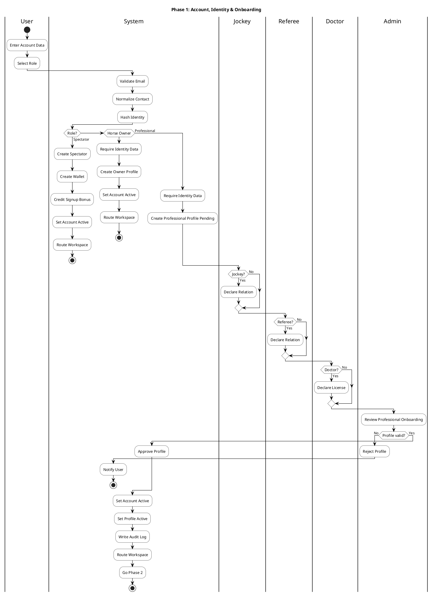

### **2.2.4 Pha 2: Tournament Setup & Participant Registration**

**Mục đích:** Admin tạo Tournament và mở roster đăng ký theo từng giải. Owner/Jockey/Referee/Doctor không mặc nhiên được dùng trong mọi giải; họ phải có bản ghi `TournamentParticipants` của giải đó. Owner được System approve tự động, còn Jockey/Referee/Doctor phải qua professional screening và Admin approval.

**Flow nghiệp vụ:**

1. Admin tạo Tournament, cấu hình rules, prize và tạo Race.
2. System set `Tournament.Status = Draft`, set `Race.Status = Upcoming`, validate purse/config.
3. Admin open registration; System set `Tournament.Status = Open Registration` và notify các role.
4. Horse Owner đăng ký Tournament bằng cách chọn/xác nhận giải, không nhập lại toàn bộ profile; System reuse dữ liệu `Users` + `OwnerProfiles`.
5. System tạo Owner roster với `ScreeningStatus = AutoEligible`, `Status = Approved`, `ApprovedAt = now`, rồi enable owner roster.
6. Jockey/Referee/Doctor đăng ký Tournament bằng cách chọn/xác nhận giải, không nhập lại toàn bộ profile; System reuse dữ liệu account/profile/declaration hiện tại.
7. System screen professional roster: AutoRejected thì reject/notify; ManualReview đưa vào hàng đợi manual review; AutoEligible đưa vào hàng đợi bulk approval.
8. Admin approve/reject professional roster; System enable roster use, giữ `Tournament.Status = Open Registration` và chuyển sang pha 3.

**Rule bắt buộc:**

| **Rule** | **Nội dung implement** |
| --- | --- |
| Form đăng ký giải | Không nhập lại full identity/profile; chỉ chọn/current Tournament, xác nhận tham gia, accept tournament rules và optional availability/note |
| Owner roster | Owner `Active` + Tournament `Open Registration` → System auto approve roster; không hiển thị trong Admin approval queue |
| Professional roster | Jockey/Referee/Doctor phải có account/profile `Active`; `AutoEligible` chỉ vào bulk approval queue, không tự thành `Approved` |
| Jockey AutoEligible | Account/profile active, identity/contact/DOB đủ, license có, `ExperienceYears >= Tournament.MinJockeyExperienceYears`, weight hợp lệ, declaration có, không exact duplicate, không có lịch sử rủi ro |
| Jockey ManualReview | License proof chưa rõ, experience sát ngưỡng/bất thường, health warning, declaration thiếu/mơ hồ, fuzzy duplicate name+DOB, prior rejection/suspension, relation risk với participant trong Tournament |
| Jockey AutoRejected | Account/profile không active, thiếu license, thiếu identity bắt buộc, không đủ experience, exact duplicate identity conflict, suspended/rejected |
| Referee AutoEligible | Account/profile active, identity đủ, certification present, declaration present, không exact duplicate, không lịch sử nghiêm trọng |
| Referee ManualReview | Certification không rõ/level thấp, relation risk với Owner/Jockey trong Tournament, fuzzy duplicate, duplicate contact warning, declaration thiếu/mơ hồ, prior issue |
| Referee AutoRejected | Account/profile không active, thiếu certification, thiếu identity bắt buộc, exact duplicate identity conflict, suspended/rejected |
| Doctor AutoEligible | Account/profile active, identity đủ, medical license present, không exact duplicate, không lịch sử nghiêm trọng |
| Doctor ManualReview | Medical license format/proof chưa rõ, relation risk với Owner/Jockey trong Tournament, fuzzy duplicate, duplicate contact warning, declaration thiếu nếu rule yêu cầu, prior issue |
| Doctor AutoRejected | Account/profile không active, thiếu medical license, thiếu identity bắt buộc, exact duplicate identity conflict, suspended/rejected |
| Giới hạn auto-approval | Nếu chưa có external license verification, Jockey/Referee/Doctor chỉ auto-screen; admin vẫn approve cuối |

**Swimlane chi tiết:**

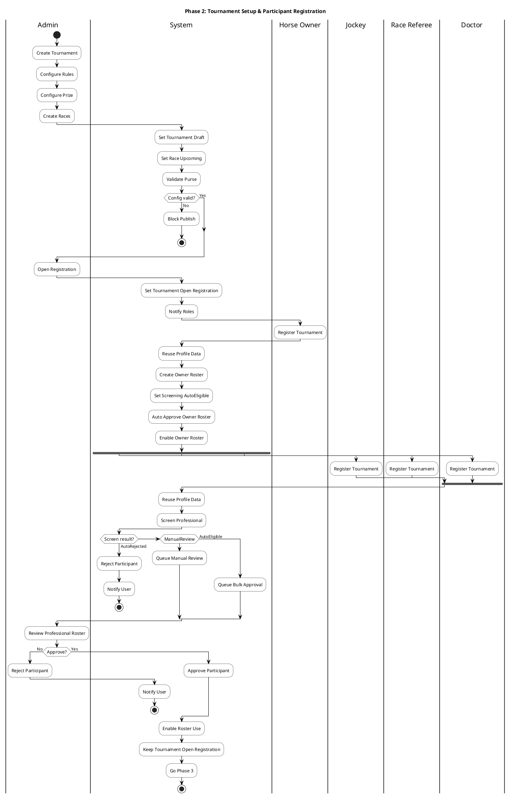

### **2.2.5 Pha 3: Horse Registration, Pairing & Race Allocation**

**Mục đích:** Horse Owner đăng ký ngựa vào đúng Tournament, hệ thống screen/approve hồ sơ ngựa, Horse Owner/Jockey tạo pairing và Admin allocate pairing vào Race.

**Flow nghiệp vụ:**

1. Horse Owner mở đăng ký ngựa từ Tournament page hoặc Horse Registration menu.
2. Nếu từ Tournament page, System dùng current Tournament; nếu từ menu tổng, Owner phải chọn Tournament từ danh sách giải đang `Open Registration` mà Owner đã `Approved`.
3. Horse Owner đăng ký ngựa vào Tournament đã chọn và accept legal consent.
4. System resolve `TournamentId`, kiểm tra owner roster, Tournament đang `Open Registration` và giữ Race ở `Upcoming`.
5. Nếu Owner chưa approved trong Tournament roster, System block horse registration.
6. System screen horse: AutoRejected thì reject/notify; ManualReview thì Admin review; AutoEligible thì System approve horse trực tiếp.
7. Pairing có 2 entry points: từ Tournament page dùng current Tournament; từ Pairing Management menu Owner chọn Tournament hợp lệ.
8. System list approved horses của Owner trong Tournament và list Jockey active/approved trong cùng Tournament.
9. Owner chọn Horse/Jockey và gửi invitation; System kiểm tra same Tournament, Jockey approved và experience.
10. System tạo Pending Pairing và lưu `Pairing.TournamentId`; Jockey accept/decline pairing; Horse Owner confirm pairing.
11. Admin allocate race; System kiểm tra same Tournament, max horses và double booking.
12. Admin draw post position; System save starting gate, publish schedule, close registration, set Tournament `Closed Registration` và giữ Race `Upcoming`.

**Rule bắt buộc:**

| **Rule** | **Nội dung implement** |
| --- | --- |
| Owner roster | Owner chưa `Approved` trong TournamentParticipants thì không được đăng ký ngựa vào giải |
| Tournament context | Từ Tournament page thì `TournamentId` được prefill/readonly; từ menu tổng thì Owner phải chọn Tournament hợp lệ |
| Horse TournamentId | Mỗi hồ sơ ngựa đăng ký giải phải gắn `TournamentId`; không allocate sang Race thuộc Tournament khác |
| AutoEligible | Breed hợp lệ, doping clean, legal consent accepted, hồ sơ đủ; System approve horse trực tiếp theo rule hiện tại |
| AutoRejected | Doping failed hoặc breed mismatch; admin không override auto-reject cứng |
| ManualReview | Doping pending, thiếu giấy tờ, dữ liệu mơ hồ hoặc nghi ngờ trùng; Admin quyết định approve/reject |
| Pairing | Pairing phải lưu `TournamentId`; Horse phải approved trong Tournament đó; Jockey phải active và approved trong cùng Tournament |
| Race allocation | Pairing phải `Confirmed`, Race thuộc cùng Tournament, không double-book ngựa/Jockey, không vượt MaxHorses |

**Swimlane chi tiết:**

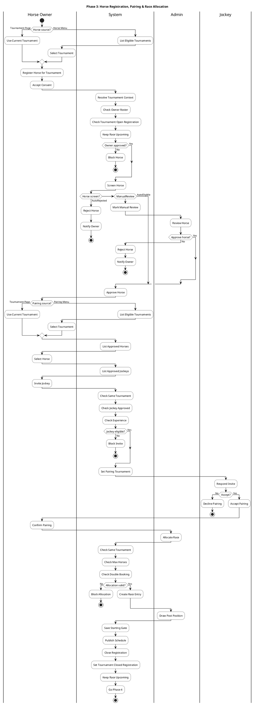

### **2.2.6 Pha 4: Official Assignment & COI Clearance**

**Mục đích:** tách assignment khỏi pre-race. Admin phải phân công Referee/Doctor trước khi Race bước vào `Pre-Race`; hệ thống chạy COI Check bằng dữ liệu định danh, không chỉ bằng tên hoặc `UserId`.

**Flow nghiệp vụ:**

1. Admin view official roster và assign Referee.
2. System check referee approval, run referee COI.
3. COI passed thì save assignment; COI manual review thì hold assignment để Admin resolve; COI failed thì block assignment.
4. Admin assign Doctor; System lặp lại check approval và doctor COI.
5. System save doctor assignment, notify officials, giữ Tournament `Closed Registration` và Race `Upcoming`.
6. Race Referee/Doctor view assignment.
7. Nếu relationship declaration thay đổi, System rerun COI trước khi clear race officials.

**COI Check — logic chuẩn:**

| **Nội dung** | **Quy định** |
| --- | --- |
| Áp dụng cho | Referee và Doctor trước/trong thời gian được phân công vào Race |
| Đối tượng so khớp | Owner và Jockey của các RaceEntry trong cùng Race |
| Quan hệ trực tiếp | `Spouse`, `Parent`, `Child`, `Sibling` |
| Matching priority | 1. `RelatedUserId`/`PersonId`; 2. `identityHash`; 3. normalized email; 4. normalized phone; 5. `fullName + dateOfBirth` |
| `Passed` | Không tìm thấy conflict |
| `Failed` | Có conflict rõ ràng bằng identity/email/phone/resolved user |
| `ManualReview` | Match mơ hồ, nhiều match hoặc thiếu định danh quan trọng |
| `NotChecked` | Chưa chạy check |

**Swimlane chi tiết:**

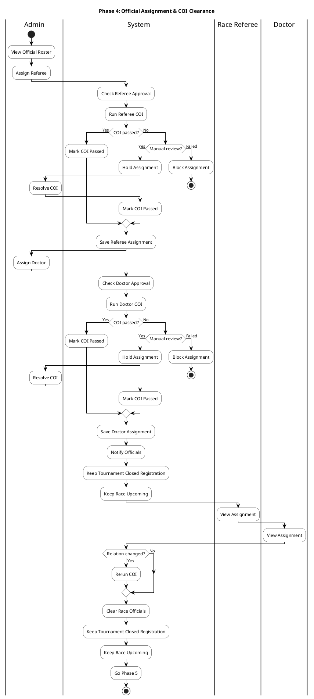

### **2.2.7 Pha 5: Wallet, Ticket Reward Code, Prediction & Pre-Race Checks**

**Mục đích:** Spectator nhận điểm từ ticket code trước khi dự đoán; sau đó Race chuyển `Pre-Race` để Doctor/Race Referee thực hiện kiểm tra bắt buộc trước khi cho `Live`.

**Flow nghiệp vụ:**

1. Spectator nhập ticket code; System validate code.
2. Nếu code hợp lệ, System credit wallet và write ledger; nếu không hợp lệ thì reject code.
3. Admin open prediction gate; Spectator place prediction.
4. System check gate/balance; prediction hợp lệ thì debit wallet và write ledger, không hợp lệ thì reject.
5. Race Referee start pre-race; System set `Race.Status = Pre-Race`, giữ Tournament `Closed Registration`, close prediction gate.
6. Doctor weigh jockey, verify horse và check clinical.
7. Pre-race failed thì System disqualify entry, refund predictions, notify parties.
8. Race Referee run Independence; System match identity/contact và trả kết quả Passed/ManualReview/Failed.
9. Passed hoặc manual review đã resolve thì Race Referee confirm start list; System giữ Race `Pre-Race` và chuyển sang pha 6.

**Ticket reward code rule:**

| **Rule** | **Nội dung implement** |
| --- | --- |
| Phạm vi | Code từ vé xem trực tiếp tại trường đua, dùng để cộng điểm ảo trước prediction |
| Một lần | Mỗi code chỉ redeem một lần |
| Ledger | Cộng điểm phải tạo `VirtualPointsTransactions.Type = Ticket Code Bonus`; không update balance rời rạc |
| Ràng buộc | Code có thể gắn Tournament/Race, có hạn dùng, trạng thái Active/Redeemed/Expired/Disabled |

**Independence Check — logic chuẩn:**

| **Nội dung** | **Quy định** |
| --- | --- |
| Áp dụng cho | Jockey của từng RaceEntry tại `Race.Status = Pre-Race` |
| So với ai | Tất cả Owner đối thủ trong cùng Race; không check với Owner của chính ngựa mình cưỡi nếu nghiệp vụ cho phép quan hệ thuê/mời |
| Matching priority | 1. `RelatedUserId`/`PersonId`; 2. `identityHash`; 3. normalized email; 4. normalized phone; 5. `fullName + dateOfBirth` |
| `Passed` | Không có quan hệ trực tiếp với opposing Owner |
| `Failed` | Jockey là spouse/parent/child/sibling của opposing Owner hoặc match identity/email/phone rõ ràng |
| `ManualReview` | Dữ liệu khai báo chưa resolve nhưng có dấu hiệu trùng/mơ hồ |
| Lưu kết quả | `RaceEntries.IndependenceCheckStatus`, `IndependenceCheckedByRefereeId`, `IndependenceCheckedAt`, `IndependenceViolationReason` |

**Swimlane chi tiết:**

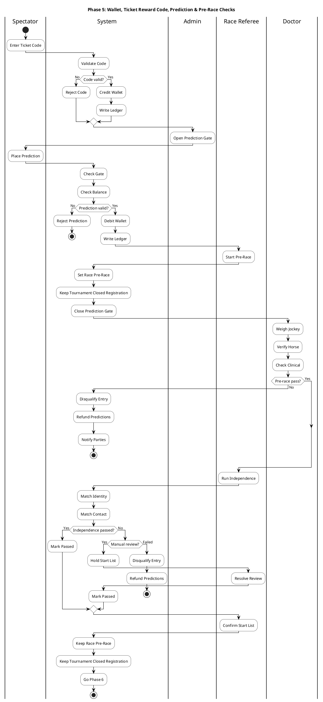

### **2.2.8 Pha 6: Live Race, Result, Reward & Tournament Completion**

**Mục đích:** Race diễn ra, kết quả được ghi nhận/chốt theo ACID transaction, prediction/reward/leaderboard/purse được cập nhật và Tournament chỉ Completed khi tất cả Race kết thúc.

**Flow nghiệp vụ:**

1. Race Referee start race; System set `Race.Status = Live` và cancel pending entries.
2. Spectator view live race; Doctor weigh out khi cần.
3. Race Referee record violation và enter result.
4. System set `Race.Status = Unofficial`.
5. Horse Owner/Jockey có thể submit protest trong cửa sổ hợp lệ.
6. Race Referee review protest, apply penalty/update result hoặc reject protest, rồi lock report draft.
7. Admin declare official; System set `Race.Status = Official`, lock report, settle prediction, update leaderboard, calculate purse và write audit log.
8. Nếu tất cả Race đã kết thúc, System set `Tournament.Status = Completed`; nếu chưa, Tournament giữ `Closed Registration`.

**Precondition chuyển Live:** mọi RaceEntry hợp lệ phải `Confirmed`, có `PreRaceJockeyWeight`, `HorseIdentityStatus = Matched`, `ClinicalStatus = Fit`, `IndependenceCheckStatus = Passed`, không `Cancelled/Disqualified`. Thiếu bất kỳ điều kiện nào thì backend chặn chuyển `Live`.

**Swimlane chi tiết:**

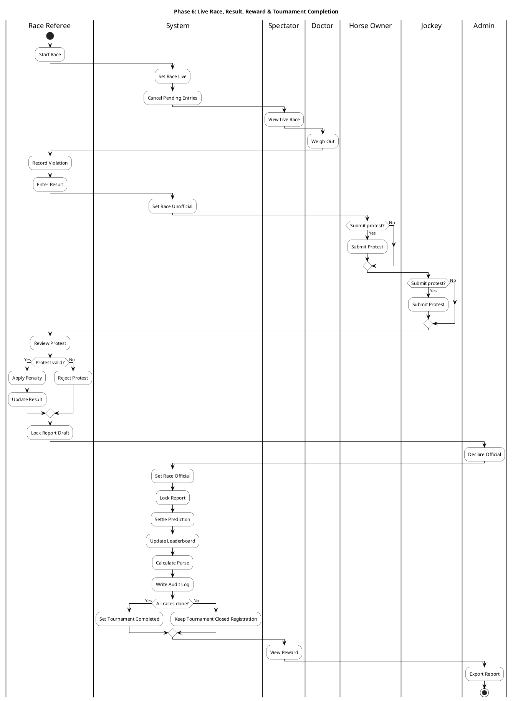

### **2.2.9 Mermaid Swimlane — Luồng Tổng Thể**

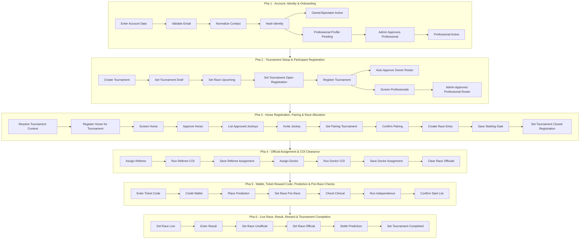

### **2.2.10 Phân Tích Happy Path và Unhappy Cases**

| **Nhóm lỗi** | **Điểm phát sinh** | **Kết quả xử lý** |
| --- | --- | --- |
| Participant chưa approved roster | Pha 2-4 | Không cho đăng ký ngựa, pairing, allocation hoặc assignment tùy role |
| Horse auto-rejected | Pha 3 | Không được pairing/allocation; lưu lý do auto-reject |
| Pairing khác Tournament | Pha 3 | Chặn allocation vì Horse/Race không cùng Tournament |
| COI Failed | Pha 4 | Chặn assignment Referee/Doctor hoặc remove assignment hiện tại |
| COI ManualReview | Pha 4 | Assignment chưa được dùng để confirm starting list |
| Ticket code invalid/redeemed/expired | Pha 5 | Không cộng điểm; Spectator vẫn có thể prediction nếu đủ điểm khác |
| Independence Failed | Pha 5 | Entry bị block hoặc Emergency DQ theo rule đang áp dụng |
| Pre-race thiếu check | Pha 5-6 | Chặn chuyển Race sang `Live` |
| Declare Official lỗi | Pha 6 | Rollback toàn bộ ACID transaction |

## **2.3 Actors & Features**

### **2.3.1 Danh Sách 6 Actors Chính**

| **Actor (Tác nhân)** | **Tên tiếng Anh** | **Mô tả Vai trò** | **Quyền hạn chính** |
| --- | --- | --- | --- |
| **Admin** | Administrator | Quản lý toàn bộ hệ thống, cấu hình giải đấu, phê duyệt hồ sơ, công bố kết quả chính thức. | Tạo/sửa/xóa giải đấu, duyệt hồ sơ, lập lịch, công bố kết quả, xuất báo cáo, quản lý người dùng. |
| **Horse Owner** | Chủ ngựa | Quản lý thông tin ngựa, đăng ký tham gia giải, ghép cặp Jockey, xác nhận lịch thi đấu, nộp khiếu nại. | Tạo/quản lý hồ sơ ngựa, đăng ký giải, mời Jockey, xác nhận tham gia, nộp khiếu nại về vi phạm. |
| **Jockey** | Nài ngựa | Khai báo chứng chỉ hành nghề, thông tin y tế cá nhân và quan hệ gia đình, tham gia thi đấu, nhận phân công giải đấu, nộp khiếu nại. | Khai báo chứng chỉ, xem lịch thi đấu, nhận/từ chối lời mời thuê, nộp khiếu nại về vi phạm. |
| **Race Referee** | Trọng tài / Thanh tra viên | Ghi nhận vi phạm trực tiếp, xử lý khiếu nại, xác nhận thứ hạng sơ bộ, kích hoạt Jockey Independence Check tại Paddock. | Ghi nhận vi phạm, xử lý khiếu nại, xác nhận kết quả sơ bộ, kích hoạt Jockey Independence Check tại Paddock. |
| **Doctor** | Bác sĩ thú y | Xác minh danh tính ngựa và kiểm tra y tế tại Paddock, cân Jockey trước đua (Pre-Race Weigh-In) và sau đua (Post-Race Weigh-Out). **(EC-37/EC-38)** Phải được Admin duyệt onboarding (`Active`) và được phân công cho từng Race (`DoctorAssignments`), chịu Doctor COI Check. | Xác minh danh tính ngựa, khám lâm sàng Fit/Unfit, cân Jockey (Pre + Post) — chỉ trên Race được phân công. |
| **Spectator** | Khán giả / Người dự đoán | Theo dõi giải đấu, đặt dự đoán (Win), xem kết quả, nhận phần thưởng điểm ảo. | Xem thông tin giải đấu, đặt dự đoán, xem lịch thi đấu, xem kết quả và bảng xếp hạng, quản lý ví điểm ảo. |

---

### **2.3.2 Danh Sách 17 Module Chức Năng (A–Q)**

| **Module** | **Tên Module** | **Actors người dùng** | **Chức năng chính** |
| --- | --- | --- | --- |
| **A** | Quản lý Tài khoản và Phân quyền | Admin, Horse Owner, Jockey, Race Referee, Doctor, Spectator | Đăng ký tài khoản, quản lý tài khoản, xác thực username/password đã mã hóa, phân quyền theo Role; **(EC-47)** tạo ví Spectator + `SignUp Bonus` nguyên tử; Owner/Spectator active ngay khi hợp lệ; **(EC-37 — BR-46)** onboarding Jockey/Referee/Doctor `Pending → Active` |
| **B** | Quản lý Giải đấu (Admin) | Admin | Tạo/sửa/hủy giải đấu, cấu hình AllowedBreed *(single-select — 1 giống ngựa duy nhất/giải)*, TrackType, RaceDistance, RaceCategory, MinJockeyExperienceYears, **EntryFeeAmount** *(mặc định 0 — miễn phí; hệ thống skip luồng phí nếu = 0)*, **PrizeDistributions** *(EC-33 — BR-42: 5 tỷ lệ Top1–5, validate tổng=100%)*, **ngưỡng cân Pre/Post** *(EC-39)*, Round/Race; **(EC-34/EC-35)** validate ΣRace.Purse ≤ Tournament.Purse + ràng buộc thời gian phân cấp; **(EC-36 — BR-45)** state machine cấp giải 5 chuyển tiếp; **(EC-30/EC-32 — BR-27/BR-41)** Tournament Cancellation Flow: hủy giải có dữ liệu → 1 giao dịch nhất quán (cancel entries, refund predictions, **auto Refund Pending lệ phí**, vô hiệu Pairings/Payouts, Notification, AuditLog) |
| **C** | Quản lý Đăng ký Ngựa Thi đấu và Duyệt Hồ sơ | Horse Owner, Admin | Khai báo hồ sơ ngựa (hành chính + y tế tự khai báo: Breed, VaccinationRecordRef, DopingTestDate, DopingTestResult); Admin phê duyệt/từ chối; auto-check AllowedBreed (single-value) và DopingTestResult; ghi nhận Entry Fee thủ công (`EntryFeeStatus`: Unpaid → Paid); **Approve bị block khi `EntryFeeStatus != 'Paid'`**; **(EC-32)** auto `Paid → Refund Pending` khi Withdrawal/DQ/Cancellation; Doctor không tham gia Module C. |
| **D** | Quản lý Nài ngựa (Jockey) | Jockey, Admin, Horse Owner | Khai báo chứng chỉ, kinh nghiệm, thông tin y tế (cân nặng sơ bộ, BloodType, tình trạng sức khỏe) và quan hệ gia đình ruột thịt (phục vụ Independence Check); Admin phê duyệt Jockey; Owner mời Jockey; kiểm tra ExperienceYears. |
| **E** | Lập lịch Thi đấu, Bốc thăm và Sắp xếp Cuộc đua | Admin, Horse Owner, Jockey | Phân bổ Race, Post Position Draw, xác nhận lịch, Withdrawal Flow |
| **F** | Phân công Trọng tài và Referee Conflict-of-Interest Check | Admin, Race Referee | Phân công Lead/Assistant Referee, COI Check, thông báo phân công; **(EC-37)** chỉ Referee `Active`; **(EC-45 — BR-54)** mỗi Race đúng 1 Lead Referee |
| **G** | Kiểm tra Trước Thi đấu: Jockey Independence Check và Xác nhận Ngựa | Doctor, Race Referee | Pre-Race Weigh-In (Doctor cân Jockey — điều kiện bắt buộc trước Live); Doctor xác minh danh tính ngựa Paddock; Doctor khám lâm sàng Fit/Unfit (lý do ≥ 20 ký tự nếu Unfit); Race Referee kích hoạt Jockey Independence Check — Hệ thống thực thi tự động; Disqualification khẩn cấp kèm hoàn điểm ảo; **(EC-38 — BR-47)** phân công Doctor (`DoctorAssignments`) + Doctor COI Check; **(EC-39)** ngưỡng cân cấu hình theo giải |
| **H** | Theo dõi Diễn biến Cuộc đua và Xử lý Vi phạm (Race Referee) | Race Referee, Spectator, Horse Owner, Jockey, Doctor | Trạng thái Race, khóa dự đoán khi Live, Live Simulation Animation, ghi nhận vi phạm, tiếp nhận Protest, Post-Race Weigh-Out (Doctor cân Jockey sau đua — Flag cảnh báo cho Referee nếu chênh lệch vượt ngưỡng); **(EC-42 — BR-51)** cưỡng chế `PostRaceJockeyWeight` NOT NULL khi chốt biên bản |
| **I** | Xử lý Vi phạm và Khiếu nại (Protest Handling) | Race Referee, Horse Owner, Jockey | Điều tra Protest, áp dụng hình phạt, tính lại thứ hạng, closed-loop notification; **(EC-20/EC-27)** cửa sổ Protest có deadline (mặc định 2h sau `Unofficial`) + giới hạn số lần + chặn sau Declare Official; **(EC-03)** ngựa Protest-DQ → refund dự đoán trong transaction Declare Official; **(EC-43/EC-44 — BR-52/BR-53)** guard tư cách người nộp + cùng-Race; **(EC-41 — BR-50)** re-validate thứ hạng sau mỗi Protest |
| **J** | Quản lý Kết quả và Công bố Kết quả Chính thức (Admin) | Admin | Declare Official, Lock UI, ACID Transaction 6 bước, ROLLBACK khi lỗi |
| **K** | Tính toán và Phân bổ Tiền thưởng | Admin | Cấu hình Purse, tính phân bổ lý thuyết, ghi trạng thái Paid/Unpaid sau thanh toán ngoài hệ thống; **(EC-33 — BR-42)** tỷ lệ nạp từ bảng `PrizeDistributions` (không hard-code; thiếu cấu hình → chặn Declare); **(EC-08 — BR-26)** tổng tỷ lệ = 100%, phần dư <5 ngựa ghi `Remainder`; **(EC-34 — BR-43)** ΣRace.Purse ≤ Tournament.Purse |
| **L** | Bảng Xếp hạng Tích lũy (Leaderboard & Jockey Standings) | Admin, Horse Owner, Jockey, Race Referee, Doctor, Spectator | Xem Leaderboard ngựa và Jockey Standings; cập nhật bằng HTTP Polling tối thiểu 30 giây; **(EC-31 — BR-28)** đọc bằng isolation tối thiểu `READ COMMITTED` + push re-fetch sau Declare Official |
| **M** | Quản lý Dự đoán và Prediction Gate | Admin, Spectator | Cấu hình/mở/đóng cổng dự đoán, chỉ Win (Top 1), Form Score static SQL; **(EC-05 — BR-23)** kiểm tra cổng phía server: từ chối dự đoán khi `IsPredictionGateClosed = true` hoặc Race không còn `Upcoming` |
| **N** | Đối chiếu Dự đoán và Trả thưởng (Spectator) | Spectator | Đối chiếu dự đoán với kết quả Official, cộng điểm ảo, thông báo kết quả, xem lịch sử và ví ảo |
| **O** | Hệ thống Thông báo (Notification) | Admin, Horse Owner, Jockey, Race Referee, Doctor, Spectator | Gửi/nhận In-app Notification và Email qua SMTP Gateway |
| **P** | Báo cáo và Xuất Dữ liệu | Admin, Horse Owner, Jockey, Race Referee, Doctor, Spectator | Xuất CSV, PDF hoặc in trực tiếp từ trình duyệt theo quyền hạn |
| **Q** | Bảo mật, Xác thực và Audit Log | Admin | Quản lý bảo mật, phiên làm việc, RBAC Backend API, theo dõi Audit Log; **(EC-29 — BR-33)** Suspend tài khoản → xóa/blacklist phiên Redis tức thì, Backend kiểm tra `Users.Status` mỗi request |

---

### **2.3.3 Ma Trận Liên Kết Actor ↔︎ Module ↔︎ Pha**

| **Actor** | **Module có tương tác** | **Pha có tham gia** |
| --- | --- | --- |
| **Admin** | A, B, C, D, E, F, G, J, K, L, M, O, P, Q | 1, 2, 3, 4, 6 |
| **Horse Owner** | A, C, D, E, H, I, L, O, P | 2, 3, 5, 6 |
| **Jockey** | A, D, E, H, I, L, O, P | 2, 3, 5, 6 |
| **Race Referee** | A, F, G, H, I, L, O, P | 3, 4, 5, 6 |
| **Doctor** | A, G, H, L, O, P | 4, 5 |
| **Spectator** | A, H, L, M, N, O, P | 3, 5, 6 |

---

## **2.4 User Characteristics**

### **2.4.1 Phân Loại Người Dùng — 6 Actors**

| **Actor** | **Đặc điểm sử dụng hệ thống** | **Nhu cầu giao diện** |
| --- | --- | --- |
| **Admin** | Quản lý cấu hình giải, phê duyệt hồ sơ, lập lịch, công bố Official, xuất báo cáo | Giao diện quản trị rõ ràng; cảnh báo trước thao tác khóa/công bố kết quả |
| **Horse Owner** | Quản lý ngựa, đăng ký giải, mời Jockey, xác nhận lịch, nộp khiếu nại | Form khai báo dễ kiểm tra, thông báo lý do từ chối rõ ràng |
| **Jockey** | Khai báo chứng chỉ, nhận/từ chối lời mời, xem lịch, nộp khiếu nại | Tối ưu tra cứu lịch và phản hồi lời mời nhanh |
| **Race Referee** | Kích hoạt Independence Check, ghi vi phạm, xử lý Protest, xác nhận sơ bộ | Giao diện nhập liệu tại sân rõ ràng, hạn chế nhầm lẫn mã lỗi |
| **Doctor** | Cân Jockey trước/sau đua, xác minh danh tính ngựa Paddock, khám lâm sàng, ghi Fit/Unfit | Form nhập cân nặng (Pre + Post Weigh), kết quả danh tính (Matched/Mismatch), kết luận sức khỏe (Fit/Unfit kèm lý do bắt buộc); yêu cầu xác nhận trước khi lưu kết quả ảnh hưởng đến Disqualification. |
| **Spectator** | Xem giải, đặt dự đoán Win (Top 1), xem Live Animation, Leaderboard và ví ảo | Responsive Web, thao tác dự đoán và xem kết quả dễ hiểu |

---

### **2.4.2 Yêu Cầu Thiết Bị & Khả Năng Truy Cập**

| **Nhóm yêu cầu** | **Nội dung** |
| --- | --- |
| Thiết bị | Web Responsive trên desktop, tablet và mobile browser |
| Trình duyệt tối thiểu | Google Chrome 90+; Mozilla Firefox 88+ |
| Ứng dụng native | Không có Mobile App native iOS/Android trong Phase 1 |
| Live Race | Hiển thị animation mô phỏng bằng Canvas/SVG phía client |
| Leaderboard | Cập nhật bằng HTTP Polling tối thiểu 30 giây hoặc tải lại trang thủ công |

---

## **2.5 General Constraints**

### **2.5.1 Ràng Buộc Kỹ Thuật**

| **Nhóm ràng buộc** | **Nội dung bắt buộc** |
| --- | --- |
| Technology stack | React 18+ SPA, .NET 8+ ASP.NET Core, SQL Server 2022+, Docker, Redis, SMTP Gateway, HTTPS/TLS 1.3 |
| Authentication | Username/password đã mã hóa; phân quyền nghiêm ngặt theo Role |
| Access Control | RBAC được kiểm soát tại Backend API |
| Live Race | Chỉ là animation giả lập client-side bằng Math.random() + setInterval(100ms) trên Canvas/SVG |
| Leaderboard | HTTP Polling tối thiểu 30 giây |
| Prediction | Chỉ Win (Top 1); Form Score static SQL 40% Horse, 35% Jockey, 25% Race Category |
| Declare Official | 6 bước trong 1 ACID Transaction; lỗi bất kỳ bước nào thì ROLLBACK toàn bộ |
| Notification | In-app Notification và Email qua SMTP Gateway; không dùng SMS |
| Payment/Purse | HRTMS chỉ tính phân bổ lý thuyết; tiền thưởng thực tế xử lý ngoài hệ thống; Admin cập nhật Paid/Unpaid |

---

### **2.5.2 Ràng Buộc Pháp Lý & Quy Định**

| **Nhóm ràng buộc** | **Nội dung** |
| --- | --- |
| Bảo vệ dữ liệu cá nhân | Tuân thủ Nghị định 13/2023/NĐ-CP về bảo vệ dữ liệu cá nhân |
| Cá cược tiền thật | Tuyệt đối không hỗ trợ cá cược bằng tiền thật |
| Odds / Parimutuel | Không tính toán Odds tài chính, không có cơ chế Parimutuel |
| Điểm ảo | Virtual Points không có giá trị quy đổi thành tiền thật dưới bất kỳ hình thức nào |
| Prediction | Chỉ hỗ trợ Win (Top 1) phi tài chính; không hỗ trợ Place hay Exotic Wager |
| Biên bản thi đấu | Sau khi khóa IsLocked = true, biên bản là immutable, không được UPDATE hoặc DELETE — **(EC-19)** cưỡng chế bằng trigger `INSTEAD OF` tầng DB, không chỉ Frontend disable |
| Audit Log | Audit Log immutable và được lưu giữ tối thiểu 7 năm — **(EC-19)** append-only: `DENY UPDATE, DELETE` ở DB role |

---

### **2.5.3 Ràng Buộc Thời Gian**

| **Ràng buộc** | **Giá trị** | **Module liên quan** |
| --- | --- | --- |
| Confirmation Cut-off Time | Mặc định 24 giờ trước giờ chạy hoặc do Admin tùy chỉnh | Module E |
| Lịch phân công trọng tài | Hoàn tất và lưu trữ ít nhất 5 ngày làm việc trước ngày thi đấu chính thức | Module F |
| Live Animation | Cập nhật vị trí chip ngựa mỗi 100ms bằng setInterval | Module H |
| Leaderboard Polling | Tối thiểu 30 giây | Module L |
| Công bố kết quả Official | Mục tiêu trong vòng 30 phút sau khi Admin xác nhận | Module J |
| Lưu trữ Audit Log | Tối thiểu 7 năm | Module Q |
| Ràng buộc thời gian phân cấp (EC-35) | `Tournament.StartDate ≤ Round.ScheduledDate ≤ Race.ScheduledTime ≤ Tournament.EndDate` và `Race.ScheduledTime > Now` | Module B, E |
| Cửa sổ nộp Protest (EC-27) | `Races.ProtestDeadlineMinutes` — mặc định 120 phút kể từ khi Race chuyển `Unofficial` | Module I |

---

### **2.5.4 Ràng Buộc Dữ Liệu**

| **Ràng buộc** | **Nội dung** |
| --- | --- |
| AllowedBreed | Single-select — chọn đúng 1 giống ngựa duy nhất (Thoroughbred, Arabian, Quarter Horse, Mixed); bắt buộc không được để trống; hệ thống Auto-reject ngay nếu Horse.Breed không khớp. |
| DopingTestResult | Owner tự khai báo (Clean/Pending/Failed); hệ thống Auto-reject ngay nếu = Failed; không cần Admin xét duyệt |
| PrizeDistributions (EC-33) | Bảng cấu hình 5 tỷ lệ chia Purse (Top1–Top5) per giải; App layer validate SUM=100%; nguồn `@Pct1..@Pct5` cho Declare Official; thiếu cấu hình → chặn Declare |
| Ngưỡng cân nặng (EC-39) | `Tournament.PreRaceWeightThresholdKg` (mặc định 2.0), `PostRaceWeightDiffThresholdKg` (mặc định 1.0) — cấu hình theo giải thay cho giá trị "ví dụ" |
| SelfDeclaredWeight (EC-39) | Bắt buộc NOT NULL khi gửi hồ sơ Jockey — luôn có baseline cho Pre-Race Weigh-In |
| PreRaceJockeyWeight | Doctor ghi nhận bắt buộc trước khi cuộc đua chuyển sang Live; lưu vào RaceEntries.PreRaceJockeyWeight |
| PostRaceJockeyWeight | Doctor ghi nhận sau đua; hệ thống so sánh với PreRaceJockeyWeight; chênh lệch vượt ngưỡng → Flag cảnh báo cho Referee; **(EC-42)** NOT NULL bắt buộc trước khi chốt biên bản |
| UnfitReason | Bắt buộc NOT NULL và tối thiểu 20 ký tự khi Doctor kết luận ngựa Unfit |
| ReasonOfRejection | Bắt buộc khi Admin từ chối hồ sơ ngựa; tối thiểu 10 ký tự |
| ExperienceYears | Kiểm tra với Tournament.MinJockeyExperienceYears trước khi ghép cặp |
| RaceEntry | Có thể chuyển Cancelled khi rút lui/quá hạn hoặc Disqualified khi không đạt điều kiện trước đua |
| RaceReport.IsLocked | Khi true, biên bản thi đấu không thể sửa hoặc xóa |
| Prediction data | Chỉ lưu dự đoán Win (Top 1) và điểm ảo; không lưu giao dịch tiền thật |
| Purse data | Lưu phân bổ lý thuyết và trạng thái Paid/Unpaid do Admin cập nhật |
| EntryFeeStatus | `Unpaid` khi tạo RaceEntry (tự động `Paid` nếu `EntryFeeAmount = 0`); Admin cập nhật → `Paid` sau xác nhận nhận phí ngoài hệ thống; Approve Node 2.5 bị block khi `!= 'Paid'`; **(EC-32)** **tự động** `Paid → Refund Pending` khi Withdrawal/DQ/Tournament Cancellation; Admin chốt `Refunded` |
| Wallet & SignUp Bonus (EC-47) | `Wallets.Balance` DEFAULT đổi `1000 → 0`; bonus 1000 hình thành qua một dòng `VirtualPointsTransactions` cùng transaction tạo ví — giữ bất biến `Balance = SUM(giao dịch)` |
| JockeyProfiles/RefereeProfiles/DoctorProfiles.Status (EC-37) | Khởi tạo `Pending`; Admin duyệt onboarding → `Active`; chỉ `Active` mới được dùng cho pairing/phân công |
| Audit Log | Ghi các hành động quan trọng: tạo/sửa/hủy giải (**Cancel_Tournament**), duyệt hồ sơ (**Approve_Referee/Approve_Doctor**), bốc thăm, **phân công Doctor (Assign_Doctor)**, thay đổi lịch, withdrawal, disqualification, Declare Official, cập nhật Paid/Unpaid, **Update_Entry_Fee_Status** |

---

## **2.6 Assumptions & Dependencies**

### **2.6.1 Giả Định Dự Án (Assumptions)**

| **#** | **Giả định** | **Mô tả** | **Mức rủi ro** | **Ghi chú** |
| --- | --- | --- | --- | --- |
| **A1** | Hạ tầng vận hành được cung cấp | Dự án có VPS/Cloud Hosting, SQL Server 2022+, domain, HTTPS/TLS và SMTP Gateway | Trung | Phụ thuộc bên cung cấp hạ tầng |
| **A2** | Dữ liệu y tế ngựa được nhập thủ công | Dữ liệu sức khỏe, tiêm phòng và doping của ngựa được nhập từ biên bản tại sân; không tích hợp phần mềm thú y bên ngoài | **Cao** | Cần validation và quy trình nhập liệu rõ ràng |
| **A3** | Kết quả thi đấu được nhập thủ công | Race Referee nhập kết quả dựa trên kết luận tại sân; không dùng Photo Finish hardware hoặc GPS chip | **Cao** | Cần kiểm tra chéo nghiệp vụ trước khi công bố Official |
| **A4** | Thanh toán tiền thưởng thực tế nằm ngoài hệ thống | Đơn vị tổ chức xử lý chi trả ngoài HRTMS; Admin chỉ cập nhật Paid/Unpaid | Trung | Đây là Out-of-Scope của hệ thống |
| **A5** | Spectator chỉ dự đoán Win | Người dùng hiểu điểm ảo không quy đổi tiền thật | Trung | UI cần thể hiện rõ đây là dự đoán phi tài chính |
| **A6** | SMTP Gateway hoạt động ổn định | Email phụ thuộc SendGrid/AWS SES | Trung | In-app Notification vẫn thuộc hệ thống |
| **A7** | Người dùng có trình duyệt hỗ trợ | Người dùng truy cập bằng Chrome 90+ hoặc Firefox 88+ | Trung | Không có Mobile App native |

---

### **2.6.2 Phụ Thuộc Dự Án (Dependencies)**

| **#** | **Phụ thuộc** | **Nội dung** |
| --- | --- | --- |
| **D1** | Business Requirements Document | Căn cứ nghiệp vụ cho phạm vi HRTMS Phase 1 |
| **D2** | Architecture Design Document | Làm rõ thiết kế React, .NET, SQL Server, Docker, Redis, HTTPS/TLS |
| **D3** | User Stories and Use Cases Document | Chi tiết tương tác của 6 Actors |
| **D4** | Database Schema Specification | Thiết kế bảng, khóa, ràng buộc dữ liệu và Audit Log |
| **D5** | UI/UX Design & Wireframes | Màn hình cho 6 Actors, Web Responsive |
| **D6** | Test Plan & Test Cases | Kiểm thử module, luồng nghiệp vụ, ACID Transaction, RBAC và dữ liệu |
| **D7** | Deployment & Infrastructure Guide | Hướng dẫn triển khai bằng Docker trên hosting đã cung cấp |
| **D8** | Phê duyệt SRS từ Stakeholders | Xác nhận phạm vi Phase 1 trước khi triển khai |

---

### **2.6.3 Phụ Thuộc Bên Ngoài (External Dependencies)**

| **#** | **External Dependency** | **Vai trò trong hệ thống** | **Ràng buộc phạm vi** |
| --- | --- | --- | --- |
| **E1** | SMTP Gateway (SendGrid/AWS SES) | Gửi Email Notification outbound | External service duy nhất có giao tiếp ứng dụng ra ngoài |
| **E2** | SQL Server 2022+ | Cơ sở dữ liệu chính của HRTMS | Lưu dữ liệu nghiệp vụ, kết quả, dự đoán và Audit Log |
| **E3** | Hosting Infrastructure | Môi trường chạy ứng dụng web/backend/database theo triển khai dự án | Không bổ sung công nghệ ngoài scope |
| **E4** | SSL/TLS Certificate | Bảo đảm HTTPS/TLS 1.3 | Bắt buộc cho truy cập hệ thống |
| **E5** | Domain/DNS | Định danh truy cập web chính thức | Phục vụ truy cập HRTMS qua trình duyệt |

---

### **2.6.4 Phụ Thuộc Về Thay Đổi Quy Trình Nghiệp Vụ**

HRTMS Phase 1 thay thế quy trình thủ công thiếu đồng bộ bằng quy trình web tập trung. Việc triển khai phụ thuộc vào cam kết vận hành của sáu nhóm tác nhân đúng vai trò đã định nghĩa.

| **Nhóm người dùng** | **Nội dung cần sẵn sàng** |
| --- | --- |
| Admin | Quy trình tạo giải, duyệt hồ sơ, lập lịch, phân công trọng tài, Declare Official và cập nhật Paid/Unpaid |
| Horse Owner | Quy trình khai báo ngựa, đăng ký giải, mời Jockey, xác nhận lịch và nộp Protest |
| Jockey | Quy trình khai báo chứng chỉ, phản hồi lời mời, xem lịch và nộp Protest |
| Race Referee | Quy trình kích hoạt Independence Check tại Paddock, ghi vi phạm, xử lý Protest và xác nhận kết quả sơ bộ |
| Doctor | Quy trình Pre-Race Weigh-In (cân Jockey trước đua), xác minh danh tính ngựa tại Paddock, khám lâm sàng và ghi kết luận Fit/Unfit (kèm lý do bắt buộc nếu Unfit), và Post-Race Weigh-Out (cân Jockey sau đua). |
| Spectator | Quy trình đặt dự đoán Win, theo dõi Live Animation, xem Leaderboard và ví điểm ảo |

---

*Chương 2 — OVERALL DESCRIPTION kết thúc.*

*Chương tiếp theo: **Chương 3 — SPECIFIC REQUIREMENTS** (Chi tiết yêu cầu chức năng và phi chức năng theo từng Module).*

---

**Tài liệu này là một phần của SRS chính thức dự án SU26SWP03 — HRTMS Phase 1.**

---

# 3. SPECIFIC REQUIREMENTS — Đặc tả Yêu cầu Cụ thể

## 3.1 User Interface Requirements (Đặc tả Yêu cầu Giao diện Người dùng)

### 3.1.1 Căn cứ thiết kế & Phạm vi giao diện

Mục 3.1 đặc tả toàn bộ yêu cầu về giao diện người dùng (User Interface — UI) của hệ thống HRTMS Phase 1. Nội dung được suy luận trực tiếp từ **SRS Chương 1 (Introduction — Scope)** (6 Actor, 17 Module A–Q), **SRS Chương 2 (Overall Description)** (Main Flows 6 pha, User Characteristics — mục 2.4.1) và **Database Schema Specification** (27 bảng Logical ERD). Mỗi màn hình trong mục này được truy xuất ngược (traceability) tới Module nghiệp vụ, pha vận hành và các thực thể dữ liệu liên quan (mục 3.1.10).

HRTMS triển khai theo mô hình **Single Page Application (SPA)** trên nền **React 18+**, giao tiếp với Backend **.NET 8 ASP.NET Core** qua REST API. Giao diện là **Web Responsive** (desktop/tablet/mobile browser), **không có ứng dụng native** iOS/Android trong Phase 1.

Hệ thống phục vụ **6 Actor** với quyền hạn phân tách nghiêm ngặt theo **RBAC (Role-Based Access Control)**: Admin, Horse Owner, Jockey, Race Referee, Doctor, Spectator. Giao diện hiển thị (menu, màn hình, hành động) được điều khiển theo Role — gọi là **RBAC-driven UI**.

Tổng số màn hình chính: **35 screens** (mã `UI-S01` … `UI-S35`), chia thành 8 nhóm chức năng tương ứng cấu trúc workspace của từng Actor. Bản vẽ wireframe low-fidelity của toàn bộ 35 màn hình được cung cấp tại tệp đính kèm `3.1_UI_Wireframes.html` (mục 3.1.11).

---

### 3.1.2 Nguyên tắc thiết kế giao diện chung (General UI Principles)

Các nguyên tắc sau (mã `UI-PR`) áp dụng cho **mọi màn hình** của hệ thống:

| **Mã** | **Nguyên tắc** | **Mô tả & căn cứ** |
| --- | --- | --- |
| UI-PR1 | RBAC-driven UI | Giao diện chỉ hiển thị chức năng/dữ liệu mà Role hiện tại được cấp phép. Sau đăng nhập, hệ thống điều hướng (redirect) về workspace của Role. Một số màn dùng chung URL nhưng **render có điều kiện theo Role** (UI-S05 Tournament Hub, UI-S06 Leaderboard, UI-S23 Protest). |
| UI-PR2 | Responsive Web | Mọi màn hình bố cục thích ứng desktop/tablet/mobile browser (Chrome 90+, Firefox 88+). Các màn nhập liệu tại sân (UI-S28 Race Officiating, UI-S31 Paddock Console) **ưu tiên tối ưu tablet/mobile** vì sử dụng tại khu Paddock. |
| UI-PR3 | Không real-time streaming | Live Race (UI-S07) là **animation giả lập client-side** bằng Canvas/SVG + `setInterval` 100ms (`Math.random`), **không** WebSocket/SSE/GPS. Leaderboard (UI-S06) cập nhật bằng **HTTP Polling ≥ 30 giây** hoặc tải lại thủ công (F5). |
| UI-PR4 | Xác nhận trước thao tác sinh-tử | Mọi thao tác bất khả hồi hoặc ảnh hưởng kết quả phải có **modal xác nhận** kèm cảnh báo rõ ràng: Declare Official (UI-S13), Disqualification/Unfit (UI-S31), Withdrawal (UI-S22), Suspend tài khoản (UI-S16). |
| UI-PR5 | Phản hồi lỗi rõ ràng (tiếng Việt) | Thông báo lỗi/validation hiển thị inline, ngôn ngữ tiếng Việt, nêu rõ nguyên nhân và cách khắc phục (ví dụ: lý do auto-reject sai giống ngựa). Phù hợp nhu cầu giao diện ở OVERALL 2.4.1. |
| UI-PR6 | Khóa giao diện theo trạng thái dữ liệu | Các nút/field bị **disable** khi điều kiện nghiệp vụ chưa thỏa: Approve khóa khi `EntryFeeStatus ≠ Paid`; field cấu hình race đóng băng sau Post Position Draw; nút Sửa/Xóa biên bản disable sau Declare Official (kèm tooltip). |
| UI-PR7 | Thông báo hai kênh | Sự kiện quan trọng phát qua **In-app** (UI-S04 Notification Center) **và Email** (Module O). Mục 3.1 chỉ đặc tả phần **In-app**; logic gửi Email thuộc backend Module O. |
| UI-PR8 | Bảo mật phiên giao diện | Khi tài khoản bị `Suspended`, phiên bị vô hiệu hóa tức thì (EC-29); giao diện đẩy người dùng về màn Login với thông báo phiên hết hiệu lực. |

---

### 3.1.3 Quy ước trạng thái & nhãn (Status & Badge Conventions)

Giao diện sử dụng hệ thống **badge màu** nhất quán để biểu diễn trạng thái của các thực thể có state machine. Quy ước này áp dụng xuyên suốt mọi bảng/danh sách:

**Trạng thái Giải đấu (`Tournaments.Status` — EC-36):**

| Trạng thái | Nhãn màu | Ý nghĩa |
| --- | --- | --- |
| Draft | Xám | Đang soạn, chưa công bố |
| Open Registration | Xanh dương | Đang mở đăng ký roster và ngựa |
| Closed Registration | Xám đậm | Đã đóng đăng ký; Admin hoàn tất allocation/assignment |
| Completed | Xanh lá | Mọi Race trong giải đã Official/Cancelled |
| Cancelled | Xám/đỏ | Giải đã hủy; refund/cancel xử lý theo rule |

**Trạng thái Cuộc đua (`Races.Status`):**

| Trạng thái | Nhãn màu | Ý nghĩa |
| --- | --- | --- |
| Upcoming | Xanh dương | Chờ diễn ra |
| Pre-Race | Vàng | Đang kiểm tra y tế, danh tính, cân nặng và Independence |
| Live | Đỏ (●) | Đang diễn ra (cổng dự đoán đóng) |
| Unofficial | Vàng | Kết thúc sơ bộ (có biên bản, mở cửa sổ Protest) |
| Official | Xanh lá | Đã công bố chính thức (biên bản khóa) |
| Cancelled | Xám | Đã hủy |

**Trạng thái hồ sơ (Profiles / RaceEntry / EntryFee):** `Pending` (vàng), `Active`/`Approved`/`Paid` (xanh lá), `Suspended`/`Rejected` (xám/đỏ), `Refund Pending` (xanh dương). Trạng thái cấp Giải và cấp Race là **độc lập**, giao diện không được trộn lẫn hai hệ.

---

### 3.1.4 Thành phần giao diện dùng chung (Common UI Components)

Các thành phần sau (mã `UI-C`) được tái sử dụng trên nhiều màn hình; đặc tả một lần tại đây và tham chiếu trong từng màn:

| **Mã** | **Thành phần** | **Đặc tả** |
| --- | --- | --- |
| UI-C1 | Top App Bar | Logo HRTMS (trái); bên phải: chuông Notification (badge số chưa đọc), nhãn Role, menu tài khoản (My Account, Logout). Hiển thị trên mọi màn sau đăng nhập. |
| UI-C2 | Sidebar Navigation | Menu dọc trái, các mục theo Role (RBAC-driven). Mục đang chọn highlight. Dùng chung trong từng workspace (Admin S08–S18, Owner S19–S23, …). |
| UI-C3 | Data Table | Bảng dữ liệu có header, hỗ trợ filter + search + sort + pagination; mỗi dòng có cột hành động (nút). |
| UI-C4 | Form & Validation | Nhóm field có nhãn, validation inline; field bắt buộc đánh dấu `*`; dropdown chuẩn hóa (single-select) cho giá trị enum. |
| UI-C5 | Confirmation Modal | Hộp thoại xác nhận cho thao tác sinh-tử (UI-PR4), nêu hệ quả + nút Xác nhận/Hủy. |
| UI-C6 | Status Badge | Nhãn trạng thái màu theo mục 3.1.3. |
| UI-C7 | Notification Bell & Center | Chuông badge số chưa đọc + màn Notification Center (UI-S04). |
| UI-C8 | Stat Tiles & Charts | Thẻ số liệu tổng quan + biểu đồ cột tham khảo (dashboard). Biểu đồ không real-time. |
| UI-C9 | Empty/Loading/Error State | Trạng thái rỗng (không dữ liệu), đang tải, và lỗi — đều có thông báo tiếng Việt rõ ràng (UI-PR5). |

---

### 3.1.5 Bản đồ điều hướng theo vai trò (Navigation Map)

Sau khi đăng nhập, mỗi Actor được điều hướng tới workspace riêng (RBAC-driven, UI-PR1). Sơ đồ dưới thể hiện cây điều hướng từ điểm vào tới các màn hình mà từng Role truy cập:

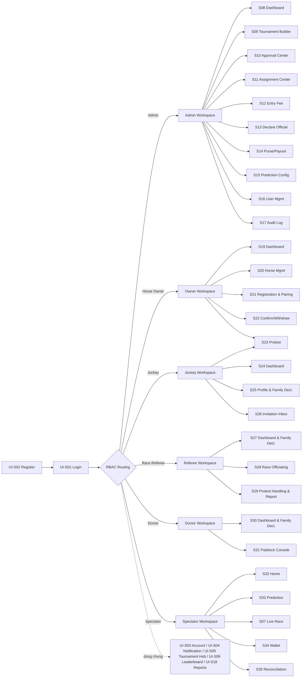

---

### 3.1.6 Danh mục màn hình (Screen Inventory)

Toàn bộ 35 màn hình, mã `UI-S01`–`UI-S35`, nhóm theo workspace. Cột "Module" và "Pha" phục vụ traceability (chi tiết mục 3.1.10).

**Nhóm 1 — Xác thực & Tài khoản (dùng chung)**

| Mã | Màn hình | Mục đích | Actor | Module |
| --- | --- | --- | --- | --- |
| UI-S01 | Login | Đăng nhập, RBAC routing | Tất cả | A, Q |
| UI-S02 | Register (2 bước) | B1: thông tin chung + chọn role (default Spectator) → B2: form riêng theo role + khai báo gia đình (Jockey/Referee) | Owner, Jockey, Referee, Doctor, Spectator | A, F, G |
| UI-S03 | My Account / Profile | Xem/sửa thông tin, đổi mật khẩu | Tất cả | A |
| UI-S04 | Notification Center | Hộp thông báo In-app | Tất cả | O |

**Nhóm 2 — Public / Dùng chung**

| Mã | Màn hình | Mục đích | Actor | Module |
| --- | --- | --- | --- | --- |
| UI-S05 | Tournament Hub | Danh sách giải + chi tiết + lịch chính thức (Post Position) | Tất cả (công khai) | B, E |
| UI-S06 | Leaderboard & Standings | BXH Ngựa + Jockey Standings (polling 30s) | Tất cả | L |
| UI-S07 | Live Race View | Animation mô phỏng cuộc đua (Canvas/SVG) | Spectator (chính) + tất cả | H |

**Nhóm 3 — Admin Workspace**

| Mã | Màn hình | Mục đích | Actor | Module |
| --- | --- | --- | --- | --- |
| UI-S08 | Admin Dashboard | Tổng quan vận hành, cảnh báo URGENT | Admin | B, O |
| UI-S09 | Tournament Builder | Tạo/sửa giải, PrizeDistributions, Round/Race, Post Position Draw | Admin | B, K, E |
| UI-S10 | Approval Center | Duyệt Ngựa/Jockey/onboarding Referee-Doctor | Admin | C, D, F, G |
| UI-S11 | Assignment Center | Phân công Referee/Doctor + COI Check | Admin | F, G |
| UI-S12 | Entry Fee Management | Xác nhận phí, xử lý Refund Pending | Admin | C |
| UI-S13 | Declare Official Console | Công bố kết quả chính thức (ACID 6 bước) | Admin | J, K, L, N |
| UI-S14 | Purse & Payout Management | Phân bổ thưởng, cập nhật chi trả, Remainder | Admin | K |
| UI-S15 | Prediction Config | Cấu hình phần thưởng, mở/đóng cổng dự đoán | Admin | M |
| UI-S16 | User Management | Quản lý user theo Role, Suspend/kích hoạt | Admin | A, Q |
| UI-S17 | Audit Log Viewer | Tra cứu nhật ký kiểm toán | Admin | Q |
| UI-S18 | Reports & Export | Kết xuất CSV/PDF/in | Admin (+ Actor theo quyền) | P |

**Nhóm 4 — Horse Owner Workspace**

| Mã | Màn hình | Mục đích | Actor | Module |
| --- | --- | --- | --- | --- |
| UI-S19 | Owner Dashboard | Tổng quan ngựa, đăng ký, lời mời | Horse Owner | C, E |
| UI-S20 | Horse Management | CRUD hồ sơ ngựa + khai báo y tế + cam kết | Horse Owner | C |
| UI-S21 | Registration & Pairing | Đăng ký ngựa vào Tournament; tìm & mời Jockey cùng Tournament | Horse Owner | C, D |
| UI-S22 | Schedule Confirm & Withdrawal | Xác nhận tham gia / rút lui | Horse Owner | E |
| UI-S23 | Protest | Nộp & theo dõi khiếu nại | Horse Owner / Jockey | I |

**Nhóm 5 — Jockey Workspace**

| Mã | Màn hình | Mục đích | Actor | Module |
| --- | --- | --- | --- | --- |
| UI-S24 | Jockey Dashboard | Lịch thi đấu, lời mời chờ | Jockey | D, E |
| UI-S25 | Profile & Family Declaration | Chứng chỉ, SelfDeclaredWeight, khai báo gia đình | Jockey | D, G |
| UI-S26 | Invitation Inbox | Đồng ý/từ chối lời mời thuê | Jockey | D |

**Nhóm 6 — Referee Workspace**

| Mã | Màn hình | Mục đích | Actor | Module |
| --- | --- | --- | --- | --- |
| UI-S27 | Referee Dashboard & Family Decl. | Race được phân công + khai báo COI | Race Referee | F |
| UI-S28 | Race Officiating | Ghi vi phạm, xác nhận thứ hạng sơ bộ | Race Referee | H |
| UI-S29 | Protest Handling & Race Report | Xử lý khiếu nại, lập & khóa biên bản | Race Referee | I |

**Nhóm 7 — Doctor Workspace**

| Mã | Màn hình | Mục đích | Actor | Module |
| --- | --- | --- | --- | --- |
| UI-S30 | Doctor Dashboard & Family Decl. | Race được phân công + khai báo COI | Doctor | G |
| UI-S31 | Paddock Console | Weigh-In, xác minh ngựa, Fit/Unfit, Weigh-Out | Doctor | G |

**Nhóm 8 — Spectator Workspace**

| Mã | Màn hình | Mục đích | Actor | Module |
| --- | --- | --- | --- | --- |
| UI-S32 | Spectator Home | Giải/race sắp diễn ra, Form Score | Spectator | M |
| UI-S33 | Prediction Page | Dự đoán Win (Top 1) + Form Score + ví | Spectator | M |
| UI-S34 | Wallet & Transactions | Số dư ví + lịch sử giao dịch (ledger) | Spectator | N |
| UI-S35 | My Predictions / Reconciliation | Đối chiếu dự đoán vs kết quả | Spectator | N |

---

### 3.1.7 Đặc tả chi tiết màn hình (Detailed Screen Specifications)

Mỗi màn hình đặc tả theo cấu trúc: **Mục đích — Actor — Thành phần giao diện chính — Ràng buộc UI đặc thù**. Wireframe tương ứng xem `3.1_UI_Wireframes.html` (cùng mã UI-Sxx).

#### Nhóm 1 — Xác thực & Tài khoản

**UI-S01 — Login**
Mục đích: Xác thực người dùng, định tuyến RBAC. Actor: Tất cả.
Thành phần: Form Username + Password; checkbox "Ghi nhớ"; nút Đăng nhập; link sang UI-S02.
Ràng buộc: Hiển thị lỗi sai mật khẩu, tài khoản `Suspended`, và `Lockout` (theo `FailedLoginAttempts`/`LockoutEnd` — Module Q). Sau đăng nhập điều hướng theo Role (UI-PR1).

**UI-S02 — Register (Đăng ký 2 bước)**
Mục đích: Tự đăng ký cho 5 vai trò theo luồng 2 bước, tối ưu cho Spectator (nhóm người dùng đông nhất). Actor: Owner, Jockey, Referee, Doctor, Spectator.

*Bước 1 (UI-S02a) — Thông tin chung + chọn vai trò:*
Thành phần: Form trường chung của bảng `Users` (Họ tên, Email, Username, Password, Xác nhận mật khẩu); ô chọn Role **mặc định `Spectator`**; checkbox cam kết thông tin trung thực; nút "Tiếp tục". Validation trường chung trước khi cho qua bước sau.
Phân nhánh khi "Tiếp tục":
- Role = `Spectator` → **tạo tài khoản ngay**, chuyển màn "Đăng ký thành công"; tài khoản `Active` tức thì + tạo `Wallets` kèm `VirtualPointsTransactions` loại `SignUp Bonus` (+1000) **nguyên tử** (EC-47); **không qua bước 2**.
- Role ≠ Spectator → sang **UI-S02b**.

*Bước 2 (UI-S02b) — Thông tin riêng theo vai trò (Owner/Jockey/Referee/Doctor):*
- **Khối 1 — Trường nghề nghiệp:** Owner (PhoneNumber, IdentityNumber); Jockey (LicenseCertificate, ExperienceYears, **SelfDeclaredWeight bắt buộc**, BloodType, HealthStatus); Referee (CertificationLevel); Doctor (MedicalLicenseNumber).
- **Khối 2 — Khai báo quan hệ gia đình (COI) — *chỉ Jockey & Referee*:** bảng nhiều dòng, mỗi dòng gồm Tên người thân, RelationType (`Spouse`/`Parent`/`Child`/`Sibling`), IndustryRole (tùy chọn), Notes (tùy chọn). Ô "Tên người thân" có **autocomplete liên kết**: khi gõ (debounce), hệ thống tìm `Users` có `Role ∈ (Owner, Jockey, Referee, Doctor)` và gợi ý, hiển thị **tối thiểu Họ tên + Vai trò**. Chọn một gợi ý → ghi `RelatedUserId` (exact match, ưu tiên 1); không chọn → giữ tên tự nhập làm `RelatedPersonName`, `RelatedUserId = NULL` (fallback theo tên, ưu tiên 2). App layer chặn trùng theo `UNIQUE(DeclarantUserId, RelatedUserId)`.
- **Khối 3 — Cam kết pháp lý (checkbox bắt buộc, EC-18):** cam kết khai báo đầy đủ & trung thực, chịu trách nhiệm pháp lý; khai sai/thiếu là vi phạm hành chính, Admin có quyền Suspend.
- Nút "Quay lại" (cho đổi role) + "Hoàn tất đăng ký".

Ràng buộc:
- **Owner KHÔNG khai báo quan hệ gia đình** — Owner là phía được match tự động trong COI/Independence Check, giữ liêm chính schema (`FamilyRelationshipDeclarations.DeclarantUserId` chỉ nhận Role Jockey/Referee/Doctor).
- **Doctor KHÔNG khai báo gia đình ở bước đăng ký**; Doctor thực hiện khai báo tại workspace (UI-S30) phục vụ Doctor COI Check (EC-38).
- **Tạo tài khoản nguyên tử ở lần submit cuối**: Spectator (cuối bước 1) hoặc Owner/Jockey/Referee/Doctor (cuối bước 2 — tạo `Users` + `*Profiles` + các dòng `FamilyRelationshipDeclarations` trong một giao dịch) → tránh tài khoản "mồ côi" không có profile.
- **Trạng thái sau đăng ký:** Spectator & Owner `Active` ngay; Jockey/Referee/Doctor profile `Pending` chờ Admin duyệt (Module D / EC-37). Tài khoản Admin không qua luồng tự đăng ký.
- Khai báo gia đình **chỉnh sửa lại được sau** tại workspace (UI-S25 Jockey, UI-S27 Referee, UI-S30 Doctor); mỗi lần thay đổi → tự re-run COI (EC-25).
- Autocomplete chỉ gợi ý người có vai trò trong ngành, hiển thị tối thiểu (tên + vai trò) để bảo đảm riêng tư.

**UI-S03 — My Account / Profile**
Mục đích: Quản lý thông tin cá nhân. Actor: Tất cả.
Thành phần: Tab Thông tin cá nhân / Đổi mật khẩu / Hồ sơ vai trò; badge trạng thái tài khoản.
Ràng buộc: Field hiển thị tùy Role; tab Hồ sơ vai trò liên kết tới profile mở rộng (UI-S25, UI-S20…).

**UI-S04 — Notification Center**
Mục đích: Trung tâm thông báo In-app. Actor: Tất cả.
Thành phần: UI-C7; Data Table (nội dung, loại, thời gian, đã/chưa đọc); filter theo loại; nút "Đánh dấu đã đọc"; badge số chưa đọc trên chuông (UI-C1).
Ràng buộc: Chỉ đặc tả kênh In-app; Email thuộc backend Module O. Loại sự kiện: reject hồ sơ, lời mời Jockey, phân công Referee, phán quyết Protest (closed-loop), đổi lịch khẩn (URGENT), kết quả dự đoán.

#### Nhóm 2 — Public / Dùng chung

**UI-S05 — Tournament Hub**
Mục đích: Cổng công khai danh sách giải + chi tiết + lịch chính thức. Actor: Tất cả (công khai).
Thành phần: Data Table giải (Tên, thời gian, Breed, TrackType, Distance, Purse, Status) + filter/search/pagination; trang chi tiết: cây Round/Race, bảng Post Position theo race, badge trạng thái.
Ràng buộc: **Role-conditional rendering** (UI-PR1): khách xem công khai; Owner/Jockey thấy nút Đăng ký/Xác nhận; Spectator thấy nút Dự đoán/Live.

**UI-S06 — Leaderboard & Standings**
Mục đích: BXH tích lũy. Actor: Tất cả.
Thành phần: Tab Ngựa (toggle Points 10/5/3 ↔ Earnings) + Tab Jockey (Wins/Top/Win Rate/Income); biểu đồ cột top 10; chỉ báo auto-refresh + nút tải lại.
Ràng buộc: Cập nhật bằng **HTTP Polling ≥ 30s** hoặc F5 (UI-PR3). Đọc ở mức `READ COMMITTED` (EC-31); sau Declare Official commit → kích hoạt tải lại ngay.

**UI-S07 — Live Race View**
Mục đích: Xem diễn biến cuộc đua. Actor: Spectator (chính) + tất cả.
Thành phần: Vùng Canvas/SVG với chip ngựa (số cổng, tên) di chuyển; panel danh sách ngựa + post position; đồng hồ; trạng thái cổng dự đoán.
Ràng buộc: Animation **giả lập client-side** (UI-PR3), cập nhật 100ms, không GPS/WebSocket. Khi Referee chốt sơ bộ → race `Unofficial`, chip về đúng thứ hạng, hiện bảng kết quả sơ bộ.

#### Nhóm 3 — Admin Workspace

**UI-S08 — Admin Dashboard**
Mục đích: Tổng quan vận hành. Actor: Admin.
Thành phần: UI-C2 sidebar Admin (tái dùng S08–S18); stat tiles (giải đang mở, hồ sơ chờ duyệt, race sắp diễn ra, cảnh báo URGENT); biểu đồ; quick actions.
Ràng buộc: Tile URGENT gom withdrawal/disqualification (Module E/G).

**UI-S09 — Tournament Builder** *(màn phức tạp nhất)*
Mục đích: Tạo/sửa giải, cấu hình chia thưởng, dựng cấu trúc & bốc thăm. Actor: Admin.
Thành phần: Wizard 4 tab — (1) Thông số (Name, StartDate, EndDate, AllowedBreed single-select, TrackType, RaceDistance, RaceCategory, MaxHorses, MinJockeyExperienceYears, PurseAmount, EntryFeeAmount, PreRace/PostRaceWeightThreshold); (2) **PrizeDistributions** 5 dòng Top1–Top5, validate tổng = 100% trực tiếp; (3) Builder cây Round→Race (SequenceOrder, ScheduledDate, RaceNumber, ScheduledTime, PurseAmount, overrides); (4) **Post Position Draw** (nút bốc thăm ngẫu nhiên → hiện số cổng).
Ràng buộc: Validation trực quan ràng buộc thời gian phân cấp (EC-35), `SUM(Race.Purse) ≤ Tournament.Purse` (EC-34), tổng % = 100 (EC-33/08). **Sau bốc thăm** (`IsPostPositionDrawn=1`) các field nhạy cảm (`ScheduledTime`, `RaceDistanceOverride`, `TrackTypeOverride`) bị **disable/đóng băng** (EC-48, UI-PR6). Actions: Save Draft, Publish (Open Registration), Cancel Tournament.

**UI-S10 — Approval Center**
Mục đích: Hàng đợi phê duyệt. Actor: Admin.
Thành phần: Tabs Ngựa / Jockey / Onboarding Referee-Doctor; Data Table hồ sơ; nút Approve/Reject; drawer chi tiết; modal nhập lý do từ chối.
Ràng buộc: Nút **Approve khóa khi `EntryFeeStatus ≠ Paid`** (Node 2.5, UI-PR6). Auto-reject khi `Horse.Breed ≠ Tournament.AllowedBreed` (Admin không override). Reject bắt buộc lý do ≥10 ký tự → gửi Notification kèm lý do. Tab onboarding chỉ cho Jockey/Referee/Doctor: đối chiếu license/certification/medical license, duplicate warning và declaration risk → `Pending → Active` (EC-37). Owner không nằm trong queue duyệt onboarding/roster.

**UI-S11 — Assignment Center**
Mục đích: Phân công Ban Trọng tài & Bác sĩ. Actor: Admin.
Thành phần: Tabs Referee / Doctor; chọn Race → danh sách ứng viên `Active`; chọn Lead + Assistant; panel kết quả COI Check.
Ràng buộc: COI Check **chặn phân công** khi người được chỉ định là thân nhân trực hệ của Owner trong race; **đúng 1 Lead Referee/race** (EC-45). Doctor phân công tường minh (`DoctorAssignments`) + Doctor COI Check (EC-38). Thay đổi khai báo gia đình sau phân công → tự re-run COI (EC-25).

**UI-S12 — Entry Fee Management**
Mục đích: Quản lý lệ phí đăng ký. Actor: Admin.
Thành phần: Data Table (Race, Ngựa, Owner, phí, trạng thái); nút "Xác nhận đã thu → Paid"; nút "Chốt Refunded".
Ràng buộc: Phase 1 xác nhận phí **thủ công** (ngoài hệ thống). `Paid` → ghi `EntryFeeConfirmedBy/At` + AuditLog. Withdrawal/Disqualify/Cancel tự chuyển **`Paid → Refund Pending`** (EC-32). Không có Payment Gateway (Phase 2).

**UI-S13 — Declare Official Console**
Mục đích: Công bố kết quả chính thức. Actor: Admin.
Thành phần: Data Table race `Unofficial` (biên bản, trạng thái Protest); nút Declare Official; modal xác nhận liệt kê **6 bước ACID** + cảnh báo khóa biên bản vĩnh viễn.
Ràng buộc: Nút khóa khi còn Protest đang xử lý hoặc giải chưa cấu hình đủ `PrizeDistributions`. Re-check toàn vẹn thứ hạng (EC-41) phải pass. Lỗi bất kỳ bước → **ROLLBACK** toàn bộ, hiện lỗi cụ thể (Module J).

**UI-S14 — Purse & Payout Management**
Mục đích: Phân bổ & chi trả thưởng. Actor: Admin.
Thành phần: Data Table `PursePayouts` (người nhận, vai trò, vị trí, số tiền, trạng thái chi trả); nút Đánh dấu Paid; dòng Remainder; export.
Ràng buộc: Chỉ tính toán lý thuyết, chi trả thực tế ngoài hệ thống. Khi <5 ngựa, phần dư = **Remainder** giữ lại (EC-08), không thất thoát/vượt quỹ. Cập nhật Paid → AuditLog.

**UI-S15 — Prediction Gate & Reward Config**
Mục đích: Cấu hình dự đoán. Actor: Admin.
Thành phần: Form phần thưởng (+200 điểm/voucher); Data Table race (PostPositionDrawn, cổng dự đoán); nút Mở/Đóng cổng.
Ràng buộc: Cổng chỉ mở được sau `IsPostPositionDrawn = true` (F4). Backend chặn nhận dự đoán khi gate đóng/race ≠ `Upcoming` (F4b/EC-05) — không chỉ khóa Frontend.

**UI-S16 — User Management**
Mục đích: Quản trị tài khoản. Actor: Admin.
Thành phần: Data Table user (filter Role); nút Suspend/Kích hoạt; nút Tạo user.
Ràng buộc: Suspend → xóa/blacklist session/token Redis tức thì, request sau trả 401 (EC-29). HRTMS chỉ Suspend, **không hard-delete** user (giữ toàn vẹn COI/audit).

**UI-S17 — Audit Log Viewer**
Mục đích: Tra cứu nhật ký kiểm toán. Actor: Admin.
Thành phần: Data Table (thời gian, user, action, đối tượng) + filter ngày/action/user + search.
Ràng buộc: Ghi mọi hành động quan trọng của Admin/Referee/system: tạo giải, duyệt hồ sơ, Post Position Draw, đổi lịch, Withdrawal, Disqualification, Declare Official.

**UI-S18 — Reports & Export**
Mục đích: Kết xuất dữ liệu. Actor: Admin (+ Actor theo quyền).
Thành phần: Form chọn loại báo cáo + giải/race + khoảng thời gian; vùng xem trước; nút Export CSV/PDF/in trình duyệt.
Ràng buộc: Nội dung & quyền export tùy Role (Module P).

#### Nhóm 4 — Horse Owner Workspace

**UI-S19 — Owner Dashboard**
Mục đích: Tổng quan của Owner. Actor: Horse Owner.
Thành phần: Sidebar Owner (tái dùng S19–S23); stat tiles (số ngựa, đăng ký chờ duyệt, lời mời chờ, cần xác nhận lịch); Data Table ngựa (hồ sơ, Pairing, EntryFee).

**UI-S20 — Horse Management**
Mục đích: CRUD hồ sơ ngựa. Actor: Horse Owner.
Thành phần: Data Table ngựa; Form (thông tin hành chính: Tên, BirthYear→auto tuổi, giới tính, màu, huyết thống, đặc điểm; thông số y tế: Breed, VaccinationRecordRef, DopingTestDate, DopingTestResult); checkbox cam kết pháp lý (EC-22).
Ràng buộc: Sửa trường nhạy cảm (`DopingTestResult`/`Breed`/`VaccinationRecordRef`/`DopingTestDate`) **sau khi Approved** → hồ sơ tự về `Pending`, treo Pairing, chạy lại auto-reject (EC-23); cảnh báo rõ trước khi lưu.

**UI-S21 — Tournament Registration & Pairing**
Mục đích: Đăng ký ngựa vào Tournament và ghép cặp Jockey theo Tournament context. Actor: Horse Owner.
Thành phần: Entry point từ Tournament page dùng current Tournament; entry point từ menu tổng yêu cầu chọn Tournament hợp lệ; danh sách ngựa `Approved` của Owner trong Tournament; danh sách Jockey `Active` và `Approved` trong cùng Tournament với cột "Đạt MinExp?"; nút Gửi lời mời; trạng thái Pairing + EntryFee.
Ràng buộc: Chỉ list Tournament đang `Open Registration` mà Owner đã `Approved`; Pairing lưu `TournamentId`; kiểm tra `ExperienceYears ≥ MinJockeyExperienceYears` khi gửi lời mời và **tái kiểm tra khi vào RaceEntry** (EC-21). Chặn 1 ngựa/Jockey trùng trong cùng race (EC-40); chặn vượt `MaxHorses` (EC-46). EntryFee tạo tự động `Unpaid` (hoặc `Paid` nếu phí=0).

**UI-S22 — Schedule Confirmation & Withdrawal**
Mục đích: Xác nhận tham gia / rút lui. Actor: Horse Owner.
Thành phần: Data Table race đã đăng ký (ScheduledTime, Post Position, đếm ngược Cut-off, trạng thái); nút Xác nhận / Rút lui; modal rút lui kèm lý do.
Ràng buộc: Quá Confirmation Cut-off chưa xác nhận hoặc Owner rút → RaceEntry **`Cancelled`**, Post Position → `Vacant`, gửi URGENT cho Admin, hoàn điểm Spectator (Prediction Refund), ghi AuditLog (Module E).

**UI-S23 — Protest** *(dùng chung Owner/Jockey)*
Mục đích: Nộp & theo dõi khiếu nại. Actor: Horse Owner / Jockey.
Thành phần: Form (Race `Unofficial`, cặp bị khiếu nại, vi phạm liên quan, nội dung, đếm ngược deadline); Data Table lịch sử + phán quyết.
Ràng buộc: Chỉ Owner/Jockey của cặp đấu hợp lệ **trong chính race đó** mới nộp được (EC-43/44). Hợp lệ khi race `Unofficial` & trong `ProtestDeadlineMinutes` (mặc định 120) (EC-20/27). Phán quyết gửi closed-loop cho cả 2 bên.

#### Nhóm 5 — Jockey Workspace

**UI-S24 — Jockey Dashboard**
Mục đích: Tổng quan của Jockey. Actor: Jockey.
Thành phần: Sidebar Jockey; stat tiles (lời mời chờ, race sắp tới, Wins, Win Rate); Data Table race sắp tới.

**UI-S25 — Jockey Profile & Family Declaration**
Mục đích: Quản lý hồ sơ hành nghề + khai báo gia đình. Actor: Jockey.
Thành phần: Form (LicenseCertificate, ExperienceYears, **SelfDeclaredWeight bắt buộc**); Data Table khai báo quan hệ gia đình (họ tên, RelationType, IndustryRole, liên kết UserId); checkbox cam kết (EC-18).
Ràng buộc: `SelfDeclaredWeight` **NOT NULL** (baseline cho Pre-Race Weigh-In — EC-39). Khai báo gia đình phục vụ Jockey Independence Check (Node 4.4); thiếu/sai là vi phạm hành chính, Admin có quyền Suspend.

**UI-S26 — Invitation Inbox**
Mục đích: Phản hồi lời mời thuê. Actor: Jockey.
Thành phần: Data Table lời mời (Owner, Ngựa, Race, giờ chạy); nút Đồng ý / Từ chối.
Ràng buộc: Jockey Đồng ý → Owner hoàn tất xác nhận để chính thức ghép cặp Horse–Jockey (UI-S21).

#### Nhóm 6 — Referee Workspace

**UI-S27 — Referee Dashboard & Family Declaration**
Mục đích: Race được phân công + khai báo COI. Actor: Race Referee.
Thành phần: Sidebar Referee; Data Table race được phân công (vai trò Lead/Assistant, COI, trạng thái); tab khai báo quan hệ gia đình (giống UI-S25).
Ràng buộc: Thay đổi khai báo sau phân công → tự re-run COI (EC-25).

**UI-S28 — Race Officiating** *(nhập liệu tại sân)*
Mục đích: Ghi vi phạm & xác nhận thứ hạng sơ bộ. Actor: Race Referee.
Thành phần: Danh sách ngựa (cột trái); panel ghi vi phạm (dropdown ≥7 mã lỗi seed sẵn, chọn cặp, ghi chú); bảng vi phạm đã ghi (sửa/xóa); bảng nhập thứ hạng về đích; nút Xác nhận kết quả sơ bộ.
Ràng buộc: UI nhập liệu **rõ ràng, hạn chế nhầm mã lỗi** (nhu cầu giao diện Referee — OVERALL 2.4.1). Sửa/xóa vi phạm **chỉ trước** khi xác nhận sơ bộ. Khi chuyển `Live`: cổng dự đoán auto đóng & mọi entry phải đủ điều kiện (EC-17/24). Tối ưu tablet/mobile (UI-PR2).

**UI-S29 — Protest Handling & Race Report**
Mục đích: Xử lý khiếu nại, lập & khóa biên bản. Actor: Race Referee.
Thành phần: Hàng đợi Protest (chi tiết, dropdown phán quyết: `Disqualified`/`PlaceBehind`/`Warning`/`Scratch`); nút Chấp thuận/Bác bỏ; vùng biên bản thi đấu điện tử; nút Xác nhận biên bản.
Ràng buộc: Sau điều chỉnh thứ hạng → hệ thống **re-check toàn vẹn standard-ranking** (EC-41) trước khi cho Declare Official. Phán quyết gửi **closed-loop** cả 2 bên (in-app + email). Sau Declare Official: `RaceReport.IsLocked=true`, nút Sửa/Xóa **disable** + tooltip "đã khóa vĩnh viễn" (UI-PR6).

#### Nhóm 7 — Doctor Workspace

**UI-S30 — Doctor Dashboard & Family Declaration**
Mục đích: Race được phân công khám + khai báo COI. Actor: Doctor.
Thành phần: Sidebar Doctor; Data Table race được phân công (COI, số cặp cần khám); nút Mở Paddock; tab khai báo gia đình (giống UI-S25).
Ràng buộc: Doctor phải được Admin **phân công tường minh** (`DoctorAssignments`) & qua Doctor COI Check mới thao tác được (EC-38).

**UI-S31 — Paddock Console** *(màn nhập liệu quan trọng)*
Mục đích: Pre-Race Weigh-In, xác minh danh tính ngựa, Fit/Unfit, Post-Race Weigh-Out. Actor: Doctor.
Thành phần: Danh sách cặp đấu (cột trái); panel theo cặp: nhập `PreRaceJockeyWeight` (hiện baseline `SelfDeclaredWeight` + flag nếu vượt ngưỡng), xác minh danh tính (`Matched`/`Mismatch`), khám lâm sàng (`Fit`/`Unfit` kèm lý do ≥20 ký tự), nhập `PostRaceJockeyWeight`; modal xác nhận.
Ràng buộc: Pre-Race Weigh-In là điều kiện trước khi race `Live`; chênh vượt `PreRaceWeightThresholdKg` → flag (EC-39). `Unfit`/`Mismatch`/Independence fail → **loại khẩn cấp nguyên tử** (ACID, EC-26): `Disqualified` + cập nhật danh sách + hoàn điểm Spectator + 3 notification + AuditLog. `PostRaceJockeyWeight` **bắt buộc NOT NULL** trước khi Referee chốt biên bản (EC-42). Modal xác nhận trước khi lưu (UI-PR4).

#### Nhóm 8 — Spectator Workspace

**UI-S32 — Spectator Home**
Mục đích: Trang chủ Spectator. Actor: Spectator.
Thành phần: Sidebar Spectator; số dư ví trên app bar; Data Table cuộc đua sắp diễn ra (trạng thái cổng dự đoán, nút Dự đoán).

**UI-S33 — Prediction Page**
Mục đích: Đặt dự đoán Win + tham khảo Form Score. Actor: Spectator.
Thành phần: Data Table ngựa trong race (post, ngựa, Jockey, **Form Score**); radio chọn ngựa Win; nhập số điểm đặt; hiển thị số dư ví; nút Xác nhận dự đoán.
Ràng buộc: Chỉ một loại **Win (Top 1)** trong Phase 1. Form Score = SQL tĩnh (40% ngựa, 35% Jockey, 25% loại vòng), **không AI/ML** (F7). Backend chặn khi `IsPredictionGateClosed` hoặc race ≠ `Upcoming` (EC-05) — ghi VP Transaction `Prediction Placed` (âm).

**UI-S34 — Wallet & Transaction History**
Mục đích: Theo dõi ví điểm ảo. Actor: Spectator.
Thành phần: Thẻ số dư; Data Table giao dịch (Type, điểm, thời gian, race).
Ràng buộc: Mô hình **sổ cái (ledger)**: `Balance = SUM(transactions)`. 4 loại Type: `SignUp Bonus`, `Prediction Placed`, `Prediction Win Reward`, `Prediction Refund` (Module N). Đọc ở `READ COMMITTED` (EC-31).

**UI-S35 — My Predictions / Reconciliation**
Mục đích: Đối chiếu dự đoán với kết quả chính thức. Actor: Spectator.
Thành phần: Data Table đối chiếu (race, ngựa đoán, kết quả thực tế, Thắng/Thua/Hoàn điểm, điểm cộng/hoàn).
Ràng buộc: Đối chiếu tự động **trong transaction Declare Official** của Admin. Đoán đúng Win → +200; cặp bị `Disqualified`/`Withdrawn` → `Prediction Refund`. Gửi Notification kết quả (in-app + email).

---

### 3.1.8 Ma trận Màn hình × Vai trò (Screen × Actor Access Matrix)

Ký hiệu: **F** = Full (xem + thao tác), **R** = Read-only, **—** = không truy cập. Ma trận chứng minh phân quyền giao diện theo RBAC (UI-PR1).

| Màn hình | Admin | Owner | Jockey | Referee | Doctor | Spectator |
| --- | :---: | :---: | :---: | :---: | :---: | :---: |
| S01 Login / S02 Register / S03 Account / S04 Notification | F | F | F | F | F | F |
| S05 Tournament Hub | F | R | R | R | R | R |
| S06 Leaderboard | R | R | R | R | R | R |
| S07 Live Race | R | R | R | R | R | F |
| S08–S17 Admin (Builder, Approval, Assignment, Fee, Declare, Purse, Prediction Cfg, User, Audit) | F | — | — | — | — | — |
| S18 Reports & Export | F | R | R | R | R | R |
| S19–S22 Owner workspace | — | F | — | — | — | — |
| S23 Protest | R | F | F | F | — | — |
| S24–S26 Jockey workspace | — | — | F | — | — | — |
| S27–S29 Referee workspace | R | — | — | F | — | — |
| S30–S31 Doctor workspace | R | — | — | — | F | — |
| S32–S35 Spectator workspace | — | — | — | — | — | F |

> Ghi chú: Admin có quyền **R** (giám sát) trên một số workspace nghiệp vụ (Protest, Referee/Doctor) để theo dõi vận hành nhưng không thay thế thao tác chuyên môn. S23 Protest dùng chung Owner & Jockey (chỉ bên tham gia cuộc đua — EC-43/44).

---

### 3.1.9 Sơ đồ luồng giao diện (UI Flows)

**UI Flow 0 — Đăng ký 2 bước (UI-S02):**

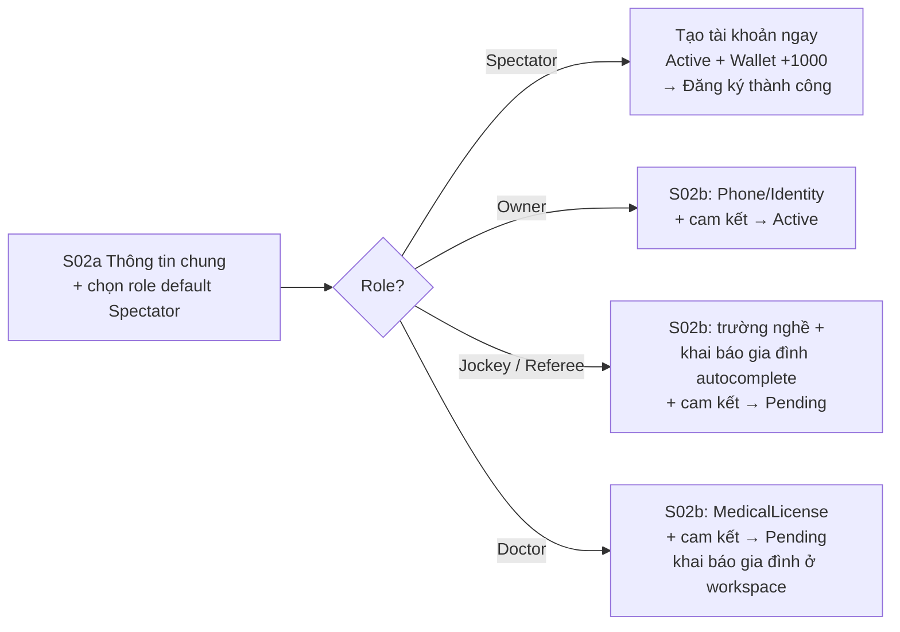

**UI Flow 1 — Đăng ký & Ghép cặp (Pha 2):**

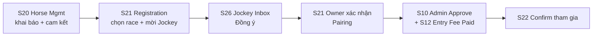

**UI Flow 2 — Paddock Pre-Race Check (Pha 4):**

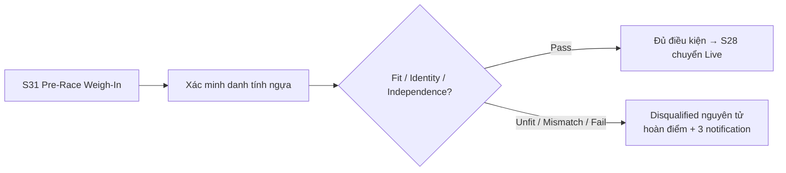

**UI Flow 3 — Declare Official (Pha 6, ACID 6 bước):**

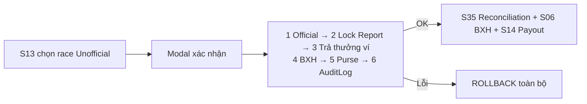

**UI Flow 4 — Prediction (Spectator, Pha 3→6):**

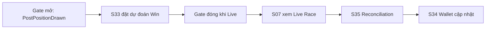

---

### 3.1.10 Ma trận truy xuất (Traceability: Screen → Module → Entities)

| Màn hình | Module (A–Q) | Pha | Thực thể dữ liệu chính |
| --- | --- | --- | --- |
| S01 Login | A, Q | mọi pha | Users |
| S02 Register | A, F, G | trước Pha 1 | Users, *Profiles, Wallets, VirtualPointsTransactions, FamilyRelationshipDeclarations |
| S03 My Account | A | mọi pha | Users, *Profiles |
| S04 Notification | O | mọi pha | Notifications |
| S05 Tournament Hub | B, E | 1, 3 | Tournaments, Rounds, Races, RaceEntries |
| S06 Leaderboard | L | 6 | RaceEntries, PursePayouts, *Profiles |
| S07 Live Race | H | 5 | Races, RaceEntries, Pairings |
| S08 Admin Dashboard | B, O | mọi pha | Tournaments, Races, RaceEntries, Notifications |
| S09 Tournament Builder | B, K, E | 1, 3 | Tournaments, PrizeDistributions, Rounds, Races, RaceEntries |
| S10 Approval Center | C, D, F, G | 1, 2 | Horses, JockeyProfiles, Referee/DoctorProfiles, RaceEntries |
| S11 Assignment Center | F, G | 3, 4 | RefereeAssignments, DoctorAssignments, FamilyRelationshipDeclarations |
| S12 Entry Fee Mgmt | C | 2 | RaceEntries, AuditLogs |
| S13 Declare Official | J, K, L, N | 6 | Races, RaceReports, PursePayouts, Predictions, AuditLogs |
| S14 Purse & Payout | K | 6 | PursePayouts |
| S15 Prediction Config | M | 3 | Races, Predictions |
| S16 User Management | A, Q | mọi pha | Users |
| S17 Audit Log Viewer | Q | mọi pha | AuditLogs |
| S18 Reports & Export | P | 6 | nhiều bảng (read-only) |
| S19 Owner Dashboard | C, E | 2, 3 | Horses, Pairings, RaceEntries |
| S20 Horse Management | C | 2 | Horses |
| S21 Registration & Pairing | C, D | 2 | Pairings, RaceEntries, JockeyProfiles |
| S22 Confirm / Withdrawal | E | 3 | RaceEntries, Predictions, Notifications |
| S23 Protest | I | 5 | Protests, Violations, RaceEntries |
| S24 Jockey Dashboard | D, E | 2, 3 | Pairings, RaceEntries |
| S25 Jockey Profile | D, G | trước Pha 2 | JockeyProfiles, FamilyRelationshipDeclarations |
| S26 Invitation Inbox | D | 2 | Pairings |
| S27 Referee Dashboard | F | 3, 4 | RefereeAssignments, FamilyRelationshipDeclarations |
| S28 Race Officiating | H | 5 | Violations, RaceReports, RaceEntries |
| S29 Protest Handling & Report | I | 5 | Protests, RaceReports, Violations |
| S30 Doctor Dashboard | G | 4 | DoctorAssignments, FamilyRelationshipDeclarations |
| S31 Paddock Console | G | 4 | RaceEntries, JockeyProfiles, Horses |
| S32 Spectator Home | M | 3 | Tournaments, Races |
| S33 Prediction Page | M | 3 | Predictions, Wallets, Races, Pairings |
| S34 Wallet | N | mọi pha | Wallets, VirtualPointsTransactions |
| S35 Reconciliation | N | 6 | Predictions, VirtualPointsTransactions |

---

### 3.1.11 Tham chiếu Wireframe

Bản vẽ wireframe low-fidelity của toàn bộ 35 màn hình (mã trùng UI-S01–UI-S35) được cung cấp trong tệp **`3.1_UI_Wireframes.html`** (mở bằng trình duyệt). Mỗi wireframe thể hiện bố cục thật của màn hình (app bar, sidebar theo Role, form, bảng, dashboard, Canvas Live Race, modal xác nhận) kèm chú thích ràng buộc UI đặc thù. Wireframe là tài liệu tham khảo bố cục — màu sắc, branding và pixel-level design sẽ được hoàn thiện ở giai đoạn UI/UX Design, không thuộc phạm vi đặc tả này.

---

> **Ghi chú phạm vi (Out-of-Scope giao diện — đồng bộ SRS 1.2.4):** Mục 3.1 **không** bao gồm: màn hình thanh toán tiền thật (Payment Gateway — Phase 2), cấu hình SMS, giao diện tích hợp phần cứng sân (Photo Finish, chip GPS), và ứng dụng native iOS/Android. Mọi cập nhật "thời gian thực" trên giao diện được hiện thực bằng animation client-side (Live Race) hoặc HTTP Polling (Leaderboard), không dùng WebSocket/SSE.

---

## 3.2 Functional Requirements (Đặc tả Yêu cầu Chức năng)

### 3.2.1 Căn cứ thiết kế & Phạm vi (Basis & Scope)

Mục 3.2 đặc tả toàn bộ **yêu cầu chức năng (Functional Requirements — FR)** của hệ thống HRTMS Phase 1. Nội dung được suy luận trực tiếp (traceability) từ **SRS Chương 1 (Introduction — Scope, 17 Module A–Q)**, **SRS Chương 2 (Overall Description)** — đặc biệt mục **2.3.2 Danh sách 17 Module Chức năng (đóng vai trò Product Functions)**, mục **2.2 Main Flows (6 pha nghiệp vụ)** — và **Database Schema Specification** (27 bảng Logical ERD). Mỗi FR được truy xuất ngược tới Module nghiệp vụ, màn hình giao diện (mục 3.1), thực thể dữ liệu và Business Rule (BR-01…BR-63) / Edge-case (EC-01…EC-48) liên quan.

Mỗi **Product Function (PF)** = một Module A–Q. Mỗi PF được mở rộng (expand) thành nhiều FR chi tiết. Tổng quan ánh xạ PF → FR tại mục 3.2.2; chi tiết từng FR tại mục 3.2.3–3.2.19; ma trận truy vết đầy đủ tại mục 3.2.20. Các FR cập nhật sau cùng ưu tiên cách hiểu: roster theo Tournament, identity-based COI/Independence, ticket reward code và tách trạng thái Tournament/Race.

---

### 3.2.2 Quy ước & Ánh xạ Product Function → Functional Requirements

#### Quy ước đánh mã (Naming Convention)

Mã FR: **`REQ-F-<MODULE_CODE>.<n>`**. Ánh xạ Module → Code:

| Module | Code | Tên Module (Product Function) | Số FR |
| --- | --- | --- | --- |
| A | ACC | Quản lý Tài khoản & Phân quyền | 10 |
| B | TRN | Quản lý Giải đấu | 11 |
| C | HRS | Đăng ký Ngựa & Duyệt hồ sơ | 9 |
| D | JOC | Quản lý Nài ngựa (Jockey) | 7 |
| E | SCH | Lập lịch, Bốc thăm & Rút lui | 9 |
| F | REF | Phân công Trọng tài & COI Check | 5 |
| G | MED | Kiểm tra trước thi đấu (Medical/Independence) | 8 |
| H | RACE | Diễn biến cuộc đua & Vi phạm | 8 |
| I | PRT | Xử lý Khiếu nại (Protest) | 7 |
| J | RES | Công bố Kết quả chính thức | 5 |
| K | PRZ | Tính & Phân bổ Tiền thưởng (Purse) | 6 |
| L | LDR | Bảng xếp hạng (Leaderboard/Standings) | 4 |
| M | PRD | Dự đoán & Prediction Gate | 6 |
| N | REC | Đối chiếu Dự đoán & Trả thưởng | 5 |
| O | NOTI | Hệ thống Thông báo | 3 |
| P | RPT | Báo cáo & Xuất dữ liệu | 3 |
| Q | SEC | Bảo mật, Xác thực & Audit Log | 6 |
| | | **TỔNG: 17 Module** | **112 FR** |

#### Quy ước trình bày mỗi FR

Mỗi FR gồm các trường: **Priority** (High/Medium/Low), **Nguồn** (Module/PF + Pha), **Mô tả** (phát biểu chuẩn IEEE dùng động từ "PHẢI" / SHALL), **Tiêu chí chấp nhận** (Acceptance Criteria — kiểm thử được), **Actor**, **Bảng dữ liệu** (DB), **Màn hình** (UI-S), **Truy vết** (BR/EC). Toàn bộ phát biểu chức năng dùng "hệ thống PHẢI…" làm khẳng định bắt buộc; "NÊN" cho khuyến nghị.

#### Tổng quan Trace Mapping: 17 Product Function → Nhóm FR

```
PF-A Account & RBAC          → REQ-F-ACC.1 … ACC.9
PF-B Tournament              → REQ-F-TRN.1 … TRN.10
PF-C Horse Registration      → REQ-F-HRS.1 … HRS.8
PF-D Jockey                  → REQ-F-JOC.1 … JOC.7
PF-E Scheduling & Draw       → REQ-F-SCH.1 … SCH.9
PF-F Referee Assignment      → REQ-F-REF.1 … REF.5
PF-G Pre-Race Medical/Check  → REQ-F-MED.1 … MED.8
PF-H Live Race & Violations  → REQ-F-RACE.1 … RACE.8
PF-I Protest Handling        → REQ-F-PRT.1 … PRT.7
PF-J Declare Official        → REQ-F-RES.1 … RES.5
PF-K Prize/Purse             → REQ-F-PRZ.1 … PRZ.6
PF-L Leaderboard             → REQ-F-LDR.1 … LDR.4
PF-M Prediction & Gate       → REQ-F-PRD.1 … PRD.6
PF-N Reconcile & Reward      → REQ-F-REC.1 … REC.5
PF-O Notification            → REQ-F-NOTI.1 … NOTI.3
PF-P Report & Export         → REQ-F-RPT.1 … RPT.3
PF-Q Security & Audit        → REQ-F-SEC.1 … SEC.6
```

---

### 3.2.3 Module A — Quản lý Tài khoản & Phân quyền (REQ-F-ACC)

**Nguồn:** Module A (Scope 1.2.3) | Pha 1 | Actor: Tất cả | Màn hình chính: UI-S01, UI-S02, UI-S03, UI-S16

#### REQ-F-ACC.1 — Tự đăng ký tài khoản theo vai trò

- **Priority:** High
- **Mô tả:** Hệ thống PHẢI cho phép người dùng tự đăng ký tài khoản thuộc một trong năm vai trò tự đăng ký (Horse Owner, Jockey, Race Referee, Doctor, Spectator) qua quy trình hai bước: (B1) thông tin chung + chọn vai trò (mặc định Spectator); (B2) biểu mẫu trường quy chuẩn riêng theo vai trò. Tài khoản Admin KHÔNG đi qua luồng tự đăng ký.
- **Tiêu chí chấp nhận:**
  1. Bước thông tin chung bắt buộc thu `fullName`, `email`, `phoneNumber`, `dateOfBirth`, `identityNumber`, `username`, `password`, `role` đối với Owner/Jockey/Referee/Doctor.
  2. Spectator có thể đăng ký tối giản, nhưng phải bổ sung phone/identity khi redeem ticket code hoặc nhận reward có kiểm soát.
  3. Email là duy nhất toàn hệ thống; identity hash dùng để chống trùng và phục vụ COI/Independence.
  4. Family declaration không yêu cầu nhập `UserId`; người dùng khai báo tên, quan hệ, role nếu biết, identity/email/phone/DOB nếu biết.
  5. Đăng ký thành công tạo bản ghi `Users` + bản ghi `*Profiles` tương ứng.
  6. Owner và Spectator hợp lệ được `Active` ngay; Jockey/Referee/Doctor tạo profile `Pending` và chờ Admin duyệt.
  7. Không dùng `AutoEligible` cho account onboarding.
- **Actor:** Horse Owner, Jockey, Referee, Doctor, Spectator | **DB:** Users, JockeyProfiles, OwnerProfiles, RefereeProfiles, DoctorProfiles, SpectatorProfiles, FamilyRelationshipDeclarations | **UI:** UI-S02 | **Truy vết:** Module A; EC-18.

#### REQ-F-ACC.1A — Chuẩn dữ liệu định danh dùng chung

- **Priority:** High
- **Mô tả:** Hệ thống PHẢI chuẩn hóa dữ liệu định danh dùng chung cho mọi role nghiệp vụ để phục vụ chống trùng, COI Check và Independence Check. `identityNumber` không lưu plain text; backend lưu encrypted value để hiển thị có kiểm soát và `identityHash` deterministic để matching.
- **Tiêu chí chấp nhận:**
  1. Owner/Jockey/Referee/Doctor thiếu phone, DOB hoặc identity → chặn đăng ký/hoàn tất profile.
  2. Email/phone được normalize trước khi lưu và trước khi matching.
  3. COI/Independence không yêu cầu người khai báo biết `UserId` của người liên quan.
- **Actor:** Tất cả role nghiệp vụ, System | **DB:** Users, *Profiles, FamilyRelationshipDeclarations | **UI:** UI-S02, UI-S03 | **Truy vết:** BR-61, BR-62; REQ-NF-SEC.6.


#### REQ-F-ACC.2 — Admin tạo tài khoản

- **Priority:** Medium
- **Mô tả:** Hệ thống PHẢI cho phép Admin tạo tài khoản người dùng cho bất kỳ vai trò nào, bao gồm tài khoản Admin khác.
- **Tiêu chí chấp nhận:**
  1. Chỉ Role Admin truy cập được chức năng (RBAC).
  2. Tài khoản tạo bởi Admin tuân thủ cùng ràng buộc validation như tự đăng ký.
  3. Hành động được ghi `AuditLogs`.
- **Actor:** Admin | **DB:** Users, *Profiles, AuditLogs | **UI:** UI-S16 | **Truy vết:** Module A.

#### REQ-F-ACC.3 — Cập nhật thông tin tài khoản

- **Priority:** Medium
- **Mô tả:** Hệ thống PHẢI cho phép Admin cập nhật thông tin tài khoản, và cho phép người dùng tự cập nhật hồ sơ cá nhân/đổi mật khẩu của chính mình.
- **Tiêu chí chấp nhận:**
  1. Người dùng chỉ sửa được hồ sơ của chính mình (trừ Admin).
  2. Đổi mật khẩu yêu cầu xác thực mật khẩu hiện tại.
  3. Thay đổi trường nhạy cảm được ghi nhận.
- **Actor:** Tất cả, Admin | **DB:** Users, *Profiles | **UI:** UI-S03, UI-S16 | **Truy vết:** Module A.

#### REQ-F-ACC.4 — Vô hiệu hóa (Suspend) tài khoản

- **Priority:** High
- **Mô tả:** Hệ thống PHẢI cho phép Admin vô hiệu hóa tài khoản (`Users.Status = 'Suspended'`); KHÔNG xóa cứng tài khoản đã phát sinh dữ liệu.
- **Tiêu chí chấp nhận:**
  1. Tài khoản `Suspended` không thể đăng nhập; phiên hiện hành bị vô hiệu tức thì (xem REQ-F-SEC.3).
  2. Dữ liệu lịch sử của tài khoản được bảo toàn (soft-delete).
  3. Hành động ghi `AuditLogs`.
- **Actor:** Admin | **DB:** Users, AuditLogs | **UI:** UI-S16 | **Truy vết:** BR-33, BR-40; EC-29, EC-11/12.

#### REQ-F-ACC.5 — Đăng nhập & xác thực

- **Priority:** High
- **Mô tả:** Hệ thống PHẢI xác thực người dùng bằng cặp username/password (mật khẩu lưu trữ đã mã hóa) và điều hướng về workspace theo vai trò (RBAC routing).
- **Tiêu chí chấp nhận:**
  1. Sai thông tin đăng nhập → báo lỗi không tiết lộ trường nào sai.
  2. Đăng nhập thành công khởi tạo phiên và điều hướng đúng workspace của Role.
  3. Tài khoản `Pending`/`Suspended` bị xử lý theo trạng thái (chặn hoặc cảnh báo).
- **Actor:** Tất cả | **DB:** Users | **UI:** UI-S01 | **Truy vết:** Module A, Q.

#### REQ-F-ACC.6 — Phân quyền chức năng theo vai trò (RBAC)

- **Priority:** High
- **Mô tả:** Hệ thống PHẢI giới hạn truy cập chức năng và dữ liệu nghiêm ngặt theo vai trò; mỗi Actor chỉ thao tác được các chức năng được cấp phép.
- **Tiêu chí chấp nhận:**
  1. Truy cập trái phép tới chức năng ngoài quyền → từ chối tại Backend (không chỉ ẩn UI).
  2. Menu/màn hình hiển thị theo Role (RBAC-driven UI).
- **Actor:** Tất cả | **DB:** Users | **UI:** Tất cả | **Truy vết:** Module A, Q.

#### REQ-F-ACC.7 — Onboarding chuyên môn Jockey/Referee/Doctor (Pending → Active)

- **Priority:** High
- **Mô tả:** Hệ thống PHẢI khởi tạo hồ sơ Jockey/Referee/Doctor ở trạng thái `Pending` và yêu cầu Admin duyệt onboarding trước khi chuyển account/profile sang `Active`. Account onboarding không dùng `AutoEligible`.
- **Tiêu chí chấp nhận:**
  1. Jockey `Pending` không xuất hiện trong danh sách mời/pairing.
  2. Referee/Doctor `Pending` không xuất hiện trong danh sách phân công.
  3. Admin approve → `Users.Status = Active` và role profile `Status = Active`.
  4. Admin reject → profile `Rejected`, lưu lý do và notify user.
  5. Duyệt/reject onboarding ghi `AuditLogs`.
- **Actor:** Admin, Jockey, Referee, Doctor | **DB:** Users, JockeyProfiles, RefereeProfiles, DoctorProfiles, AuditLogs | **UI:** UI-S10 | **Truy vết:** BR-46; EC-37.

#### REQ-F-ACC.8 — Checklist Admin khi duyệt onboarding chuyên môn

- **Priority:** High
- **Mô tả:** UI Approval Center PHẢI hiển thị đủ thông tin để Admin duyệt Jockey/Referee/Doctor onboarding thủ công.
- **Tiêu chí chấp nhận:**
  1. Jockey detail hiển thị identity/contact/DOB, license certificate, experience years, self-declared weight, health/blood type nếu có, family declarations, duplicate identity/email/phone warnings, previous suspension/rejection.
  2. Referee detail hiển thị identity/contact/DOB, certification level, family declarations, duplicate warnings, COI-risk warnings, previous suspension/rejection.
  3. Doctor detail hiển thị identity/contact/DOB, medical license number, duplicate warnings, declaration/COI warning nếu có, previous suspension/rejection.
  4. Reject bắt buộc `RejectionReason >= 10` ký tự.
- **Actor:** Admin | **DB:** Users, JockeyProfiles, RefereeProfiles, DoctorProfiles, FamilyRelationshipDeclarations, AuditLogs | **UI:** UI-S10 | **Truy vết:** BR-46; EC-37.

#### REQ-F-ACC.9 — Khởi tạo ví Spectator + SignUp Bonus nguyên tử

- **Priority:** High
- **Mô tả:** Khi tạo tài khoản Spectator, hệ thống PHẢI tạo ví điểm ảo (`Wallets`, `Balance` mặc định 0) VÀ ghi đồng thời một dòng sổ cái `VirtualPointsTransactions` loại `SignUp Bonus` (+1000) trong **cùng một giao dịch**, đảm bảo bất biến `Balance = SUM(giao dịch)`.
- **Tiêu chí chấp nhận:**
  1. Sau đăng ký, `Wallets.Balance = 1000` và bằng tổng giao dịch sổ cái.
  2. Lỗi bất kỳ bước nào → ROLLBACK toàn bộ (không tạo ví lệch sổ cái).
- **Actor:** Spectator, System | **DB:** Wallets, VirtualPointsTransactions | **UI:** UI-S02 | **Truy vết:** BR-56; EC-47.

---

### 3.2.4 Module B — Quản lý Giải đấu (REQ-F-TRN)

**Nguồn:** Module B | Pha 1 | Actor: Admin | Màn hình chính: UI-S08, UI-S09

#### REQ-F-TRN.1 — Tạo giải đấu & thông tin cơ bản

- **Priority:** High
- **Mô tả:** Hệ thống PHẢI cho phép Admin tạo giải đấu mới với thông tin cơ bản: tên giải, thời gian bắt đầu/kết thúc, quy mô, quỹ thưởng giải (`Tournament.PurseAmount`).
- **Tiêu chí chấp nhận:**
  1. Trường bắt buộc không để trống; `EndDate ≥ StartDate`.
  2. Giải mới khởi tạo ở trạng thái `Draft`.
- **Actor:** Admin | **DB:** Tournaments | **UI:** UI-S09 | **Truy vết:** Module B.

#### REQ-F-TRN.2 — Cấu hình thông số đặc thù ngành đua ngựa

- **Priority:** High
- **Mô tả:** Hệ thống PHẢI yêu cầu Admin cấu hình các thông số đặc thù: `AllowedBreed` (single-select đúng 1 giống, không để trống), `TrackType`, `RaceDistance`, `RaceCategory`, `MinJockeyExperienceYears`.
- **Tiêu chí chấp nhận:**
  1. `AllowedBreed` chọn đúng một giá trị trong danh mục chuẩn (Thoroughbred, Arabian, Quarter Horse, Mixed).
  2. Các thông số được dùng làm căn cứ auto-check ở Module C và D.
- **Actor:** Admin | **DB:** Tournaments | **UI:** UI-S09 | **Truy vết:** Module B; BR-01; 2.5.4.

#### REQ-F-TRN.3 — Cấu hình lệ phí đăng ký (EntryFeeAmount)

- **Priority:** High
- **Mô tả:** Hệ thống PHẢI cho phép Admin đặt `EntryFeeAmount` cho giải (mặc định 0 = miễn phí). Nếu = 0, hệ thống tự động bỏ qua toàn bộ luồng xác nhận phí (Module C).
- **Tiêu chí chấp nhận:**
  1. `EntryFeeAmount = 0` → RaceEntry tạo ra tự động `Paid`.
  2. `EntryFeeAmount > 0` → kích hoạt luồng xác nhận phí thủ công.
- **Actor:** Admin | **DB:** Tournaments | **UI:** UI-S09 | **Truy vết:** BR-21.

#### REQ-F-TRN.4 — Cấu hình tỷ lệ chia thưởng (PrizeDistributions)

- **Priority:** High
- **Mô tả:** Hệ thống PHẢI cho phép Admin nhập 5 tỷ lệ phần trăm cho vị trí Top1–Top5, lưu thành bảng `PrizeDistributions` (mỗi vị trí một dòng) và **validate tổng = 100%** ngay khi lưu.
- **Tiêu chí chấp nhận:**
  1. Tổng 5 tỷ lệ ≠ 100% → chặn lưu, báo lỗi.
  2. Đây là nguồn dữ liệu thật để Declare Official nạp tỷ lệ phân bổ Purse (Module K).
  3. Giải thiếu cấu hình tỷ lệ → chặn công bố kết quả chính thức.
- **Actor:** Admin | **DB:** PrizeDistributions | **UI:** UI-S09 | **Truy vết:** BR-42; EC-33; EC-08.

#### REQ-F-TRN.5 — Cấu hình ngưỡng cảnh báo cân nặng

- **Priority:** Medium
- **Mô tả:** Hệ thống PHẢI cho phép Admin cấu hình theo giải: ngưỡng chênh lệch cân trước đua (`PreRaceWeightThresholdKg`, mặc định 2.0) và sau đua (`PostRaceWeightDiffThresholdKg`, mặc định 1.0).
- **Tiêu chí chấp nhận:**
  1. Giá trị ngưỡng được Module G/H đọc để gắn cờ cảnh báo.
  2. Không nhập → áp giá trị mặc định.
- **Actor:** Admin | **DB:** Tournaments | **UI:** UI-S09 | **Truy vết:** BR-48; EC-39.

#### REQ-F-TRN.6 — Lập cấu trúc Vòng đua & Cuộc đua (Round/Race)

- **Priority:** High
- **Mô tả:** Hệ thống PHẢI cho phép Admin lập cấu trúc giải gồm các vòng (Round: Vòng loại, Bán kết, Chung kết) và các cuộc đua (Race) cụ thể trong từng vòng, kèm thời gian và quỹ thưởng cấp Race.
- **Tiêu chí chấp nhận:**
  1. Mỗi Race thuộc một Round; mỗi Round thuộc một Tournament.
  2. Race khởi tạo trạng thái `Upcoming`.
- **Actor:** Admin | **DB:** Rounds, Races | **UI:** UI-S09 | **Truy vết:** Module B.

#### REQ-F-TRN.7 — Ràng buộc thời gian & quỹ phân cấp

- **Priority:** High
- **Mô tả:** Khi tạo Round/Race, hệ thống PHẢI cưỡng chế `Tournament.StartDate ≤ Round.ScheduledDate ≤ Race.ScheduledTime ≤ Tournament.EndDate`, `Race.ScheduledTime > thời điểm hiện tại`, và tổng `Race.PurseAmount` không vượt `Tournament.PurseAmount`.
- **Tiêu chí chấp nhận:**
  1. Lịch ngoài cửa sổ giải hoặc trong quá khứ → chặn lưu.
  2. Tổng quỹ Race > quỹ giải → chặn lưu (chống over-allocation).
- **Actor:** Admin, System | **DB:** Tournaments, Rounds, Races | **UI:** UI-S09 | **Truy vết:** BR-43, BR-44; EC-34, EC-35.

#### REQ-F-TRN.8 — State machine trạng thái giải đấu

- **Priority:** High
- **Mô tả:** Hệ thống PHẢI quản lý `Tournaments.Status` theo state machine cấp giải một chiều: `Draft → Open Registration → Closed Registration → Completed`, với nhánh `Cancelled`. `Pre-Race`, `Live`, `Unofficial`, `Official` thuộc `Races.Status`, không được lưu trong Tournament. Mỗi chuyển tiếp có tác nhân/điều kiện rõ ràng và được ghi `AuditLogs`.
- **Tiêu chí chấp nhận:**
  1. Chuyển trạng thái sai trình tự → bị chặn.
  2. Không cho chuyển Tournament sang `Pre-Race` hoặc `In-Progress`; các trạng thái này phải được xử lý ở Race.
  3. Tournament chỉ `Completed` khi mọi Race thuộc giải đã `Official` hoặc `Cancelled`.
  4. Mỗi chuyển tiếp ghi nhật ký kiểm toán.
- **Actor:** Admin, System | **DB:** Tournaments, AuditLogs | **UI:** UI-S08, UI-S09 | **Truy vết:** BR-45; EC-36.

#### REQ-F-TRN.9 — Cập nhật / sửa giải trước khi bắt đầu

- **Priority:** Medium
- **Mô tả:** Hệ thống PHẢI cho phép Admin cập nhật thông tin giải đấu khi giải chưa bắt đầu chính thức.
- **Tiêu chí chấp nhận:**
  1. Không cho sửa các thông số đã ràng buộc dữ liệu phát sinh (vd sau khi có RaceEntry/dự đoán — xem REQ-F-SCH.9).
  2. Thay đổi được ghi nhận.
- **Actor:** Admin | **DB:** Tournaments | **UI:** UI-S09 | **Truy vết:** Module B.

#### REQ-F-TRN.10 — Luồng hủy giải (Tournament Cancellation Flow)

- **Priority:** High
- **Mô tả:** Khi Admin hủy một giải đã có dữ liệu phát sinh, hệ thống PHẢI thực hiện trong **một giao dịch nhất quán**: hủy mọi `RaceEntry` liên quan, hoàn điểm ảo mọi dự đoán đang chờ, tự động chuyển lệ phí đã đóng sang `Refund Pending`, vô hiệu Pairing/PursePayout liên quan, gửi thông báo và ghi `AuditLogs`.
- **Tiêu chí chấp nhận:**
  1. Toàn bộ các bước nằm trong một giao dịch; lỗi → ROLLBACK.
  2. Mọi Spectator có dự đoán Pending được hoàn điểm.
  3. Mọi entry `Paid` chuyển `Refund Pending` kèm Notification + AuditLog.
- **Actor:** Admin, System | **DB:** Tournaments, RaceEntries, Predictions, Pairings, PursePayouts, Notifications, AuditLogs | **UI:** UI-S09 | **Truy vết:** BR-27, BR-41; EC-30, EC-32.

#### REQ-F-TRN.11 — Đăng ký roster tham gia giải theo Tournament

- **Priority:** High
- **Mô tả:** Khi Tournament ở `Open Registration`, hệ thống PHẢI cho phép Owner/Jockey/Referee/Doctor đăng ký tham gia giải bằng cách chọn/current Tournament, xác nhận tham gia và accept tournament rules; hệ thống reuse dữ liệu account/profile/declaration hiện tại, không yêu cầu nhập lại toàn bộ hồ sơ.
- **Tiêu chí chấp nhận:**
  1. Tournament không ở `Open Registration` → chặn đăng ký roster.
  2. Một user chỉ có một bản ghi roster trong cùng Tournament.
  3. Owner `Active` đăng ký thành công → `TournamentParticipants.ScreeningStatus = AutoEligible`, `Status = Approved`, `ApprovedAt = now`; Owner không vào Admin approval queue.
  4. Jockey/Referee/Doctor phải có account/profile `Active`; hệ thống screen thành `AutoEligible`, `ManualReview` hoặc `AutoRejected`.
  5. `AutoEligible` của Jockey/Referee/Doctor chỉ vào bulk approval queue; Admin approve thì mới `Status = Approved`.
  6. `ManualReview` yêu cầu Admin mở detail; `AutoRejected` tự reject + notify với reason hệ thống.
- **Actor:** Owner, Jockey, Referee, Doctor, Admin, System | **DB:** TournamentParticipants, Users, *Profiles | **UI:** UI-S05, UI-S10 | **Truy vết:** BR-58, BR-59.

---

### 3.2.5 Module C — Đăng ký Ngựa & Duyệt hồ sơ (REQ-F-HRS)

**Nguồn:** Module C | Pha 2 | Actor: Horse Owner (khai báo), Admin (phê duyệt) | Màn hình chính: UI-S20, UI-S21, UI-S10, UI-S12

#### REQ-F-HRS.1 — Khai báo hồ sơ hành chính của ngựa

- **Priority:** High
- **Mô tả:** Hệ thống PHẢI cho phép Horse Owner khai báo hồ sơ hành chính của ngựa: tên, `BirthYear` (hệ thống tự tính tuổi), giới tính, màu sắc, huyết thống, trọng lượng, đặc điểm nhận dạng.
- **Tiêu chí chấp nhận:**
  1. Tuổi tự tính = năm hiện tại − BirthYear.
  2. Trường bắt buộc được validate trước khi lưu.
- **Actor:** Horse Owner | **DB:** Horses | **UI:** UI-S20 | **Truy vết:** Module C.

#### REQ-F-HRS.2 — Khai báo thông số y tế chuyên sâu

- **Priority:** High
- **Mô tả:** Hệ thống PHẢI cho phép Horse Owner khai báo (tự khai) thông số y tế: `Breed` (FK giống ngựa), `VaccinationRecordRef`, `DopingTestDate`, `DopingTestResult` (Clean/Pending/Failed).
- **Tiêu chí chấp nhận:**
  1. `DopingTestResult` chỉ nhận giá trị enum hợp lệ.
  2. Dữ liệu y tế nhập thủ công, không tích hợp phần mềm thú y ngoài.
- **Actor:** Horse Owner | **DB:** Horses | **UI:** UI-S20 | **Truy vết:** Module C; 2.5.4.

#### REQ-F-HRS.3 — Cam kết pháp lý trước khi gửi hồ sơ

- **Priority:** Medium
- **Mô tả:** Trước khi gửi hồ sơ, hệ thống PHẢI yêu cầu Horse Owner tích điều khoản cam kết tính trung thực của thông tin y tế tự khai và chịu trách nhiệm pháp lý.
- **Tiêu chí chấp nhận:**
  1. Chưa tích cam kết → không cho gửi hồ sơ.
  2. Cam kết được lưu cùng hồ sơ.
- **Actor:** Horse Owner | **DB:** Horses | **UI:** UI-S20 | **Truy vết:** BR-32; EC-22.

#### REQ-F-HRS.4 — Auto-reject theo giống & doping

- **Priority:** High
- **Mô tả:** Hệ thống PHẢI tự động đối chiếu và từ chối (auto-reject) hồ sơ khi `Horse.Breed ≠ Tournament.AllowedBreed` HOẶC `DopingTestResult = Failed`; `TournamentId` đến từ Tournament page hoặc lựa chọn Tournament hợp lệ trong Horse Registration menu; Admin KHÔNG được override auto-reject cứng.
- **Tiêu chí chấp nhận:**
  1. Breed không khớp → auto-reject + báo lỗi cụ thể.
  2. Doping = Failed → auto-reject tức thì, không cần Admin duyệt.
  3. Không có Tournament hợp lệ mà Owner đã `Approved` và Tournament đang `Open Registration` → chặn đăng ký ngựa.
- **Actor:** System | **DB:** Horses, Tournaments | **UI:** UI-S20, UI-S10 | **Truy vết:** BR-01, BR-02.

#### REQ-F-HRS.5 — Admin duyệt / từ chối hồ sơ ngựa

- **Priority:** High
- **Mô tả:** Hệ thống PHẢI cho phép Admin phê duyệt hoặc từ chối hồ sơ ngựa; khi từ chối, bắt buộc nhập lý do (`ReasonOfRejection` NOT NULL, ≥ 10 ký tự) và gửi thông báo kèm lý do đến Horse Owner.
- **Tiêu chí chấp nhận:**
  1. Lý do từ chối < 10 ký tự → chặn.
  2. Nút Phê duyệt bị khóa khi `EntryFeeStatus ≠ 'Paid'` (xem REQ-F-HRS.7).
  3. Hồ sơ Approved/Rejected ghi nhận và thông báo.
- **Actor:** Admin | **DB:** Horses, Notifications | **UI:** UI-S10 | **Truy vết:** BR-03.

#### REQ-F-HRS.6 — Re-validate hồ sơ sau khi đã Approved

- **Priority:** High
- **Mô tả:** Sau khi hồ sơ ngựa `Approved`, nếu Horse Owner sửa bất kỳ trường nhạy cảm nào (`DopingTestResult`, `Breed`, `VaccinationRecordRef`, `DopingTestDate`), hệ thống PHẢI tự động đưa hồ sơ về `Pending`, treo/hủy Pairing liên quan và chạy lại auto-reject.
- **Tiêu chí chấp nhận:**
  1. Sửa trường nhạy cảm → `AdminApprovalStatus` về `Pending`.
  2. Admin bắt buộc duyệt lại trước khi ngựa vào lập lịch.
- **Actor:** System, Horse Owner | **DB:** Horses, Pairings | **UI:** UI-S20, UI-S10 | **Truy vết:** BR-24; EC-23.

#### REQ-F-HRS.7 — Ghi nhận lệ phí Entry Fee thủ công

- **Priority:** High
- **Mô tả:** Khi Admin allocate một Pairing hợp lệ vào Race cùng Tournament, hệ thống PHẢI tạo `RaceEntry` với `EntryFeeStatus = 'Unpaid'` (hoặc tự động `Paid` nếu `EntryFeeAmount = 0`). Admin xác nhận đã nhận phí (ngoài hệ thống) rồi cập nhật `Paid`, ghi `EntryFeeConfirmedBy/At` và `AuditLogs` (`Update_Entry_Fee_Status`).
- **Tiêu chí chấp nhận:**
  1. Nút Phê duyệt hồ sơ (Node 2.5) bị khóa cứng khi `EntryFeeStatus ≠ 'Paid'`.
  2. Cập nhật Paid ghi người/thời điểm xác nhận + AuditLog.
- **Actor:** Admin | **DB:** RaceEntries, AuditLogs | **UI:** UI-S12 | **Truy vết:** BR-21.

#### REQ-F-HRS.8 — Hoàn lệ phí tự động (Refund Pending)

- **Priority:** High
- **Mô tả:** Khi một entry đã `Paid` bị Withdrawal, Emergency Disqualification hoặc Tournament Cancellation, hệ thống PHẢI tự động chuyển `EntryFeeStatus: Paid → Refund Pending` ngay trong cùng giao dịch của luồng đó, kèm Notification cho Owner và `AuditLogs`.
- **Tiêu chí chấp nhận:**
  1. Chuyển Refund Pending không phụ thuộc thao tác thủ công của Admin.
  2. Admin sau đó chốt `Refunded` sau khi hoàn trả ngoài hệ thống.
- **Actor:** System | **DB:** RaceEntries, Notifications, AuditLogs | **UI:** UI-S12 | **Truy vết:** BR-41; EC-32.

---

### 3.2.6 Module D — Quản lý Nài ngựa (REQ-F-JOC)

**Nguồn:** Module D | Pha 2 | Actor: Jockey (khai báo), Admin (phê duyệt), Horse Owner (ghép cặp) | Màn hình chính: UI-S25, UI-S21, UI-S26, UI-S10

#### REQ-F-JOC.1 — Khai báo hồ sơ Jockey

- **Priority:** High
- **Mô tả:** Hệ thống PHẢI cho phép Jockey khai báo: tên, chứng chỉ hành nghề, thông tin liên lạc, số năm kinh nghiệm (`ExperienceYears`), cân nặng tự khai (`SelfDeclaredWeight` NOT NULL), tình trạng sức khỏe.
- **Tiêu chí chấp nhận:**
  1. `SelfDeclaredWeight` bắt buộc, làm baseline cho Pre-Race Weigh-In.
  2. Trường bắt buộc được validate.
- **Actor:** Jockey | **DB:** JockeyProfiles | **UI:** UI-S25 | **Truy vết:** Module D; EC-39.

#### REQ-F-JOC.2 — Khai báo quan hệ gia đình (Independence Check)

- **Priority:** High
- **Mô tả:** Hệ thống PHẢI yêu cầu Jockey khai báo đầy đủ quan hệ gia đình ruột thịt với Horse Owner/Jockey trong ngành và tích cam kết trung thực, phục vụ Jockey Independence Check (Pha 4).
- **Tiêu chí chấp nhận:**
  1. Chưa khai báo/tích cam kết → không hoàn tất hồ sơ.
  2. Dữ liệu lưu vào `FamilyRelationshipDeclarations`.
- **Actor:** Jockey | **DB:** FamilyRelationshipDeclarations | **UI:** UI-S25 | **Truy vết:** BR-32; EC-18.

#### REQ-F-JOC.3 — Admin duyệt / từ chối hồ sơ Jockey

- **Priority:** High
- **Mô tả:** Hệ thống PHẢI yêu cầu Admin phê duyệt hồ sơ Jockey trước khi Jockey xuất hiện trong danh sách tìm kiếm; khi từ chối, bắt buộc nhập lý do (≥ 10 ký tự) và thông báo.
- **Tiêu chí chấp nhận:**
  1. Jockey chưa `Active` không xuất hiện trong tìm kiếm của Owner.
  2. Lý do từ chối < 10 ký tự → chặn.
- **Actor:** Admin | **DB:** JockeyProfiles, Notifications | **UI:** UI-S10 | **Truy vết:** BR-04.

#### REQ-F-JOC.4 — Tìm kiếm & lọc Jockey khả dụng

- **Priority:** Medium
- **Mô tả:** Sau khi resolve Tournament context từ Tournament page hoặc Pairing Management menu, hệ thống PHẢI cho phép Horse Owner tìm kiếm và lọc danh sách Jockey `Active` đã `Approved` trong cùng Tournament.
- **Tiêu chí chấp nhận:**
  1. Chỉ hiển thị Jockey `Active` và có `TournamentParticipants.Status = Approved` trong Tournament đã chọn.
  2. Hỗ trợ lọc theo kinh nghiệm/tiêu chí liên quan và hiển thị trạng thái đạt `MinJockeyExperienceYears`.
- **Actor:** Horse Owner | **DB:** JockeyProfiles, TournamentParticipants | **UI:** UI-S21 | **Truy vết:** Module D.

#### REQ-F-JOC.5 — Gửi lời mời thuê Jockey

- **Priority:** High
- **Mô tả:** Hệ thống PHẢI cho phép Horse Owner gửi lời mời thuê Jockey để tạo Pairing trong Tournament đã chọn.
- **Tiêu chí chấp nhận:**
  1. Chỉ mời được Jockey `Active`, approved trong cùng Tournament và đạt kinh nghiệm tối thiểu.
  2. Lời mời tạo bản ghi Pairing ở trạng thái chờ phản hồi và lưu `TournamentId`.
  3. Backend chặn nếu Horse/Jockey không thuộc cùng Tournament context.
- **Actor:** Horse Owner | **DB:** Pairings, Horses, TournamentParticipants | **UI:** UI-S21 | **Truy vết:** Module D.

#### REQ-F-JOC.6 — Phản hồi lời mời & xác nhận ghép cặp

- **Priority:** High
- **Mô tả:** Hệ thống PHẢI cho phép Jockey đồng ý/từ chối lời mời; khi đồng ý, Horse Owner hoàn tất xác nhận để chính thức kết hợp cặp ngựa–Jockey.
- **Tiêu chí chấp nhận:**
  1. Jockey từ chối → Owner có thể mời Jockey khác.
  2. Cặp chỉ `Confirmed` sau khi Owner xác nhận lần cuối.
- **Actor:** Jockey, Horse Owner | **DB:** Pairings | **UI:** UI-S26, UI-S21 | **Truy vết:** Module D.

#### REQ-F-JOC.7 — Kiểm tra kinh nghiệm tối thiểu

- **Priority:** High
- **Mô tả:** Hệ thống PHẢI kiểm tra `Jockey.ExperienceYears ≥ Tournament.MinJockeyExperienceYears`; chặn gửi lời mời/ghép cặp nếu không đạt, và **tái kiểm tra tại thời điểm đưa cặp vào cuộc đua cụ thể** (RaceEntry).
- **Tiêu chí chấp nhận:**
  1. Không đủ kinh nghiệm → chặn ghép cặp cho giải đó.
  2. Vì Pairing đã gắn `TournamentId`, ràng buộc được kiểm tra khi gửi lời mời và re-check khi tạo RaceEntry.
- **Actor:** System | **DB:** Pairings, RaceEntries, Tournaments | **UI:** UI-S21 | **Truy vết:** BR-05; EC-21.

---

### 3.2.7 Module E — Lập lịch, Bốc thăm & Rút lui (REQ-F-SCH)

**Nguồn:** Module E | Pha 3 | Actor: Admin, Horse Owner, Jockey | Màn hình chính: UI-S09, UI-S05, UI-S22

#### REQ-F-SCH.1 — Phân bổ ngựa (Pairing) vào cuộc đua

- **Priority:** High
- **Mô tả:** Hệ thống PHẢI cho phép Admin phân bổ các cặp đã duyệt vào cuộc đua cụ thể, tạo bản ghi `RaceEntry`.
- **Tiêu chí chấp nhận:**
  1. Chỉ phân bổ cặp hợp lệ (ngựa Approved, cặp Confirmed, đủ điều kiện).
  2. RaceEntry liên kết đúng Race và Pairing.
- **Actor:** Admin | **DB:** RaceEntries | **UI:** UI-S09 | **Truy vết:** Module E.

#### REQ-F-SCH.2 — Bốc thăm vị trí xuất phát nguyên tử

- **Priority:** High
- **Mô tả:** Hệ thống PHẢI hỗ trợ Admin bốc thăm vị trí xuất phát (Post Position Draw) ngẫu nhiên và công khai, gán toàn bộ entry trong **một giao dịch**, đảm bảo `UNIQUE(RaceId, PostPosition)` — không hai ngựa cùng cổng.
- **Tiêu chí chấp nhận:**
  1. Mỗi entry nhận đúng một vị trí duy nhất.
  2. Sau bốc thăm, `IsPostPositionDrawn = true`; lịch chính thức hiển thị công khai.
- **Actor:** Admin, System | **DB:** RaceEntries | **UI:** UI-S09, UI-S05 | **Truy vết:** BR-37; EC-06.

#### REQ-F-SCH.3 — Hiển thị lịch thi đấu công khai

- **Priority:** Medium
- **Mô tả:** Hệ thống PHẢI hiển thị công khai lịch thi đấu chính thức (gồm vị trí xuất phát) cho tất cả Actor.
- **Tiêu chí chấp nhận:**
  1. Lịch hiển thị sau khi bốc thăm.
  2. Mọi Actor (kể cả công khai) xem được.
- **Actor:** Tất cả | **DB:** Races, RaceEntries | **UI:** UI-S05 | **Truy vết:** Module E.

#### REQ-F-SCH.4 — Xác nhận tham gia trước Confirmation Cut-off

- **Priority:** High
- **Mô tả:** Hệ thống PHẢI cho phép Horse Owner xác nhận tham gia cho ngựa trước thời hạn chốt (Confirmation Cut-off, mặc định 24 giờ trước giờ chạy hoặc do Admin tùy chỉnh). Ngựa chỉ vào danh sách xuất phát sau khi xác nhận.
- **Tiêu chí chấp nhận:**
  1. Chưa xác nhận quá hạn → kích hoạt Withdrawal Flow (REQ-F-SCH.5).
  2. Xác nhận trước hạn → entry chuyển `Confirmed`.
- **Actor:** Horse Owner | **DB:** RaceEntries | **UI:** UI-S22 | **Truy vết:** BR-08.

#### REQ-F-SCH.5 — Luồng rút lui / quá hạn (Withdrawal Flow)

- **Priority:** High
- **Mô tả:** Khi Owner rút lui hoặc quá hạn xác nhận, hệ thống PHẢI chuyển `RaceEntry → Cancelled`, giải phóng vị trí xuất phát (`Vacant`), gửi thông báo khẩn `URGENT` cho Admin, ghi `AuditLogs`, và **tự động hoàn điểm ảo** cho mọi dự đoán vào cặp bị hủy.
- **Tiêu chí chấp nhận:**
  1. Chuyển `Cancelled` dùng guard `WHERE Status='Pending'` + `@@ROWCOUNT` (idempotent, chống đua điều kiện).
  2. Refund chỉ trên `Predictions.Status='Pending'` rồi đánh dấu `Refunded`.
  3. Entry `Paid` chuyển `Refund Pending` (REQ-F-HRS.8).
- **Actor:** System, Horse Owner | **DB:** RaceEntries, Predictions, Notifications, AuditLogs | **UI:** UI-S22 | **Truy vết:** BR-08, BR-36; EC-04.

#### REQ-F-SCH.6 — Ràng buộc thời gian lập lịch

- **Priority:** High
- **Mô tả:** Hệ thống PHẢI cưỡng chế `Race.ScheduledTime` nằm trong `[Tournament.StartDate, Tournament.EndDate]`, không sớm hơn `Round.ScheduledDate`, và không trong quá khứ.
- **Tiêu chí chấp nhận:**
  1. Lịch ngoài cửa sổ → chặn.
  2. Đảm bảo các mốc Cut-off/Protest deadline tính đúng.
- **Actor:** System | **DB:** Races, Rounds, Tournaments | **UI:** UI-S09 | **Truy vết:** BR-44; EC-35.

#### REQ-F-SCH.7 — Cưỡng chế số ngựa tối đa (MaxHorses)

- **Priority:** Medium
- **Mô tả:** Hệ thống PHẢI giới hạn số entry hợp lệ mỗi cuộc đua bởi `Tournament.MaxHorses`; chặn duyệt/tạo RaceEntry khi đã đạt giới hạn. Hệ thống KHÔNG áp số ngựa tối thiểu ("ngựa bao nhiêu đua bấy nhiêu").
- **Tiêu chí chấp nhận:**
  1. Số entry đạt MaxHorses → chặn tạo thêm.
  2. Không có ngưỡng tối thiểu chặn cuộc đua diễn ra.
- **Actor:** System | **DB:** RaceEntries, Tournaments | **UI:** UI-S09 | **Truy vết:** BR-55, BR-31; EC-46, EC-16.

#### REQ-F-SCH.8 — Chống double-booking ngựa / Jockey

- **Priority:** High
- **Mô tả:** Khi tạo RaceEntry, hệ thống PHẢI chặn (a) cùng ngựa hoặc Jockey có entry trong Race khác có thời gian chồng lấn, và (b) cùng ngựa/Jockey xuất hiện hai lần trong **cùng một cuộc đua**.
- **Tiêu chí chấp nhận:**
  1. Lịch chồng lấn → chặn tạo entry (EC-15).
  2. Trùng trong cùng Race → chặn tạo entry (EC-40).
- **Actor:** System | **DB:** RaceEntries | **UI:** UI-S09 | **Truy vết:** BR-38, BR-49; EC-15, EC-40.

#### REQ-F-SCH.9 — Đóng băng cấu hình cuộc đua sau khi mở dự đoán

- **Priority:** Medium
- **Mô tả:** Sau khi đã bốc thăm (`IsPostPositionDrawn = true`) hoặc đã có dự đoán, hệ thống PHẢI khóa không cho sửa các trường nhạy cảm của cuộc đua (`ScheduledTime`, `RaceDistanceOverride`, `TrackTypeOverride`). Nếu buộc phải thay đổi, hệ thống hủy cuộc đua và hoàn toàn bộ dự đoán liên quan thay vì sửa tại chỗ.
- **Tiêu chí chấp nhận:**
  1. Sửa trường bị đóng băng → chặn.
  2. Thay đổi điều kiện đua → hủy Race + Prediction Refund.
- **Actor:** System | **DB:** Races, Predictions | **UI:** UI-S09 | **Truy vết:** BR-57; EC-48.

---

### 3.2.8 Module F — Phân công Trọng tài & COI Check (REQ-F-REF)

**Nguồn:** Module F | Pha 3 | Actor: Admin (phân công), Race Referee (nhận) | Màn hình chính: UI-S11, UI-S27

#### REQ-F-REF.1 — Quản lý danh sách Trọng tài khả dụng

- **Priority:** Medium
- **Mô tả:** Hệ thống PHẢI cho phép Admin xem và quản lý danh sách Trọng tài đã onboarding (`Active`) để phục vụ phân công.
- **Tiêu chí chấp nhận:**
  1. Chỉ Referee `Active` xuất hiện trong danh sách phân công.
- **Actor:** Admin | **DB:** RefereeProfiles | **UI:** UI-S11 | **Truy vết:** EC-37.

#### REQ-F-REF.2 — Phân công Ban Trọng tài cho cuộc đua

- **Priority:** High
- **Mô tả:** Hệ thống PHẢI cho phép Admin phân công Ban Trọng tài cho từng cuộc đua (1 Lead Referee + các Assistant Referee); lịch phân công hoàn tất ít nhất 5 ngày làm việc trước thi đấu, và gửi thông báo tới các trọng tài.
- **Tiêu chí chấp nhận:**
  1. Phân công tạo bản ghi `RefereeAssignments` + Notification.
  2. Khuyến nghị hoàn tất ≥ 5 ngày làm việc trước ngày thi đấu (BR-07).
- **Actor:** Admin | **DB:** RefereeAssignments, Notifications | **UI:** UI-S11 | **Truy vết:** Module F; BR-07.

#### REQ-F-REF.3 — Ràng buộc đúng một Lead Referee mỗi cuộc đua

- **Priority:** High
- **Mô tả:** Hệ thống PHẢI ràng buộc mỗi cuộc đua có **đúng một Lead Referee** (filtered UNIQUE), tránh mơ hồ ai ký chốt biên bản và phán quyết Protest.
- **Tiêu chí chấp nhận:**
  1. Phân công Lead thứ hai cho cùng Race → chặn.
- **Actor:** System | **DB:** RefereeAssignments | **UI:** UI-S11 | **Truy vết:** BR-54; EC-45.

#### REQ-F-REF.4 — Kiểm tra xung đột lợi ích Trọng tài (COI Check)

- **Priority:** High
- **Mô tả:** Trước khi phân công, hệ thống PHẢI tự động kiểm tra COI bằng dữ liệu định danh: Trọng tài không được là người thân trực hệ (`Spouse`, `Parent`, `Child`, `Sibling`) của bất kỳ Owner hoặc Jockey nào liên quan đến Race. Người khai báo không cần biết `UserId`; backend resolve/match theo thứ tự `RelatedUserId/PersonId` → `identityHash` → email normalized → phone normalized → `fullName + dateOfBirth`.
- **Tiêu chí chấp nhận:**
  1. Conflict rõ ràng bằng resolved user, identity, email hoặc phone → chặn phân công, yêu cầu chọn trọng tài khác.
  2. Match mơ hồ hoặc thiếu định danh quan trọng → trạng thái `ManualReview`, assignment chưa được dùng để confirm starting list.
  3. Trọng tài tích cam kết COI khi khai báo; khai báo sai có thể bị Suspend và ghi AuditLog.
- **Actor:** System | **DB:** RefereeAssignments, FamilyRelationshipDeclarations | **UI:** UI-S11, UI-S27 | **Truy vết:** BR-06; EC-18.

#### REQ-F-REF.5 — Re-run COI khi dữ liệu thay đổi

- **Priority:** Medium
- **Mô tả:** Nếu quan hệ gia đình của Trọng tài thay đổi sau khi đã phân công, hệ thống PHẢI tự động chạy lại COI Check cho mọi phân công đang hiệu lực; phát hiện xung đột → đình chỉ phân công và cảnh báo Admin.
- **Tiêu chí chấp nhận:**
  1. Thay đổi khai báo → tự động re-run COI.
  2. Xung đột mới → đình chỉ + Alert Admin chọn người thay thế.
- **Actor:** System | **DB:** RefereeAssignments, FamilyRelationshipDeclarations | **UI:** UI-S11 | **Truy vết:** BR-25; EC-25.

---

### 3.2.9 Module G — Kiểm tra trước thi đấu (REQ-F-MED)

**Nguồn:** Module G | Pha 4 | Actor: Doctor, Race Referee, System | Màn hình chính: UI-S31, UI-S11, UI-S30

#### REQ-F-MED.1 — Phân công Doctor & Doctor COI Check

- **Priority:** High
- **Mô tả:** Hệ thống PHẢI yêu cầu Admin phân công Doctor tường minh cho từng cuộc đua (`DoctorAssignments`) và chạy Doctor COI Check bằng cùng logic identity-based như Referee COI: `RelatedUserId/PersonId` → `identityHash` → email normalized → phone normalized → `fullName + dateOfBirth`. Doctor không được cân/khám/xác minh ngựa cho Race có Owner hoặc Jockey là quan hệ trực tiếp của mình. Backend chỉ chấp nhận thao tác cân/khám/Unfit của Doctor đã được phân công và COI `Passed`.
- **Tiêu chí chấp nhận:**
  1. Doctor chưa phân công thao tác trên Race → từ chối tại Backend.
  2. Doctor có conflict rõ ràng → chặn phân công; dữ liệu mơ hồ → `ManualReview`.
  3. Thay đổi family declaration sau phân công → re-run COI cho assignment active.
- **Actor:** Admin, System | **DB:** DoctorAssignments, FamilyRelationshipDeclarations | **UI:** UI-S11, UI-S30 | **Truy vết:** BR-47; EC-38.

#### REQ-F-MED.2 — Pre-Race Weigh-In (cân Jockey trước đua)

- **Priority:** High
- **Mô tả:** Hệ thống PHẢI cho phép Doctor cân Jockey trước đua và ghi `PreRaceJockeyWeight`; đây là điều kiện bắt buộc trước khi cuộc đua được chuyển `Live`.
- **Tiêu chí chấp nhận:**
  1. Thiếu `PreRaceJockeyWeight` → chặn chuyển Live.
  2. Cân nặng ghi vào RaceEntry.
- **Actor:** Doctor | **DB:** RaceEntries | **UI:** UI-S31 | **Truy vết:** BR-12.

#### REQ-F-MED.3 — Cảnh báo chênh lệch cân vượt ngưỡng

- **Priority:** Medium
- **Mô tả:** Hệ thống PHẢI so sánh `PreRaceJockeyWeight` với `SelfDeclaredWeight`; chênh lệch vượt ngưỡng cấu hình theo giải (`PreRaceWeightThresholdKg`) → gắn cờ cảnh báo.
- **Tiêu chí chấp nhận:**
  1. Chênh lệch > ngưỡng → hiển thị cờ cảnh báo.
  2. Ngưỡng đọc từ cấu hình giải (REQ-F-TRN.5).
- **Actor:** System | **DB:** RaceEntries, Tournaments, JockeyProfiles | **UI:** UI-S31 | **Truy vết:** BR-48; EC-39.

#### REQ-F-MED.4 — Xác minh danh tính ngựa tại Paddock

- **Priority:** High
- **Mô tả:** Hệ thống PHẢI cho phép Doctor xác minh thủ công danh tính ngựa (tên, mã số, đặc điểm nhận dạng) tại khu Paddock và ghi kết quả Matched/Mismatch.
- **Tiêu chí chấp nhận:**
  1. Mismatch → kích hoạt Emergency Disqualification (REQ-F-MED.7).
  2. Kết quả xác minh được lưu.
- **Actor:** Doctor | **DB:** RaceEntries | **UI:** UI-S31 | **Truy vết:** Module G.

#### REQ-F-MED.5 — Khám lâm sàng Fit/Unfit

- **Priority:** High
- **Mô tả:** Hệ thống PHẢI cho phép Doctor khám lâm sàng và ghi trạng thái y tế `Fit` hoặc `Unfit`; khi `Unfit`, bắt buộc kèm lý do (`UnfitReason` NOT NULL, ≥ 20 ký tự).
- **Tiêu chí chấp nhận:**
  1. `Unfit` không có lý do ≥ 20 ký tự → chặn lưu.
  2. `Unfit` → kích hoạt Emergency Disqualification.
- **Actor:** Doctor | **DB:** RaceEntries | **UI:** UI-S31 | **Truy vết:** BR-13.

#### REQ-F-MED.6 — Jockey Independence Check

- **Priority:** High
- **Mô tả:** Hệ thống PHẢI tự động xác minh (do Race Referee kích hoạt) rằng Jockey điều khiển ngựa có chứng chỉ hợp lệ và **không có quan hệ trực tiếp** với bất kỳ Owner đối thủ nào có ngựa trong cùng Race. Check không yêu cầu người khai báo nhập `UserId`; backend match theo `RelatedUserId/PersonId` → `identityHash` → email normalized → phone normalized → `fullName + dateOfBirth`. Không check với Owner của chính ngựa mình cưỡi nếu nghiệp vụ cho phép quan hệ thuê/mời Jockey.
- **Tiêu chí chấp nhận:**
  1. Conflict rõ ràng với Owner đối thủ → `IndependenceCheckStatus = Failed` và kích hoạt xử lý block/DQ theo flow pre-race.
  2. Match mơ hồ hoặc dữ liệu thiếu → `ManualReview`, không cho confirm starting list cho đến khi Admin/Referee xử lý.
  3. Không có conflict → `Passed`.
  4. Kết quả lưu `IndependenceCheckStatus`, `IndependenceCheckedByRefereeId`, `IndependenceCheckedAt`, `IndependenceViolationReason`.
- **Actor:** Race Referee, System | **DB:** RaceEntries, FamilyRelationshipDeclarations | **UI:** UI-S28, UI-S31 | **Truy vết:** BR-14.

#### REQ-F-MED.7 — Loại ngựa khẩn cấp nguyên tử (Emergency Disqualification)

- **Priority:** High
- **Mô tả:** Emergency Disqualification được kích hoạt bởi **hai nguồn riêng biệt theo Separation of Concerns:**
  - **(Doctor domain — REQ-F-MED.4–5):** Doctor đánh dấu `Unfit` sau khám lâm sàng, hoặc phát hiện sai lệch danh tính ngựa tại Paddock.
  - **(Race Referee domain — REQ-F-MED.6):** Race Referee kích hoạt Independence Check và hệ thống phát hiện vi phạm tính độc lập Jockey.

  Từ bất kỳ nguồn nào, hệ thống PHẢI thực hiện trong **một ACID transaction**: chuyển cặp `Disqualified`, cập nhật danh sách xuất phát, hoàn điểm ảo dự đoán liên quan, gửi 3 thông báo khẩn (Owner, Jockey, Admin), ghi `AuditLogs`. Lỗi bất kỳ → ROLLBACK toàn bộ.
- **Tiêu chí chấp nhận:**
  1. Toàn bộ chuỗi nằm trong một transaction; lỗi → RaceEntry giữ nguyên trạng thái trước.
  2. Entry `Paid` chuyển `Refund Pending` trong cùng transaction.
  3. Gửi đúng 3 thông báo khẩn đồng thời.
- **Actor:** System | **DB:** RaceEntries, Predictions, Notifications, AuditLogs | **UI:** UI-S31 | **Truy vết:** BR-30; EC-26, EC-32.

#### REQ-F-MED.8 — Xác nhận danh sách xuất phát chính thức

- **Priority:** High
- **Mô tả:** Sau khi hoàn tất kiểm tra, hệ thống PHẢI xác nhận danh sách xuất phát chính thức của cuộc đua (gồm các cặp đã đạt mọi điều kiện).
- **Tiêu chí chấp nhận:**
  1. Chỉ cặp `Confirmed` + Weigh-In + Fit + danh tính khớp + Independence đạt mới vào danh sách.
  2. Danh sách là tiền đề chuyển `Live` (REQ-F-RACE.1).
- **Actor:** Race Referee, System | **DB:** RaceEntries, Races | **UI:** UI-S28 | **Truy vết:** Module G; EC-17/24.

---

### 3.2.10 Module H — Diễn biến cuộc đua & Vi phạm (REQ-F-RACE)

**Nguồn:** Module H | Pha 5 | Actor: Race Referee, Doctor, Spectator, Horse Owner, Jockey, System | Màn hình chính: UI-S28, UI-S07, UI-S31

#### REQ-F-RACE.1 — Chuyển cuộc đua sang Live (tiền điều kiện)

- **Priority:** High
- **Mô tả:** Trước khi Race Referee chuyển cuộc đua sang `Live`, hệ thống PHẢI: (1) tự động hủy đồng bộ mọi RaceEntry còn `Pending`; (2) đảm bảo mọi cặp hợp lệ còn lại đã `Confirmed`, có `PreRaceJockeyWeight`, đã khám `Fit`, danh tính khớp và đạt Independence Check. Thiếu bất kỳ điều kiện → chặn chuyển `Live`.
- **Tiêu chí chấp nhận:**
  1. Còn entry chưa đủ điều kiện → chặn thao tác.
  2. Auto-cancel `Pending` đồng bộ (không chờ scheduler).
- **Actor:** Race Referee, System | **DB:** Races, RaceEntries | **UI:** UI-S28 | **Truy vết:** BR-22; EC-17, EC-24.

#### REQ-F-RACE.2 — Khóa cổng dự đoán khi Live

- **Priority:** High
- **Mô tả:** Ngay khi cuộc đua chuyển từ `Upcoming` sang `Live`, hệ thống PHẢI tự động đóng cổng dự đoán của Spectator.
- **Tiêu chí chấp nhận:**
  1. Sau khi Live, mọi yêu cầu đặt dự đoán bị từ chối (gồm server-side).
- **Actor:** System | **DB:** Races, Predictions | **UI:** UI-S28, UI-S07 | **Truy vết:** BR-15.

#### REQ-F-RACE.3 — Live Simulation Animation

- **Priority:** Medium
- **Mô tả:** Khi cuộc đua ở trạng thái `Live`, màn hình Spectator PHẢI hiển thị animation mô phỏng: mỗi ngựa là một "chip" đồ họa trên Canvas/SVG, vị trí cập nhật mỗi 100ms bằng `setInterval` + `Math.random()` phía client. Không dùng WebSocket/SSE/GPS.
- **Tiêu chí chấp nhận:**
  1. Animation chạy client-side, không kết nối thời gian thực.
  2. Khi Referee chốt kết quả sơ bộ, chip ngựa đẩy về đúng thứ hạng thực tế.
- **Actor:** Spectator | **DB:** (client-side) | **UI:** UI-S07 | **Truy vết:** Module H; 2.5.1.

#### REQ-F-RACE.4 — Ghi nhận vi phạm bằng dropdown mã lỗi

- **Priority:** High
- **Mô tả:** Hệ thống PHẢI cho phép Race Referee ghi nhận vi phạm bằng cách chọn từ danh sách mã lỗi (dropdown) đã seed sẵn tối thiểu 7 mã vi phạm đặc thù ngành đua ngựa.
- **Tiêu chí chấp nhận:**
  1. Danh sách mã lỗi ≥ 7 mã, seed sẵn.
  2. Vi phạm liên kết đúng RaceEntry.
- **Actor:** Race Referee | **DB:** Violations | **UI:** UI-S28 | **Truy vết:** Module H.

#### REQ-F-RACE.5 — Sửa / xóa vi phạm trước khi chốt sơ bộ

- **Priority:** Medium
- **Mô tả:** Hệ thống PHẢI cho phép Race Referee sửa hoặc xóa các ghi nhận vi phạm chỉ trước khi bấm xác nhận kết quả sơ bộ.
- **Tiêu chí chấp nhận:**
  1. Sau khi chốt sơ bộ → không cho sửa/xóa vi phạm.
- **Actor:** Race Referee | **DB:** Violations | **UI:** UI-S28 | **Truy vết:** Module H.

#### REQ-F-RACE.6 — Tiếp nhận Protest trong cửa sổ hợp lệ

- **Priority:** High
- **Mô tả:** Hệ thống PHẢI tiếp nhận đơn khiếu nại (Protest) từ Horse Owner/Jockey trong cửa sổ sau khi ngựa về đích nhưng trước khi kết quả công bố chính thức.
- **Tiêu chí chấp nhận:**
  1. Protest chỉ hợp lệ khi Race `Unofficial` và biên bản chưa khóa.
  2. Chi tiết ràng buộc tư cách/cửa sổ tại Module I.
- **Actor:** Horse Owner, Jockey | **DB:** Protests | **UI:** UI-S23 | **Truy vết:** BR-16.

#### REQ-F-RACE.7 — Post-Race Weigh-Out (cân Jockey sau đua)

- **Priority:** High
- **Mô tả:** Hệ thống PHẢI cho phép Doctor cân Jockey sau đua và ghi `PostRaceJockeyWeight`; chênh lệch Pre/Post vượt ngưỡng cấu hình (`PostRaceWeightDiffThresholdKg`) → gắn cờ cảnh báo cho Referee. `PostRaceJockeyWeight` bắt buộc NOT NULL cho mọi cặp hợp lệ.
- **Tiêu chí chấp nhận:**
  1. Chênh lệch vượt ngưỡng → cờ cảnh báo cho Referee cân nhắc ghi vi phạm.
  2. Còn cặp chưa cân sau đua → chặn chốt biên bản (REQ-F-RACE.8).
- **Actor:** Doctor | **DB:** RaceEntries | **UI:** UI-S31 | **Truy vết:** BR-51; EC-42, EC-39.

#### REQ-F-RACE.8 — Chốt kết quả sơ bộ (Unofficial)

- **Priority:** High
- **Mô tả:** Hệ thống PHẢI cho phép Race Referee xác nhận thứ hạng sơ bộ và chuyển cuộc đua sang `Unofficial`; trước khi chốt, validate `FinishPosition` theo standard ranking (cho phép đồng hạng, gán đủ) và mọi cặp hợp lệ có `PostRaceJockeyWeight`.
- **Tiêu chí chấp nhận:**
  1. Còn cặp hợp lệ thiếu `FinishPosition` hoặc `PostRaceJockeyWeight` → chặn chốt.
  2. Đồng hạng (dead-heat) được phép theo dạng `1,1,3`.
- **Actor:** Race Referee, System | **DB:** RaceReports, RaceEntries, Races | **UI:** UI-S28 | **Truy vết:** BR-35, BR-51; EC-02, EC-14, EC-42.

---

### 3.2.11 Module I — Xử lý Khiếu nại (REQ-F-PRT)

**Nguồn:** Module I | Pha 5 | Actor: Race Referee, Horse Owner, Jockey, System | Màn hình chính: UI-S23, UI-S29

#### REQ-F-PRT.1 — Nộp Protest (guard tư cách & cùng cuộc đua)

- **Priority:** High
- **Mô tả:** Hệ thống PHẢI chỉ cho phép Owner hoặc Jockey của một cặp đấu hợp lệ **trong chính cuộc đua bị khiếu nại** nộp Protest; cặp bị khiếu nại (`AccusedRaceEntryId`) và vi phạm liên kết phải thuộc đúng cuộc đua đó.
- **Tiêu chí chấp nhận:**
  1. Người ngoài cuộc (khán giả, Owner/Jockey không tham gia race) → chặn nộp.
  2. FK chéo bảng cùng `RaceId`.
- **Actor:** Horse Owner, Jockey | **DB:** Protests, RaceEntries | **UI:** UI-S23 | **Truy vết:** BR-52, BR-53; EC-43, EC-44.

#### REQ-F-PRT.2 — Cửa sổ, thời hạn & giới hạn số lần Protest

- **Priority:** High
- **Mô tả:** Hệ thống PHẢI chỉ nhận Protest khi cuộc đua `Unofficial`, biên bản chưa khóa, trong thời hạn cấu hình (`ProtestDeadlineMinutes`, mặc định 120 phút kể từ khi chuyển `Unofficial`), và giới hạn số lần khiếu nại lại trên cùng một kết quả. Sau Declare Official, chặn mọi thao tác Protest.
- **Tiêu chí chấp nhận:**
  1. Quá thời hạn / quá số lần → chặn nộp.
  2. Sau Official → chặn nộp/duyệt.
- **Actor:** System | **DB:** Protests, Races | **UI:** UI-S23, UI-S29 | **Truy vết:** BR-16; EC-20, EC-27.

#### REQ-F-PRT.3 — Điều tra & phán quyết hình phạt

- **Priority:** High
- **Mô tả:** Hệ thống PHẢI cho phép Race Referee điều tra vi phạm/Protest và đưa ra phán quyết hình phạt: `Disqualified`, `PlaceBehind`, `Warning`, `Scratch`.
- **Tiêu chí chấp nhận:**
  1. Hình phạt áp dụng cập nhật thứ hạng tương ứng.
  2. Mỗi phán quyết được lưu vết.
- **Actor:** Race Referee | **DB:** Protests, Violations, RaceEntries | **UI:** UI-S29 | **Truy vết:** Module I.

#### REQ-F-PRT.4 — Thông báo khép kín (Closed-loop) cho hai bên

- **Priority:** High
- **Mô tả:** Sau khi Referee phán quyết Protest, hệ thống PHẢI gửi thông báo In-app và Email đồng thời đến **cả hai bên** (bên nộp đơn và bên bị khiếu nại), nêu rõ phán quyết, hình phạt và thứ hạng mới sau điều chỉnh.
- **Tiêu chí chấp nhận:**
  1. Cả hai bên nhận thông báo đầy đủ nội dung.
- **Actor:** System | **DB:** Protests, Notifications | **UI:** UI-S29 | **Truy vết:** BR-17.

#### REQ-F-PRT.5 — Tái kiểm tra toàn vẹn thứ hạng sau điều chỉnh

- **Priority:** High
- **Mô tả:** Mỗi lần Referee chấp thuận Protest và điều chỉnh thứ hạng, hệ thống PHẢI chạy lại kiểm tra toàn vẹn standard-ranking trước khi cho phép công bố chính thức; áp quy tắc "kéo lên" khi một vị trí bị bỏ trống do truất quyền.
- **Tiêu chí chấp nhận:**
  1. Tập thứ hạng không hợp lệ → chặn Declare Official cho tới khi chuẩn hóa.
- **Actor:** System | **DB:** RaceEntries, RaceReports | **UI:** UI-S29 | **Truy vết:** BR-50; EC-41.

#### REQ-F-PRT.6 — Lập biên bản thi đấu điện tử

- **Priority:** High
- **Mô tả:** Hệ thống PHẢI cho phép Race Referee lập biên bản thi đấu điện tử đầy đủ (kết quả xếp hạng sơ bộ, vi phạm, hình phạt, phán quyết khiếu nại).
- **Tiêu chí chấp nhận:**
  1. Biên bản chứa đủ thành phần bắt buộc.
  2. Là căn cứ để Admin Declare Official.
- **Actor:** Race Referee | **DB:** RaceReports | **UI:** UI-S29 | **Truy vết:** Module I.

#### REQ-F-PRT.7 — Biên bản immutable sau khi khóa

- **Priority:** High
- **Mô tả:** Sau khi `RaceReport.IsLocked = true` (lúc Declare Official), hệ thống PHẢI ngăn mọi UPDATE/DELETE biên bản, **cưỡng chế ở tầng DB** bằng trigger `INSTEAD OF`; Frontend disable chỉ là lớp phụ.
- **Tiêu chí chấp nhận:**
  1. Mọi cố gắng sửa/xóa biên bản đã khóa → bị chặn ở DB.
- **Actor:** System | **DB:** RaceReports | **UI:** UI-S29 | **Truy vết:** BR-19; EC-19.

---

### 3.2.12 Module J — Công bố Kết quả chính thức (REQ-F-RES)

**Nguồn:** Module J | Pha 6 | Actor: Admin, System | Màn hình chính: UI-S13

#### REQ-F-RES.1 — Xem danh sách cuộc đua Unofficial

- **Priority:** Medium
- **Mô tả:** Hệ thống PHẢI cho phép Admin xem danh sách cuộc đua đang `Unofficial` (đã có biên bản của Trọng tài).
- **Tiêu chí chấp nhận:**
  1. Chỉ Race `Unofficial` có biên bản xuất hiện để Declare.
- **Actor:** Admin | **DB:** Races, RaceReports | **UI:** UI-S13 | **Truy vết:** Module J.

#### REQ-F-RES.2 — Công bố kết quả chính thức (Declare Official)

- **Priority:** High
- **Mô tả:** Hệ thống PHẢI cho phép Admin bấm "Công bố kết quả chính thức" với modal xác nhận, kích hoạt giao dịch công bố.
- **Tiêu chí chấp nhận:**
  1. Có modal xác nhận trước thao tác bất khả hồi.
- **Actor:** Admin | **DB:** Races | **UI:** UI-S13 | **Truy vết:** Module J.

#### REQ-F-RES.3 — ACID Transaction 6 bước

- **Priority:** High
- **Mô tả:** Khi Admin Declare Official, hệ thống PHẢI thực hiện trong **một Database Transaction duy nhất** đúng 6 bước: (1) `Race.Status = 'Official'`; (2) `RaceReport.IsLocked = true`; (3) đối chiếu cược & trả thưởng ví ảo (gồm refund Protest-DQ/Cancelled còn Pending); (4) cập nhật Leaderboard & Jockey Standings; (5) tính & phân bổ Purse; (6) ghi `AuditLogs`. Lỗi bất kỳ bước nào → ROLLBACK toàn bộ.
- **Tiêu chí chấp nhận:**
  1. Lỗi → trả về trạng thái trước, không cập nhật ví/Leaderboard/Purse/Audit.
  2. Mọi Prediction Pending trên cặp DQ/Cancelled được hoàn điểm trong bước 3.
- **Actor:** System | **DB:** Races, RaceReports, Wallets, VirtualPointsTransactions, Predictions, PursePayouts, AuditLogs | **UI:** UI-S13 | **Truy vết:** BR-18; EC-03.

#### REQ-F-RES.4 — Idempotent guard chống double-click

- **Priority:** High
- **Mô tả:** Bước 1 của transaction PHẢI dùng `UPDATE Races SET Status='Official' WHERE Status='Unofficial'` + kiểm tra `@@ROWCOUNT` (THROW khi = 0), chống double-click/retry gây trả thưởng nhân đôi.
- **Tiêu chí chấp nhận:**
  1. Bấm Declare hai lần → lần hai không tạo thưởng trùng.
- **Actor:** System | **DB:** Races | **UI:** UI-S13 | **Truy vết:** BR-34; EC-01.

#### REQ-F-RES.5 — Khóa cứng biên bản (Lock UI + DB)

- **Priority:** High
- **Mô tả:** Ngay khi Official, hệ thống PHẢI khóa cứng biên bản: disable nút Sửa/Xóa của Referee (kèm tooltip) và cưỡng chế immutability ở tầng DB (REQ-F-PRT.7).
- **Tiêu chí chấp nhận:**
  1. UI hiển thị tooltip cảnh báo biên bản đã khóa vĩnh viễn.
- **Actor:** System | **DB:** RaceReports | **UI:** UI-S13, UI-S29 | **Truy vết:** BR-19.

---

### 3.2.13 Module K — Tính & Phân bổ Tiền thưởng (REQ-F-PRZ)

**Nguồn:** Module K | Pha 1 (cấu hình) & Pha 6 (phân bổ) | Actor: Admin, System | Màn hình chính: UI-S09, UI-S14, UI-S13

#### REQ-F-PRZ.1 — Cấu hình quỹ thưởng (Purse) cho cuộc đua

- **Priority:** High
- **Mô tả:** Hệ thống PHẢI cho phép Admin cấu hình quỹ tiền thưởng (`Race.PurseAmount`) cho từng cuộc đua trước giải.
- **Tiêu chí chấp nhận:**
  1. Tổng quỹ Race không vượt quỹ giải (REQ-F-PRZ.5).
- **Actor:** Admin | **DB:** Races | **UI:** UI-S09 | **Truy vết:** Module K.

#### REQ-F-PRZ.2 — Tính phân bổ theo vị trí (nạp PrizeDistributions)

- **Priority:** High
- **Mô tả:** Trong transaction Declare Official, hệ thống PHẢI tự động tính phân bổ Purse theo tỷ lệ nạp trực tiếp từ bảng cấu hình `PrizeDistributions` của giải (không hard-code tỷ lệ).
- **Tiêu chí chấp nhận:**
  1. Giải chưa cấu hình đủ tỷ lệ → chặn Declare Official.
  2. Phân bổ theo `FinishPosition` chính thức (xử lý đồng hạng chia trung bình % các vị trí nhóm chiếm).
- **Actor:** System | **DB:** PrizeDistributions, PursePayouts | **UI:** UI-S13, UI-S14 | **Truy vết:** BR-42; EC-33.

#### REQ-F-PRZ.3 — Phân bổ nội bộ Jockey / Owner

- **Priority:** Medium
- **Mô tả:** Hệ thống PHẢI tính phân bổ nội bộ phần thưởng của mỗi ngựa: Jockey nhận 10% cho vị trí Nhất, 5% cho Nhì–Tư, phí cố định cho ngoài top; Horse Owner nhận phần còn lại sau khấu trừ Jockey.
- **Tiêu chí chấp nhận:**
  1. Tổng phân bổ nội bộ không vượt phần thưởng của ngựa.
- **Actor:** System | **DB:** PursePayouts | **UI:** UI-S14 | **Truy vết:** Module K.

#### REQ-F-PRZ.4 — Đảm bảo tổng = 100% & xử lý Remainder

- **Priority:** High
- **Mô tả:** Hệ thống PHẢI đảm bảo tổng tỷ lệ phân bổ Purse = 100%; khi số ngựa về đích hợp lệ ít hơn số vị trí được thưởng, phần Purse dư được giữ lại (ghi `Remainder`) để Admin xử lý thủ công, tuyệt đối không thất thoát hay vượt quỹ.
- **Tiêu chí chấp nhận:**
  1. Tổng phân bổ luôn = 100% (đã validate khi lưu cấu hình).
  2. Phần dư ghi `Remainder`, không tự phân bổ vượt.
- **Actor:** System, Admin | **DB:** PursePayouts | **UI:** UI-S14 | **Truy vết:** BR-26; EC-08.

#### REQ-F-PRZ.5 — Quỹ phân cấp Race ≤ Tournament

- **Priority:** High
- **Mô tả:** Hệ thống PHẢI cưỡng chế tổng `Race.PurseAmount` của một giải không vượt `Tournament.PurseAmount`.
- **Tiêu chí chấp nhận:**
  1. Vượt quỹ giải → chặn cấu hình.
- **Actor:** System | **DB:** Races, Tournaments | **UI:** UI-S09 | **Truy vết:** BR-43; EC-34.

#### REQ-F-PRZ.6 — Lịch sử thưởng & trạng thái chi trả

- **Priority:** Medium
- **Mô tả:** Hệ thống PHẢI ghi nhận lịch sử tiền thưởng tích lũy cho Chủ ngựa/Nài ngựa và cho phép Admin cập nhật trạng thái chi trả (Chưa thanh toán/Đã thanh toán) sau khi chi trả thực tế ngoài hệ thống; cập nhật ghi `AuditLogs`.
- **Tiêu chí chấp nhận:**
  1. Cập nhật Paid/Unpaid ghi nhật ký kiểm toán.
  2. HRTMS chỉ tính lý thuyết, không xử lý dòng tiền thật.
- **Actor:** Admin | **DB:** PursePayouts, AuditLogs | **UI:** UI-S14 | **Truy vết:** Module K; 2.5.1.

---

### 3.2.14 Module L — Bảng xếp hạng (REQ-F-LDR)

**Nguồn:** Module L | Pha 6 | Actor: Tất cả, System | Màn hình chính: UI-S06

#### REQ-F-LDR.1 — Leaderboard ngựa (Points / Earnings)

- **Priority:** Medium
- **Mô tả:** Hệ thống PHẢI tự động tính thứ hạng ngựa tích lũy theo hai tùy chọn: hệ thống điểm (Nhất 10đ, Nhì 5đ, Ba 3đ) hoặc tổng tiền thưởng tích lũy (Earnings).
- **Tiêu chí chấp nhận:**
  1. Cho phép chuyển đổi giữa hai chế độ xếp hạng.
- **Actor:** Tất cả | **DB:** Races, RaceEntries, PursePayouts | **UI:** UI-S06 | **Truy vết:** Module L.

#### REQ-F-LDR.2 — Jockey Standings

- **Priority:** Medium
- **Mô tả:** Hệ thống PHẢI tự động xếp hạng Jockey theo số lần thắng (Wins), số lần lọt top, tỷ lệ chiến thắng (Win Rate) và tổng thu nhập.
- **Tiêu chí chấp nhận:**
  1. Các chỉ số tính từ kết quả chính thức.
- **Actor:** Tất cả | **DB:** RaceEntries, Pairings | **UI:** UI-S06 | **Truy vết:** Module L.

#### REQ-F-LDR.3 — Cập nhật bằng HTTP Polling

- **Priority:** Medium
- **Mô tả:** Hệ thống PHẢI cập nhật Leaderboard cho người xem bằng HTTP Polling định kỳ (tối thiểu 30 giây) hoặc tải lại trang thủ công; KHÔNG dùng WebSocket/SSE.
- **Tiêu chí chấp nhận:**
  1. Chu kỳ polling ≥ 30 giây.
- **Actor:** Tất cả | **DB:** (read) | **UI:** UI-S06 | **Truy vết:** Module L; 2.5.1.

#### REQ-F-LDR.4 — Nhất quán khi đọc & re-fetch sau Official

- **Priority:** Medium
- **Mô tả:** Mọi truy vấn đọc Leaderboard/số dư ví PHẢI dùng mức cô lập tối thiểu `READ COMMITTED`; sau khi Declare Official commit, hệ thống phát thông báo kích hoạt tải lại ngay.
- **Tiêu chí chấp nhận:**
  1. Spectator chỉ thấy dữ liệu đã commit.
  2. Tránh hiển thị trạng thái trung gian trong chu kỳ polling.
- **Actor:** System | **DB:** (read) | **UI:** UI-S06 | **Truy vết:** BR-28; EC-31.

---

### 3.2.15 Module M — Dự đoán & Prediction Gate (REQ-F-PRD)

**Nguồn:** Module M | Pha 3 & 5 | Actor: Admin, Spectator, System | Màn hình chính: UI-S15, UI-S32, UI-S33

#### REQ-F-PRD.1 — Cấu hình & đóng/mở cổng dự đoán

- **Priority:** Medium
- **Mô tả:** Hệ thống PHẢI cho phép Admin cấu hình phần thưởng điểm ảo và đóng/mở cổng dự đoán.
- **Tiêu chí chấp nhận:**
  1. Cấu hình áp dụng cho cuộc đua tương ứng.
- **Actor:** Admin | **DB:** Races, Predictions | **UI:** UI-S15 | **Truy vết:** Module M.

#### REQ-F-PRD.2 — Cổng chỉ mở sau Post Position Draw

- **Priority:** High
- **Mô tả:** Hệ thống PHẢI chỉ cho phép mở cổng dự đoán sau khi đã bốc thăm vị trí xuất phát (`IsPostPositionDrawn = true`) — điều kiện tiên quyết cứng để tránh rò rỉ lợi thế.
- **Tiêu chí chấp nhận:**
  1. Chưa bốc thăm → không mở cổng.
- **Actor:** System | **DB:** Races | **UI:** UI-S15 | **Truy vết:** BR-09.

#### REQ-F-PRD.3 — Chỉ hỗ trợ dự đoán Win (Top 1)

- **Priority:** High
- **Mô tả:** Hệ thống PHẢI chỉ hỗ trợ một loại dự đoán duy nhất: `Win` (đoán ngựa về Nhất). Không hỗ trợ Place/Exotic Wager.
- **Tiêu chí chấp nhận:**
  1. Chỉ loại Win khả dụng trong UI và backend.
- **Actor:** Spectator | **DB:** Predictions | **UI:** UI-S33 | **Truy vết:** BR-10.

#### REQ-F-PRD.4 — Form Score (chỉ số phong độ static SQL)

- **Priority:** Medium
- **Mô tả:** Hệ thống PHẢI cung cấp chỉ số phong độ tham khảo (Form Score) tính bằng SQL thuần với ba trọng số cố định: 40% lịch sử ngựa, 35% lịch sử Jockey, 25% kết quả trung bình theo loại vòng đua. KHÔNG dùng AI/ML.
- **Tiêu chí chấp nhận:**
  1. Trọng số cố định 40/35/25.
  2. Hiển thị trước khi Spectator đặt dự đoán.
- **Actor:** System | **DB:** Races, RaceEntries | **UI:** UI-S32, UI-S33 | **Truy vết:** Module M; 2.5.1.

#### REQ-F-PRD.5 — Đặt dự đoán (trừ điểm ví + ghi sổ cái)

- **Priority:** High
- **Mô tả:** Hệ thống PHẢI cho phép Spectator đặt dự đoán Win, trừ điểm ví và ghi đồng thời một dòng `VirtualPointsTransactions` loại `Prediction Placed` (âm) trong cùng giao dịch, giữ bất biến `Balance = SUM(giao dịch)`. Trước khi đặt dự đoán, Spectator có thể nhập ticket reward code mua trực tiếp tại trường đua để nhận thêm điểm qua `Ticket Code Bonus`.
- **Tiêu chí chấp nhận:**
  1. Mọi thay đổi `Balance` kèm một dòng sổ cái cùng transaction.
  2. Số dư không đủ → chặn đặt dự đoán.
- **Actor:** Spectator | **DB:** Predictions, Wallets, VirtualPointsTransactions | **UI:** UI-S33 | **Truy vết:** BR-39; EC-13.

#### REQ-F-PRD.6 — Kiểm tra cổng phía server (server-side gate)

- **Priority:** High
- **Mô tả:** Hệ thống PHẢI chặn việc nhận dự đoán ở Backend khi cổng đã đóng (`IsPredictionGateClosed = true`) hoặc cuộc đua không còn `Upcoming` — không chỉ dựa vào khóa Frontend.
- **Tiêu chí chấp nhận:**
  1. Gửi dự đoán sau khi Live/đóng cổng qua API → bị từ chối.
- **Actor:** System | **DB:** Races, Predictions | **UI:** UI-S33 | **Truy vết:** BR-23; EC-05.

---

### 3.2.16 Module N — Đối chiếu Dự đoán & Trả thưởng (REQ-F-REC)

**Nguồn:** Module N | Pha 6 | Actor: Spectator, System | Màn hình chính: UI-S34, UI-S35

#### REQ-F-REC.1 — Đối chiếu dự đoán với kết quả Official

- **Priority:** High
- **Mô tả:** Hệ thống PHẢI tự động đối chiếu các dự đoán của Spectator với kết quả chính thức ngay trong transaction Declare Official.
- **Tiêu chí chấp nhận:**
  1. Đối chiếu chạy trong cùng transaction công bố.
  2. Dự đoán Win vào mọi ngựa đồng hạng Nhất đều thắng.
- **Actor:** System | **DB:** Predictions, RaceEntries | **UI:** UI-S35 | **Truy vết:** Module N; EC-02.

#### REQ-F-REC.2 — Cộng điểm thưởng cho dự đoán đúng

- **Priority:** High
- **Mô tả:** Hệ thống PHẢI tự động cộng +200 điểm ảo (`Prediction Win Reward`) vào ví Spectator dự đoán đúng `Win`, ghi sổ cái cùng transaction.
- **Tiêu chí chấp nhận:**
  1. Cộng điểm kèm dòng `VirtualPointsTransactions`.
  2. Cộng gộp (SUM) theo Spectator để tránh update phi tất định.
- **Actor:** System | **DB:** Wallets, VirtualPointsTransactions | **UI:** UI-S34 | **Truy vết:** Module N; BR-35.

#### REQ-F-REC.3 — Bảng đối chiếu chi tiết

- **Priority:** Medium
- **Mô tả:** Hệ thống PHẢI hiển thị bảng đối chiếu chi tiết cho từng dự đoán (ngựa đoán, kết quả thực tế, thắng/thua, điểm được cộng).
- **Tiêu chí chấp nhận:**
  1. Mỗi dự đoán hiển thị đủ thông tin đối chiếu.
- **Actor:** Spectator | **DB:** Predictions | **UI:** UI-S35 | **Truy vết:** Module N.

#### REQ-F-REC.4 — Lịch sử dự đoán & ví

- **Priority:** Medium
- **Mô tả:** Hệ thống PHẢI cho phép Spectator xem toàn bộ lịch sử dự đoán và số dư/lịch sử giao dịch ví ảo (ledger).
- **Tiêu chí chấp nhận:**
  1. Hiển thị đầy đủ các loại giao dịch: SignUp Bonus, Prediction Placed, Win Reward, Refund.
- **Actor:** Spectator | **DB:** Predictions, Wallets, VirtualPointsTransactions | **UI:** UI-S34 | **Truy vết:** Module N.

#### REQ-F-REC.5 — Thông báo kết quả đối chiếu

- **Priority:** Medium
- **Mô tả:** Hệ thống PHẢI tự động gửi thông báo kết quả (In-app + Email) đến Spectator khi hoàn tất đối chiếu.
- **Tiêu chí chấp nhận:**
  1. Thông báo gửi sau khi transaction Official commit.
- **Actor:** System | **DB:** Notifications | **UI:** UI-S04, UI-S35 | **Truy vết:** Module N.

---

### 3.2.17 Module O — Hệ thống Thông báo (REQ-F-NOTI)

**Nguồn:** Module O | Pha 2–6 | Actor: System, Tất cả | Màn hình chính: UI-S04

#### REQ-F-NOTI.1 — Gửi thông báo In-app

- **Priority:** Medium
- **Mô tả:** Hệ thống PHẢI gửi và hiển thị thông báo In-app trên web (Notification Center) cho người nhận tương ứng.
- **Tiêu chí chấp nhận:**
  1. Badge số chưa đọc cập nhật trên Top App Bar.
- **Actor:** System | **DB:** Notifications | **UI:** UI-S04 | **Truy vết:** Module O.

#### REQ-F-NOTI.2 — Gửi Email qua SMTP Gateway

- **Priority:** Medium
- **Mô tả:** Hệ thống PHẢI gửi thông báo Email qua SMTP Gateway (outbound). Không dùng SMS.
- **Tiêu chí chấp nhận:**
  1. Email gửi cho các sự kiện yêu cầu hai kênh.
  2. SMTP lỗi không làm mất bản ghi In-app.
- **Actor:** System | **DB:** Notifications | **UI:** — | **Truy vết:** Module O; 2.5.1.

#### REQ-F-NOTI.3 — Danh mục sự kiện kích hoạt thông báo

- **Priority:** Medium
- **Mô tả:** Hệ thống PHẢI gửi thông báo cho các sự kiện: hồ sơ ngựa bị từ chối (kèm lý do), lời mời thuê Jockey mới, phân công Trọng tài, phán quyết khiếu nại (closed-loop 2 bên), thay đổi lịch khẩn cấp, kết quả đối chiếu dự đoán.
- **Tiêu chí chấp nhận:**
  1. Mỗi sự kiện gửi đúng người nhận và kênh quy định.
- **Actor:** System | **DB:** Notifications | **UI:** UI-S04 | **Truy vết:** Module O.

---

### 3.2.18 Module P — Báo cáo & Xuất dữ liệu (REQ-F-RPT)

**Nguồn:** Module P | Pha 6 | Actor: Admin (+ Actor theo quyền) | Màn hình chính: UI-S18

#### REQ-F-RPT.1 — Xuất báo cáo CSV

- **Priority:** Low
- **Mô tả:** Hệ thống PHẢI cho phép người dùng kết xuất dữ liệu cuộc đua/giải đấu dưới dạng CSV theo quyền hạn.
- **Tiêu chí chấp nhận:**
  1. CSV chứa đúng dữ liệu trong phạm vi quyền.
- **Actor:** Theo quyền | **DB:** (đa bảng read) | **UI:** UI-S18 | **Truy vết:** Module P.

#### REQ-F-RPT.2 — Xuất PDF / in trực tiếp

- **Priority:** Low
- **Mô tả:** Hệ thống PHẢI cho phép kết xuất PDF hoặc lệnh in trực tiếp từ trình duyệt.
- **Tiêu chí chấp nhận:**
  1. Định dạng PDF/in phản ánh đúng dữ liệu hiển thị.
- **Actor:** Theo quyền | **DB:** (đa bảng read) | **UI:** UI-S18 | **Truy vết:** Module P.

#### REQ-F-RPT.3 — Lọc dữ liệu báo cáo theo quyền hạn

- **Priority:** Medium
- **Mô tả:** Hệ thống PHẢI giới hạn dữ liệu báo cáo theo vai trò người yêu cầu (RBAC).
- **Tiêu chí chấp nhận:**
  1. Người dùng không thấy dữ liệu ngoài phạm vi quyền.
- **Actor:** Theo quyền | **DB:** (đa bảng read) | **UI:** UI-S18 | **Truy vết:** Module P, Q.

---

### 3.2.19 Module Q — Bảo mật, Xác thực & Audit Log (REQ-F-SEC)

**Nguồn:** Module Q | Toàn hệ thống | Actor: System, Admin | Màn hình chính: UI-S16, UI-S17

#### REQ-F-SEC.1 — Mã hóa mật khẩu lưu trữ

- **Priority:** High
- **Mô tả:** Hệ thống PHẢI lưu mật khẩu người dùng dưới dạng đã mã hóa (băm + salt); không lưu plaintext.
- **Tiêu chí chấp nhận:**
  1. Không trường nào chứa mật khẩu dạng rõ.
- **Actor:** System | **DB:** Users | **UI:** — | **Truy vết:** Module Q; 2.5.1.

#### REQ-F-SEC.2 — Quản lý phiên & auto timeout

- **Priority:** High
- **Mô tả:** Hệ thống PHẢI quản lý phiên làm việc với tự động hết hạn sau thời gian không hoạt động.
- **Tiêu chí chấp nhận:**
  1. Phiên hết hạn → yêu cầu đăng nhập lại.
- **Actor:** System | **DB:** (Redis session) | **UI:** UI-S01 | **Truy vết:** Module Q.

#### REQ-F-SEC.3 — Vô hiệu phiên tức thì khi Suspend

- **Priority:** High
- **Mô tả:** Khi Admin vô hiệu hóa (`Suspended`) một tài khoản, hệ thống PHẢI xóa/blacklist phiên (session/token) trong Redis ngay lập tức; mọi request dùng token cũ trả 401. Backend kiểm tra `Users.Status` ở mỗi request (không chỉ dựa chữ ký JWT).
- **Tiêu chí chấp nhận:**
  1. Sau Suspend, token cũ → 401 ngay.
- **Actor:** System | **DB:** Users (Redis) | **UI:** UI-S16 | **Truy vết:** BR-33; EC-29.

#### REQ-F-SEC.4 — RBAC cưỡng chế tại Backend API

- **Priority:** High
- **Mô tả:** Hệ thống PHẢI kiểm soát truy cập theo vai trò (RBAC) chặt chẽ tại Backend API cho mọi endpoint nhạy cảm.
- **Tiêu chí chấp nhận:**
  1. Mọi endpoint nhạy cảm kiểm tra Role server-side.
- **Actor:** System | **DB:** Users | **UI:** Tất cả | **Truy vết:** Module Q.

#### REQ-F-SEC.5 — Ghi Audit Log mọi thao tác nhạy cảm

- **Priority:** High
- **Mô tả:** Hệ thống PHẢI ghi `AuditLogs` cho toàn bộ thao tác quan trọng: tạo/sửa/hủy giải, duyệt hồ sơ, bốc thăm, phân công Doctor, thay đổi lịch, Withdrawal, Emergency Disqualification, Declare Official, cập nhật Paid/Unpaid, Update_Entry_Fee_Status.
- **Tiêu chí chấp nhận:**
  1. Mỗi thao tác nhạy cảm tạo một bản ghi Audit với Action chuẩn hóa.
- **Actor:** System | **DB:** AuditLogs | **UI:** UI-S17 | **Truy vết:** Module Q.

#### REQ-F-SEC.6 — Audit Log immutable / append-only

- **Priority:** High
- **Mô tả:** Hệ thống PHẢI đảm bảo `AuditLogs` không bao giờ bị sửa/xóa, cưỡng chế append-only ở tầng DB (`DENY UPDATE, DELETE` cho role ứng dụng), lưu giữ tối thiểu 7 năm.
- **Tiêu chí chấp nhận:**
  1. Mọi UPDATE/DELETE trên AuditLogs bị chặn ở DB.
- **Actor:** System | **DB:** AuditLogs | **UI:** UI-S17 | **Truy vết:** BR-20; EC-19.

---

### 3.2.20 Ma trận Truy vết Chức năng (Functional Traceability Matrix)

Ma trận liên kết: **Product Function (2.3.2) → FR (3.2) → Màn hình UI (3.1) → Bảng dữ liệu (3.4) → NFR (3.3) → Actor (2.3.1)**. (Trích các FR tiêu biểu mỗi module; tham chiếu chi tiết tại từng FR ở trên.)

| FR tiêu biểu | PF nguồn | UI (3.1) | Bảng DB | NFR liên quan (3.3) | Actor |
| --- | --- | --- | --- | --- | --- |
| REQ-F-ACC.5 | A | UI-S01 | Users | NF-SEC.1, NF-PERF.1 | Tất cả |
| REQ-F-ACC.9 | A | UI-S02 | Wallets, VPT | NF-REL.1, NF-REL.4 | Spectator |
| REQ-F-TRN.4 | B | UI-S09 | PrizeDistributions | NF-REL.2, NF-MAINT.3 | Admin |
| REQ-F-TRN.10 | B | UI-S09 | Tournaments, RaceEntries, Predictions… | NF-REL.1, NF-REL.8 | Admin/System |
| REQ-F-HRS.4 | C | UI-S20, UI-S10 | Horses, Tournaments | NF-PERF.2, NF-REL.2 | System |
| REQ-F-HRS.7 | C | UI-S12 | RaceEntries, AuditLogs | NF-REL.6, NF-SEC.7 | Admin |
| REQ-F-JOC.7 | D | UI-S21 | Pairings, RaceEntries | NF-REL.2 | System |
| REQ-F-SCH.2 | E | UI-S09, UI-S05 | RaceEntries | NF-REL.1, NF-SEC.3 | Admin/System |
| REQ-F-SCH.5 | E | UI-S22 | RaceEntries, Predictions… | NF-REL.1, NF-REL.4 | System |
| REQ-F-REF.4 | F | UI-S11 | RefereeAssignments, FamilyDecl. | NF-SEC.6, NF-CMPL.1 | System |
| REQ-F-MED.7 | G | UI-S31 | RaceEntries, Predictions… | NF-REL.1, NF-PERF.3 | System |
| REQ-F-RACE.1 | H | UI-S28 | Races, RaceEntries | NF-REL.1 | Referee/System |
| REQ-F-RACE.3 | H | UI-S07 | (client) | NF-PERF.6, NF-COMP.3 | Spectator |
| REQ-F-PRT.7 | I | UI-S29 | RaceReports | NF-REL.3, NF-CMPL.4 | System |
| REQ-F-RES.3 | J | UI-S13 | (đa bảng) | NF-REL.1, NF-PERF.4 | System |
| REQ-F-RES.4 | J | UI-S13 | Races | NF-REL.1 | System |
| REQ-F-PRZ.4 | K | UI-S14 | PursePayouts | NF-REL.2 | System/Admin |
| REQ-F-LDR.3 | L | UI-S06 | (read) | NF-PERF.5, NF-SCAL.2 | Tất cả |
| REQ-F-PRD.6 | M | UI-S33 | Races, Predictions | NF-SEC.3, NF-PERF.2 | System |
| REQ-F-PRD.5 | M | UI-S33 | Predictions, Wallets, VPT | NF-REL.4 | Spectator |
| REQ-F-REC.2 | N | UI-S34 | Wallets, VPT | NF-REL.4 | System |
| REQ-F-NOTI.2 | O | UI-S04 | Notifications | NF-REL.5, NF-COMP.4 | System |
| REQ-F-RPT.3 | P | UI-S18 | (read) | NF-SEC.3 | Theo quyền |
| REQ-F-SEC.6 | Q | UI-S17 | AuditLogs | NF-CMPL.5, NF-SEC.7 | System |

**Quy tắc bao phủ (Coverage):** Mỗi Product Function (Module A–Q) ánh xạ tới ≥ 3 FR; mỗi FR ánh xạ tới ≥ 1 màn hình UI (3.1) và ≥ 1 bảng dữ liệu (3.4); mỗi FR có ràng buộc phi chức năng được phản ánh ở ≥ 1 NFR (3.3). Toàn bộ Business Rule BR-01…BR-63 và Edge-case EC-01…EC-48 đều được truy vết qua trường "Truy vết" của các FR tương ứng.

---

*Mục 3.2 — FUNCTIONAL REQUIREMENTS kết thúc. Tổng: 17 Module Product Function → 112 Functional Requirements.*

*Tài liệu này là một phần của SRS chính thức dự án SU26SWP03 — HRTMS Phase 1. Phiên bản 1.0 | Ngày: 11/06/2026 | Chuẩn IEEE 29148:2018.*

---

## 3.3 Non-Functional Requirements (Đặc tả Yêu cầu Phi Chức năng)

### 3.3.1 Căn cứ thiết kế & Phạm vi (Basis & Scope)

Mục 3.3 đặc tả toàn bộ **yêu cầu phi chức năng (Non-Functional Requirements — NFR)** của hệ thống HRTMS Phase 1: các thuộc tính chất lượng (quality attributes) mà hệ thống phải đáp ứng song song với yêu cầu chức năng (3.2). Nội dung được suy luận trực tiếp (traceability) từ **SRS Chương 2 — mục 2.5 General Constraints** (2.5.1 Kỹ thuật, 2.5.2 Pháp lý & Quy định, 2.5.3 Thời gian, 2.5.4 Dữ liệu), **mục 2.6 Assumptions & Dependencies**, **mục 2.4 User Characteristics**, **mục 2.1.4 Môi trường triển khai**, và **ràng buộc phi chức năng trong Database Schema Specification (3.4.4)**.

> **Ghi chú về đánh số nguồn:** Theo template IEEE 830, "Constraints" thường ở mục 2.4; tuy nhiên trong bộ tài liệu HRTMS, **Constraints nằm ở mục 2.5** (mục 2.4 là User Characteristics). Mọi tham chiếu "Constraint nguồn" trong chương này trỏ tới **mục 2.5**. Các NFR có target định lượng chưa được nêu trong tài liệu nguồn được đánh dấu **`[CẦN CHỐT]`** để stakeholder xác nhận (tổng hợp tại mục 3.3.6).

Mỗi NFR phát biểu theo chuẩn IEEE 29148 với động từ "PHẢI" (SHALL), kèm **metric đo được** và (khi viết kiểm thử) **phương pháp kiểm chứng** (Test / Analysis / Inspection / Demonstration).

---

### 3.3.2 Quy ước & Phân loại (Conventions & Categories)

#### Quy ước đánh mã (Naming Convention)

Mã NFR: **`REQ-NF-<CAT>.<n>`**. Tám nhóm chất lượng:

| Nhóm (Category) | Code | Số NFR | Mức ưu tiên nhóm | Lý do ưu tiên |
| --- | --- | --- | --- | --- |
| Performance | PERF | 6 | Medium-High | Trải nghiệm người dùng + mục tiêu thời gian (2.5.3) |
| Security | SEC | 7 | High | Xử lý dữ liệu cá nhân (NĐ 13/2023) + điểm ảo |
| Reliability | REL | 11 | High | ACID, sổ cái ví, immutability là cốt lõi |
| Usability | USAB | 4 | Medium | 6 Actor đa dạng, nhập liệu tại sân |
| Scalability | SCAL | 3 | Medium | Phase 1 quy mô vừa; chuẩn bị Phase 2 |
| Compatibility | COMP | 4 | Medium | Web Responsive, browser tối thiểu |
| Maintainability | MAINT | 4 | Medium | Cấu hình được, container hóa, no-AI |
| Compliance | CMPL | 5 | High | NĐ 13/2023, no real-money, retention 7 năm |
| | | **TỔNG: 44 NFR** | | |

#### Trace Mapping tổng quan: 2.5 Constraints → 3.3 NFR

```
2.5.1 Kỹ thuật:
  Technology stack          → COMP.1, MAINT.1
  Auth username/password    → SEC.1, SEC.2
  RBAC Backend              → SEC.3
  Live Race client-side     → PERF.6, COMP.3
  Leaderboard Polling 30s   → PERF.5
  Declare Official ACID     → REL.1, REL.2
  Notification In-app+Email → COMP.4, REL.5
  Payment/Purse lý thuyết   → CMPL.3

2.5.2 Pháp lý:
  NĐ 13/2023 dữ liệu cá nhân → CMPL.1, SEC.6
  Không cá cược tiền thật     → CMPL.2, CMPL.3
  Biên bản immutable (EC-19)  → REL.3, CMPL.4
  Audit Log immutable 7 năm   → CMPL.5, SEC.7

2.5.3 Thời gian:
  Confirmation Cut-off 24h    → REL.6
  Referee assign 5 ngày       → REL.6
  Live update 100ms           → PERF.6
  Leaderboard Polling 30s     → PERF.5
  Declare Official ≤30 phút   → PERF.4
  Audit retention 7 năm       → CMPL.5
  Thời gian phân cấp (EC-35)  → REL.7
  Protest deadline 120 phút   → REL.6

2.5.4 Dữ liệu:
  AllowedBreed / Auto-reject  → REL.2
  PrizeDistributions 100%     → REL.2
  Ngưỡng cân cấu hình         → MAINT.3
  Wallet invariant (EC-13/47) → REL.4
  RaceReport.IsLocked         → REL.3
  Soft-delete NO ACTION       → REL.8

DB 3.4.4 / 2.1.4:
  Isolation READ COMMITTED    → REL.9
  HTTPS/TLS 1.3               → SEC.4
  Backup & DR                → REL.10, REL.11 [CẦN CHỐT]
```

---

### 3.3.3 Đặc tả Non-Functional Requirements

#### 3.3.3.1 Performance (REQ-NF-PERF)

##### REQ-NF-PERF.1 — Thời gian phản hồi thao tác đọc thông thường

- **Priority:** Medium
- **Mô tả:** Hệ thống PHẢI phản hồi các thao tác đọc thông thường (đăng nhập, tìm kiếm, xem danh sách/chi tiết) trong **≤ 2 giây** ở phân vị 95 (P95) với điều kiện tải bình thường.
- **Metric/Target:** Response time P95 ≤ 2s `[CẦN CHỐT con số]`
- **Rationale (nguồn):** Nhu cầu giao diện 2.4; chuẩn UX hệ thống web.
- **Related FR:** REQ-F-ACC.5, REQ-F-JOC.4, REQ-F-LDR.1.

##### REQ-NF-PERF.2 — Thời gian phản hồi auto-check khi submit hồ sơ

- **Priority:** Medium
- **Mô tả:** Hệ thống PHẢI hoàn tất kiểm tra tự động khi submit (auto-reject Breed/Doping, kiểm tra cổng dự đoán server-side) trong **≤ 2 giây**.
- **Metric/Target:** Auto-validation ≤ 2s.
- **Rationale (nguồn):** 2.5.4 (Auto-reject); 2.5.1.
- **Related FR:** REQ-F-HRS.4, REQ-F-PRD.6.

##### REQ-NF-PERF.3 — Thời gian thực thi giao dịch ghi / nguyên tử

- **Priority:** Medium
- **Mô tả:** Hệ thống PHẢI hoàn tất giao dịch ghi đơn trong **≤ 3 giây**, và các giao dịch ACID phức tạp cấp cuộc đua (Emergency DQ, Withdrawal, Post Position Draw) trong **≤ 5 giây** ở điều kiện tải bình thường.
- **Metric/Target:** Ghi đơn ≤ 3s; ACID cấp Race ≤ 5s `[CẦN CHỐT]`.
- **Rationale (nguồn):** 2.5.1 (ACID); thao tác tại sân cần phản hồi nhanh (2.4.1).
- **Related FR:** REQ-F-SCH.2, REQ-F-MED.7, REQ-F-SCH.5.

##### REQ-NF-PERF.4 — Hoàn tất công bố kết quả chính thức

- **Priority:** High
- **Mô tả:** Hệ thống PHẢI hoàn tất toàn bộ giao dịch Declare Official (6 bước ACID) trong **≤ 30 phút** kể từ khi Admin xác nhận.
- **Metric/Target:** Declare Official hoàn tất ≤ 30 phút (mục tiêu vận hành).
- **Rationale (nguồn):** 2.5.3 (Công bố kết quả Official — mục tiêu trong vòng 30 phút).
- **Related FR:** REQ-F-RES.3.

##### REQ-NF-PERF.5 — Chu kỳ cập nhật Leaderboard

- **Priority:** Medium
- **Mô tả:** Hệ thống PHẢI cập nhật Leaderboard và Jockey Standings bằng HTTP Polling với chu kỳ **tối thiểu 30 giây**; KHÔNG dùng WebSocket/SSE.
- **Metric/Target:** Polling interval ≥ 30s.
- **Rationale (nguồn):** 2.5.1, 2.5.3 (tối ưu hạ tầng, Out-of-Scope WebSocket).
- **Related FR:** REQ-F-LDR.3, REQ-F-LDR.4.

##### REQ-NF-PERF.6 — Tần suất cập nhật Live Animation

- **Priority:** Medium
- **Mô tả:** Hệ thống PHẢI cập nhật vị trí chip ngựa trong Live Simulation Animation mỗi **100ms** bằng `setInterval` phía client (Canvas/SVG, `Math.random()`).
- **Metric/Target:** Animation refresh = 100ms client-side.
- **Rationale (nguồn):** 2.5.1, 2.5.3 (Live Animation 100ms).
- **Related FR:** REQ-F-RACE.3.

#### 3.3.3.2 Security (REQ-NF-SEC)

##### REQ-NF-SEC.1 — Mã hóa mật khẩu lưu trữ

- **Priority:** High
- **Mô tả:** Hệ thống PHẢI lưu mật khẩu dưới dạng băm một chiều có salt bằng thuật toán mạnh (khuyến nghị bcrypt hoặc Argon2); tuyệt đối không lưu plaintext.
- **Metric/Target:** 100% mật khẩu được băm + salt; 0 mật khẩu plaintext.
- **Rationale (nguồn):** 2.5.1 (username/password đã mã hóa); Module Q.
- **Related FR:** REQ-F-SEC.1, REQ-F-ACC.5.

##### REQ-NF-SEC.2 — Chính sách mật khẩu

- **Priority:** Medium
- **Mô tả:** Hệ thống PHẢI cưỡng chế chính sách độ mạnh mật khẩu (độ dài tối thiểu, độ phức tạp) khi tạo/đổi mật khẩu.
- **Metric/Target:** `[CẦN CHỐT]` — đề xuất tối thiểu 8 ký tự, gồm chữ + số; (tùy chọn) chính sách hết hạn.
- **Rationale (nguồn):** 2.5.1 (Authentication); chưa định lượng trong nguồn.
- **Related FR:** REQ-F-ACC.5, REQ-F-ACC.3.

##### REQ-NF-SEC.3 — RBAC cưỡng chế phía máy chủ

- **Priority:** High
- **Mô tả:** Hệ thống PHẢI cưỡng chế kiểm soát truy cập theo vai trò (RBAC) tại Backend API cho 100% endpoint nhạy cảm — không chỉ ẩn/khóa giao diện.
- **Metric/Target:** 100% endpoint nhạy cảm kiểm tra Role server-side.
- **Rationale (nguồn):** 2.5.1 (Access Control RBAC tại Backend).
- **Related FR:** REQ-F-SEC.4, REQ-F-ACC.6, REQ-F-PRD.6.

##### REQ-NF-SEC.4 — Mã hóa truyền tải HTTPS/TLS 1.3

- **Priority:** High
- **Mô tả:** Hệ thống PHẢI bắt buộc giao tiếp qua HTTPS/TLS 1.3 cho toàn bộ kết nối client–server.
- **Metric/Target:** 100% lưu lượng qua TLS 1.3; chặn kết nối không mã hóa.
- **Rationale (nguồn):** 2.1.4, 3.4.4 (HTTPS/TLS 1.3 bắt buộc).
- **Related FR:** (nền tảng — áp dụng mọi FR).

##### REQ-NF-SEC.5 — Quản lý phiên & thu hồi tức thì

- **Priority:** High
- **Mô tả:** Hệ thống PHẢI quản lý phiên với tự động hết hạn khi không hoạt động, và khi tài khoản bị `Suspended` PHẢI xóa/blacklist token trong Redis ngay lập tức (token cũ → 401); Backend kiểm tra `Users.Status` mỗi request.
- **Metric/Target:** Thu hồi phiên hiệu lực ngay khi Suspend; token cũ trả 401 ở request kế tiếp.
- **Rationale (nguồn):** 2.5.1; EC-29.
- **Related FR:** REQ-F-SEC.2, REQ-F-SEC.3, REQ-F-ACC.4.

##### REQ-NF-SEC.6 — Bảo vệ dữ liệu cá nhân nhạy cảm

- **Priority:** High
- **Mô tả:** Hệ thống PHẢI kiểm soát truy cập theo vai trò tới dữ liệu cá nhân nhạy cảm (hồ sơ y tế ngựa/Jockey, quan hệ gia đình, thông tin liên lạc); chỉ vai trò có thẩm quyền mới xem được.
- **Metric/Target:** 0 truy cập trái phép tới dữ liệu nhạy cảm; phân quyền theo Role.
- **Rationale (nguồn):** 2.5.2 (NĐ 13/2023).
- **Related FR:** REQ-F-HRS.2, REQ-F-JOC.2, REQ-F-REF.4.

##### REQ-NF-SEC.7 — Audit log append-only ở tầng DB

- **Priority:** High
- **Mô tả:** Hệ thống PHẢI cưỡng chế `AuditLogs` ở chế độ append-only tại tầng cơ sở dữ liệu (`DENY UPDATE, DELETE` cho role ứng dụng — chỉ INSERT/SELECT).
- **Metric/Target:** 0 thao tác UPDATE/DELETE thành công trên AuditLogs.
- **Rationale (nguồn):** 2.5.2, EC-19.
- **Related FR:** REQ-F-SEC.6.

#### 3.3.3.3 Reliability (REQ-NF-REL)

##### REQ-NF-REL.1 — Tính nguyên tử ACID cho giao dịch trọng yếu

- **Priority:** High
- **Mô tả:** Hệ thống PHẢI thực hiện các giao dịch trọng yếu (Declare Official, Emergency DQ, Withdrawal, Tournament Cancellation, Post Position Draw, tạo ví + SignUp Bonus) trong **một transaction duy nhất**; lỗi bất kỳ bước nào → ROLLBACK toàn bộ về trạng thái trước.
- **Metric/Target:** 100% giao dịch trọng yếu đảm bảo all-or-nothing; 0 trạng thái lưng chừng.
- **Rationale (nguồn):** 2.5.1 (Declare Official 6 bước ACID).
- **Related FR:** REQ-F-RES.3, REQ-F-MED.7, REQ-F-SCH.5, REQ-F-TRN.10, REQ-F-ACC.9.

##### REQ-NF-REL.2 — Toàn vẹn dữ liệu (constraints / validation)

- **Priority:** High
- **Mô tả:** Hệ thống PHẢI đảm bảo toàn vẹn dữ liệu qua ràng buộc và validation: tổng `PrizeDistributions` = 100%, `Horse.Breed` khớp `AllowedBreed`, `FinishPosition` theo standard ranking (cho phép đồng hạng), `MaxHorses`, enum trạng thái hợp lệ.
- **Metric/Target:** 0 bản ghi vi phạm ràng buộc toàn vẹn; validation chặn tại nguồn.
- **Rationale (nguồn):** 2.5.4 (Ràng buộc dữ liệu).
- **Related FR:** REQ-F-TRN.4, REQ-F-HRS.4, REQ-F-RACE.8, REQ-F-PRZ.4.

##### REQ-NF-REL.3 — Immutability biên bản thi đấu

- **Priority:** High
- **Mô tả:** Sau khi `RaceReport.IsLocked = true`, hệ thống PHẢI ngăn mọi UPDATE/DELETE biên bản, cưỡng chế tại tầng DB bằng trigger `INSTEAD OF`; Frontend disable là lớp phụ.
- **Metric/Target:** 0 sửa/xóa thành công trên biên bản đã khóa.
- **Rationale (nguồn):** 2.5.2, EC-19.
- **Related FR:** REQ-F-PRT.7, REQ-F-RES.5.

##### REQ-NF-REL.4 — Nhất quán ví ↔ sổ cái

- **Priority:** High
- **Mô tả:** Hệ thống PHẢI duy trì bất biến `Wallets.Balance = SUM(VirtualPointsTransactions)`: mọi thay đổi số dư bắt buộc kèm một dòng sổ cái cùng transaction; job định kỳ đối soát và cảnh báo Admin khi lệch.
- **Metric/Target:** 100% biến động ví có dòng ledger tương ứng; job đối soát phát hiện lệch → Alert.
- **Rationale (nguồn):** EC-13, EC-47.
- **Related FR:** REQ-F-ACC.9, REQ-F-PRD.5, REQ-F-REC.2.

##### REQ-NF-REL.5 — Độ bền thông báo

- **Priority:** Medium
- **Mô tả:** Hệ thống PHẢI luôn ghi nhận thông báo In-app; với Email, khi SMTP Gateway lỗi PHẢI ghi log và (khuyến nghị) cơ chế retry/queue, không làm hỏng giao dịch nghiệp vụ chính.
- **Metric/Target:** In-app 100% được ghi; Email lỗi không ảnh hưởng transaction chính.
- **Rationale (nguồn):** 2.6 A6 (SMTP phụ thuộc bên thứ ba); 2.5.1.
- **Related FR:** REQ-F-NOTI.1, REQ-F-NOTI.2.

##### REQ-NF-REL.6 — Cưỡng chế ràng buộc thời gian / deadline

- **Priority:** Medium
- **Mô tả:** Hệ thống PHẢI cưỡng chế các deadline nghiệp vụ phía máy chủ: Confirmation Cut-off (mặc định 24h), phân công Trọng tài ≥ 5 ngày làm việc, Protest deadline (mặc định 120 phút).
- **Metric/Target:** Quá hạn → hành động tự động (Cancel/refund/chặn) đúng thời điểm.
- **Rationale (nguồn):** 2.5.3 (Ràng buộc thời gian).
- **Related FR:** REQ-F-SCH.4, REQ-F-REF.2, REQ-F-PRT.2.

##### REQ-NF-REL.7 — Toàn vẹn thời gian phân cấp lịch

- **Priority:** Medium
- **Mô tả:** Hệ thống PHẢI cưỡng chế quan hệ thời gian phân cấp `Tournament.StartDate ≤ Round.ScheduledDate ≤ Race.ScheduledTime ≤ Tournament.EndDate` và `Race.ScheduledTime > Now`.
- **Metric/Target:** 0 lịch ngoài cửa sổ giải hoặc trong quá khứ.
- **Rationale (nguồn):** EC-35; 2.5.3.
- **Related FR:** REQ-F-TRN.7, REQ-F-SCH.6.

##### REQ-NF-REL.8 — Không xóa cứng dữ liệu phát sinh

- **Priority:** High
- **Mô tả:** Hệ thống PHẢI áp dụng chính sách xóa an toàn: User chỉ `Suspended`, Tournament/Race chỉ `Cancelled` (soft-delete); FK trọng yếu đặt `ON DELETE NO ACTION`.
- **Metric/Target:** 0 hard-delete bản ghi đã phát sinh dữ liệu liên quan.
- **Rationale (nguồn):** EC-11, EC-12; 2.5.4.
- **Related FR:** REQ-F-ACC.4, REQ-F-TRN.10.

##### REQ-NF-REL.9 — Nhất quán khi đọc (isolation level)

- **Priority:** Medium
- **Mô tả:** Mọi truy vấn đọc Leaderboard và số dư ví PHẢI dùng mức cô lập tối thiểu `READ COMMITTED` để chỉ thấy dữ liệu đã commit.
- **Metric/Target:** Isolation ≥ READ COMMITTED cho đọc Leaderboard/ví.
- **Rationale (nguồn):** EC-31; DB 3.4.4.
- **Related FR:** REQ-F-LDR.4.

##### REQ-NF-REL.10 — Sao lưu dữ liệu (Backup) `[CẦN CHỐT]`

- **Priority:** High
- **Mô tả:** Hệ thống PHẢI sao lưu cơ sở dữ liệu định kỳ để đảm bảo khả năng phục hồi, đặc biệt cho dữ liệu chứng từ pháp lý (biên bản, Audit Log lưu 7 năm).
- **Metric/Target:** `[CẦN CHỐT]` — đề xuất backup hằng ngày (full) + backup nhật ký giao dịch thường xuyên.
- **Rationale (nguồn):** Suy ra từ 2.5.2 (lưu trữ 7 năm); chưa nêu tường minh trong nguồn — xem mục 3.3.6.
- **Related FR:** REQ-F-SEC.5, REQ-F-SEC.6.

##### REQ-NF-REL.11 — Phục hồi sau thảm họa (RTO/RPO) `[CẦN CHỐT]`

- **Priority:** Medium
- **Mô tả:** Hệ thống NÊN định nghĩa mục tiêu thời gian phục hồi (RTO) và mục tiêu điểm phục hồi (RPO) cho tình huống sự cố hạ tầng.
- **Metric/Target:** `[CẦN CHỐT]` — RTO/RPO chưa được nêu trong tài liệu nguồn.
- **Rationale (nguồn):** Khoảng trống — đề xuất bổ sung (xem mục 3.3.5 Risk R6, 3.3.6).
- **Related FR:** (nền tảng vận hành).

#### 3.3.3.4 Usability (REQ-NF-USAB)

##### REQ-NF-USAB.1 — Giao diện Web Responsive đa thiết bị

- **Priority:** Medium
- **Mô tả:** Hệ thống PHẢI cung cấp giao diện Web Responsive thích ứng desktop, tablet và mobile browser; không có ứng dụng native trong Phase 1.
- **Metric/Target:** Bố cục hiển thị đúng trên desktop/tablet/mobile.
- **Rationale (nguồn):** 2.4.2.
- **Related FR:** (toàn bộ UI — mục 3.1).

##### REQ-NF-USAB.2 — Xác nhận trước thao tác bất khả hồi

- **Priority:** Medium
- **Mô tả:** Hệ thống PHẢI hiển thị modal xác nhận kèm cảnh báo rõ ràng trước các thao tác bất khả hồi/ảnh hưởng kết quả: Declare Official, Disqualification/Unfit, Withdrawal, Suspend tài khoản.
- **Metric/Target:** 100% thao tác bất khả hồi có bước xác nhận.
- **Rationale (nguồn):** 2.4.1 (cảnh báo trước thao tác khóa/công bố).
- **Related FR:** REQ-F-RES.2, REQ-F-MED.7, REQ-F-SCH.5, REQ-F-ACC.4.

##### REQ-NF-USAB.3 — Thông báo lỗi rõ ràng (tiếng Việt)

- **Priority:** Medium
- **Mô tả:** Hệ thống PHẢI hiển thị thông báo lỗi/validation bằng tiếng Việt, nêu rõ nguyên nhân và cách khắc phục (ví dụ lý do auto-reject sai giống ngựa, lý do từ chối hồ sơ).
- **Metric/Target:** Mọi lỗi nghiệp vụ có thông điệp rõ ràng, có ngữ cảnh.
- **Rationale (nguồn):** 2.4.1 (thông báo lý do từ chối rõ ràng).
- **Related FR:** REQ-F-HRS.5, REQ-F-JOC.3, REQ-F-HRS.4.

##### REQ-NF-USAB.4 — Tối ưu thao tác nhập liệu tại sân

- **Priority:** Medium
- **Mô tả:** Hệ thống PHẢI tối ưu màn hình nhập liệu tại sân của Doctor và Race Referee (ít bước, dropdown mã lỗi seed sẵn, form cân nặng nhanh) để hạn chế nhầm lẫn khi thao tác tại khu Paddock.
- **Metric/Target:** Màn hình tại sân ưu tiên tablet/mobile; thao tác tối thiểu.
- **Rationale (nguồn):** 2.4.1 (Doctor/Referee — giao diện nhập liệu tại sân).
- **Related FR:** REQ-F-RACE.4, REQ-F-MED.2, REQ-F-MED.5.

#### 3.3.3.5 Scalability (REQ-NF-SCAL)

##### REQ-NF-SCAL.1 — Số người dùng đồng thời mục tiêu `[CẦN CHỐT]`

- **Priority:** Medium
- **Mô tả:** Hệ thống PHẢI hỗ trợ số người dùng đồng thời mục tiêu của Phase 1 (đặc biệt cao điểm khi xem Live Race/Leaderboard và đặt dự đoán).
- **Metric/Target:** `[CẦN CHỐT]` — đề xuất 200–500 concurrent users (cần xác nhận).
- **Rationale (nguồn):** Suy ra từ bối cảnh vận hành; chưa định lượng trong nguồn.
- **Related FR:** REQ-F-LDR.3, REQ-F-PRD.5.

##### REQ-NF-SCAL.2 — Chịu tải đọc cao điểm

- **Priority:** Medium
- **Mô tả:** Hệ thống PHẢI duy trì hiệu năng đọc khi nhiều Spectator cùng xem Leaderboard/Live Race, tận dụng cache Redis và cơ chế HTTP Polling (thay vì push) để giảm tải.
- **Metric/Target:** Không suy giảm phản hồi đáng kể ở cao điểm đọc.
- **Rationale (nguồn):** 2.1.4 (Redis caching); 2.5.1.
- **Related FR:** REQ-F-LDR.3, REQ-F-RACE.3.

##### REQ-NF-SCAL.3 — Kiến trúc sẵn sàng cho Phase 2

- **Priority:** Low
- **Mô tả:** Hệ thống NÊN thiết kế kiến trúc dữ liệu cho phép mở rộng Phase 2 (tách `Pairings`/`RaceEntries`, mô hình sổ cái ví sẵn sàng cho tích hợp Payment Gateway sau này).
- **Metric/Target:** Không cần tái cấu trúc lớn để bổ sung Payment Gateway/Exotic Wager.
- **Rationale (nguồn):** 3.4.7 (kết luận thiết kế CSDL); Out-of-Scope Phase 1.
- **Related FR:** (kiến trúc — nền tảng).

#### 3.3.3.6 Compatibility (REQ-NF-COMP)

##### REQ-NF-COMP.1 — Tuân thủ technology stack bắt buộc

- **Priority:** High
- **Mô tả:** Hệ thống PHẢI được xây dựng trên đúng stack quy định: React 18+ (frontend), .NET 8+ ASP.NET Core (backend), SQL Server 2022+, Docker, Redis.
- **Metric/Target:** 100% thành phần đúng phiên bản tối thiểu quy định.
- **Rationale (nguồn):** 2.5.1, 2.1.4.
- **Related FR:** (nền tảng).

##### REQ-NF-COMP.2 — Hỗ trợ trình duyệt tối thiểu

- **Priority:** Medium
- **Mô tả:** Hệ thống PHẢI hoạt động đúng trên Google Chrome 90+ và Mozilla Firefox 88+.
- **Metric/Target:** Chức năng đầy đủ trên Chrome 90+, Firefox 88+.
- **Rationale (nguồn):** 2.4.2.
- **Related FR:** (toàn bộ UI).

##### REQ-NF-COMP.3 — Render animation bằng Canvas/SVG client

- **Priority:** Medium
- **Mô tả:** Hệ thống PHẢI render Live Race Animation bằng Canvas/SVG phía client, không phụ thuộc plugin trình duyệt bên ngoài.
- **Metric/Target:** Animation chạy trên trình duyệt hỗ trợ mà không cài thêm.
- **Rationale (nguồn):** 2.4.2; 2.5.1.
- **Related FR:** REQ-F-RACE.3.

##### REQ-NF-COMP.4 — Kênh thông báo In-app + Email (không SMS)

- **Priority:** Medium
- **Mô tả:** Hệ thống PHẢI hỗ trợ thông báo qua hai kênh In-app và Email (SMTP Gateway outbound); KHÔNG tích hợp SMS.
- **Metric/Target:** Hai kênh In-app + Email; 0 tích hợp SMS.
- **Rationale (nguồn):** 2.5.1; Out-of-Scope (SMS).
- **Related FR:** REQ-F-NOTI.1, REQ-F-NOTI.2.

#### 3.3.3.7 Maintainability (REQ-NF-MAINT)

##### REQ-NF-MAINT.1 — Đóng gói & triển khai bằng Docker

- **Priority:** Medium
- **Mô tả:** Hệ thống PHẢI được đóng gói và triển khai bằng Docker để đảm bảo tính nhất quán môi trường và dễ vận hành.
- **Metric/Target:** Toàn bộ stack container hóa, triển khai lặp lại được.
- **Rationale (nguồn):** 2.1.4.
- **Related FR:** (deploy — nền tảng).

##### REQ-NF-MAINT.2 — Logic tính toán minh bạch, không AI/ML

- **Priority:** Medium
- **Mô tả:** Hệ thống PHẢI tính Form Score bằng SQL tĩnh với trọng số cố định (40% ngựa, 35% Jockey, 25% loại vòng đua); KHÔNG dùng mô hình AI/ML.
- **Metric/Target:** Trọng số cố định 40/35/25; 0 thành phần AI/ML.
- **Rationale (nguồn):** 2.5.1; Out-of-Scope (AI/ML).
- **Related FR:** REQ-F-PRD.4.

##### REQ-NF-MAINT.3 — Tham số cấu hình được (không hard-code)

- **Priority:** Medium
- **Mô tả:** Hệ thống PHẢI cho phép cấu hình theo giải các tham số nghiệp vụ thay vì hard-code: ngưỡng cân Pre/Post, Confirmation Cut-off, Protest deadline, `PrizeDistributions`, `EntryFeeAmount`, `MaxHorses`, `MinJockeyExperienceYears`.
- **Metric/Target:** Các tham số trên đọc từ cấu hình giải, sửa được không cần đổi code.
- **Rationale (nguồn):** EC-33, EC-39, EC-27; 2.5.4.
- **Related FR:** REQ-F-TRN.4, REQ-F-TRN.5, REQ-F-PRT.2.

##### REQ-NF-MAINT.4 — Ghi log & báo lỗi hệ thống

- **Priority:** Medium
- **Mô tả:** Hệ thống PHẢI ghi log lỗi kỹ thuật ở Backend phục vụ vận hành/khắc phục sự cố, tách biệt với `AuditLogs` nghiệp vụ.
- **Metric/Target:** Log kỹ thuật đầy đủ; tách biệt log nghiệp vụ và log kỹ thuật.
- **Rationale (nguồn):** 2.5.1; thực hành vận hành.
- **Related FR:** REQ-F-SEC.5.

#### 3.3.3.8 Compliance (REQ-NF-CMPL)

##### REQ-NF-CMPL.1 — Tuân thủ Nghị định 13/2023/NĐ-CP

- **Priority:** High
- **Mô tả:** Hệ thống PHẢI tuân thủ Nghị định 13/2023/NĐ-CP về bảo vệ dữ liệu cá nhân trong thu thập, truy cập, lưu trữ và xử lý dữ liệu cá nhân của người dùng.
- **Metric/Target:** Đáp ứng yêu cầu bảo vệ dữ liệu cá nhân theo NĐ 13/2023.
- **Rationale (nguồn):** 2.5.2.
- **Related FR:** REQ-F-SEC.6, REQ-F-HRS.2, REQ-F-JOC.2.

##### REQ-NF-CMPL.2 — Không cá cược tiền thật / không Odds

- **Priority:** High
- **Mô tả:** Hệ thống PHẢI tuyệt đối không hỗ trợ cá cược bằng tiền thật, không tính Odds tài chính, không cơ chế Parimutuel; điểm ảo không có giá trị quy đổi tiền thật dưới bất kỳ hình thức nào.
- **Metric/Target:** 0 chức năng cá cược tiền thật/Odds; điểm ảo phi tài chính.
- **Rationale (nguồn):** 2.5.2; BR-11.
- **Related FR:** REQ-F-PRD.3, REQ-F-REC.2.

##### REQ-NF-CMPL.3 — Tách biệt tiền thưởng thật khỏi hệ thống

- **Priority:** High
- **Mô tả:** Hệ thống PHẢI chỉ tính toán và phân bổ tiền thưởng ở mức lý thuyết, cho phép Admin cập nhật trạng thái chi trả (Paid/Unpaid); KHÔNG tích hợp cổng thanh toán hay xử lý dòng tiền thật trong Phase 1.
- **Metric/Target:** 0 luồng dòng tiền thật trong hệ thống.
- **Rationale (nguồn):** 2.5.1; Out-of-Scope (Payment Gateway).
- **Related FR:** REQ-F-PRZ.6.

##### REQ-NF-CMPL.4 — Biên bản thi đấu là chứng từ pháp lý immutable

- **Priority:** High
- **Mô tả:** Hệ thống PHẢI bảo đảm biên bản thi đấu sau khi công bố chính thức là bất biến (không sửa/xóa), phục vụ giá trị pháp lý của kết quả.
- **Metric/Target:** Biên bản sau Official không thể thay đổi (cưỡng chế DB — REL.3).
- **Rationale (nguồn):** 2.5.2.
- **Related FR:** REQ-F-PRT.7, REQ-F-RES.5.

##### REQ-NF-CMPL.5 — Lưu trữ Audit Log tối thiểu 7 năm

- **Priority:** High
- **Mô tả:** Hệ thống PHẢI lưu trữ `AuditLogs` ở chế độ append-only trong tối thiểu **7 năm**.
- **Metric/Target:** Retention ≥ 7 năm; không xóa.
- **Rationale (nguồn):** 2.5.2, 2.5.3.
- **Related FR:** REQ-F-SEC.5, REQ-F-SEC.6.

---

### 3.3.4 Ma trận Truy vết Phi chức năng (Non-Functional Traceability Matrix)

Ma trận liên kết: **Constraint (2.5) → NFR (3.3) → FR (3.2) → Công nghệ (3.5 dự kiến) → Dữ liệu (3.4) → Actor/User (2.4)**. (3.5 Technology Choices và 3.6 Data Requirements là các mục dự kiến của Chương 3; cột công nghệ/dữ liệu gợi ý liên kết để khép kín khi viết các mục đó.)

| NFR | Constraint nguồn | FR ảnh hưởng | Công nghệ (3.5) | Dữ liệu (3.4) | Actor |
| --- | --- | --- | --- | --- | --- |
| NF-PERF.4 | 2.5.3 (≤30') | REQ-F-RES.3 | .NET transaction | đa bảng Official | Admin/System |
| NF-PERF.5 | 2.5.1/2.5.3 (30s) | REQ-F-LDR.3 | HTTP Polling | Leaderboard read | Tất cả |
| NF-PERF.6 | 2.5.3 (100ms) | REQ-F-RACE.3 | Canvas/SVG, setInterval | (client) | Spectator |
| NF-SEC.1 | 2.5.1 | REQ-F-SEC.1, ACC.5 | bcrypt/Argon2 | Users.PasswordHash | Tất cả |
| NF-SEC.3 | 2.5.1 | REQ-F-SEC.4, ACC.6 | RBAC middleware | Users | Tất cả |
| NF-SEC.4 | 2.1.4 | (nền tảng) | TLS 1.3 | (transit) | Tất cả |
| NF-SEC.5 | 2.5.1/EC-29 | REQ-F-SEC.3, ACC.4 | Redis session | Users.Status | Admin/Tất cả |
| NF-SEC.7 | EC-19 | REQ-F-SEC.6 | DB DENY UPDATE,DELETE | AuditLogs | System |
| NF-REL.1 | 2.5.1 | REQ-F-RES.3, MED.7 | SQL transaction | Races, RaceEntries… | System |
| NF-REL.2 | 2.5.4 | REQ-F-TRN.4, RACE.8 | CHECK/validation | PrizeDistributions… | System |
| NF-REL.3 | 2.5.2/EC-19 | REQ-F-PRT.7, RES.5 | DB trigger | RaceReports | System |
| NF-REL.4 | EC-13/47 | REQ-F-PRD.5, REC.2 | ledger model | Wallets, VPT | Spectator/System |
| NF-REL.8 | EC-11/12 | REQ-F-ACC.4, TRN.10 | soft-delete FK NO ACTION | Users, Tournaments | Admin |
| NF-REL.9 | EC-31 | REQ-F-LDR.4 | READ COMMITTED | Leaderboard/Wallets | System |
| NF-USAB.4 | 2.4.1 | REQ-F-RACE.4, MED.2 | React form | Violations, RaceEntries | Doctor/Referee |
| NF-COMP.1 | 2.5.1 | (nền tảng) | full stack | — | Dev/Tất cả |
| NF-MAINT.3 | EC-33/39/27 | REQ-F-TRN.4, PRT.2 | config theo giải | Tournaments | Admin |
| NF-CMPL.1 | 2.5.2 | REQ-F-SEC.6, HRS.2 | RBAC + bảo vệ dữ liệu | *Profiles, FamilyDecl. | Tất cả |
| NF-CMPL.2 | 2.5.2 | REQ-F-PRD.3, REC.2 | no payment module | Predictions, VPT | Spectator |
| NF-CMPL.5 | 2.5.2/2.5.3 | REQ-F-SEC.5, SEC.6 | DB retention | AuditLogs | Admin |

**Quy tắc bao phủ (Coverage):** Mỗi Constraint trong mục 2.5 ánh xạ tới ≥ 1 NFR; mỗi NFR có ≥ 1 metric đo được và truy vết tới ≥ 1 FR (3.2). Các NFR chưa có target định lượng trong nguồn được đánh dấu `[CẦN CHỐT]` và tổng hợp tại mục 3.3.6.

---

### 3.3.5 Phân tích Rủi ro (Risk Analysis)

| Mã | Rủi ro | Mức | Tác động & Giảm thiểu |
| --- | --- | --- | --- |
| R1 | Declare Official (ACID 6 bước) chạy lâu/deadlock khi dữ liệu lớn → vượt mục tiêu 30 phút hoặc rollback lặp | Trung-Cao | Tối ưu index, batch, test tải; là ràng buộc khó đạt nhất khi quy mô lớn (NF-PERF.4, NF-REL.1) |
| R2 | Một luồng cộng/trừ điểm quên ghi sổ cái → lệch `Balance = SUM(VPT)`, khó truy vết | Cao | Bắt buộc ghi ledger cùng transaction + job đối soát định kỳ cảnh báo Admin (NF-REL.4, EC-13) |
| R3 | Chỉ disable Frontend mà thiếu trigger DB → biên bản/Audit bị sửa qua truy cập DB trực tiếp | Cao (pháp lý) | Cưỡng chế immutability tầng DB là bắt buộc (NF-REL.3, NF-SEC.7, EC-19) |
| R4 | SMTP Gateway down → mất thông báo Email | Trung | In-app luôn ghi; retry/queue Email (NF-REL.5, 2.6 A6) |
| R5 | Polling 30s khiến Spectator thấy kết quả trễ tới 30s | Thấp-Trung | Đã chấp nhận trong scope; push re-fetch ngay sau Official (NF-PERF.5, NF-REL.9, EC-31) |
| R6 | Thiếu định lượng: concurrent users, RTO/RPO, backup, password policy, response time | Trung | Cần stakeholder cung cấp số để NFR "measurable" đúng IEEE (xem 3.3.6) |
| R7 | Live Animation `Math.random()` không phản ánh kết quả thật → người dùng hiểu nhầm | Thấp | Truyền đạt rõ đây là mô phỏng phi kết quả (NF-COMP.3, 2.4.2) |

---

### 3.3.6 Giả định & Mục cần stakeholder xác nhận (Assumptions & Open Items)

Các NFR sau có target **chưa được nêu tường minh** trong tài liệu nguồn (2.5/2.6) và cần stakeholder chốt số trước khi finalize SRS (tất cả đã đánh dấu `[CẦN CHỐT]` ở trên):

| # | Hạng mục | NFR liên quan | Đề xuất tạm | Hành động |
| --- | --- | --- | --- | --- |
| AS-N1 | Đánh số nguồn Constraints | (toàn chương) | Map từ mục 2.5 (không phải 2.4) | Xác nhận giữ đánh số hiện tại hoặc chuẩn hóa lại Chương 2 |
| AS-N2 | Response time mục tiêu | NF-PERF.1/2/3 | P95 ≤ 2s (đọc), ≤ 3–5s (ghi/ACID) | Chốt con số chính thức |
| AS-N3 | Uptime / Availability | (chưa có NFR) | Chưa áp con số | Quyết định có thêm NFR uptime (vd 99%/99.5%) không |
| AS-N4 | Backup & DR (RTO/RPO) | NF-REL.10/11 | Backup hằng ngày; RTO/RPO chờ chốt | Bổ sung số liệu hoặc xác nhận ngoài scope Phase 1 |
| AS-N5 | Concurrent users | NF-SCAL.1 | 200–500 đề xuất | Chốt quy mô mục tiêu Phase 1 |
| AS-N6 | Password policy | NF-SEC.2 | ≥ 8 ký tự, chữ + số | Chốt chính sách chính thức |
| AS-N7 | Accessibility (WCAG) / Đa ngôn ngữ | (chưa có NFR) | Phase 1 tiếng Việt, không cam kết WCAG | Xác nhận có đưa vào scope không |

---

### 3.3.7 Ghi chú & Gợi ý bổ sung (Notes & Recommendations)

- **Bổ sung vào 2.5 Constraints:** Để NFR đầy đủ theo IEEE 29148, nên bổ sung vào Chương 2 các constraint còn thiếu: (a) response time mục tiêu, (b) số người dùng đồng thời, (c) availability/uptime, (d) backup & DR (RTO/RPO), (e) password policy. Hiện các NFR tương ứng đã đánh dấu `[CẦN CHỐT]`.
- **Mỗi NFR phải đo được:** Khi chuyển sang giai đoạn kiểm thử, mỗi NFR cần gắn phương pháp kiểm chứng (Test/Analysis/Inspection/Demonstration). Các mục `[CẦN CHỐT]` phải có số trước khi finalize.
- **Tách NFR vs Business Rule:** Một số ràng buộc (tổng = 100%, dead-heat, wallet invariant) vừa là toàn vẹn dữ liệu (NFR Reliability) vừa là logic nghiệp vụ (FR). FR (3.2) mô tả "what"; NFR (3.3) mô tả "integrity guarantee" — tránh trùng lặp khi đọc chéo.
- **Liên kết 3.5/3.6:** Khi viết mục 3.5 (Technology Choices) và 3.6 (Data Requirements) của Chương 3, cần ánh xạ ngược các NFR (đặc biệt COMP.1, SEC.4, REL.4) để hoàn thiện traceability hai chiều.
- **Compliance là điểm mạnh cần làm nổi bật:** NĐ 13/2023, không cá cược tiền thật, Audit Log 7 năm là các yếu tố hội đồng phản biện thường hỏi — nhóm CMPL nên được trình bày kỹ kèm căn cứ.

---

*Mục 3.3 — NON-FUNCTIONAL REQUIREMENTS kết thúc. Tổng: 8 nhóm chất lượng → 44 Non-Functional Requirements (gồm 2 mục `[CẦN CHỐT]` Backup/DR).*

*Tài liệu này là một phần của SRS chính thức dự án SU26SWP03 — HRTMS Phase 1. Phiên bản 1.0 | Ngày: 11/06/2026 | Chuẩn IEEE 29148:2018.*

---

## 3.4 CONCEPTUAL & LOGICAL ERD — ANALYSIS & PROPOSAL

> **Loại tài liệu:** Proposal nội bộ — chờ duyệt trước khi viết nội dung thực tế
> **Nguồn phân tích:** database_design_guide.md (v2.1), 3.2_Functional_Requirements.md (v1.0), 3.1_UI_Requirements.md
> **Ngày:** 11/06/2026 | **Người phân tích:** Claude (Cowork)

### A. ENTITIES SUMMARY (từ database_design_guide.md v2.1)

Tổng cộng **27 bảng** chia thành 6 nhóm phân hệ. Dưới đây là danh sách đầy đủ.

---

#### NHÓM 1 — Users & Profile Extensions (Module A)

**Bảng: Users**
- Attributes: mở rộng (UserId, Username, FullName, Email, PhoneNumber, DateOfBirth, IdentityNumberEncrypted, IdentityHash, PasswordHash, Role, Status, FailedLoginAttempts, LockoutEnd, CreatedAt, UpdatedAt)
- PK: UserId (INT, Identity)
- FKs: không có FK đến bảng khác (bảng gốc trung tâm)
- Key constraints: UNIQUE(Username), UNIQUE(Email), UNIQUE/INDEX(IdentityHash khi không NULL), CHECK Role IN (6 giá trị), CHECK Status IN (Active/Pending/Suspended/Rejected). `AutoEligible` không dùng cho account onboarding.

**Bảng: JockeyProfiles**
- Attributes: 9 (JockeyId, LicenseCertificate, ExperienceYears, SelfDeclaredWeight, BloodType, HealthStatus, Status, RejectionReason, CreatedAt, UpdatedAt)
- PK: JockeyId = FK → Users.UserId (quan hệ 1:1 extension)
- Key constraints: UNIQUE(LicenseCertificate), SelfDeclaredWeight NOT NULL CHECK > 0, CHECK Status IN (Pending/Active/Suspended/Rejected)

**Bảng: OwnerProfiles**
- Attributes: 3 (OwnerId, CreatedAt, UpdatedAt)
- PK: OwnerId = FK → Users.UserId (1:1 extension)
- Key constraints: Owner active ngay sau đăng ký hợp lệ; phone/identity/DOB nằm ở Users, không lưu plain identity tại profile.

**Bảng: RefereeProfiles**
- Attributes: 6 (RefereeId, CertificationLevel, Status, RejectionReason, CreatedAt, UpdatedAt)
- PK: RefereeId = FK → Users.UserId (1:1 extension)
- Key constraints: CHECK Status IN (Pending/Active/Suspended/Rejected)

**Bảng: DoctorProfiles**
- Attributes: 6 (DoctorId, MedicalLicenseNumber, Status, RejectionReason, CreatedAt, UpdatedAt)
- PK: DoctorId = FK → Users.UserId (1:1 extension)
- Key constraints: UNIQUE(MedicalLicenseNumber), CHECK Status IN (Pending/Active/Suspended/Rejected)

**Bảng: SpectatorProfiles**
- Attributes: 3 (SpectatorId, CreatedAt)
- PK: SpectatorId = FK → Users.UserId (1:1 extension)

**Bảng: FamilyRelationshipDeclarations**
- Attributes: 9 (DeclarationId, DeclarantUserId, RelatedPersonName, RelatedUserId, RelationType, IndustryRole, Notes, DeclaredAt)
- PK: DeclarationId (INT, Identity)
- FKs: DeclarantUserId → Users.UserId (ON DELETE NO ACTION), RelatedUserId → Users.UserId (nullable)
- Key constraints: UNIQUE(DeclarantUserId, RelatedUserId) khi RelatedUserId IS NOT NULL; CHECK RelationType IN (Spouse/Parent/Child/Sibling); DeclarantUserId chỉ nhận Role IN (Jockey, Referee, Doctor)

---

#### NHÓM 2 — Tournament Structure (Module B)

**Bảng: Tournaments**
- Attributes: 18 (TournamentId, Name, Description, StartDate, EndDate, MaxHorses, AllowedBreed, TrackType, RaceDistance, RaceCategory, MinJockeyExperienceYears, PurseAmount, EntryFeeAmount, PreRaceWeightThresholdKg, PostRaceWeightDiffThresholdKg, Status, CreatedAt, UpdatedAt, CreatedBy)
- PK: TournamentId (INT, Identity)
- FKs: CreatedBy → Users.UserId
- Key constraints: CHECK EndDate > StartDate; CHECK Status IN (6 trạng thái); CHECK AllowedBreed, TrackType, RaceCategory theo danh mục chuẩn; CHECK RaceDistance > 1200 AND < 2400; CHECK PurseAmount >= 0; CHECK EntryFeeAmount >= 0

**Bảng: PrizeDistributions** (MỚI — EC-33)
- Attributes: 6 (PrizeDistributionId, TournamentId, Position, Percentage, CreatedAt, UpdatedAt)
- PK: PrizeDistributionId (INT, Identity)
- FKs: TournamentId → Tournaments.TournamentId (ON DELETE CASCADE)
- Key constraints: UNIQUE(TournamentId, Position); CHECK Position BETWEEN 1 AND 5; CHECK Percentage >= 0 AND <= 100; App layer validate SUM(Percentage) = 100 cho mỗi TournamentId

**Bảng: Rounds**
- Attributes: 7 (RoundId, TournamentId, Name, SequenceOrder, ScheduledDate, Status, UpdatedAt)
- PK: RoundId (INT, Identity)
- FKs: TournamentId → Tournaments.TournamentId (ON DELETE CASCADE)
- Key constraints: UNIQUE(TournamentId, SequenceOrder); CHECK Status IN (Upcoming/In-Progress/Completed/Cancelled)

**Bảng: TournamentParticipants**
- Attributes: mở rộng (ParticipantId, TournamentId, UserId, Role, Status, ScreeningStatus, ScreeningReason, ScreenedAt, RegisteredAt, ApprovedBy, ApprovedAt, RejectionReason)
- PK: ParticipantId
- FKs: TournamentId → Tournaments; UserId/ApprovedBy → Users
- Key constraints: UNIQUE(TournamentId, UserId); CHECK Role IN (Owner/Jockey/Doctor/Referee); CHECK Status IN (Pending/Approved/Rejected/ManualReview); CHECK ScreeningStatus IN (NotScreened/AutoEligible/ManualReview/AutoRejected). `AutoEligible` là screening status, không phải participant status.

**Bảng: Races**
- Attributes: 14 (RaceId, RoundId, RaceNumber, ScheduledTime, PurseAmount, TrackTypeOverride, RaceDistanceOverride, Status, IsPostPositionDrawn, IsPredictionGateClosed, ConfirmationCutoffHours, ProtestDeadlineMinutes, CreatedAt, UpdatedAt)
- PK: RaceId (INT, Identity)
- FKs: RoundId → Rounds.RoundId (ON DELETE CASCADE)
- Key constraints: UNIQUE(RoundId, RaceNumber); CHECK Status IN (Upcoming/Pre-Race/Live/Unofficial/Official/Cancelled)

---

#### NHÓM 3 — Horse, Pairing & Race Registration (Module C, D, E)

**Bảng: Horses**
- Attributes: 16 (HorseId, OwnerId, Name, BirthYear, Gender, Color, Pedigree, Weight, IdentifyingMarks, Breed, VaccinationRecordRef, DopingTestDate, DopingTestResult, Status, AdminApprovalStatus, RejectionReason, CreatedAt, UpdatedAt)
- PK: HorseId (INT, Identity)
- FKs: OwnerId → OwnerProfiles.OwnerId
- Key constraints: CHECK Gender IN (Male/Female/Gelding); CHECK Breed; CHECK DopingTestResult IN (Clean/Pending/Failed); CHECK AdminApprovalStatus IN (Pending/Approved/Rejected)

**Bảng: Pairings**
- Attributes: 9 (PairingId, TournamentId, HorseId, JockeyId, Status, RequestMessage, ResponseReason, CreatedAt, UpdatedAt)
- PK: PairingId (INT, Identity)
- FKs: TournamentId → Tournaments.TournamentId; HorseId → Horses.HorseId; JockeyId → JockeyProfiles.JockeyId
- Key constraints: CHECK Status IN (Pending/Accepted/Declined/Confirmed/Cancelled); backend/service enforce Horse/Jockey approved trong cùng Tournament

**Bảng: RaceEntries** ← JUNCTION TABLE (N:N Races × Pairings)
- Attributes: 22 (RaceEntryId, RaceId, PairingId, PostPosition, Status, PreRaceJockeyWeight, PreRaceWeightByDoctorId, PostRaceJockeyWeight, PostRaceWeightByDoctorId, FinishPosition, FinishTime, PointsAwarded, EarningsAwarded, EntryFeeStatus, EntryFeeConfirmedBy, EntryFeeConfirmedAt, IsWithdrawn, WithdrawalReason, UnfitReason, PostRaceWeightFlagged, CreatedAt, UpdatedAt)
- PK: RaceEntryId (INT, Identity)
- FKs: RaceId → Races.RaceId (ON DELETE NO ACTION); PairingId → Pairings.PairingId; PreRaceWeightByDoctorId → DoctorProfiles.DoctorId; PostRaceWeightByDoctorId → DoctorProfiles.DoctorId; EntryFeeConfirmedBy → Users.UserId
- Key constraints: UNIQUE(RaceId, PairingId); Filtered UNIQUE(RaceId, PostPosition) WHERE PostPosition IS NOT NULL; CHECK Status IN (Pending/Confirmed/Cancelled/Disqualified)

---

#### NHÓM 4 — Supervision, Reports, Violations & Protests (Module F, G, H, I)

**Bảng: RefereeAssignments** ← JUNCTION TABLE (N:N Races × RefereeProfiles)
- Attributes: 4 (RaceId, RefereeId, Role, AssignedAt)
- PK: Composite (RaceId, RefereeId)
- FKs: RaceId → Races.RaceId (ON DELETE CASCADE); RefereeId → RefereeProfiles.RefereeId
- Key constraints: CHECK Role IN (Lead Referee/Assistant Referee); Filtered UNIQUE(RaceId) WHERE Role = 'Lead Referee'

**Bảng: DoctorAssignments** ← JUNCTION TABLE (N:N Races × DoctorProfiles) (MỚI — EC-38)
- Attributes: 4 (RaceId, DoctorId, AssignedAt, CertifiedAt)
- PK: Composite (RaceId, DoctorId)
- FKs: RaceId → Races.RaceId (ON DELETE CASCADE); DoctorId → DoctorProfiles.DoctorId

**Bảng: RaceReports**
- Attributes: 6 (RaceReportId, RaceId, LeadRefereeId, Notes, IsLocked, SubmittedAt, LockedAt)
- PK: RaceReportId (INT, Identity)
- FKs: RaceId → Races.RaceId UNIQUE (ON DELETE NO ACTION); LeadRefereeId → RefereeProfiles.RefereeId
- Key constraints: UNIQUE(RaceId) — 1 Race → 1 RaceReport; IsLocked bất biến tầng DB (trigger INSTEAD OF)

**Bảng: Violations**
- Attributes: 8 (ViolationId, RaceReportId, RaceEntryId, ViolationCode, Penalty, PlaceBehindEntryId, Description, LoggedAt)
- PK: ViolationId (INT, Identity)
- FKs: RaceReportId → RaceReports.RaceReportId (ON DELETE CASCADE); RaceEntryId → RaceEntries.RaceEntryId; PlaceBehindEntryId → RaceEntries.RaceEntryId (nullable)
- Key constraints: CHECK Penalty IN (Disqualified/PlaceBehind/Warning/Scratch)

**Bảng: Protests**
- Attributes: 11 (ProtestId, RaceId, SubmittedByUserId, AccusedRaceEntryId, ViolationId, Description, Status, RefereeDecision, PenaltyApplied, SubmittedAt, ResolvedAt)
- PK: ProtestId (INT, Identity)
- FKs: RaceId → Races.RaceId; SubmittedByUserId → Users.UserId; AccusedRaceEntryId → RaceEntries.RaceEntryId; ViolationId → Violations.ViolationId (nullable)
- Key constraints: CHECK Status IN (Pending/Approved/Rejected); CHECK PenaltyApplied IN (4 giá trị)

---

#### NHÓM 5 — Predictions, Ticket Codes & Virtual Wallets (Module M, N)

**Bảng: Wallets**
- Attributes: 4 (WalletId, SpectatorId, Balance, UpdatedAt)
- PK: WalletId (INT, Identity)
- FKs: SpectatorId → SpectatorProfiles.SpectatorId UNIQUE (ON DELETE NO ACTION)
- Key constraints: UNIQUE(SpectatorId) — 1 Spectator → 1 Wallet; CHECK Balance >= 0

**Bảng: TicketRewardCodes**
- Attributes: RewardCodeId, CodeHash, Points, TournamentId NULL, RaceId NULL, Status, ValidFrom, ValidUntil, RedeemedBySpectatorId NULL, RedeemedAt NULL, CreatedAt
- PK: RewardCodeId
- FKs: TournamentId → Tournaments, RaceId → Races, RedeemedBySpectatorId → SpectatorProfiles
- Key constraints: UNIQUE(CodeHash); CHECK Points > 0; CHECK Status IN (Active/Redeemed/Expired/Disabled); một code chỉ redeem một lần


**Bảng: VirtualPointsTransactions**
- Attributes: 6 (TransactionId, WalletId, Amount, Type, ReferenceId, CreatedAt)
- PK: TransactionId (INT, Identity)
- FKs: WalletId → Wallets.WalletId (ON DELETE NO ACTION)
- Key constraints: CHECK Type IN (SignUp Bonus/Ticket Code Bonus/Prediction Win Reward/Prediction Refund/Prediction Placed); Amount âm khi Prediction Placed, dương khi còn lại

**Bảng: Predictions**
- Attributes: 9 (PredictionId, SpectatorId, RaceId, RaceEntryId, PredictionType, PointsPlaced, Status, PointsAwarded, CreatedAt)
- PK: PredictionId (INT, Identity)
- FKs: SpectatorId → SpectatorProfiles.SpectatorId; RaceId → Races.RaceId (ON DELETE NO ACTION); RaceEntryId → RaceEntries.RaceEntryId
- Key constraints: UNIQUE(SpectatorId, RaceEntryId, PredictionType); CHECK PredictionType = 'Win' (chỉ Win trong Phase 1); CHECK PointsPlaced > 0; CHECK Status IN (Pending/Won/Lost/Refunded)

---

#### NHÓM 6 — Purse Payouts, Audit & Notifications (Module K, O, Q)

**Bảng: PursePayouts**
- Attributes: 8 (PursePayoutId, RaceEntryId, RecipientUserId, Role, CalculatedAmount, PayoutStatus, PaidAt, UpdatedByAdminId, UpdatedAt)
- PK: PursePayoutId (INT, Identity)
- FKs: RaceEntryId → RaceEntries.RaceEntryId (ON DELETE CASCADE); RecipientUserId → Users.UserId; UpdatedByAdminId → Users.UserId
- Key constraints: CHECK Role IN (Owner/Jockey); CHECK CalculatedAmount > 0; CHECK PayoutStatus IN (Unpaid/Paid)

**Bảng: AuditLogs**
- Attributes: 10 (AuditLogId, ActorId, Action, EntityName, EntityId, OldValue, NewValue, IpAddress, UserAgent, CreatedAt)
- PK: AuditLogId (INT, Identity)
- FKs: ActorId → Users.UserId
- Key constraints: Append-only (DENY UPDATE, DELETE ở DB role); lưu tối thiểu 7 năm

**Bảng: Notifications**
- Attributes: 10 (NotificationId, RecipientId, Title, Message, Type, IsRead, RelatedEntityType, RelatedEntityId, SentAt, ReadAt)
- PK: NotificationId (INT, Identity)
- FKs: RecipientId → Users.UserId (ON DELETE NO ACTION)
- Key constraints: CHECK Type IN (In-app/Email/Both)

---

### B. RELATIONSHIPS SUMMARY

#### 1:1 Relationships (5 cặp — profile extensions)

```
Users 1:1 JockeyProfiles      (Users.UserId = JockeyProfiles.JockeyId)
Users 1:1 OwnerProfiles       (Users.UserId = OwnerProfiles.OwnerId)
Users 1:1 RefereeProfiles     (Users.UserId = RefereeProfiles.RefereeId)
Users 1:1 DoctorProfiles      (Users.UserId = DoctorProfiles.DoctorId)
Users 1:1 SpectatorProfiles   (Users.UserId = SpectatorProfiles.SpectatorId)
SpectatorProfiles 1:1 Wallets (SpectatorProfiles.SpectatorId = Wallets.SpectatorId)
Races 1:1 RaceReports         (Races.RaceId = RaceReports.RaceId — UNIQUE FK)
```

> Ghi chú: SpectatorProfiles-Wallets và Races-RaceReports cũng là 1:1 nhờ UNIQUE constraint trên FK.

#### 1:N Relationships (16 cặp)

```
Users 1:N Tournaments                      (Users.UserId → Tournaments.CreatedBy)
Users 1:N FamilyRelationshipDeclarations   (Users.UserId → FRD.DeclarantUserId)
Users 1:N FamilyRelationshipDeclarations   (Users.UserId → FRD.RelatedUserId — nullable)
Users 1:N Protests                         (Users.UserId → Protests.SubmittedByUserId)
Users 1:N PursePayouts                     (Users.UserId → PursePayouts.RecipientUserId)
Users 1:N AuditLogs                        (Users.UserId → AuditLogs.ActorId)
Users 1:N Notifications                    (Users.UserId → Notifications.RecipientId)
Tournaments 1:N PrizeDistributions         (Tournaments.TournamentId → PrizeDistributions.TournamentId)
Tournaments 1:N Rounds                     (Tournaments.TournamentId → Rounds.TournamentId)
Rounds 1:N Races                           (Rounds.RoundId → Races.RoundId)
OwnerProfiles 1:N Horses                   (OwnerProfiles.OwnerId → Horses.OwnerId)
Horses 1:N Pairings                        (Horses.HorseId → Pairings.HorseId)
JockeyProfiles 1:N Pairings                (JockeyProfiles.JockeyId → Pairings.JockeyId)
RaceReports 1:N Violations                 (RaceReports.RaceReportId → Violations.RaceReportId)
Pairings 1:N Violations                    (Pairings.PairingId → qua RaceEntryId → Violations)
VirtualPointsTransactions: Wallets 1:N VPT (Wallets.WalletId → VPT.WalletId)
Races 1:N Protests                         (Races.RaceId → Protests.RaceId)
Races 1:N Predictions                      (Races.RaceId → Predictions.RaceId)
RaceEntries 1:N Violations                 (RaceEntries.RaceEntryId → Violations.RaceEntryId)
RaceEntries 1:N Protests                   (RaceEntries.RaceEntryId → Protests.AccusedRaceEntryId)
RaceEntries 1:N Predictions                (RaceEntries.RaceEntryId → Predictions.RaceEntryId)
RaceEntries 1:N PursePayouts               (RaceEntries.RaceEntryId → PursePayouts.RaceEntryId)
```

#### N:M Relationships — phá vỡ bởi Junction Tables (3 cặp)

```
Races N:M Pairings           → Junction: RaceEntries      (RaceId + PairingId)
Races N:M RefereeProfiles    → Junction: RefereeAssignments (RaceId + RefereeId)
Races N:M DoctorProfiles     → Junction: DoctorAssignments  (RaceId + DoctorId)
```

---

### C. PROPOSED ERD STRUCTURE

#### Khuyến nghị: **Option 2 — 1 Conceptual ERD + Multiple Logical ERDs (chia theo module nhóm)**

**Lý do chọn Option 2:**

1. **Kích thước schema:** 27 bảng trong 1 Logical ERD duy nhất sẽ cực kỳ khó đọc — diagram sẽ rất rộng, đặc biệt khi mỗi bảng có đến 22 attributes (RaceEntries).

2. **Nhóm nghiệp vụ rõ ràng:** 6 nhóm phân hệ đã được document_guide xác định tường minh — mỗi nhóm là một domain nghiệp vụ độc lập tương đối, rất phù hợp để vẽ riêng.

3. **Độc giả khác nhau:** Developer phụ trách module Prediction không cần xem ERD của module Violation ngay cùng lúc.

4. **Chuẩn SRS IEEE 830:** Phân đoạn ERD theo subsystem là thông lệ chấp nhận trong tài liệu SRS quy mô lớn.

5. **Tương thích Mermaid/PlantUML:** Các công cụ render đều giới hạn kích thước; diagram > 15 bảng dễ bị cắt hoặc overlapping.

**Cấu trúc đề xuất:**

```
3.4.1 Căn cứ thiết kế          (đã có trong database_design_guide.md — tái sử dụng)
3.4.2 Conceptual ERD            (1 diagram — overview toàn hệ thống, 15 entity chính)
3.4.3 Logical ERD               (chia thành 6 sub-diagram theo nhóm phân hệ)
   3.4.3.1  Nhóm 1: Users & Profiles (7 bảng)
   3.4.3.2  Nhóm 2: Tournament Structure (4 bảng)
   3.4.3.3  Nhóm 3: Horse, Pairing & Registration (3 bảng + 1 junction)
   3.4.3.4  Nhóm 4: Supervision, Reports & Disputes (5 bảng + 2 junction)
   3.4.3.5  Nhóm 5: Predictions & Wallets (3 bảng)
   3.4.3.6  Nhóm 6: Purse, Audit & Notifications (3 bảng)
3.4.4 Ràng buộc phi chức năng  (đã có — tái sử dụng & expand)
3.4.5 Ánh xạ nghiệp vụ phức tạp (đã có — tái sử dụng)
3.4.6 Ma trận Bảng ↔ Module ↔ Pha (đã có — tái sử dụng)
```

---

### D. CONCEPTUAL ERD PROPOSAL

**Mục đích:** Overview cấp cao cho non-technical stakeholders & onboarding. Chỉ thể hiện thực thể và quan hệ nghiệp vụ — không có attributes, không có junction table, không có kiểu dữ liệu.

**Entities sẽ include (15 entities chính — bỏ junction tables và bảng kỹ thuật thuần):**

```
USERS
├─ JOCKEY_PROFILES
├─ OWNER_PROFILES
├─ REFEREE_PROFILES
├─ DOCTOR_PROFILES
└─ SPECTATOR_PROFILES

FAMILY_RELATIONSHIP_DECLARATIONS

TOURNAMENTS
├─ PRIZE_DISTRIBUTIONS
├─ ROUNDS
└─ RACES
      └─ RACE_REPORTS

HORSES
PAIRINGS

WALLETS / VP_TRANSACTIONS (gộp thành 1 block "Fan Engagement")
PREDICTIONS
PURSE_PAYOUTS
AUDIT_LOGS
NOTIFICATIONS
```

**Thực thể BỎ KHỎI Conceptual** (chỉ show ở Logical):
- RaceEntries (junction — chỉ show quan hệ N:M Races↔Pairings trực tiếp)
- RefereeAssignments (junction — N:M Races↔RefereeProfiles)
- DoctorAssignments (junction — N:M Races↔DoctorProfiles)
- VirtualPointsTransactions (kỹ thuật ledger, gộp với Wallets ở Conceptual)
- Violations (detail của RaceReport — có thể gộp)

**Relationships sẽ show trong Conceptual:**

```
USERS 1:1 → JOCKEY_PROFILES, OWNER_PROFILES, REFEREE_PROFILES, DOCTOR_PROFILES, SPECTATOR_PROFILES
USERS 1:N → FAMILY_RELATIONSHIP_DECLARATIONS (declarant & related)
USERS 1:N → TOURNAMENTS (creates)
TOURNAMENTS 1:N → ROUNDS → RACES
TOURNAMENTS 1:N → PRIZE_DISTRIBUTIONS
OWNER_PROFILES 1:N → HORSES
OWNER_PROFILES 1:N → PAIRINGS (initiates)
JOCKEY_PROFILES 1:N → PAIRINGS (accepts)
RACES N:M → PAIRINGS (competes_in)   ← giữ nguyên N:M ở Conceptual
RACES N:M → REFEREE_PROFILES (supervised_by)
RACES N:M → DOCTOR_PROFILES (conducts_weigh)
RACES 1:1 → RACE_REPORTS
SPECTATOR_PROFILES 1:1 → WALLETS 1:N → VP_TRANSACTIONS
SPECTATOR_PROFILES 1:N → PREDICTIONS
RACES 1:N → PREDICTIONS
RACES 1:N → PURSE_PAYOUTS
USERS 1:N → AUDIT_LOGS, NOTIFICATIONS
```

**Diagram format:** Mermaid erDiagram (đã có sẵn trong database_design_guide.md 3.4.2 — có thể tái sử dụng toàn bộ; diagram này đã được verify là đúng theo chuẩn nghiệp vụ, version 1.4)

---

### E. LOGICAL ERD PROPOSAL (6 Sub-diagrams)

#### ERD 3.4.3.1 — Nhóm Users & Profiles (7 bảng)

**Entities:** Users, JockeyProfiles, OwnerProfiles, RefereeProfiles, DoctorProfiles, SpectatorProfiles, FamilyRelationshipDeclarations

**Cross-references ra nhóm khác (chỉ show FK anchor, không vẽ lại):**
- Users.UserId được tham chiếu từ Tournaments.CreatedBy, AuditLogs.ActorId, Notifications.RecipientId, Protests.SubmittedByUserId, PursePayouts.RecipientUserId
- JockeyProfiles.JockeyId → Pairings.JockeyId (Nhóm 3)
- OwnerProfiles.OwnerId → Horses.OwnerId (Nhóm 3)
- RefereeProfiles.RefereeId → RefereeAssignments.RefereeId (Nhóm 4)
- DoctorProfiles.DoctorId → DoctorAssignments.DoctorId (Nhóm 4)
- SpectatorProfiles.SpectatorId → Wallets.SpectatorId (Nhóm 5)

**Attributes hiển thị:** Tất cả attributes + PK/FK + data type + constraints

---

#### ERD 3.4.3.2 — Nhóm Tournament Structure (4 bảng)

**Entities:** Tournaments, PrizeDistributions, Rounds, Races

**Relationships trong nhóm:**
- Tournaments 1:N PrizeDistributions (TournamentId, CASCADE)
- Tournaments 1:N Rounds (TournamentId, CASCADE)
- Rounds 1:N Races (RoundId, CASCADE)

**Cross-references ra nhóm khác:**
- Tournaments.CreatedBy → Users.UserId (Nhóm 1)
- Races.RaceId → RaceEntries.RaceId (Nhóm 3), RefereeAssignments/DoctorAssignments (Nhóm 4), Predictions/Protests (Nhóm 4/5)

---

#### ERD 3.4.3.3 — Nhóm Horse, Pairing & Registration (3 bảng + 1 junction)

**Entities:** Horses, Pairings, RaceEntries (junction)

**Relationships trong nhóm:**
- OwnerProfiles(ref) 1:N Horses
- Horses 1:N Pairings
- JockeyProfiles(ref) 1:N Pairings
- Pairings 1:N RaceEntries (PairingId)
- Races(ref) 1:N RaceEntries (RaceId, NO ACTION)

**Đặc biệt chú ý khi vẽ:**
- RaceEntries là bảng phức tạp nhất (22 attributes) — show đầy đủ vì đây là trung tâm nghiệp vụ
- Highlight 2 FK đến DoctorProfiles: PreRaceWeightByDoctorId, PostRaceWeightByDoctorId
- Highlight filtered UNIQUE(RaceId, PostPosition) WHERE PostPosition IS NOT NULL
- Highlight EntryFeeStatus flow (Unpaid→Paid→Refund Pending→Refunded)

---

#### ERD 3.4.3.4 — Nhóm Supervision, Reports & Disputes (5 bảng + 2 junction)

**Entities:** RefereeAssignments (junction), DoctorAssignments (junction), RaceReports, Violations, Protests

**Relationships trong nhóm:**
- Races(ref)/RefereeProfiles(ref) → RefereeAssignments
- Races(ref)/DoctorProfiles(ref) → DoctorAssignments
- Races 1:1 RaceReports (UNIQUE FK, NO ACTION)
- RaceReports 1:N Violations
- RaceEntries(ref) → Violations.RaceEntryId
- Violations 1:N Protests (ViolationId, nullable)
- Races 1:N Protests
- Users(ref) → Protests.SubmittedByUserId
- RaceEntries(ref) → Protests.AccusedRaceEntryId

**Đặc biệt chú ý khi vẽ:**
- RaceReports.IsLocked: trigger bất biến tầng DB
- RefereeAssignments: Filtered UNIQUE(RaceId) WHERE Role = 'Lead Referee'
- Violations: 2 FK vào RaceEntries (RaceEntryId + PlaceBehindEntryId)

---

#### ERD 3.4.3.5 — Nhóm Predictions & Virtual Wallets (3 bảng)

**Entities:** Wallets, VirtualPointsTransactions, Predictions

**Relationships trong nhóm:**
- SpectatorProfiles(ref) 1:1 Wallets (UNIQUE FK, NO ACTION)
- Wallets 1:N VirtualPointsTransactions (WalletId, NO ACTION)
- SpectatorProfiles(ref) 1:N Predictions
- Races(ref) 1:N Predictions
- RaceEntries(ref) 1:N Predictions

**Đặc biệt chú ý khi vẽ:**
- Wallets.Balance là cached balance — bất biến với SUM(VPT.Amount)
- VPT.Amount: âm khi Prediction Placed, dương khi reward/refund/bonus
- Predictions: chỉ PredictionType = 'Win' (Phase 1)
- UNIQUE(SpectatorId, RaceEntryId, PredictionType) trên Predictions

---

#### ERD 3.4.3.6 — Nhóm Purse, Audit & Notifications (3 bảng)

**Entities:** PursePayouts, AuditLogs, Notifications

**Relationships trong nhóm:**
- RaceEntries(ref) 1:N PursePayouts (CASCADE)
- Users(ref) 1:N PursePayouts (RecipientUserId, UpdatedByAdminId)
- Users(ref) 1:N AuditLogs (ActorId)
- Users(ref) 1:N Notifications (RecipientId, NO ACTION)

**Đặc biệt chú ý khi vẽ:**
- AuditLogs: append-only (DENY UPDATE/DELETE)
- PursePayouts: 2 FK vào Users (RecipientUserId + UpdatedByAdminId)

---

### F. DIAGRAM SUGGESTIONS

**Công cụ được khuyến nghị:** Mermaid erDiagram (đồng nhất với Conceptual ERD hiện có)

**Format gợi ý cho SRS:**

```
[INSERT DIAGRAM 3.4.2: Conceptual ER Diagram]
Công cụ: Mermaid erDiagram
Nội dung: 15 entities chính + N:M relationships (không junction table)
Source: Tái sử dụng trực tiếp từ database_design_guide.md mục 3.4.2 (đã render-tested)
Kích thước ước tính: ~50 dòng Mermaid

[INSERT DIAGRAM 3.4.3.1: Logical ERD — Users & Profiles]
Công cụ: Mermaid erDiagram
Nội dung: 7 bảng + all attributes + PK/FK + data types + constraints
Kích thước ước tính: ~80 dòng Mermaid

[INSERT DIAGRAM 3.4.3.2: Logical ERD — Tournament Structure]
Công cụ: Mermaid erDiagram
Nội dung: 4 bảng + all attributes
Kích thước ước tính: ~60 dòng Mermaid

[INSERT DIAGRAM 3.4.3.3: Logical ERD — Horse, Pairing & Registration]
Công cụ: Mermaid erDiagram
Nội dung: 3 bảng + 1 junction (RaceEntries 22 cols) + all attributes
Kích thước ước tính: ~100 dòng Mermaid (lớn nhất do RaceEntries)

[INSERT DIAGRAM 3.4.3.4: Logical ERD — Supervision, Reports & Disputes]
Công cụ: Mermaid erDiagram
Nội dung: 5 bảng + 2 junction tables + all attributes
Kích thước ước tính: ~90 dòng Mermaid

[INSERT DIAGRAM 3.4.3.5: Logical ERD — Predictions & Wallets]
Công cụ: Mermaid erDiagram
Nội dung: 3 bảng + all attributes
Kích thước ước tính: ~50 dòng Mermaid

[INSERT DIAGRAM 3.4.3.6: Logical ERD — Purse, Audit & Notifications]
Công cụ: Mermaid erDiagram
Nội dung: 3 bảng + all attributes
Kích thước ước tính: ~60 dòng Mermaid
```

> **Lưu ý về Mermaid limitations:** Mermaid erDiagram không hỗ trợ filtered UNIQUE index, trigger, hay DENY syntax. Những ràng buộc này phải được ghi chú bằng comments (`%%`) hoặc trong bảng chú thích bên dưới diagram.

---

### G. TRACE MAPPING — Entities → FRs & UIs

| **Entity** | **Functional Requirements (3.2)** | **UI Screens (3.1)** |
|---|---|---|
| Users | REQ-F-ACC.1–6 (đăng ký, đăng nhập, RBAC, Suspend) | UI-S01 (Login), UI-S02 (Register), UI-S03 (Profile), UI-S16 (Admin User Mgmt) |
| JockeyProfiles | REQ-F-JOC.1 (khai báo), REQ-F-JOC.3 (duyệt hồ sơ), REQ-F-ACC.7 (onboarding) | UI-S05 (Jockey Profile), UI-S16 (Admin Approve) |
| OwnerProfiles | REQ-F-ACC.1 (đăng ký Owner) | UI-S02, UI-S03 |
| RefereeProfiles | REQ-F-REF.1 (danh sách khả dụng), REQ-F-ACC.7 (onboarding) | UI-S10 (Referee Management), UI-S16 |
| DoctorProfiles | REQ-F-MED.1 (phân công), REQ-F-ACC.8 (onboarding) | UI-S10, UI-S16 |
| SpectatorProfiles | REQ-F-ACC.1, REQ-F-ACC.9 (ví + bonus) | UI-S02 |
| FamilyRelationshipDeclarations | REQ-F-JOC.2 (khai báo gia đình), REQ-F-REF.4 (COI Check), REQ-F-MED.1 (Doctor COI), REQ-F-MED.6 (Independence Check), REQ-F-REF.5 (re-run COI) | UI-S05 (FRD Form), UI-S10 (COI Warning modal) |
| Tournaments | REQ-F-TRN.1–10 (toàn bộ module B) | UI-S08 (Tournament List), UI-S09 (Tournament Create/Edit/Detail) |
| PrizeDistributions | REQ-F-TRN.4 (cấu hình tỷ lệ), REQ-F-PRZ.2 (tính phân bổ) | UI-S09 (Prize Config tab) |
| Rounds | REQ-F-TRN.6 (lập cấu trúc vòng/race) | UI-S09 (Round management section) |
| Races | REQ-F-TRN.6–7, REQ-F-SCH.2–9, REQ-F-RACE.1–8, REQ-F-RES.1–5 | UI-S09, UI-S11 (Race Schedule), UI-S12 (Race Detail/Live) |
| Horses | REQ-F-HRS.1–8 (toàn bộ module C) | UI-S06 (Horse List), UI-S07 (Horse Register/Detail), UI-S16 (Admin Approve) |
| Pairings | REQ-F-JOC.5 (gửi lời mời), REQ-F-JOC.6 (phản hồi ghép cặp), REQ-F-JOC.7 (check kinh nghiệm) | UI-S21 (Registration & Pairing), UI-S09 (Tournament Detail), UI-S26 (Invitation Inbox) |
| RaceEntries | REQ-F-SCH.1 (phân bổ vào race), REQ-F-SCH.4–5 (xác nhận/rút lui), REQ-F-MED.2–8, REQ-F-RACE.1, REQ-F-PRZ.1–6, REQ-F-RES.3 | UI-S11 (Race Entry List), UI-S12 (Race Live — weight check) |
| RefereeAssignments | REQ-F-REF.2 (phân công), REQ-F-REF.3 (1 Lead/Race) | UI-S10 (Assign Referee modal) |
| DoctorAssignments | REQ-F-MED.1 (phân công Doctor) | UI-S10 (Assign Doctor modal) |
| RaceReports | REQ-F-PRT.6 (lập biên bản), REQ-F-PRT.7 (immutable), REQ-F-RACE.8 (chốt sơ bộ), REQ-F-RES.5 (khóa) | UI-S12 (Race Report form) |
| Violations | REQ-F-RACE.4 (ghi vi phạm), REQ-F-RACE.5 (sửa/xóa trước chốt) | UI-S12 (Violation dropdown panel) |
| Protests | REQ-F-PRT.1–5 (toàn bộ module I) | UI-S13 (Protest List/Submit), UI-S14 (Protest Detail/Decision) |
| Wallets | REQ-F-ACC.9 (tạo ví), REQ-F-REC.4 (lịch sử ví) | UI-S15 (Wallet & Points History) |
| VirtualPointsTransactions | REQ-F-PRD.5 (đặt dự đoán trừ điểm), REQ-F-REC.2 (cộng thưởng), REQ-F-ACC.9 (signup bonus) | UI-S15 |
| Predictions | REQ-F-PRD.1–6, REQ-F-REC.1–5 (toàn bộ module M, N) | UI-S12 (Prediction Gate section), UI-S15 (Prediction History) |
| PursePayouts | REQ-F-PRZ.3 (phân bổ Owner/Jockey), REQ-F-PRZ.6 (lịch sử thưởng) | UI-S09 (Payout tab in Tournament Detail) |
| AuditLogs | REQ-F-SEC.5 (ghi audit), REQ-F-SEC.6 (immutable) | UI-S16 (Admin Audit Log view) |
| Notifications | REQ-F-NOTI.1–3 (toàn bộ module O) | Notification bell (tất cả màn hình — persistent component) |

---

### H. DATA INTEGRITY & BUSINESS RULES

#### Constraints tầng DB (cưỡng chế tự động — không phụ thuộc app layer)

1. **PK Auto-increment:** 24/27 bảng dùng INT Identity PK — không cần app tạo ID.
2. **CASCADE DELETE chain:** Tournaments → Rounds → Races (cascade); PrizeDistributions cascade theo Tournament; Violations cascade theo RaceReport.
3. **NO ACTION (chặn cứng):** RaceEntries, RaceReports, Predictions, Wallets, VPT, FRD, Notifications — không bị cascade xóa khi xóa bản ghi cha. Database chặn DELETE nếu còn FK con.
4. **Unique constraints:**
   - Users: UNIQUE(Username), UNIQUE(Email)
   - JockeyProfiles: UNIQUE(LicenseCertificate)
   - OwnerProfiles: UNIQUE(IdentityNumber)
   - DoctorProfiles: UNIQUE(MedicalLicenseNumber)
   - RefereeAssignments: Filtered UNIQUE(RaceId) WHERE Role='Lead Referee'
   - RaceEntries: UNIQUE(RaceId, PairingId); Filtered UNIQUE(RaceId, PostPosition) WHERE PostPosition IS NOT NULL
   - Predictions: UNIQUE(SpectatorId, RaceEntryId, PredictionType)
   - Wallets: UNIQUE(SpectatorId)
   - RaceReports: UNIQUE(RaceId)
   - PrizeDistributions: UNIQUE(TournamentId, Position)
   - Rounds: UNIQUE(TournamentId, SequenceOrder)
   - Races: UNIQUE(RoundId, RaceNumber)
   - FRD: UNIQUE(DeclarantUserId, RelatedUserId) WHERE RelatedUserId IS NOT NULL
5. **Trigger bất biến:** RaceReports — INSTEAD OF UPDATE/DELETE chặn khi IsLocked=1; AuditLogs — DENY UPDATE/DELETE ở DB role.

#### Constraints tầng App Layer (bắt buộc implement)

1. **COI Check:** Referee/Doctor không được phân công vào Race có ngựa của người thân — SQL JOIN FamilyRelationshipDeclarations.
2. **Independence Check:** Jockey không được đua cùng Race có Owner là người thân — SQL JOIN FamilyRelationshipDeclarations.
3. **SUM(PrizeDistributions.Percentage) = 100** cho mỗi TournamentId.
4. **SUM(Races.PurseAmount) ≤ Tournaments.PurseAmount** khi tạo/sửa Race.
5. **Ràng buộc thời gian phân cấp:** Tournament.StartDate ≤ Round.ScheduledDate ≤ Race.ScheduledTime ≤ Tournament.EndDate.
6. **Prediction Gate:** Chỉ INSERT Predictions khi Race.IsPostPositionDrawn=1 AND IsPredictionGateClosed=0 AND Status='Upcoming'.
7. **MaxHorses per Race:** Chặn Approve/tạo RaceEntry khi số entry hợp lệ ≥ MaxHorses.
8. **Live Precondition (EC-17/24):** Tất cả entry Confirmed, có PreRaceJockeyWeight, Fit, danh tính Matched, Independence Check pass.
9. **Toàn vẹn thứ hạng (EC-02/14):** Validation standard ranking (dead-heat) khi chốt biên bản.
10. **Double-booking (EC-15):** Chặn cùng Horse/Jockey trong 2 Race có ScheduledTime chồng lấn.
11. **@@ROWCOUNT guard:** Tất cả UPDATE quan trọng (Declare Official Bước 1, Withdrawal Bước 1, Prediction Placed Bước 2) đều kiểm tra @@ROWCOUNT = 0 → THROW/ROLLBACK.

#### Referential Integrity Rules tóm tắt

```
User chỉ Suspended — không hard-delete (FRD, AuditLogs, Notifications, VPT sẽ orphan)
Tournament/Race chỉ Cancelled (soft-delete) — không hard-delete
AuditLogs: lưu tối thiểu 7 năm — append-only
Wallets.Balance bất biến = SUM(VPT.Amount) — bao giờ cũng update cùng transaction
EntryFee auto Refund Pending khi Withdrawal/Emergency DQ/Tournament Cancel (nếu Paid)
```

---

### I. CONSISTENCY CHECK

#### Terminology (so với 1.3 Definitions trong Introduction)

| **Thuật ngữ DB** | **Match với 1.3?** | **Ghi chú** |
|---|---|---|
| Tournament / Race / Round | ✅ | Đúng phân cấp Giải → Vòng → Cuộc đua |
| Jockey, Owner, Referee, Doctor, Spectator | ✅ | Đúng 6 Actor |
| Pairing (Horse+Jockey) | ✅ | Thuật ngữ "ghép cặp" khớp Module D |
| RaceEntry | ✅ | "Đăng ký vào race" — nhất quán |
| PursePayouts | ✅ | "Quỹ tiền thưởng" Module K |
| VirtualPointsTransactions | ✅ | "Điểm ảo" Module N |
| FamilyRelationshipDeclarations | ✅ | "Khai báo quan hệ gia đình" Module D/F/G |
| PrizeDistributions | ✅ | "Tỷ lệ chia thưởng" Module K |
| DoctorAssignments | ✅ | "Phân công Doctor" Module G (EC-38) |

#### Scope (so với 2.2 Product Functions)

| **Module** | **Bảng tương ứng** | **Covered?** |
|---|---|---|
| A — RBAC | Users, *Profiles | ✅ Đầy đủ |
| B — Tournament | Tournaments, Rounds, Races, PrizeDistributions | ✅ Đầy đủ |
| C — Horse | Horses, RaceEntries (EntryFee) | ✅ Đầy đủ |
| D — Jockey | JockeyProfiles, Pairings, FRD | ✅ Đầy đủ |
| E — Scheduling | RaceEntries, Races (PostPosition, ConfirmationCutoff) | ✅ Đầy đủ |
| F — Referee | RefereeProfiles, RefereeAssignments, FRD | ✅ Đầy đủ |
| G — Medical | DoctorProfiles, DoctorAssignments, RaceEntries (WeightCheck, Fit/Unfit) | ✅ Đầy đủ |
| H — Live Race | RaceReports, Violations, Races (Status) | ✅ Đầy đủ |
| I — Protest | Protests, Violations | ✅ Đầy đủ |
| J — Declare Official | Races (Status), RaceReports (IsLocked), PursePayouts | ✅ Đầy đủ |
| K — Prize | PursePayouts, PrizeDistributions, Tournaments.PurseAmount | ✅ Đầy đủ |
| L — Leaderboard | RaceEntries.PointsAwarded — dữ liệu nguồn | ✅ Đủ (no dedicated table — computed) |
| M — Prediction | Races (IsPostPositionDrawn, IsPredictionGateClosed), Predictions | ✅ Đầy đủ |
| N — Reconcile | Wallets, VirtualPointsTransactions, Predictions | ✅ Đầy đủ |
| O — Notification | Notifications | ✅ Đầy đủ |
| P — Report | AuditLogs + Views/Queries trên toàn schema | ⚠️ Xem mục Notes |
| Q — Security | Users (PasswordHash, FailedLoginAttempts), AuditLogs | ✅ Đầy đủ |

#### User Roles (so với 2.3 User Characteristics)

| **Actor** | **Profile table** | **Covered?** |
|---|---|---|
| Admin | Users (Role='Admin') — không có Profile riêng | ✅ (Admin không cần profile mở rộng) |
| Horse Owner | OwnerProfiles | ✅ |
| Jockey | JockeyProfiles | ✅ |
| Race Referee | RefereeProfiles | ✅ |
| Doctor | DoctorProfiles | ✅ |
| Spectator | SpectatorProfiles, Wallets | ✅ |

---

### J. ASSUMPTIONS & QUESTIONS

#### Cần confirm trước khi viết nội dung thực tế

1. **Conceptual ERD:** Có nên tái sử dụng nguyên văn diagram Mermaid từ database_design_guide.md 3.4.2 (đã có sẵn, đã verified v1.4), hay cần vẽ lại theo một format khác? → **Gợi ý: tái sử dụng trực tiếp** để tránh divergence.

2. **Logical ERD format:** Mermaid erDiagram không hỗ trợ data types trực tiếp (vd INT, DECIMAL(18,2)). Có chấp nhận ghi data type trong comment hoặc bảng chú thích phía dưới diagram không?

3. **Cross-reference giữa các sub-diagram Logical:** Khi Entity A ở Nhóm 1 được reference bởi Entity B ở Nhóm 3 — có vẽ lại "stub" entity A trong diagram Nhóm 3 không (để diagram tự đọc được), hay chỉ ghi chú "(ref to Nhóm 1)"?

4. **Module P — Report:** Database không có dedicated table cho Reports (dùng queries/views trên schema sẵn có). Section 3.4 có cần note rõ điều này không, hay để Module P tự giải thích ở 3.2?

5. **Leaderboard:** Không có bảng Leaderboard riêng — data đọc từ RaceEntries.PointsAwarded + EarningsAwarded. Có cần tạo bảng Leaderboard/Standings hay vẫn dùng computed view? → **Gợi ý Phase 1 dùng computed view** (hiện không có trong schema).

---

### K. NOTES & GỢI Ý BỔ SUNG

#### 1. Entities không được cover đầy đủ bởi FRs hiện tại

- **DoctorAssignments (bảng mới EC-38):** Trong 3.2, REQ-F-MED.1 đề cập "Phân công Doctor & Doctor COI Check" nhưng chỉ ở level cao. Nên xem xét bổ sung FR chi tiết hơn cho luồng Admin phân công Doctor (tương tự REQ-F-REF.2 cho Referee).

- **PrizeDistributions:** REQ-F-TRN.4 cover nhưng phần "Declare Official đọc từ PrizeDistributions" chỉ nằm trong REQ-F-RES.3 (ACID transaction). Nên đảm bảo FR nào đó explicitly mention "Nếu PrizeDistributions chưa đủ 5 dòng → chặn Declare Official".

#### 2. FRs có entities tương ứng nhưng chưa align hoàn toàn

- **REQ-F-LDR (Module L):** 4 FRs về Leaderboard nhưng không có bảng Leaderboard riêng — chỉ dựa vào RaceEntries.PointsAwarded. Nếu cần cache Leaderboard cho HTTP Polling 30s (REQ-F-LDR.3), nên thảo luận có cần thêm table/materialized view không.

- **REQ-F-RPT.1–3 (Module P — Report):** Không có bảng Report riêng. Tất cả report được generate từ queries trên schema hiện có. Cần note rõ trong 3.4 để tránh reviewer hỏi "bảng Reports ở đâu".

#### 3. Cardinality cần clarify thêm

- **FamilyRelationshipDeclarations ↔ Users (RelatedUserId):** Đây là optional FK (nullable). Ở Logical ERD, cần thể hiện rõ cardinality là `0..1` (zero-or-one) phía RelatedUserId — Mermaid dùng ký hiệu `}o--o|`.

- **PursePayouts.UpdatedByAdminId:** Nullable FK → Users. Cardinality là `0..1`. Cần hiển thị đúng trong Logical ERD.

#### 4. Intermediate tables (Junction) — đã đủ chưa?

Schema hiện có **3 junction tables** phá vỡ N:M:
- RaceEntries (Races × Pairings) ✅
- RefereeAssignments (Races × RefereeProfiles) ✅
- DoctorAssignments (Races × DoctorProfiles) ✅

Không có N:M nào bị bỏ sót — tất cả quan hệ N:M trong Conceptual ERD đã được hiện thực đúng trong Logical ERD.

#### 5. Gợi ý về nội dung ghi chú dưới mỗi sub-diagram Logical

Sau mỗi diagram, nên có một bảng "Key Constraints & Business Rules" ngắn gọn ghi lại những gì Mermaid không thể diễn đạt:
- Filtered UNIQUE indexes
- DB-level triggers
- ACID transaction flows
- App-layer validation rules quan trọng

#### 6. Về tái sử dụng từ database_design_guide.md

Phần lớn nội dung 3.4 (Conceptual ERD, toàn bộ Logical ERD text, 3.4.4, 3.4.5, 3.4.6) **đã tồn tại đầy đủ trong database_design_guide.md v2.1**. Section 3.4 trong SRS thực chất là format lại + bổ sung trace mapping vào nội dung đó. Gợi ý workflow:

1. Tái sử dụng nguyên văn Conceptual ERD Mermaid (mục 3.4.2 của guide)
2. Tái sử dụng tất cả bảng Logical ERD (mục 3.4.3.1–3.4.3.6) — đã có đầy đủ attributes, constraints
3. Tái sử dụng 3.4.4, 3.4.5, 3.4.6 từ guide
4. Bổ sung THÊM: Trace Mapping columns (FR references, UI references) vào mỗi nhóm — đây là phần duy nhất cần viết mới
5. Bổ sung THÊM: Ghi chú cross-reference giữa các sub-diagram Logical

Cách này đảm bảo **zero divergence** giữa database_design_guide.md và SRS 3.4.

---

*Proposal này hoàn chỉnh — sẵn sàng để review. Sau khi bạn duyệt và có feedback, Claude sẽ viết nội dung 3.4 thực tế.*

---

## 3.5 Technical Requirements (Đặc tả Yêu cầu Kỹ thuật / Technology Choices)

### 3.5.1 Căn cứ thiết kế & Phạm vi (Basis & Scope)

Mục 3.5 đặc tả **các lựa chọn công nghệ (Technology Choices)** mà hệ thống HRTMS Phase 1 PHẢI sử dụng để hiện thực hóa các yêu cầu chức năng (3.2) và phi chức năng (3.3).

> **Lưu ý quan trọng về tính chất của mục này:** Khác với một số dự án nơi tech stack còn để mở, **technology stack của HRTMS đã được CHỐT cứng và nhất quán** trong các tài liệu nguồn: **2.1.1 (Kiến trúc kỹ thuật Phase 1)**, **2.1.4 (Môi trường triển khai)**, **2.5.1 (Ràng buộc kỹ thuật)**, **2.6.3 (External Dependencies)** và **REQ-NF-COMP.1**. Do đó mục 3.5 **không phải là bước "chọn" công nghệ mà là bước *tài liệu hóa chính thức* + *biện minh (justification)* + *truy vết hai chiều (traceability)*** stack đã chốt về NFR/FR/Constraint. Điều này thỏa mãn nguyên tắc của 3.3.7: "Khi viết mục 3.5, cần ánh xạ ngược các NFR (đặc biệt COMP.1, SEC.4, REL.4) để hoàn thiện traceability hai chiều."

Các quyết định kỹ thuật **con (sub-choices) không được nêu tường minh** trong tài liệu nguồn (ORM, scheduler, thư viện UI, thuật toán băm cụ thể, thư viện xuất báo cáo) được chốt tại mục này dựa trên phân tích nghiệp vụ và edge-case; những lựa chọn còn cần stakeholder xác nhận được đánh dấu **`[CẦN CHỐT]`** và tổng hợp tại **3.5.8**.

Mỗi yêu cầu kỹ thuật phát biểu theo chuẩn IEEE 29148 với động từ "PHẢI" (SHALL), kèm **phiên bản tối thiểu**, **lý do lựa chọn (rationale)** và **truy vết nguồn**.

---

### 3.5.2 Quy ước đánh mã (Naming Convention)

Mã yêu cầu kỹ thuật: **`REQ-TECH-<LAYER>.<n>`**. Bảy nhóm theo lớp kiến trúc:

| Lớp (Layer) | Code | Số REQ | Trạng thái |
| --- | --- | --- | --- |
| Frontend (Client) | FE | 5 | Đã chốt (FE-2 sub-choice) |
| Backend (Application) | BE | 6 | Đã chốt (BE-3/BE-4 sub-choice) |
| Database (Persistence) | DB | 4 | Đã chốt |
| Caching & Session | CACHE | 2 | Đã chốt |
| Integration & Notification | INT | 2 | Đã chốt |
| Security & Transport | SEC | 4 | Đã chốt (SEC-2 sub-choice) |
| DevOps & Deployment | OPS | 4 | Đã chốt một phần (OPS-3/OPS-4 `[CẦN CHỐT]`) |
| | | **TỔNG: 27 REQ-TECH** | |

**Quy ước phiên bản:** "X+" nghĩa là phiên bản tối thiểu X và mọi minor/patch tương thích ngược cao hơn (ví dụ ".NET 8+" = .NET 8.0 trở lên trong dòng LTS).

---

### 3.5.3 Kiến trúc Tổng quan (High-Level Architecture)

HRTMS Phase 1 là một **ứng dụng web 3 lớp (3-tier), kiến trúc Monolith phân lớp (Layered Monolith)**, đóng gói bằng Docker. Lựa chọn Monolith (thay vì Microservices) phù hợp với quy mô Phase 1, một nhóm phát triển nhỏ, và yêu cầu **giao dịch ACID đa bảng trong một transaction duy nhất** (Declare Official 6 bước, Emergency DQ — REQ-NF-REL.1) — vốn đơn giản và an toàn hơn rất nhiều khi nằm trong một ranh giới giao dịch CSDL duy nhất, không phải phân tán.

```
┌──────────────────────────────────────────────────────────────────────┐
│                         CLIENT (Browser)                              │
│   React 18+ SPA · Tailwind CSS · Zustand/Context · Canvas/SVG         │
│   - HTTP Polling 30s (Leaderboard)  - setInterval 100ms (Live Anim)   │
└─────────────────────────────┬────────────────────────────────────────┘
                              │ HTTPS / TLS 1.3 · REST/JSON · JWT
                              ▼
┌──────────────────────────────────────────────────────────────────────┐
│                  BACKEND — .NET 8+ ASP.NET Core (Web API)             │
│   API/Controller  →  Service (Business Logic)  →  Repository (DAL)    │
│   · RBAC middleware  · FluentValidation  · Serilog                    │
│   · Hangfire (background jobs: ví reconciliation, cut-off, deadline)  │
│   · EF Core 8 (CRUD)  +  Raw SQL/Stored Procedure (ACID trọng yếu)    │
└──────────┬───────────────────────────────┬───────────────────────────┘
           │                               │ outbound only
           ▼                               ▼
┌────────────────────────┐      ┌─────────────────────────┐
│  SQL Server 2022+      │      │   Redis                 │   ┌──────────────┐
│  · Tables/CHECK/FK     │      │  · Session/JWT          │   │ SMTP Gateway │
│  · Trigger INSTEAD OF  │      │    blacklist            │──→│ SendGrid /   │
│  · Stored Procedures   │      │  · Cache (Leaderboard)  │   │ AWS SES      │
│  · READ COMMITTED+     │      └─────────────────────────┘   └──────────────┘
└────────────────────────┘
        ▲
        │ Toàn bộ stack chạy trong Docker containers (Docker Compose)
```

**Nguyên tắc phân lớp:** Controller chỉ điều phối HTTP + RBAC; toàn bộ logic nghiệp vụ và ranh giới giao dịch nằm ở tầng Service; truy cập dữ liệu tách biệt ở tầng Repository (EF Core cho CRUD, gọi Stored Procedure cho giao dịch ACID trọng yếu). Cách phân lớp này phục vụ trực tiếp **REQ-NF-MAINT.1/4** (bảo trì, tách log) và **REQ-NF-SEC.3** (RBAC server-side, không phụ thuộc Frontend).

---

### 3.5.4 Đặc tả Technology Stack

#### 3.5.4.1 Frontend (REQ-TECH-FE)

##### REQ-TECH-FE.1 — Framework & kiểu ứng dụng
- **Priority:** High (ràng buộc bắt buộc)
- **Mô tả:** Frontend PHẢI được xây dựng bằng **React 18+** dưới dạng **Single-Page Application (SPA)**, Web Responsive cho desktop/tablet/mobile browser; KHÔNG có ứng dụng native iOS/Android trong Phase 1.
- **Phiên bản tối thiểu:** React 18.0+.
- **Rationale:** Chốt cứng tại 2.1.1, 2.1.4, 2.5.1; REQ-NF-COMP.1, REQ-NF-USAB.1.
- **Trace:** Constraint 2.5.1 → REQ-NF-COMP.1, REQ-NF-USAB.1 → toàn bộ UI mục 3.1.

##### REQ-TECH-FE.2 — Styling & quản lý state `[Sub-choice đã chốt]`
- **Priority:** Medium
- **Mô tả:** Frontend PHẢI dùng **Tailwind CSS** (utility-first) cho styling và **Zustand + React Context** cho quản lý state phía client (RBAC role-context, số dư ví, trạng thái polling).
- **Phiên bản tối thiểu:** Tailwind CSS 3+, Zustand 4+.
- **Rationale:** Tài liệu nguồn (3.1) chỉ quy định thành phần (App Bar/Sidebar theo Role, Data Table, Form, Modal, Canvas Live Race) mà **không chỉ định thư viện**. Tailwind cho bundle nhẹ, tùy biến cao, phù hợp hoàn thiện branding ở giai đoạn UI/UX; Zustand/Context đủ nhẹ cho độ phức tạp state Phase 1 mà không cần boilerplate của Redux. **Quyết định của nhóm (đã xác nhận).**
- **Trace:** 3.1 (UI-C4 Form & Validation, UI-S* App Bar/Sidebar theo Role) → REQ-NF-USAB.1/4.

##### REQ-TECH-FE.3 — Render Live Race Animation (client-side)
- **Priority:** Medium
- **Mô tả:** Live Race Animation PHẢI được render bằng **Canvas/SVG phía client**, cập nhật vị trí chip ngựa mỗi **100ms** bằng `setInterval` với `Math.random()`; KHÔNG dùng WebSocket/SSE/GPS.
- **Rationale:** 2.5.1, Out-of-Scope #2/#7; REQ-NF-PERF.6, REQ-NF-COMP.3.
- **Trace:** REQ-F-RACE.3 → REQ-NF-PERF.6, REQ-NF-COMP.3.

##### REQ-TECH-FE.4 — Cập nhật Leaderboard bằng HTTP Polling
- **Priority:** Medium
- **Mô tả:** Frontend PHẢI cập nhật Leaderboard/Jockey Standings bằng **HTTP Polling chu kỳ ≥ 30 giây** (hoặc F5 thủ công); sau khi nhận Notification "Declare Official committed" PHẢI re-fetch ngay. KHÔNG dùng kết nối duy trì liên tục.
- **Rationale:** 2.5.1, 2.5.3; REQ-NF-PERF.5, REQ-NF-REL.9 (EC-31).
- **Trace:** REQ-F-LDR.3/4 → REQ-NF-PERF.5, REQ-NF-REL.9.

##### REQ-TECH-FE.5 — Build tool & trình duyệt mục tiêu
- **Priority:** Low
- **Mô tả:** Frontend NÊN dùng **Vite** làm build tool; sản phẩm PHẢI chạy đúng trên **Google Chrome 90+** và **Mozilla Firefox 88+**.
- **Rationale:** 2.4.2; REQ-NF-COMP.2. Vite là default hợp lý (chưa nêu trong nguồn — xem 3.5.8).
- **Trace:** 2.4.2 → REQ-NF-COMP.2.

#### 3.5.4.2 Backend (REQ-TECH-BE)

##### REQ-TECH-BE.1 — Runtime & Framework
- **Priority:** High (ràng buộc bắt buộc)
- **Mô tả:** Backend PHẢI được xây dựng bằng **.NET 8+ với ASP.NET Core (Web API)**, expose **REST/JSON API**, tài liệu hóa bằng OpenAPI/Swagger.
- **Phiên bản tối thiểu:** .NET 8.0 (LTS).
- **Rationale:** Chốt cứng 2.1.1, 2.1.4, 2.5.1; REQ-NF-COMP.1.
- **Trace:** Constraint 2.5.1 → REQ-NF-COMP.1 → nền tảng mọi FR.

##### REQ-TECH-BE.2 — Kiến trúc phân lớp
- **Priority:** Medium
- **Mô tả:** Backend PHẢI tổ chức theo **Layered Monolith** (Controller → Service → Repository); toàn bộ ranh giới giao dịch nghiệp vụ đặt ở tầng Service; RBAC cưỡng chế ở middleware/Controller phía server.
- **Rationale:** Quy mô Phase 1 + yêu cầu ACID đa bảng một transaction (REQ-NF-REL.1) ưu tiên monolith; REQ-NF-MAINT.1, REQ-NF-SEC.3.
- **Trace:** REQ-NF-REL.1, REQ-NF-SEC.3, REQ-NF-MAINT.1.

##### REQ-TECH-BE.3 — Chiến lược truy cập dữ liệu (Data Access) `[Sub-choice đã chốt]`
- **Priority:** High
- **Mô tả:** Backend PHẢI dùng mô hình **lai (hybrid)**: **Entity Framework Core 8** cho thao tác CRUD thông thường, **và raw SQL / Stored Procedure** cho các giao dịch trọng yếu yêu cầu kiểm soát chính xác — Declare Official (6 bước ACID), Emergency DQ, Withdrawal, Post Position Draw, tạo ví + SignUp Bonus, các guard idempotent (`UPDATE ... WHERE Status=... ` + `@@ROWCOUNT`), khóa hàng (`UPDLOCK, ROWLOCK`) và set isolation level.
- **Phiên bản tối thiểu:** EF Core 8.
- **Rationale:** Nguồn không chỉ định ORM. Edge-case đặc thù (EC-01 idempotent, EC-04 chống refund đúp, EC-26/BR-30 Emergency DQ nguyên tử, EC-13 đối soát ví) đòi hỏi SQL tinh vi mà ORM thuần khó kiểm soát; ngược lại CRUD thường (hồ sơ, danh sách) hưởng lợi từ năng suất EF Core. Hybrid cân bằng hai nhu cầu. **Quyết định của nhóm (đã xác nhận).**
- **Trace:** REQ-NF-REL.1/2/4 (ACID, toàn vẹn, ví↔sổ cái), REQ-NF-REL.9 (isolation).

##### REQ-TECH-BE.4 — Xử lý tác vụ nền & định kỳ (Background Jobs) `[Sub-choice đã chốt]`
- **Priority:** Medium
- **Mô tả:** Backend PHẢI dùng **Hangfire** (storage trên SQL Server) để chạy các tác vụ nền/định kỳ: job đối soát ví `Balance = SUM(VPT)` (EC-13), cưỡng chế Confirmation Cut-off Time (auto-cancel quá hạn — BR-08), cưỡng chế Protest deadline (EC-27), nhắc phân công Trọng tài ≥ 5 ngày, retry/queue Email khi SMTP lỗi.
- **Phiên bản tối thiểu:** Hangfire 1.8+.
- **Rationale:** Nguồn yêu cầu các tác vụ định kỳ/deadline (REQ-NF-REL.5/6, EC-13) nhưng không chỉ định cơ chế. Hangfire lưu job ngay trong SQL Server (không thêm hạ tầng), có dashboard giám sát + retry tự động. **Quyết định của nhóm (đã xác nhận).**
- **Lưu ý đồng bộ (EC-17/EC-24 — BR-22):** Việc auto-cancel các `RaceEntry` còn `Pending` **tại thời điểm chuyển `Live`** phải chạy **đồng bộ trong chính giao dịch chuyển Live** (không phụ thuộc chu kỳ Hangfire) để tránh điều kiện tranh chấp; Hangfire chỉ đảm nhận lớp cưỡng chế deadline *định kỳ/nền*, không thay thế guard đồng bộ.
- **Trace:** REQ-NF-REL.4/5/6, EC-13.

##### REQ-TECH-BE.5 — Validation & Logging kỹ thuật
- **Priority:** Medium
- **Mô tả:** Backend PHẢI validate đầu vào phía server (khuyến nghị **FluentValidation**) và ghi **log kỹ thuật bằng Serilog**, tách biệt hoàn toàn với `AuditLogs` nghiệp vụ.
- **Rationale:** REQ-NF-USAB.3 (thông báo lỗi rõ ràng), REQ-NF-MAINT.4 (tách log nghiệp vụ/kỹ thuật). Thư viện cụ thể là default (xem 3.5.8).
- **Trace:** REQ-NF-USAB.3, REQ-NF-MAINT.4.

##### REQ-TECH-BE.6 — Logic tính toán minh bạch (no AI/ML)
- **Priority:** Medium
- **Mô tả:** Form Score PHẢI được tính bằng **SQL tĩnh** với trọng số cố định 40% ngựa, 35% Jockey, 25% loại vòng đua; tuyệt đối KHÔNG dùng mô hình AI/ML.
- **Rationale:** 2.5.1, Out-of-Scope #15; REQ-NF-MAINT.2.
- **Trace:** REQ-F-PRD.4 → REQ-NF-MAINT.2.

#### 3.5.4.3 Database (REQ-TECH-DB)

##### REQ-TECH-DB.1 — Hệ quản trị CSDL
- **Priority:** High (ràng buộc bắt buộc)
- **Mô tả:** Hệ thống PHẢI dùng **Microsoft SQL Server 2022+** làm CSDL chính cho toàn bộ dữ liệu nghiệp vụ, kết quả, dự đoán, ví ảo và Audit Log.
- **Phiên bản tối thiểu:** SQL Server 2022.
- **Rationale:** Chốt cứng 2.1.1, 2.1.4, 2.6.3 (E2); REQ-NF-COMP.1.
- **Trace:** 2.5.1 → REQ-NF-COMP.1 → 3.4 (toàn bộ schema).

##### REQ-TECH-DB.2 — Cưỡng chế toàn vẹn & bất biến ở tầng DB
- **Priority:** High
- **Mô tả:** CSDL PHẢI cưỡng chế toàn vẹn bằng **CHECK constraint, FK `ON DELETE NO ACTION`, filtered UNIQUE index** (cổng xuất phát EC-06, 1 Lead Referee/Race EC-45) và **trigger `INSTEAD OF UPDATE/DELETE`** để bảo đảm immutability của biên bản đã khóa (`RaceReport.IsLocked=1`) và `AuditLogs` append-only (`DENY UPDATE, DELETE`).
- **Rationale:** EC-19, EC-06, EC-45, EC-11/12; REQ-NF-REL.2/3/8, REQ-NF-SEC.7, REQ-NF-CMPL.4.
- **Trace:** REQ-NF-REL.3, REQ-NF-SEC.7, REQ-NF-CMPL.4.

##### REQ-TECH-DB.3 — Mức cô lập giao dịch (Isolation)
- **Priority:** Medium
- **Mô tả:** Mọi truy vấn đọc Leaderboard và số dư ví PHẢI dùng mức cô lập **tối thiểu `READ COMMITTED`**; các giao dịch ghi trọng yếu sử dụng khóa/isolation phù hợp để đảm bảo all-or-nothing.
- **Rationale:** EC-31; REQ-NF-REL.1/9.
- **Trace:** REQ-NF-REL.9 → REQ-F-LDR.4.

##### REQ-TECH-DB.4 — Sao lưu & lưu giữ dữ liệu pháp lý `[CẦN CHỐT con số]`
- **Priority:** High
- **Mô tả:** CSDL PHẢI được sao lưu định kỳ (đề xuất: full backup hằng ngày + transaction-log backup thường xuyên) và bảo đảm lưu giữ `AuditLogs`/biên bản **tối thiểu 7 năm**.
- **Rationale:** 2.5.2 (retention 7 năm); REQ-NF-REL.10, REQ-NF-CMPL.5. Tần suất backup và RTO/RPO chưa định lượng trong nguồn — xem 3.5.8 (AS-N4).
- **Trace:** REQ-NF-REL.10/11, REQ-NF-CMPL.5.

#### 3.5.4.4 Caching & Session (REQ-TECH-CACHE)

##### REQ-TECH-CACHE.1 — Redis cho session & thu hồi token
- **Priority:** High
- **Mô tả:** Hệ thống PHẢI dùng **Redis** quản lý phiên/JWT và **blacklist token tức thì** khi tài khoản bị `Suspended` (token cũ → 401 ở request kế tiếp); Backend kiểm tra `Users.Status` mỗi request.
- **Phiên bản tối thiểu:** Redis 6+.
- **Rationale:** 2.1.4, EC-29; REQ-NF-SEC.5.
- **Trace:** REQ-NF-SEC.5 → REQ-F-SEC.3, REQ-F-ACC.4.

##### REQ-TECH-CACHE.2 — Redis cache cho tải đọc cao điểm
- **Priority:** Medium
- **Mô tả:** Hệ thống NÊN dùng Redis cache cho dữ liệu đọc nóng (Leaderboard, Form Score) để giảm tải SQL Server khi nhiều Spectator truy cập đồng thời, kết hợp HTTP Polling thay cho push.
- **Rationale:** 2.1.4; REQ-NF-SCAL.2.
- **Trace:** REQ-NF-SCAL.2 → REQ-F-LDR.3, REQ-F-RACE.3.

#### 3.5.4.5 Integration & Notification (REQ-TECH-INT)

##### REQ-TECH-INT.1 — Email qua SMTP Gateway
- **Priority:** Medium
- **Mô tả:** Hệ thống PHẢI gửi Email outbound qua **SMTP Gateway (SendGrid hoặc AWS SES)**; In-app Notification luôn được ghi nhận trong CSDL. Email lỗi PHẢI được log + retry/queue (Hangfire), KHÔNG làm hỏng giao dịch nghiệp vụ chính.
- **Rationale:** 2.1.4, 2.6.3 (E1), 2.6 A6; REQ-NF-REL.5, REQ-NF-COMP.4.
- **Trace:** REQ-F-NOTI.1/2 → REQ-NF-REL.5, REQ-NF-COMP.4.

##### REQ-TECH-INT.2 — Không tích hợp ngoài phạm vi
- **Priority:** High
- **Mô tả:** Hệ thống PHẢI KHÔNG tích hợp: Payment Gateway/ví tiền thật, SMS Gateway, OAuth social login, phần cứng sân đua (Photo Finish/GPS/cân điện tử/quét vi mạch), phần mềm thú y/kế toán bên ngoài. SMTP là external service ứng dụng duy nhất.
- **Rationale:** 2.1.3 Out-of-Scope #1–#19, 2.5.1; REQ-NF-CMPL.2/3.
- **Trace:** 2.1.3 → REQ-NF-CMPL.2/3.

#### 3.5.4.6 Security & Transport (REQ-TECH-SEC)

##### REQ-TECH-SEC.1 — Mã hóa truyền tải
- **Priority:** High
- **Mô tả:** Toàn bộ giao tiếp client–server PHẢI qua **HTTPS/TLS 1.3**; chặn kết nối không mã hóa. Cần SSL/TLS certificate (2.6.3 E4).
- **Rationale:** 2.1.4; REQ-NF-SEC.4.
- **Trace:** REQ-NF-SEC.4 (nền tảng mọi FR).

##### REQ-TECH-SEC.2 — Băm mật khẩu `[Sub-choice đã chốt]`
- **Priority:** High
- **Mô tả:** Mật khẩu PHẢI được băm một chiều có salt bằng **bcrypt** (khuyến nghị thư viện `BCrypt.Net-Next`); tuyệt đối không lưu plaintext. (Argon2 là phương án thay thế chấp nhận được.)
- **Rationale:** 2.5.1; REQ-NF-SEC.1. Nguồn khuyến nghị "bcrypt hoặc Argon2" — chốt bcrypt làm mặc định.
- **Trace:** REQ-NF-SEC.1 → REQ-F-SEC.1, REQ-F-ACC.5.

##### REQ-TECH-SEC.3 — Xác thực & phân quyền
- **Priority:** High
- **Mô tả:** Hệ thống PHẢI xác thực bằng username/password, cấp **JWT**, và cưỡng chế **RBAC tại Backend API** cho 100% endpoint nhạy cảm (không chỉ ẩn/khóa UI).
- **Rationale:** 2.5.1; REQ-NF-SEC.3, REQ-NF-SEC.5.
- **Trace:** REQ-NF-SEC.3 → REQ-F-SEC.4, REQ-F-ACC.6, REQ-F-PRD.6.

##### REQ-TECH-SEC.4 — Bảo vệ dữ liệu cá nhân
- **Priority:** High
- **Mô tả:** Hệ thống PHẢI kiểm soát truy cập theo vai trò tới dữ liệu cá nhân nhạy cảm (hồ sơ y tế ngựa/Jockey, quan hệ gia đình, liên lạc) theo Nghị định 13/2023/NĐ-CP.
- **Rationale:** 2.5.2; REQ-NF-SEC.6, REQ-NF-CMPL.1.
- **Trace:** REQ-NF-CMPL.1, REQ-NF-SEC.6 → REQ-F-HRS.2, REQ-F-JOC.2.

#### 3.5.4.7 DevOps & Deployment (REQ-TECH-OPS)

##### REQ-TECH-OPS.1 — Đóng gói & triển khai bằng Docker
- **Priority:** Medium
- **Mô tả:** Toàn bộ stack (Frontend, Backend, SQL Server, Redis) PHẢI được container hóa bằng **Docker** (khuyến nghị Docker Compose cho Phase 1) để bảo đảm nhất quán môi trường, triển khai lặp lại được.
- **Rationale:** 2.1.4; REQ-NF-MAINT.1.
- **Trace:** REQ-NF-MAINT.1.

##### REQ-TECH-OPS.2 — Hạ tầng vận hành
- **Priority:** Medium
- **Mô tả:** Hệ thống PHẢI được triển khai trên **VPS/Cloud Hosting do dự án cung cấp**, kèm Domain/DNS và SSL/TLS certificate.
- **Rationale:** 2.1.4, 2.6.1 (A1), 2.6.3 (E3/E4/E5).
- **Trace:** Assumption A1.

##### REQ-TECH-OPS.3 — Xuất báo cáo CSV/PDF `[CẦN CHỐT thư viện]`
- **Priority:** Medium
- **Mô tả:** Module P PHẢI hỗ trợ kết xuất **CSV, PDF** và in trực tiếp từ trình duyệt. Đề xuất thư viện: **CsvHelper** (CSV) và **QuestPDF** (PDF, giấy phép mã nguồn mở Community) phía Backend.
- **Rationale:** Module P; REQ-F-RPT.*. Thư viện chưa nêu trong nguồn — default đề xuất (xem 3.5.8).
- **Trace:** Module P (Báo cáo) → 3.1 UI-S (Export).

##### REQ-TECH-OPS.4 — CI/CD `[CẦN CHỐT]`
- **Priority:** Low
- **Mô tả:** Dự án NÊN thiết lập pipeline CI/CD cơ bản (đề xuất **GitHub Actions**): build, chạy test, đóng gói Docker image, deploy lên môi trường staging.
- **Rationale:** Không nêu trong tài liệu nguồn — đề xuất bổ sung để bảo đảm chất lượng phát hành (xem 3.5.8).
- **Trace:** Thực hành vận hành; hỗ trợ REQ-NF-MAINT.1.

---

### 3.5.5 Ma trận Truy vết: NFR (3.3) → Technology Choice (3.5)

| NFR (3.3) | Yêu cầu kỹ thuật (3.5) | Công nghệ cụ thể |
| --- | --- | --- |
| REQ-NF-PERF.5 (Polling 30s) | REQ-TECH-FE.4 | HTTP Polling, Redis cache |
| REQ-NF-PERF.6 (Anim 100ms) | REQ-TECH-FE.3 | Canvas/SVG, setInterval |
| REQ-NF-SEC.1 (băm mật khẩu) | REQ-TECH-SEC.2 | bcrypt (BCrypt.Net) |
| REQ-NF-SEC.3 (RBAC server) | REQ-TECH-BE.2, SEC.3 | ASP.NET Core middleware |
| REQ-NF-SEC.4 (TLS 1.3) | REQ-TECH-SEC.1 | HTTPS/TLS 1.3 |
| REQ-NF-SEC.5 (thu hồi phiên) | REQ-TECH-CACHE.1 | Redis blacklist |
| REQ-NF-SEC.7 (audit append-only) | REQ-TECH-DB.2 | DB DENY UPDATE/DELETE |
| REQ-NF-REL.1 (ACID) | REQ-TECH-BE.3, DB.3 | Stored Proc + transaction |
| REQ-NF-REL.2 (toàn vẹn) | REQ-TECH-DB.2 | CHECK/FK/filtered UNIQUE |
| REQ-NF-REL.3 (immutable biên bản) | REQ-TECH-DB.2 | Trigger INSTEAD OF |
| REQ-NF-REL.4 (ví↔sổ cái) | REQ-TECH-BE.3/BE.4 | Stored Proc + Hangfire job |
| REQ-NF-REL.5 (độ bền thông báo) | REQ-TECH-INT.1, BE.4 | SMTP + Hangfire retry |
| REQ-NF-REL.6 (deadline) | REQ-TECH-BE.4 | Hangfire scheduled |
| REQ-NF-REL.8 (no hard-delete) | REQ-TECH-DB.2 | FK ON DELETE NO ACTION |
| REQ-NF-REL.9 (isolation) | REQ-TECH-DB.3 | READ COMMITTED+ |
| REQ-NF-REL.10 (backup) | REQ-TECH-DB.4 | SQL Server backup |
| REQ-NF-USAB.1/4 (responsive/sân) | REQ-TECH-FE.1/2 | React + Tailwind |
| REQ-NF-SCAL.2 (tải đọc) | REQ-TECH-CACHE.2 | Redis cache |
| REQ-NF-COMP.1 (stack) | FE.1, BE.1, DB.1, CACHE.1 | React/.NET/SQL/Redis |
| REQ-NF-COMP.2 (browser) | REQ-TECH-FE.5 | Chrome 90+/Firefox 88+ |
| REQ-NF-COMP.4 (In-app+Email) | REQ-TECH-INT.1 | SMTP, no SMS |
| REQ-NF-MAINT.1 (Docker) | REQ-TECH-OPS.1 | Docker |
| REQ-NF-MAINT.2 (no AI) | REQ-TECH-BE.6 | Static SQL Form Score |
| REQ-NF-MAINT.3 (config) | REQ-TECH-BE.5 | Cấu hình theo giải |
| REQ-NF-MAINT.4 (tách log) | REQ-TECH-BE.5 | Serilog |
| REQ-NF-CMPL.1 (NĐ 13/2023) | REQ-TECH-SEC.4 | RBAC + bảo vệ dữ liệu |
| REQ-NF-CMPL.2/3 (no tiền thật) | REQ-TECH-INT.2 | Không Payment module |
| REQ-NF-CMPL.4 (biên bản pháp lý) | REQ-TECH-DB.2 | Trigger immutability |
| REQ-NF-CMPL.5 (7 năm) | REQ-TECH-DB.4 | Retention + append-only |

**Quy tắc bao phủ:** Mỗi NFR có target công nghệ trong 3.3 (cột "Công nghệ (3.5)") đều ánh xạ tới ≥ 1 REQ-TECH; ngược lại mỗi REQ-TECH truy vết về ≥ 1 NFR và/hoặc Constraint (2.5).

---

### 3.5.6 Ma trận Truy vết: FR (3.2) → Technology Choice (3.5)

| Nhóm FR (3.2) | Nhu cầu kỹ thuật | REQ-TECH liên quan |
| --- | --- | --- |
| REQ-F-RES.3 (Declare Official) | ACID 6 bước 1 transaction | BE.3, DB.3 |
| REQ-F-MED.7 (Emergency DQ) | Transaction nguyên tử + refund | BE.3 |
| REQ-F-SCH.5 (Withdrawal) | Guard `@@ROWCOUNT` + refund | BE.3, BE.4 |
| REQ-F-SCH.* (Post Position Draw) | Filtered UNIQUE + transaction | DB.2, BE.3 |
| REQ-F-PRD.4 (Form Score) | SQL tĩnh, no AI | BE.6 |
| REQ-F-PRD.5/6 (đặt/kiểm cổng dự đoán) | Server-side gate check | BE.2, SEC.3 |
| REQ-F-LDR.3/4 (Leaderboard) | Polling + cache + isolation | FE.4, CACHE.2, DB.3 |
| REQ-F-RACE.3 (Live Animation) | Canvas/SVG client | FE.3 |
| REQ-F-SEC.1 (mã hóa mật khẩu) | bcrypt | SEC.2 |
| REQ-F-SEC.3/4 (phiên, RBAC) | Redis + RBAC middleware | CACHE.1, SEC.3 |
| REQ-F-SEC.6 (Audit Log) | Append-only DB | DB.2 |
| REQ-F-PRT.7 (biên bản immutable) | Trigger INSTEAD OF | DB.2 |
| REQ-F-ACC.9 (ví + SignUp Bonus) | Transaction ví↔sổ cái | BE.3 |
| REQ-F-NOTI.1/2 (thông báo) | SMTP + In-app + retry | INT.1, BE.4 |
| REQ-F-RPT.* (báo cáo) | CSV/PDF export | OPS.3 |
| REQ-F-TRN.4/5 (cấu hình giải) | Tham số cấu hình được | BE.5 |

---

### 3.5.7 Công nghệ Ngoài Phạm vi (Out-of-Scope — tái khẳng định)

Nhất quán với **2.1.3 (19 hạng mục)** và **1.2.4**, các công nghệ sau **KHÔNG** được triển khai hoặc ngụ ý trong Phase 1: WebSockets/SSE; Payment Gateway/ví tiền thật; SMS Gateway; OAuth social login & chia sẻ mạng xã hội; phần cứng sân đua (Photo Finish, GPS chip, cân điện tử, máy quét vi mạch, bấm giờ tự động); phần mềm thú y/kế toán bên ngoài; Livestreaming; Exotic Wager; AI/Machine Learning; Odds/Parimutuel; Mobile App native; Microservices/orchestration phức tạp (Kubernetes) — Phase 1 dùng Docker Compose là đủ.

---

### 3.5.8 Giả định & Mục cần stakeholder xác nhận (Open Items)

Tổng hợp các lựa chọn kỹ thuật **chưa được nêu tường minh trong tài liệu nguồn** — đã áp default hợp lý nhưng cần stakeholder chốt:

| # | Hạng mục | REQ-TECH | Default đã áp / Đã chốt | Hành động |
| --- | --- | --- | --- | --- |
| TS-1 | Styling + state FE | FE.2 | **Tailwind + Zustand/Context** | ✅ Nhóm đã xác nhận |
| TS-2 | Data access | BE.3 | **EF Core + raw SQL/Stored Proc** | ✅ Nhóm đã xác nhận |
| TS-3 | Background job | BE.4 | **Hangfire** | ✅ Nhóm đã xác nhận |
| TS-4 | Băm mật khẩu | SEC.2 | bcrypt (BCrypt.Net-Next) | Xác nhận bcrypt vs Argon2 |
| TS-5 | Build tool FE | FE.5 | Vite | Xác nhận (hoặc CRA) |
| TS-6 | Validation/Logging | BE.5 | FluentValidation + Serilog | Xác nhận thư viện |
| TS-7 | Thư viện báo cáo | OPS.3 | CsvHelper + QuestPDF | Xác nhận (lưu ý giấy phép) |
| TS-8 | CI/CD | OPS.4 | GitHub Actions (đề xuất) | Quyết định có đưa vào Phase 1 |
| TS-9 | Backup tần suất + RTO/RPO | DB.4 | Full hằng ngày + tx-log; RTO/RPO chờ | Chốt số (đồng bộ 3.3.6 AS-N4) |
| TS-10 | Concurrent users mục tiêu | (SCAL) | 200–500 (đề xuất ở 3.3) | Chốt quy mô (3.3.6 AS-N5) |

> Các mục định lượng **response time, concurrent users, uptime, password policy, backup/DR** thuộc về NFR (3.3) và đã được liệt kê ở **3.3.6**; mục 3.5 chỉ tham chiếu, không lặp lại con số để tránh trùng lặp nguồn sự thật.

---

### 3.5.9 Ghi chú & Khuyến nghị (Notes & Recommendations)

- **Stack là ràng buộc, không phải lựa chọn:** Toàn bộ stack lõi (React/.NET/SQL Server/Docker/Redis/SMTP/TLS) đã được stakeholder chốt từ Chương 2; mục 3.5 chỉ chính thức hóa và truy vết. Mọi đề xuất đổi stack lõi phải đi qua quy trình thay đổi tài liệu (CHANGELOG Chương 2).
- **Hybrid data access là điểm mấu chốt kỹ thuật:** Quyết định EF Core + Stored Procedure trực tiếp phục vụ nhóm edge-case Ưu tiên 1 (EC-01/02/04/06/13/26). Hội đồng phản biện thường truy vấn "làm sao đảm bảo ACID & idempotent" — nên trình bày kỹ BE.3 kèm ví dụ guard `@@ROWCOUNT`.
- **Immutability tầng DB là bắt buộc pháp lý:** REQ-TECH-DB.2 (trigger `INSTEAD OF`, append-only) là tuyến phòng thủ chính cho REQ-NF-CMPL.4/5 và rủi ro R3 (3.3.5) — không được hạ xuống chỉ còn FE disable.
- **Truy vết hai chiều đã khép kín:** 3.5.5 và 3.5.6 hoàn thành mạch *Constraint (2.5) → NFR (3.3) → FR (3.2) → Công nghệ (3.5) → Dữ liệu (3.4)* mà 3.3.4 đã mở.
- **Chuẩn bị Phase 2:** Kiến trúc Layered Monolith + mô hình sổ cái ví giữ nguyên tắc tách `Pairings`/`RaceEntries` (REQ-NF-SCAL.3) để sau này bổ sung Payment Gateway/Exotic Wager mà không tái cấu trúc lớn.

---

*Mục 3.5 — TECHNICAL REQUIREMENTS kết thúc. Tổng: 7 nhóm lớp → 27 REQ-TECH (gồm các mục `[CẦN CHỐT]` tại 3.5.8).*

*Tài liệu này là một phần của SRS chính thức dự án SU26SWP03 — HRTMS Phase 1. Phiên bản 1.0 | Ngày: 11/06/2026 | Chuẩn IEEE 29148:2018.*

---

## 3.6 Data Requirements (Đặc tả Yêu cầu Dữ liệu)

### 3.6.1 Căn cứ thiết kế & Phạm vi (Basis & Scope)

Mục 3.6 đặc tả **yêu cầu dữ liệu (Data Requirements)** của hệ thống HRTMS Phase 1: từ điển dữ liệu (Data Dictionary), quy tắc kiểm tra hợp lệ (Validation), tiêu chuẩn chất lượng (Data Quality), phân loại & bảo vệ dữ liệu nhạy cảm (Sensitive Data), vòng đời & lưu giữ dữ liệu (Retention & Lifecycle), sao lưu/phục hồi (Backup & Recovery), luồng dữ liệu (Data Flow), khối lượng & lập chỉ mục (Volume & Indexing), và dữ liệu kiểm thử (Test Data). Nội dung được suy luận trực tiếp (traceability) từ:

- **3.4 Conceptual & Logical ERD** + **`database_design_guide.md` v2.1** — nguồn schema chuẩn (27 bảng, 6 nhóm phân hệ, mục 3.4.3.1–3.4.3.6);
- **3.2 Functional Requirements** — các thao tác dữ liệu (CRUD/JOIN/aggregation) và validation nghiệp vụ;
- **3.3 Non-Functional Requirements** — Reliability (REL.1–11), Security (SEC.1–7), Compliance (CMPL.1–5);
- **3.5 Technical Requirements** — SQL Server 2022+, EF Core + Stored Procedure, bcrypt, TLS 1.3, backup (DB.4);
- **Chương 2 — mục 2.5 Constraints** (đặc biệt 2.5.2 Pháp lý: NĐ 13/2023, retention 7 năm; 2.5.4 Ràng buộc dữ liệu).

> **Nguyên tắc một nguồn sự thật (Single Source of Truth — KHÔNG trùng lặp):** Từ điển dữ liệu cấp thuộc tính chi tiết (kiểu dữ liệu, ràng buộc, mô tả từng cột của toàn bộ 27 bảng) **đã được duy trì đầy đủ và canonical tại `database_design_guide.md` mục 3.4.3 / SRS mục 3.4**. Mục 3.6 **không sao chép lại** toàn văn để tránh phân kỳ (divergence); thay vào đó 3.6 (a) hợp nhất thành **bảng tổng hợp toàn cảnh**, (b) chuẩn hóa **catalog miền giá trị (enumerated domains)**, và (c) bổ sung **các lớp data-requirements** (validation tổng hợp, quality, sensitive classification, lifecycle, volume) mà 3.4 chưa cover. Khi có khác biệt, **3.4 / guide là nguồn chuẩn cho cấp thuộc tính**; 3.6 là nguồn chuẩn cho các lớp dữ liệu phi-schema. Tương tự, các con số định lượng về backup/RTO/RPO/concurrent users thuộc về **3.3** và chỉ được **tham chiếu** ở đây, không lặp lại.

Mọi yêu cầu dữ liệu phát biểu theo chuẩn IEEE 29148 với động từ "PHẢI" (SHALL); các target chưa được nêu tường minh trong tài liệu nguồn được đánh dấu **`[CẦN CHỐT]`** và tổng hợp tại mục 3.6.13.

---

### 3.6.2 Quy ước đánh mã (Naming Convention)

Mã yêu cầu dữ liệu: **`REQ-DATA-<CAT>.<n>`**. Chín nhóm:

| Nhóm (Category) | Code | Nội dung |
| --- | --- | --- |
| Data Dictionary | DICT | Từ điển dữ liệu, kiểu, miền giá trị |
| Validation | VAL | Định dạng, range/length, business validation |
| Data Quality | QUAL | Completeness, accuracy, consistency, dedup, master data |
| Sensitive Data | SENS | Phân loại, mã hóa, kiểm soát truy cập dữ liệu |
| Retention & Lifecycle | LIFE | Lưu giữ, archiving, deletion policy |
| Backup & Recovery | BKP | Sao lưu, phục hồi (tham chiếu 3.3/3.5) |
| Data Flow | FLOW | Luồng dữ liệu, integration, transformation |
| Volume & Indexing | VOL | Ước lượng khối lượng, chiến lược index |
| Test Data | TEST | Dữ liệu kiểm thử, ẩn danh hóa PII |

---

### 3.6.3 Data Dictionary (Từ điển Dữ liệu)

#### 3.6.3.1 Quy ước kiểu dữ liệu chuẩn (Standard Data Types)

##### REQ-DATA-DICT.1 — Tập kiểu dữ liệu chuẩn hóa

- **Mô tả:** Toàn bộ schema PHẢI sử dụng tập kiểu dữ liệu SQL Server 2022 chuẩn hóa sau, không dùng kiểu tùy ý ngoài danh mục:

| Kiểu | Dùng cho | Ghi chú |
| --- | --- | --- |
| `INT` | Khóa (PK/FK Identity), điểm ảo (Points/Balance), năm, số đếm, cờ số nguyên | Số nguyên 32-bit. **Điểm ảo dùng `INT` — không dùng DECIMAL** (BR-11: không quy đổi tiền thật) |
| `DECIMAL(18,2)` | Tiền thưởng lý thuyết: `PurseAmount`, `EarningsAwarded`, `CalculatedAmount` | Độ chính xác tài chính cao |
| `DECIMAL(10,2)` | `EntryFeeAmount` | Lệ phí đăng ký |
| `DECIMAL(5,2)` | Cân nặng (kg): `SelfDeclaredWeight`, `PreRaceJockeyWeight`, `PostRaceJockeyWeight`; `Percentage` | |
| `DECIMAL(4,2)` | Ngưỡng cân: `PreRaceWeightThresholdKg`, `PostRaceWeightDiffThresholdKg` | |
| `DECIMAL(8,3)` | `FinishTime` (giây, ví dụ 95.240) | |
| `VARCHAR(n)` | Mã/giá trị ASCII: Username, Email, mã enum, license, IdentityNumber, IpAddress | Không Unicode |
| `NVARCHAR(n)` | Văn bản hiển thị tiếng Việt: FullName, Name, Description, Notes, Reason, Message | Unicode |
| `NVARCHAR(MAX)` | Văn bản dài: `Description`, `Notes`, `Message`, `OldValue`/`NewValue` (JSON) | |
| `DATETIME2` | Mọi mốc thời gian | Default `GETUTCDATE()` — **lưu UTC** |
| `BIT` | Cờ boolean: `IsLocked`, `IsWithdrawn`, `IsRead`, `IsPostPositionDrawn`… | 0/1 |

- **Rationale:** Đồng nhất với guide 3.4.3 (đã chốt); REQ-NF-COMP.1 (SQL Server 2022+).
- **Trace:** Toàn bộ 3.4; REQ-TECH-DB.1.

> **Quy ước thời gian:** Mọi cột thời gian lưu **UTC** (`GETUTCDATE()`); chuyển đổi múi giờ địa phương xử lý ở tầng hiển thị (Frontend). Điều này tránh sai lệch khi tính `ConfirmationCutoffHours`, `ProtestDeadlineMinutes` và ràng buộc thời gian phân cấp (EC-35).

#### 3.6.3.2 Bảng tổng hợp toàn cảnh — 25 Entities

##### REQ-DATA-DICT.2 — Danh mục thực thể & độ nhạy cảm

Bảng tổng hợp toàn bộ 27 bảng (chi tiết cấp cột: xem guide 3.4.3 — canonical). Cột **Độ nhạy cảm** ánh xạ phân loại tại mục 3.6.6.

| # | Nhóm | Bảng | #Cột | PK | Ràng buộc khóa chính | Độ nhạy cảm |
| --- | --- | --- | --- | --- | --- | --- |
| 1 | 1 — Users & Profiles | `Users` | 11 | UserId (Identity) | UNIQUE(Username), UNIQUE(Email), CHECK Role/Status | **Restricted** (PasswordHash) |
| 2 | 1 | `JockeyProfiles` | 10 | JockeyId = FK Users | UNIQUE(LicenseCertificate), SelfDeclaredWeight NOT NULL >0 | **Confidential** (y tế) |
| 3 | 1 | `OwnerProfiles` | 5 | OwnerId = FK Users | UNIQUE(IdentityNumber) | **Restricted** (CMND/CCCD) |
| 4 | 1 | `RefereeProfiles` | 6 | RefereeId = FK Users | CHECK Status | Internal |
| 5 | 1 | `DoctorProfiles` | 6 | DoctorId = FK Users | UNIQUE(MedicalLicenseNumber) | Internal |
| 6 | 1 | `SpectatorProfiles` | 2 | SpectatorId = FK Users | — | Internal |
| 7 | 1 | `FamilyRelationshipDeclarations` | 8 | DeclarationId (Identity) | UNIQUE(DeclarantUserId, RelatedUserId) WHERE NOT NULL; CHECK RelationType | **Confidential** (quan hệ gia đình) |
| 8 | 2 — Tournament | `Tournaments` | 19 | TournamentId (Identity) | CHECK EndDate>StartDate; CHECK Breed/Track/Distance/Category/Status; Purse/Fee ≥0 | Internal |
| 9 | 2 | `PrizeDistributions` | 6 | PrizeDistributionId (Identity) | UNIQUE(TournamentId, Position); CHECK Position 1–5; Percentage 0–100 | Internal |
| 10 | 2 | `Rounds` | 7 | RoundId (Identity) | UNIQUE(TournamentId, SequenceOrder); CHECK Status | Internal |
| 11 | 2 | `Races` | 14 | RaceId (Identity) | UNIQUE(RoundId, RaceNumber); CHECK Status/overrides | Internal |
| 12 | 3 — Horse & Registration | `Horses` | 18 | HorseId (Identity) | CHECK Gender/Breed/DopingResult/AdminApprovalStatus | **Confidential** (y tế ngựa) |
| 13 | 3 | `Pairings` | 9 | PairingId (Identity) | CHECK Status; FK TournamentId | Internal |
| 14 | 3 | `RaceEntries` *(junction)* | 22 | RaceEntryId (Identity) | UNIQUE(RaceId, PairingId); filtered UNIQUE(RaceId, PostPosition); CHECK Status/EntryFeeStatus | **Confidential** (cân nặng, tài chính) |
| 15 | 4 — Supervision | `RefereeAssignments` *(junction)* | 4 | (RaceId, RefereeId) | filtered UNIQUE(RaceId) WHERE Lead; CHECK Role | Internal |
| 16 | 4 | `DoctorAssignments` *(junction)* | 4 | (RaceId, DoctorId) | — | Internal |
| 17 | 4 | `RaceReports` | 7 | RaceReportId (Identity) | UNIQUE(RaceId); IsLocked immutable (trigger) | **Confidential** (chứng từ pháp lý) |
| 18 | 4 | `Violations` | 8 | ViolationId (Identity) | CHECK Penalty | **Confidential** |
| 19 | 4 | `Protests` | 11 | ProtestId (Identity) | CHECK Status/PenaltyApplied | **Confidential** |
| 20 | 5 — Predictions & Wallets | `Wallets` | 4 | WalletId (Identity) | UNIQUE(SpectatorId); CHECK Balance ≥0 | **Confidential** (tài chính ảo) |
| 21 | 5 | `VirtualPointsTransactions` | 6 | TransactionId (Identity) | CHECK Type | **Confidential** (sổ cái) |
| 22 | 5 | `Predictions` | 9 | PredictionId (Identity) | UNIQUE(SpectatorId, RaceEntryId, PredictionType); CHECK Type='Win', PointsPlaced>0, Status | Internal |
| 23 | 6 — Purse, Audit, Notif | `PursePayouts` | 9 | PursePayoutId (Identity) | CHECK Role/PayoutStatus; CalculatedAmount>0 | **Confidential** (tài chính) |
| 24 | 6 | `AuditLogs` | 10 | AuditLogId (Identity) | Append-only (DENY UPDATE/DELETE); retention ≥7 năm | **Restricted** (forensics) |
| 25 | 6 | `Notifications` | 10 | NotificationId (Identity) | CHECK Type | Internal |

> **Tổng:** 27 bảng · 24 bảng dùng `INT Identity` PK · 3 junction tables (`RaceEntries`, `RefereeAssignments`, `DoctorAssignments`) · 5 bảng mở rộng 1:1 từ `Users`.

#### 3.6.3.3 Định dạng từ điển cấp thuộc tính (Per-attribute — Standard)

##### REQ-DATA-DICT.3 — Chuẩn trình bày từ điển cấp cột

- **Mô tả:** Từ điển dữ liệu cấp thuộc tính canonical (guide 3.4.3) PHẢI trình bày theo **định dạng standard 4 cột**: `Cột | Kiểu dữ liệu | Ràng buộc | Mô tả`. Mọi cột mới bổ sung vào schema PHẢI tuân thủ định dạng này. Dưới đây là **ví dụ chuẩn (worked example)** cho 4 bảng trọng yếu nhất về dữ liệu; phần còn lại tham chiếu guide 3.4.3.

**Ví dụ 1 — `Users` (định danh & xác thực trung tâm):**

| Cột | Kiểu dữ liệu | Ràng buộc | Mô tả |
| --- | --- | --- | --- |
| `UserId` | INT | PK, Identity | Định danh duy nhất |
| `Username` | VARCHAR(50) | NOT NULL, UNIQUE | Tên đăng nhập |
| `FullName` | NVARCHAR(100) | NOT NULL | Họ tên đầy đủ |
| `Email` | VARCHAR(100) | NOT NULL, UNIQUE | Email — kênh SMTP Notification |
| `PasswordHash` | VARCHAR(255) | NOT NULL | **Restricted** — bcrypt salt 12 (REQ-TECH-SEC.2) |
| `Role` | VARCHAR(20) | NOT NULL, CHECK | Miền: xem catalog DICT.4 |
| `Status` | VARCHAR(20) | NOT NULL, Default `Active` | Miền: `Active/Pending/Suspended` |
| `FailedLoginAttempts` | INT | NOT NULL, Default 0 | Khóa tài khoản — Module Q |
| `LockoutEnd` | DATETIME2 | NULL | Thời điểm mở khóa |
| `CreatedAt` / `UpdatedAt` | DATETIME2 | NOT NULL, Default `GETUTCDATE()` | UTC |

**Ví dụ 2 — `RaceEntries` (junction phức tạp nhất, 22 cột — dữ liệu cân nặng + tài chính):** tham chiếu guide 3.4.3.3. Các cột nhạy cảm: `PreRaceJockeyWeight`, `PostRaceJockeyWeight` (Confidential — y tế), `EarningsAwarded` (Confidential — tài chính), `EntryFeeStatus` (miền: `Unpaid/Paid/Refund Pending/Refunded`).

**Ví dụ 3 — `Wallets` + `VirtualPointsTransactions` (sổ cái điểm ảo):** `Balance INT CHECK ≥0` (cached, bất biến `= SUM(VPT.Amount)` — REQ-NF-REL.4); `Amount INT` (âm khi `Prediction Placed`); `Type` miền 4 giá trị (catalog DICT.4).

**Ví dụ 4 — `AuditLogs` (append-only, forensics):** `OldValue`/`NewValue NVARCHAR(MAX)` lưu JSON; `IpAddress VARCHAR(45)` (IPv4/IPv6); append-only tầng DB (REQ-NF-SEC.7).

#### 3.6.3.4 Catalog Miền Giá trị (Enumerated Domains — D3: liệt kê + giải thích)

##### REQ-DATA-DICT.4 — Catalog đầy đủ các trường enum

- **Mô tả:** Mọi trường có miền giá trị cố định (CHECK constraint) PHẢI tuân thủ catalog sau. Backend, Frontend (dropdown) và dữ liệu seed PHẢI dùng đúng các giá trị này (không tự do nhập text).

| Bảng.Cột | Giá trị hợp lệ | Ý nghĩa & thời điểm sử dụng |
| --- | --- | --- |
| `Users.Role` | `Admin` | Quản trị hệ thống, không có profile mở rộng |
| | `Owner` | Chủ ngựa — đăng ký & quản lý Horses |
| | `Jockey` | Nài ngựa — ghép cặp, thi đấu |
| | `Referee` | Trọng tài — giám sát, ghi vi phạm, xử Protest |
| | `Doctor` | Bác sĩ thú y — cân, khám Fit/Unfit |
| | `Spectator` | Khán giả — dự đoán, ví điểm ảo |
| `Users.Status` | `Active` | Hoạt động bình thường |
| | `Pending` | Chờ duyệt onboarding |
| | `Suspended` | Bị đình chỉ — blacklist token Redis tức thì (EC-29) |
| `JockeyProfiles.Status` | `Pending`/`Active`/`Suspended`/`Rejected` | Trạng thái hồ sơ Jockey (Active mới được ghép cặp) |
| `JockeyProfiles.HealthStatus` | `Good`/`Fair`/`Under Treatment` | Sức khỏe tự đánh giá (Confidential) |
| `RefereeProfiles.Status` / `DoctorProfiles.Status` | `Pending`/`Active`/`Suspended` | Chỉ `Active` mới được phân công (EC-37) |
| `FamilyRelationshipDeclarations.RelationType` | `Spouse`/`Parent`/`Child`/`Sibling` | Quan hệ ruột thịt — phục vụ COI/Independence Check |
| `Tournaments.AllowedBreed` | `Thoroughbred`/`Arabian`/`Quarter Horse`/`Mixed` | Mỗi giải 1 giống; Auto-reject Horse sai giống |
| `Tournaments.TrackType` *(và `Races.TrackTypeOverride`)* | `Turf`/`Dirt`/`Synthetic` | Loại đường đua |
| `Tournaments.RaceDistance` *(và override)* | Số nguyên `>1200` và `<2400` | Khoảng cách (mét); UI gợi ý mốc phổ biến |
| `Tournaments.RaceCategory` | `Open`/`Classic`/`Maiden` | Hạng giải |
| `Tournaments.Status` | `Draft`/`Open Registration`/`Closed Registration`/`Completed`/`Cancelled` | State machine cấp giải; không chứa Pre-Race/In-Progress |
| `Rounds.Status` | `Upcoming`/`In-Progress`/`Completed`/`Cancelled` | Trạng thái vòng |
| `Races.Status` | `Upcoming`/`Pre-Race`/`Live`/`Unofficial`/`Official`/`Cancelled` | State machine cấp cuộc đua (độc lập trạng thái giải) |
| `Horses.Gender` | `Male`/`Female`/`Gelding` | Giới tính ngựa |
| `Horses.DopingTestResult` | `Clean`/`Pending`/`Failed` | Kết quả kiểm tra doping |
| `Horses.AdminApprovalStatus` | `Pending`/`Approved`/`Rejected` | Duyệt hồ sơ ngựa |
| `Pairings.Status` | `Pending`/`Accepted`/`Declined`/`Confirmed`/`Cancelled` | Trạng thái lời mời và xác nhận ghép cặp |
| `RaceEntries.Status` | `Pending`/`Confirmed`/`Cancelled`/`Disqualified` | Trạng thái tham gia |
| `RaceEntries.EntryFeeStatus` | `Unpaid`/`Paid`/`Refund Pending`/`Refunded` | Vòng đời lệ phí; auto `Paid→Refund Pending` khi Withdrawal/DQ/Cancel (EC-32) |
| `RefereeAssignments.Role` | `Lead Referee`/`Assistant Referee` | Tối đa 1 Lead/Race (EC-45) |
| `Violations.Penalty` *(và `Protests.PenaltyApplied`)* | `Disqualified`/`PlaceBehind`/`Warning`/`Scratch` | Hình phạt áp dụng |
| `Protests.Status` | `Pending`/`Approved`/`Rejected` | Trạng thái khiếu nại |
| `VirtualPointsTransactions.Type` | `SignUp Bonus`/`Ticket Code Bonus`/`Prediction Placed`/`Prediction Win Reward`/`Prediction Refund` | Sổ cái điểm ảo; mọi thay đổi ví phải có transaction |
| | `Prediction Placed` | **Amount âm** — đặt cược |
| | `Prediction Win Reward` | +200 khi thắng |
| | `Prediction Refund` | Hoàn cược khi race hủy/refund |
| `Predictions.PredictionType` | `Win` | **Chỉ Win trong Phase 1** (BR-10) |
| `Predictions.Status` | `Pending`/`Won`/`Lost`/`Refunded` | Trạng thái dự đoán |
| `PursePayouts.Role` | `Owner`/`Jockey` | Người nhận thưởng |
| `PursePayouts.PayoutStatus` | `Unpaid`/`Paid` | Admin cập nhật thủ công (no Payment Gateway) |
| `Notifications.Type` | `In-app`/`Email`/`Both` | Kênh thông báo (no SMS) |

> **`Violations.ViolationCode`:** dropdown ≥ 7 mã vi phạm chuẩn hóa ngành đua ngựa (seed sẵn, không tự do nhập). Danh mục mã cụ thể `[CẦN CHỐT]` — đề xuất seed tối thiểu 7 mã (xem 3.6.13).

---

### 3.6.4 Data Validation Rules (Quy tắc Kiểm tra Hợp lệ)

Phạm vi (D4 = B): **DB-level constraints + application-level rules** (định dạng, range/length, business validation tóm tắt). Thông báo lỗi & quy trình khắc phục thuộc 3.1 (UI) / REQ-NF-USAB.3 — không lặp ở đây.

#### 3.6.4.1 Tầng cơ sở dữ liệu (DB-enforced)

##### REQ-DATA-VAL.1 — Ràng buộc cưỡng chế tại DB

- **Mô tả:** Hệ thống PHẢI cưỡng chế tại tầng DB: **PK Identity** (24/27 bảng), **FK + `ON DELETE` policy** (CASCADE cho cây Tournament→Round→Race & PrizeDistributions & Violations; **NO ACTION** cho FK liêm chính: RaceEntries, RaceReports, Predictions, Wallets, VPT, FRD, Notifications), **UNIQUE/filtered UNIQUE**, **CHECK constraints** (miền enum + ngưỡng số), **trigger INSTEAD OF** (RaceReports.IsLocked), **DENY UPDATE/DELETE** (AuditLogs).
- **Trace:** REQ-NF-REL.2/3/8, REQ-NF-SEC.7; guide 3.4.4; REQ-TECH-DB.2.

**Tổng hợp UNIQUE constraints (chống trùng):**

| Bảng | UNIQUE | Mục đích |
| --- | --- | --- |
| `Users` | `Username`; `Email` | Định danh đăng nhập/liên lạc duy nhất |
| `JockeyProfiles` | `LicenseCertificate` | Chứng chỉ hành nghề duy nhất |
| `OwnerProfiles` | `IdentityNumber` | CMND/CCCD duy nhất |
| `DoctorProfiles` | `MedicalLicenseNumber` | Giấy phép thú y duy nhất |
| `RaceEntries` | `(RaceId, PairingId)`; filtered `(RaceId, PostPosition) WHERE PostPosition IS NOT NULL` | Chống trùng đăng ký; chống 2 ngựa cùng cổng (EC-06) |
| `Predictions` | `(SpectatorId, RaceEntryId, PredictionType)` | Chống đặt trùng dự đoán |
| `Wallets` | `SpectatorId` | 1 Spectator → 1 ví |
| `RaceReports` | `RaceId` | 1 Race → 1 biên bản |
| `PrizeDistributions` | `(TournamentId, Position)` | 1 vị trí → 1 tỷ lệ |
| `Rounds` / `Races` | `(TournamentId, SequenceOrder)` / `(RoundId, RaceNumber)` | Thứ tự duy nhất |
| `RefereeAssignments` | filtered `(RaceId) WHERE Role='Lead Referee'` | Tối đa 1 Lead/Race (EC-45) |
| `FamilyRelationshipDeclarations` | `(DeclarantUserId, RelatedUserId) WHERE RelatedUserId IS NOT NULL` | Chống khai báo trùng người thân |

#### 3.6.4.2 Định dạng & Range/Length (Application-enforced)

##### REQ-DATA-VAL.2 — Quy tắc định dạng (Format)

- **Mô tả:** Hệ thống PHẢI validate định dạng các trường sau tại app layer:

| Trường | Định dạng yêu cầu |
| --- | --- |
| `Email` | RFC 5322 cơ bản (`local@domain`); lowercase chuẩn hóa |
| `*.CreatedAt/UpdatedAt/...` (DATETIME2) | ISO 8601 UTC (`YYYY-MM-DDTHH:mm:ssZ`) |
| `Tournaments.RaceDistance` | Số nguyên `>1200` và `<2400` |
| `OwnerProfiles.PhoneNumber` | Chuỗi số/`+`/`-`, độ dài ≤ 15 (E.164 khuyến nghị) `[CẦN CHỐT định dạng chính xác]` |
| `OwnerProfiles.IdentityNumber` | CMND 9 số hoặc CCCD 12 số (VN) `[CẦN CHỐT]` |
| `AuditLogs.IpAddress` | IPv4 (≤15) hoặc IPv6 (≤39) |
| `RaceEntries.UnfitReason` | Tối thiểu **20 ký tự** khi Doctor kết luận Unfit |
| `Notifications`/`Horses` rejection reason | Tối thiểu **10 ký tự** khi từ chối |

- **Trace:** guide 3.4.3; REQ-NF-USAB.3.

##### REQ-DATA-VAL.3 — Range & Length constraints

- **Mô tả:** Hệ thống PHẢI cưỡng chế giới hạn độ dài/khoảng giá trị (đã định nghĩa tại guide qua VARCHAR(n) + CHECK). Các ràng buộc số trọng yếu:

| Trường | Range/Length |
| --- | --- |
| `JockeyProfiles.SelfDeclaredWeight` | DECIMAL(5,2), **CHECK > 0**, NOT NULL |
| `JockeyProfiles.ExperienceYears` | INT, **CHECK ≥ 0** |
| `Tournaments.MaxHorses` | INT, **CHECK > 0** |
| `Tournaments.PurseAmount` | DECIMAL(18,2), **CHECK ≥ 0** |
| `Tournaments.EntryFeeAmount` | DECIMAL(10,2), **CHECK ≥ 0** |
| `Tournaments.PreRaceWeightThresholdKg` | DECIMAL(4,2), **CHECK > 0**, Default 2.00 |
| `PrizeDistributions.Position` | INT, **CHECK BETWEEN 1 AND 5** |
| `PrizeDistributions.Percentage` | DECIMAL(5,2), **CHECK 0–100** |
| `Wallets.Balance` | INT, **CHECK ≥ 0** (không âm) |
| `Predictions.PointsPlaced` | INT, **CHECK > 0** |
| `PursePayouts.CalculatedAmount` | DECIMAL(18,2), **CHECK > 0** |
| `Horses.BirthYear` | INT, **CHECK ≤ CurrentYear** |
| Họ tên/tên hiển thị | NVARCHAR(100–150) |
| Reason/Description ngắn | NVARCHAR(255–500) |

- **Trace:** guide 3.4.3; REQ-NF-REL.2.

#### 3.6.4.3 Business Validations (Tóm tắt — D7 = B)

##### REQ-DATA-VAL.4 — Quy tắc nghiệp vụ trọng yếu ảnh hưởng dữ liệu

- **Mô tả:** Các validation nghiệp vụ sau cưỡng chế tại app layer (chi tiết luồng tại 3.2; nguồn cưỡng chế: guide 3.4.4/3.4.5). 3.6 chỉ tóm tắt để khép kín tính toàn vẹn dữ liệu:

1. **`SUM(PrizeDistributions.Percentage) = 100`** cho mỗi `TournamentId` (EC-33/08) — chặn lưu nếu ≠ 100%.
2. **`SUM(Races.PurseAmount) ≤ Tournaments.PurseAmount`** toàn giải (EC-34).
3. **Thời gian phân cấp:** `Tournament.StartDate ≤ Round.ScheduledDate ≤ Race.ScheduledTime ≤ Tournament.EndDate` và `ScheduledTime > Now` (EC-35).
4. **Prediction Gate:** chỉ INSERT `Predictions` khi `IsPostPositionDrawn=1 AND IsPredictionGateClosed=0 AND Race.Status='Upcoming'` (EC-05).
5. **Wallet invariant:** mọi thay đổi `Balance` kèm 1 dòng `VirtualPointsTransactions` cùng transaction; `Balance = SUM(VPT.Amount)` (EC-13/47).
6. **Dead-heat ranking:** `FinishPosition` cho phép đồng hạng; validation toàn vẹn (đủ hạng, standard ranking) khi chốt biên bản (EC-02/14); `PostRaceJockeyWeight IS NOT NULL` cho entry hợp lệ (EC-42).
7. **MaxHorses per Race; chống 1 ngựa/Jockey vào 1 Race 2 lần (EC-40); chống double-booking giữa các Race chồng giờ (EC-15).**
8. **COI/Independence Check:** JOIN `FamilyRelationshipDeclarations` chặn phân công Referee/Doctor hoặc cho Jockey đua khi có quan hệ ruột thịt với Owner trong Race.
9. **Protest standing & cùng-Race (EC-43/44);** cửa sổ Protest ≤ `ProtestDeadlineMinutes` (EC-20/27).
10. **Idempotent guard:** UPDATE trọng yếu dùng `WHERE Status=...` + kiểm tra `@@ROWCOUNT` (EC-04).

- **Trace:** guide 3.4.4/3.4.5; REQ-NF-REL.1/2/4; 3.2 (toàn bộ FR).

---

### 3.6.5 Data Quality Standards (Tiêu chuẩn Chất lượng Dữ liệu)

##### REQ-DATA-QUAL.1 — Tiêu chuẩn chất lượng (D8 = B)

- **Mô tả:** Hệ thống PHẢI đáp ứng các tiêu chuẩn chất lượng dữ liệu:

| Chiều chất lượng | Tiêu chuẩn |
| --- | --- |
| **Completeness** | 100% trường NOT NULL bắt buộc có giá trị; trường điều kiện (RejectionReason khi Rejected, PaidAt khi Paid, ResolvedAt khi resolved, UnfitReason khi Unfit) PHẢI có giá trị khi điều kiện kích hoạt |
| **Accuracy** | Cân nặng do Doctor đo ghi đè baseline tự khai; FinishPosition phản ánh kết quả sau Protest; dữ liệu y tế truy xuất nguồn (`PreRaceWeightByDoctorId`) |
| **Consistency** | `Wallets.Balance = SUM(VPT.Amount)` (job đối soát định kỳ — EC-13); enum đúng catalog DICT.4; thời gian phân cấp hợp lệ |
| **Timeliness** | Mốc thời gian lưu UTC ngay thời điểm sự kiện (`GETUTCDATE()`); Leaderboard cập nhật ≤ 30s (REQ-NF-PERF.5) |
| **Integrity** | 0 bản ghi vi phạm FK/UNIQUE/CHECK (REQ-NF-REL.2) |

- **Trace:** REQ-NF-REL.2/4; guide 3.4.5.7.

##### REQ-DATA-QUAL.2 — Phòng chống trùng lặp (Duplicate Prevention — D9 = B)

- **Mô tả:** Hệ thống PHẢI chống trùng bằng **UNIQUE constraints (DB) + validation logic (app)**: (a) DB UNIQUE theo bảng VAL.1; (b) app-layer kiểm tra trước INSERT cho các trường hợp UNIQUE không đủ — đặc biệt **EC-40** (1 ngựa/Jockey vào 1 Race 2 lần qua 2 Pairing khác nhau) và **fallback matching** trong COI Check (`RelatedPersonName` khi `RelatedUserId IS NULL`).
- **Trace:** guide 3.4.3 (EC-40); REQ-NF-REL.2.

##### REQ-DATA-QUAL.3 — Dữ liệu chủ & tham chiếu (Master/Reference Data — D10 = B)

- **Mô tả:** Hệ thống PHẢI quản lý nhất quán các nhóm **dữ liệu tham chiếu/cấu hình theo giải**:

| Loại reference data | Thực thể/trường | Quy tắc cập nhật |
| --- | --- | --- |
| Cấu hình giải | `Tournaments` (ngưỡng cân, `MaxHorses`, `MinJockeyExperienceYears`, `EntryFeeAmount`, cutoff/protest deadline) | Cấu hình được, không hard-code (REQ-NF-MAINT.3); đóng băng sau khi giải chạy |
| Tỷ lệ chia thưởng | `PrizeDistributions` (Position 1–5 × Percentage) | Validate tổng = 100% khi lưu (EC-33) |
| Danh mục enum | Role, Status, Breed, TrackType, Penalty… (catalog DICT.4) | Seed cố định; thay đổi qua quản lý phiên bản schema |
| Mã vi phạm | `Violations.ViolationCode` (≥7 mã) | Seed danh mục chuẩn; dropdown |

- **Trace:** REQ-NF-MAINT.3; guide 3.4.3.

---

### 3.6.6 Sensitive Data Classification & Protection (Phân loại & Bảo vệ Dữ liệu Nhạy cảm)

> Bối cảnh tuân thủ: **Nghị định 13/2023/NĐ-CP** về bảo vệ dữ liệu cá nhân (REQ-NF-CMPL.1, REQ-NF-SEC.6). Phương thức kỹ thuật (bcrypt, TLS 1.3, RBAC, mã hóa app-layer) đã chốt tại **3.5**; mục này phân loại dữ liệu và **tham chiếu** phương thức, không re-spec.

#### 3.6.6.1 Phân loại 4 mức (D11 = C)

##### REQ-DATA-SENS.1 — Sơ đồ phân loại dữ liệu

- **Mô tả:** Mọi trường dữ liệu PHẢI được phân vào một trong 4 mức, với quy tắc xử lý tương ứng:

| Mức | Định nghĩa | Trường tiêu biểu | Quy tắc xử lý |
| --- | --- | --- | --- |
| **Public** | Hiển thị công khai mọi user | Tên giải, tên ngựa, lịch đua, Leaderboard, kết quả Official | Đọc tự do; ghi theo RBAC |
| **Internal** | Chỉ user đã đăng nhập | Trạng thái hồ sơ, ghép cặp, phân công, dự đoán | RBAC theo Role |
| **Confidential** | Dữ liệu cá nhân/nghiệp vụ nhạy cảm | **Y tế:** `HealthStatus`, `BloodType`, cân nặng (`SelfDeclaredWeight`, Pre/Post `JockeyWeight`), hồ sơ y tế ngựa, `DopingTestResult`. **Quan hệ gia đình:** toàn bộ `FamilyRelationshipDeclarations`. **Tài chính ảo:** `Wallets.Balance`, `VirtualPointsTransactions`, `EarningsAwarded`, `PursePayouts`. **Chứng từ:** `RaceReports`, `Violations`, `Protests` | RBAC chặt theo Role; chỉ vai trò thẩm quyền xem; TLS bắt buộc; ẩn danh ở non-prod |
| **Restricted** | Bí mật tuyệt đối / forensics | `PasswordHash`, `OwnerProfiles.IdentityNumber` (CMND/CCCD), `AuditLogs` | Mã hóa/băm; không bao giờ trả raw ra client; append-only (Audit) |

- **Trace:** REQ-NF-SEC.6, REQ-NF-CMPL.1; NĐ 13/2023.

#### 3.6.6.2 Mã hóa & Masking (D12 = B — list field, reference 3.5)

##### REQ-DATA-SENS.2 — Trường yêu cầu bảo vệ mật mã

- **Mô tả:** Các trường sau PHẢI được bảo vệ mật mã (phương thức cụ thể: xem 3.5):

| Trường | Bảo vệ | Phương thức (nguồn) |
| --- | --- | --- |
| `Users.PasswordHash` | Băm một chiều + salt | bcrypt salt 12 (REQ-TECH-SEC.2) |
| `OwnerProfiles.IdentityNumber` | Mã hóa tại app layer | NĐ 13/2023 (guide 3.4.4; REQ-TECH-SEC.4) |
| Toàn bộ dữ liệu Confidential/Restricted khi truyền | Mã hóa truyền tải | HTTPS/TLS 1.3 (REQ-TECH-SEC.1) |
| Dữ liệu PII ở môi trường non-prod | Masking/ẩn danh | xem REQ-DATA-TEST.2 |

- **Trace:** REQ-TECH-SEC.1/2/4; REQ-NF-SEC.1/4/6.

#### 3.6.6.3 Kiểm soát truy cập dữ liệu (D13 = B — role-level)

##### REQ-DATA-SENS.3 — Ma trận truy cập dữ liệu theo Role

- **Mô tả:** Hệ thống PHẢI cưỡng chế RBAC server-side (REQ-NF-SEC.3) cho truy cập dữ liệu. Ma trận role-level (bổ sung góc nhìn dữ liệu cho RBAC đã định nghĩa ở 3.5):

| Nhóm dữ liệu | Admin | Owner | Jockey | Referee | Doctor | Spectator |
| --- | --- | --- | --- | --- | --- | --- |
| Users/Profiles (của mình) | R/W tất cả | R/W own | R/W own | R/W own | R/W own | R/W own |
| Hồ sơ y tế ngựa/Jockey | R | R own | R own | — | **R/W** (khi được phân công) | — |
| FamilyRelationshipDeclarations | R | — | R/W own | R/W own | R/W own | — |
| Tournaments/Races/PrizeDistributions | R/W | R | R | R | R | R |
| RaceReports/Violations | R | R liên quan | R liên quan | **R/W** (Lead ghi) | R | — |
| Protests | R | R/W (nộp) | R/W (nộp) | **R/W** (phán quyết) | — | — |
| Wallets/VPT/Predictions | R | — | — | — | — | **R/W own** |
| PursePayouts | **R/W** (Paid/Unpaid) | R own | R own | — | — | — |
| AuditLogs | **R** (chỉ đọc) | — | — | — | — | — |

> R = đọc, W = ghi, "own" = chỉ bản ghi của chính mình, "—" = không truy cập. Mọi endpoint nhạy cảm kiểm tra Role server-side (REQ-NF-SEC.3), không chỉ ẩn UI.

- **Trace:** REQ-NF-SEC.3/6; REQ-TECH-SEC.3.

---

### 3.6.7 Data Retention, Archiving & Deletion (Lưu giữ, Lưu trữ & Xóa)

#### 3.6.7.1 Chính sách lưu giữ (D14 = B/C)

##### REQ-DATA-LIFE.1 — Lịch lưu giữ theo nhóm thực thể

- **Mô tả:** Hệ thống PHẢI lưu giữ dữ liệu theo lịch sau:

| Nhóm dữ liệu | Kỳ lưu giữ | Căn cứ |
| --- | --- | --- |
| `AuditLogs` | **Tối thiểu 7 năm**, append-only | REQ-NF-CMPL.5; 2.5.2 |
| `RaceReports` + `Violations` (chứng từ pháp lý) | **Tối thiểu 7 năm**, immutable sau khóa | REQ-NF-CMPL.4; EC-19 |
| `VirtualPointsTransactions` (sổ cái) | **Tối thiểu 7 năm** (đồng bộ audit) | EC-11; bất khả xâm phạm |
| Kết quả Official (`RaceEntries.FinishPosition`, `PursePayouts`) | Giữ vĩnh viễn trong Phase 1 (không xóa) | Tính pháp lý kết quả |
| Hồ sơ User/Horse/Tournament | Giữ suốt vòng đời hệ thống (soft-delete) | REQ-NF-REL.8 |
| Notifications | Giữ (NO ACTION); có thể archive Phase 2 | EC-11 |

- **Trace:** REQ-NF-CMPL.4/5, REQ-NF-REL.8; guide 3.4.4.

#### 3.6.7.2 Lưu trữ (Archiving — D15 = A, note Phase 2)

##### REQ-DATA-LIFE.2 — Chiến lược archiving

- **Mô tả:** Phase 1 quy mô vừa **KHÔNG** triển khai archiving riêng — toàn bộ dữ liệu giữ trong CSDL chính (soft-delete bảo toàn lịch sử). Khi khối lượng `AuditLogs`/`VirtualPointsTransactions` tăng (nhiều năm vận hành), **Phase 2 NÊN** bổ sung chiến lược archiving (chuyển bản ghi cũ sang bảng/partition lưu trữ, vẫn đảm bảo retrieval ≤ 7 năm). Đánh dấu là khoảng mở rộng tương lai, không cản tiến độ Phase 1.
- **Trace:** REQ-NF-SCAL.3 (sẵn sàng Phase 2).

#### 3.6.7.3 Chính sách xóa (Deletion — D16 = B, soft-delete)

##### REQ-DATA-LIFE.3 — Soft-delete cưỡng chế

- **Mô tả:** Hệ thống PHẢI áp dụng **soft-delete** cho dữ liệu đã phát sinh, **cấm hard-delete**: `Users` chỉ `Suspended`; `Tournaments`/`Races` chỉ `Cancelled`; FK liêm chính đặt **`ON DELETE NO ACTION`** (DB chặn cứng DELETE nếu còn bản ghi con). Điều này **bắt buộc đồng bộ với REQ-NF-REL.8** và bảo vệ liêm chính COI (xóa `FamilyRelationshipDeclarations` → COI Check tự pass = lỗ hổng — EC-11).
- **Metric/Target:** 0 hard-delete bản ghi có dữ liệu liên quan.
- **Trace:** REQ-NF-REL.8; guide 3.4.4 (EC-11/12).

---

### 3.6.8 Backup & Recovery (Sao lưu & Phục hồi)

> Toàn bộ mục này **tham chiếu** 3.3/3.5, không re-spec (tránh trùng nguồn sự thật).

##### REQ-DATA-BKP.1 — Yêu cầu sao lưu (D17 = B, reference)

- **Mô tả:** Dữ liệu HRTMS PHẢI được sao lưu định kỳ theo **REQ-NF-REL.10** và **REQ-TECH-DB.4** — đề xuất **full backup hằng ngày + transaction-log backup thường xuyên**, đặc biệt cho dữ liệu chứng từ pháp lý (`AuditLogs`, `RaceReports`) phải truy hồi được trong ≥ 7 năm. Tần suất chính xác `[CẦN CHỐT]` (3.3.6 AS-N4).
- **Trace:** REQ-NF-REL.10, REQ-NF-CMPL.5; REQ-TECH-DB.4.

##### REQ-DATA-BKP.2 — Phục hồi RTO/RPO (D18 = A, reference)

- **Mô tả:** Mục tiêu RTO/RPO **chưa được định lượng** trong tài liệu nguồn (REQ-NF-REL.11 đánh dấu `[CẦN CHỐT]`). 3.6 **tham chiếu** 3.3.6 (AS-N4) và không đặt số riêng để tránh mâu thuẫn. Yêu cầu dữ liệu: tần suất backup PHẢI đủ để đáp ứng RPO khi được chốt (ví dụ RPO 1h → tx-log backup ≤ 1h).
- **Trace:** REQ-NF-REL.11; 3.3.6 AS-N4.

---

### 3.6.9 Data Flow & Integration (Luồng Dữ liệu & Tích hợp)

#### 3.6.9.1 Sơ đồ luồng dữ liệu cấp cao (D19 = B — simple flow)

##### REQ-DATA-FLOW.1 — Luồng dữ liệu nguồn → hệ thống → đầu ra

```
NGUỒN NHẬP (Actors)                 HỆ THỐNG HRTMS                      ĐẦU RA
┌────────────────────┐      ┌──────────────────────────────┐     ┌─────────────────────┐
│ Owner: Horse, Pay   │─────▶│  ASP.NET Core API            │────▶│ Leaderboard (Polling)│
│ Jockey: Profile,    │      │   ↓ validation (FluentVal)   │     │ Live Animation (client)│
│   Pairing, FRD      │      │   ↓ Service (business logic) │     │ Báo cáo CSV/PDF      │
│ Admin: Tournament,  │      │   ↓ Repository (EF/StoredProc│     │ Notification In-app  │
│   Race, Approve     │─────▶│  ─────────────────────────── │────▶│ Notification Email ──┼──▶ SMTP
│ Referee: Violations,│      │  SQL Server 2022 (27 bảng)   │     │   (outbound only)    │   Gateway
│   RaceReport, Protest│     │   + Redis (session/cache)    │     │ Audit trail (forensic)│
│ Doctor: Weight,Fit  │─────▶│   + Hangfire (jobs nền)      │     └─────────────────────┘
│ Spectator: Prediction│     └──────────────────────────────┘
└────────────────────┘
```

- **Mô tả:** Mọi dữ liệu nhập qua API → validate → Service xử lý nghiệp vụ (ranh giới transaction) → Repository ghi SQL Server; đọc nóng (Leaderboard/Form Score) qua Redis cache; tác vụ định kỳ (đối soát ví, cutoff, deadline) qua Hangfire.
- **Trace:** 3.5.3 (kiến trúc); REQ-TECH-BE.2/3/4.

#### 3.6.9.2 Tích hợp ngoài (D20 = B)

##### REQ-DATA-FLOW.2 — Điểm tích hợp dữ liệu ngoài

- **Mô tả:** Phase 1 chỉ có **một** tích hợp ngoài: **SMTP Gateway (SendGrid/AWS SES) — outbound only**, gửi Email Notification; lỗi SMTP được log + retry/queue (Hangfire), không hỏng transaction nghiệp vụ. **KHÔNG** có inbound integration, Payment Gateway, SMS, OAuth, phần cứng sân đua, hệ thống thú y/kế toán ngoài (REQ-TECH-INT.2). Không có ETL/import dữ liệu từ hệ thống ngoài trong Phase 1.
- **Trace:** REQ-TECH-INT.1/2; REQ-NF-REL.5, REQ-NF-COMP.4.

#### 3.6.9.3 Quy tắc biến đổi dữ liệu (D21 = B — major transformations)

##### REQ-DATA-FLOW.3 — Các phép biến đổi/tính toán dữ liệu chính

- **Mô tả:** Hệ thống PHẢI thực hiện các phép biến đổi dữ liệu sau (logic tĩnh, no AI/ML):

| Phép biến đổi | Đầu vào → Đầu ra | Quy tắc |
| --- | --- | --- |
| **Form Score** | Lịch sử ngựa/Jockey/loại vòng → điểm dự đoán | SQL tĩnh trọng số **40% ngựa + 35% Jockey + 25% loại vòng** (REQ-NF-MAINT.2) |
| **Phân bổ Purse** | `Tournaments.PurseAmount` × `PrizeDistributions.Percentage` → `EarningsAwarded`, `PursePayouts.CalculatedAmount` | Đọc `@Pct1..@Pct5` động; Jockey 10% (Nhất)/5% (Nhì–Tư), Owner phần còn lại |
| **Điểm Leaderboard** | `RaceEntries.FinishPosition` → `PointsAwarded` | Thang điểm theo hạng (computed, không bảng riêng) |
| **Reward dự đoán** | Prediction `Win` đúng → `PointsAwarded = +200`; sai → 0; refund → `= PointsPlaced` | Cùng transaction ghi VPT |
| **Cờ chênh cân** | `\|Pre − Post\| > PostRaceWeightDiffThresholdKg` → `PostRaceWeightFlagged=1` | Ngưỡng cấu hình theo giải |
| **Xếp hạng dead-heat** | `FinishTime`/vi phạm → `FinishPosition` (cho phép đồng hạng) | Standard ranking (1,1,3) khi chốt biên bản |

- **Trace:** REQ-F-PRD.4, Module K/L/M/N; guide 3.4.5.4/3.4.5.9; REQ-NF-MAINT.2.

---

### 3.6.10 Data Volume & Indexing (Khối lượng & Lập chỉ mục)

#### 3.6.10.1 Ước lượng khối lượng (D22 = B)

##### REQ-DATA-VOL.1 — Ước lượng khối lượng dữ liệu Phase 1 `[CẦN CHỐT]`

- **Mô tả:** Ước lượng khối lượng phục vụ capacity planning (tài liệu nguồn chưa có số chính thức — đồng bộ 3.3.6 AS-N5 concurrent users 200–500):

| Thực thể | Ước lượng Phase 1 `[CẦN CHỐT]` | Tốc độ tăng |
| --- | --- | --- |
| `Users` (toàn bộ Actor) | ~1.000–5.000 | Tuyến tính theo đăng ký |
| `Horses` | ~500–2.000 | Theo Owner |
| `Tournaments` / `Rounds` / `Races` | ~10–50 giải/năm; ~3–10 race/giải | Theo mùa giải |
| `RaceEntries` | ~10–20/race → vài nghìn/năm | Theo race |
| `Predictions` | Cao điểm — nhiều Spectator/race; ~chục nghìn/năm | Tăng nhanh theo Spectator |
| `VirtualPointsTransactions` | Bội số của Predictions (đặt+thưởng+refund+bonus) | **Cao nhất** — sổ cái |
| `AuditLogs` | Mỗi thao tác nhạy cảm → 1 dòng; **tăng nhanh nhất**, giữ 7 năm | **Cao** — cần theo dõi |
| `Notifications` | Theo sự kiện nghiệp vụ | Trung bình |

- **Lưu ý:** `AuditLogs` và `VirtualPointsTransactions` là hai bảng tăng trưởng nhanh nhất và giữ ≥ 7 năm → ưu tiên index + cân nhắc archiving Phase 2 (LIFE.2).
- **Trace:** 3.3.6 AS-N5; REQ-NF-SCAL.1.

#### 3.6.10.2 Chiến lược lập chỉ mục (D23 = B)

##### REQ-DATA-VOL.2 — Trường then chốt cần index

- **Mô tả:** Ngoài clustered index trên PK Identity, hệ thống PHẢI lập index cho các trường truy vấn nóng:

| Bảng | Index đề xuất | Lý do |
| --- | --- | --- |
| `Users` | UNIQUE(Username), UNIQUE(Email) | Đăng nhập, tra cứu |
| `RaceEntries` | FK(RaceId), FK(PairingId); filtered UNIQUE(RaceId, PostPosition) | JOIN race; bốc thăm cổng (EC-06) |
| `Predictions` | FK(RaceId), FK(SpectatorId); UNIQUE(SpectatorId, RaceEntryId, PredictionType) | Đọc dự đoán, chống trùng |
| `VirtualPointsTransactions` | FK(WalletId), (CreatedAt) | Đối soát ví, lịch sử |
| `AuditLogs` | (ActorId), (EntityName, EntityId), (CreatedAt) | Forensics, lọc theo thời gian/đối tượng |
| `Notifications` | (RecipientId, IsRead) | Đếm chưa đọc, hiển thị bell |
| `RefereeAssignments` | filtered UNIQUE(RaceId) WHERE Lead | 1 Lead/Race (EC-45) |
| `Tournaments`/`Races` | (Status), (ScheduledTime) | Lọc lịch, dashboard |

- **Lưu ý:** Quyết định index vật lý cuối cùng do DBA tinh chỉnh theo thực đo (filtered UNIQUE index là **bắt buộc** vì gắn ràng buộc nghiệp vụ, không chỉ tối ưu).
- **Trace:** guide 3.4.4; REQ-NF-PERF.1/5, REQ-NF-SCAL.2.

---

### 3.6.11 Test Data Requirements (Dữ liệu Kiểm thử)

##### REQ-DATA-TEST.1 — Nhu cầu dữ liệu kiểm thử (D24a = B)

- **Mô tả:** QA PHẢI có bộ dữ liệu kiểm thử **thực tế** phủ: (a) đủ 6 Role + onboarding Pending/Active/Rejected; (b) giải đấu trọn vòng đời (Draft→Completed) với nhiều Race; (c) các edge-case trọng yếu (dead-heat, Withdrawal, Emergency DQ, Protest, refund ví, COI/Independence violation); (d) khối lượng đủ để kiểm thử hiệu năng Leaderboard/Prediction ở cao điểm (đồng bộ VOL.1).
- **Trace:** REQ-NF-PERF.*, guide 3.4.5; 3.3.6 AS-N5.

##### REQ-DATA-TEST.2 — Ẩn danh hóa PII (D24b = B)

- **Mô tả:** Môi trường non-production (dev/test/staging) PHẢI **KHÔNG** dùng dữ liệu cá nhân thật. Dữ liệu PII (FullName, Email, `IdentityNumber`, PhoneNumber, dữ liệu y tế, `FamilyRelationshipDeclarations`) PHẢI được **ẩn danh/mask** (thay bằng dữ liệu giả nhất quán tham chiếu) trước khi dùng ngoài production. `PasswordHash` không tái dùng từ production.
- **Metric/Target:** 0 PII thật ở môi trường non-prod.
- **Trace:** REQ-NF-CMPL.1 (NĐ 13/2023), REQ-NF-SEC.6; SENS.1.

---

### 3.6.12 Ma trận Truy vết Dữ liệu (Data Traceability Matrix)

Khép kín mạch **Constraint (2.5) → NFR (3.3) → FR (3.2) → Tech (3.5) → Data (3.6)**:

| Yêu cầu dữ liệu (3.6) | ERD/Bảng (3.4) | NFR (3.3) | Tech (3.5) | FR (3.2) |
| --- | --- | --- | --- | --- |
| DICT.1–4 (từ điển, enum) | Toàn bộ 27 bảng | REL.2 | DB.1/DB.2 | Toàn bộ FR |
| VAL.1 (DB constraints) | guide 3.4.4 | REL.2/3/8, SEC.7 | DB.2 | TRN.4, RACE.8 |
| VAL.4 (business validation) | guide 3.4.5 | REL.1/2/4 | BE.3 | RES.3, PRD.5, MED.7 |
| QUAL.1 (consistency ví) | Wallets, VPT | REL.4 | BE.3/BE.4 | REC.2, PRD.5 |
| SENS.1–3 (phân loại, RBAC) | *Profiles, FRD, RaceReports | SEC.3/6, CMPL.1 | SEC.3/SEC.4 | SEC.4, HRS.2, JOC.2 |
| SENS.2 (mã hóa) | Users, OwnerProfiles | SEC.1/4/6 | SEC.1/SEC.2/SEC.4 | SEC.1, ACC.5 |
| LIFE.1 (retention 7 năm) | AuditLogs, RaceReports, VPT | CMPL.4/5 | DB.4 | SEC.5/SEC.6 |
| LIFE.3 (soft-delete) | Users, Tournaments, FRD | REL.8 | DB.2 | ACC.4, TRN.10 |
| BKP.1/2 (backup/RTO/RPO) | (toàn DB) | REL.10/11 | DB.4 | SEC.5 |
| FLOW.2 (SMTP) | Notifications | REL.5, COMP.4 | INT.1/INT.2 | NOTI.1/2 |
| FLOW.3 (transformations) | RaceEntries, PursePayouts, Predictions | MAINT.2 | BE.6 | PRD.4, PRZ.3 |
| VOL.2 (indexing) | RaceEntries, AuditLogs… | PERF.1/5, SCAL.2 | DB.2, CACHE.2 | LDR.3 |
| TEST.2 (ẩn danh PII) | *Profiles, FRD | SEC.6, CMPL.1 | SEC.4 | (kiểm thử) |

---

### 3.6.13 Giả định & Mục cần stakeholder xác nhận (Open Items)

| # | Hạng mục | REQ-DATA liên quan | Đề xuất tạm | Hành động |
| --- | --- | --- | --- | --- |
| AS-D1 | Định dạng `PhoneNumber` | VAL.2 | E.164 (≤15) | Chốt định dạng (VN/quốc tế) |
| AS-D2 | Định dạng `IdentityNumber` | VAL.2 | CMND 9 / CCCD 12 số | Chốt + xác nhận mã hóa app-layer |
| AS-D3 | Danh mục `ViolationCode` | DICT.4 | ≥7 mã chuẩn ngành | Chốt danh sách mã + mô tả |
| AS-D4 | Tần suất backup + RTO/RPO | BKP.1/2 | Full hằng ngày + tx-log | Đồng bộ 3.3.6 AS-N4 |
| AS-D5 | Khối lượng & concurrent users | VOL.1 | 200–500 concurrent | Đồng bộ 3.3.6 AS-N5 |
| AS-D6 | Archiving Phase 2 | LIFE.2 | Chưa triển khai Phase 1 | Xác nhận hoãn sang Phase 2 |
| AS-D7 | Thang điểm Leaderboard cụ thể | FLOW.3 | Theo hạng (computed) | Chốt công thức điểm theo vị trí |

---

### 3.6.14 Ghi chú & Khuyến nghị (Notes & Recommendations)

- **Một nguồn sự thật:** Từ điển cấp cột canonical = guide 3.4.3; 3.6 không sao chép để tránh phân kỳ. Mọi thay đổi schema cập nhật ở guide/3.4 trước, 3.6 đồng bộ enum catalog + phân loại.
- **NĐ 13/2023 là điểm mạnh:** Phân loại 4 mức (SENS.1) + ma trận truy cập (SENS.3) + ẩn danh non-prod (TEST.2) thể hiện tuân thủ bảo vệ dữ liệu cá nhân — nên trình bày kỹ trước hội đồng phản biện.
- **Điểm ảo dùng `INT`, không `DECIMAL`:** khẳng định trực quan BR-11 (không quy đổi tiền thật) ngay ở tầng kiểu dữ liệu.
- **Hai bảng tăng nhanh nhất** (`AuditLogs`, `VirtualPointsTransactions`) giữ 7 năm → ưu tiên index thời gian + cân nhắc partitioning/archiving Phase 2.
- **Không trùng 3.3/3.5:** backup/RTO/RPO/encryption method/concurrent users chỉ tham chiếu; con số định lượng vẫn `[CẦN CHỐT]` tại 3.3.6.

---

*Mục 3.6 — DATA REQUIREMENTS kết thúc. Tổng: 9 nhóm yêu cầu dữ liệu phủ 27 bảng, với các mục `[CẦN CHỐT]` tổng hợp tại 3.6.13.*

*Tài liệu này là một phần của SRS chính thức dự án SU26SWP03 — HRTMS Phase 1. Phiên bản 1.0 | Ngày: 11/06/2026 | Chuẩn IEEE 29148:2018.*

---

## PHỤ LỤC (APPENDICES)

> **Ghi chú cấu trúc:** Đặc tả Use Case của HRTMS được đặt trong **PHỤ LỤC** của SRS — **không** phải mục 3.6. (Mục 3.6 trong thân SRS là *Data Requirements*, sẽ được viết sau.) Phụ lục gồm ba phần: **A. Use Case Diagram & Descriptions**, **B. Design Decisions**, **C. Glossary**.

---

### Phụ lục A — Use Case Diagram & Descriptions

#### A.0 Căn cứ thiết kế & Phạm vi (Basis & Scope)

Phụ lục A đặc tả toàn bộ **Use Case (UC)** của hệ thống HRTMS Phase 1, suy luận trực tiếp (traceability) từ: **6 Actor (SRS 2.3.1)**, **17 Module Product Function A–Q (SRS 2.3.2)**, **112 Functional Requirements (3.2)**, **35 màn hình UI-S01…UI-S35 (3.1)**, **27 bảng Logical ERD (3.4)** và **NFR (3.3)**. Mỗi UC được truy xuất ngược tới FR (`REQ-F-*`), màn hình (`UI-S*`), thực thể dữ liệu, Business Rule (`BR-01…BR-63`), Edge-case (`EC-01…EC-48`) và NFR (`NF-*`) liên quan.

---

### A.1 Định danh & Mô tả Actor (Actors Identification & Description)

#### A.1.1 Actor người dùng (Primary Human Actors — từ SRS 2.3.1)

| Actor | Mô tả vai trò | Mục tiêu chính (Goals) | Trạng thái tài khoản | Module tham gia | Pha |
| --- | --- | --- | --- | --- | --- |
| **Admin** | Quản trị toàn hệ thống: cấu hình giải, duyệt hồ sơ, lập lịch, phân công, công bố kết quả chính thức. Không qua luồng tự đăng ký. | Vận hành giải đấu end-to-end, đảm bảo tính toàn vẹn & tuân thủ | `Active` (seed) | A,B,C,D,E,F,J,K,L,M,O,P,Q | 1,2,3,6 |
| **Horse Owner** | Chủ ngựa: quản lý hồ sơ ngựa, đăng ký giải, ghép cặp Jockey, xác nhận lịch, nộp khiếu nại. | Đưa ngựa vào thi đấu hợp lệ & bảo vệ quyền lợi qua Protest | `Active` ngay sau đăng ký | A,C,D,E,H,I,L,O,P | 2,3,5,6 |
| **Jockey** | Nài ngựa: khai báo chứng chỉ, cân nặng tự khai, quan hệ gia đình; nhận/từ chối lời mời; nộp khiếu nại. | Được thuê & thi đấu hợp lệ (đủ kinh nghiệm, độc lập) | `Pending` → `Active` (Admin duyệt) | A,D,E,H,I,L,O,P | 2,3,5,6 |
| **Race Referee** | Trọng tài: ghi vi phạm, kích hoạt Jockey Independence Check, xác nhận thứ hạng sơ bộ, xử lý Protest, lập & khóa biên bản. | Điều hành cuộc đua công bằng, phán quyết chính xác | `Pending` → `Active` (onboarding) | A,F,G,H,I,L,O,P | 3,4,5,6 |
| **Doctor** | Bác sĩ thú y: Pre-Race Weigh-In, xác minh danh tính ngựa, khám Fit/Unfit, Post-Race Weigh-Out — chỉ trên Race được phân công. | Đảm bảo điều kiện y tế & danh tính trước/sau đua | `Pending` → `Active` (onboarding) | A,G,H,L,O,P | 4,5 |
| **Spectator** | Khán giả/Người dự đoán: theo dõi giải, đặt dự đoán Win, nhận thưởng điểm ảo. | Dự đoán đúng để tích lũy điểm ảo (phi tài chính) | `Active` ngay + ví +1000 | A,H,L,M,N,O,P | 3,5,6 |

> **Không có quan hệ kế thừa Actor (generalization)** trong HRTMS Phase 1: 6 vai trò tách bạch theo RBAC, một tài khoản chỉ giữ một Role. (Phù hợp Decision 3 — không chọn option C.)

#### A.1.2 Actor hệ thống & secondary (System & Secondary Actors)

| Actor | Loại | Vai trò trong Use Case |
| --- | --- | --- |
| **System** | Tác nhân hệ thống (primary cho UC tự động) | Thực thi tự động: auto-reject hồ sơ, COI/Independence Check, ACID transaction (Declare Official, Emergency Disqualification, Withdrawal, Cancellation), server-side gate, idempotent guard, refund điểm ảo, tính Purse/Leaderboard. Là **primary actor** của các UC kích hoạt theo sự kiện (event-driven). |
| **Email/SMTP Gateway** | Secondary actor (ngoài hệ thống) | Nhận yêu cầu gửi Email outbound từ Module O (thông báo hai kênh). Không phải SMS. |

> **Quy ước:** Khi một UC được người dùng kích hoạt nhưng phần lõi do hệ thống thực thi (vd Emergency Disqualification do Doctor/Referee châm ngòi), primary actor là **người kích hoạt**, và **System** là actor phối hợp (participating). Các UC hoàn toàn tự động (event-driven, không có thao tác người) có primary actor là **System**.

---

### A.2 Tổng quan Danh mục Use Case (Use Case Inventory)

Tổng **49 UC**, nhóm theo 6 Pha nghiệp vụ chuẩn ở mục 2.2. Mã UC: `UC-<nn>`. Các UC trong phụ lục này là bản phân bổ nghiệp vụ chính thức để implement; nếu diagram cũ còn tên pha lịch sử, cách hiểu ở bảng này được ưu tiên.

#### A.2.1 — Pha 1: Account, Identity & Onboarding (8 UC)

| UC | Tên | Primary Actor | Secondary/Participating | FR chính | UI |
| --- | --- | --- | --- | --- | --- |
| UC-01 | Tự đăng ký tài khoản & định danh chung | Owner/Jockey/Referee/Doctor/Spectator | System, SMTP | ACC.1, ACC.1A, ACC.9 | UI-S02 |
| UC-02 | Đăng nhập & RBAC Routing | Tất cả | System | ACC.5, ACC.6, SEC.2 | UI-S01 |
| UC-03 | Quản lý hồ sơ cá nhân & đổi mật khẩu | Tất cả | System | ACC.3 | UI-S03 |
| UC-04 | Admin tạo tài khoản | Admin | System | ACC.2 | UI-S16 |
| UC-05 | Admin Suspend/Kích hoạt tài khoản | Admin | System | ACC.4, SEC.3 | UI-S16 |
| UC-06 | Duyệt onboarding Jockey/Referee/Doctor | Admin | Jockey, Referee, Doctor, SMTP | ACC.7, ACC.8 | UI-S10 |
| UC-07 | Khai báo quan hệ gia đình bằng identity/email/phone | Jockey/Referee/Doctor | System | JOC.2, REF.4, MED.1, MED.6 | UI-S25, UI-S27, UI-S30 |
| UC-08 | Khởi tạo ví Spectator + SignUp Bonus | System | Spectator | ACC.9 | UI-S02, UI-S34 |

#### A.2.2 — Pha 2: Tournament Setup & Participant Registration (8 UC)

| UC | Tên | Primary Actor | Secondary/Participating | FR chính | UI |
| --- | --- | --- | --- | --- | --- |
| UC-09 | Tạo & cấu hình giải đấu | Admin | System | TRN.1, TRN.2, TRN.3, TRN.5 | UI-S09 |
| UC-10 | Cấu hình tỷ lệ chia thưởng | Admin | System | TRN.4 | UI-S09 |
| UC-11 | Dựng cấu trúc Round/Race & quỹ thưởng | Admin | System | TRN.6, TRN.7, PRZ.1, PRZ.5 | UI-S09 |
| UC-12 | Quản lý trạng thái Tournament | Admin | System | TRN.8 | UI-S08, UI-S09 |
| UC-13 | Owner/Jockey/Referee/Doctor đăng ký tham gia Tournament | Owner/Jockey/Referee/Doctor | System | TRN.11 | UI-S05 |
| UC-14 | Auto-screening participant roster | System | Admin | TRN.11 | UI-S10 |
| UC-15 | Admin approve/reject professional roster | Admin | Jockey/Referee/Doctor, SMTP | TRN.11 | UI-S10 |
| UC-16 | Hủy giải đấu (Cancellation Flow) | Admin | System, SMTP | TRN.10, HRS.8 | UI-S09 |

#### A.2.3 — Pha 3: Horse Registration, Pairing & Race Allocation (9 UC)

| UC | Tên | Primary Actor | Secondary/Participating | FR chính | UI |
| --- | --- | --- | --- | --- | --- |
| UC-17 | Khai báo & quản lý hồ sơ ngựa theo Tournament | Horse Owner | System | HRS.1, HRS.2, HRS.3, HRS.4A | UI-S20 |
| UC-18 | Auto-screen/auto-reject hồ sơ ngựa | System | Admin, Owner | HRS.4, HRS.4A | UI-S10, UI-S20 |
| UC-19 | Admin duyệt/từ chối hồ sơ ngựa | Admin | System, SMTP | HRS.5, HRS.4A | UI-S10 |
| UC-20 | Xác nhận lệ phí Entry Fee | Admin | Owner, System | HRS.7, HRS.8 | UI-S12 |
| UC-21 | Khai báo hồ sơ Jockey & điều kiện chuyên môn | Jockey | System | JOC.1, JOC.2 | UI-S25 |
| UC-22 | Tìm & mời Jockey approved trong cùng Tournament | Horse Owner | System, Jockey | JOC.4, JOC.5, JOC.7 | UI-S21 |
| UC-23 | Jockey phản hồi lời mời & xác nhận pairing | Jockey | Owner, System | JOC.6 | UI-S26, UI-S21 |
| UC-24 | Admin allocate pairing vào RaceEntry | Admin | System | SCH.1, SCH.6, SCH.7, SCH.8 | UI-S09 |
| UC-25 | Bốc thăm vị trí xuất phát & xác nhận/rút lui | Admin/Owner | System | SCH.2, SCH.4, SCH.5 | UI-S09, UI-S22 |

#### A.2.4 — Pha 4: Official Assignment & COI Clearance (6 UC)

| UC | Tên | Primary Actor | Secondary/Participating | FR chính | UI |
| --- | --- | --- | --- | --- | --- |
| UC-26 | Phân công Lead/Assistant Referee từ roster approved | Admin | System, Referee, SMTP | REF.1, REF.2, REF.3 | UI-S11 |
| UC-27 | Referee COI Check identity-based | System | Admin, Referee | REF.4, REF.5 | UI-S11, UI-S27 |
| UC-28 | Phân công Doctor từ roster approved | Admin | System, Doctor | MED.1 | UI-S11 |
| UC-29 | Doctor COI Check identity-based | System | Admin, Doctor | MED.1 | UI-S11, UI-S30 |
| UC-30 | Re-run COI khi family declaration thay đổi | System | Admin, Referee, Doctor | REF.5, MED.1 | UI-S11 |
| UC-31 | Xem lịch công khai & Tournament Hub | Tất cả | System | SCH.3 | UI-S05 |

#### A.2.5 — Pha 5: Wallet, Ticket Reward Code, Prediction & Pre-Race Checks (10 UC)

| UC | Tên | Primary Actor | Secondary/Participating | FR chính | UI |
| --- | --- | --- | --- | --- | --- |
| UC-32 | Cấu hình & mở/đóng prediction gate | Admin | System | PRD.1, PRD.2 | UI-S15 |
| UC-33 | Spectator nhập ticket reward code | Spectator | System | PRD.5, REC.4 | UI-S34, UI-S33 |
| UC-34 | Đặt dự đoán Win | Spectator | System | PRD.3, PRD.5, PRD.6 | UI-S33 |
| UC-35 | Race chuyển Pre-Race | Race Referee/Admin | System | RACE.1, MED.8 | UI-S28 |
| UC-36 | Cân Jockey trước đua | Doctor | System | MED.2, MED.3 | UI-S31 |
| UC-37 | Xác minh danh tính ngựa tại Paddock | Doctor | System | MED.4 | UI-S31 |
| UC-38 | Khám lâm sàng Fit/Unfit | Doctor | System | MED.5 | UI-S31 |
| UC-39 | Kích hoạt Jockey Independence Check | Race Referee | System | MED.6 | UI-S28, UI-S31 |
| UC-40 | Loại ngựa khẩn cấp (Emergency Disqualification) | System | Doctor/Referee, SMTP | MED.7, HRS.8 | UI-S31 |
| UC-41 | Xác nhận starting list chính thức | Race Referee | System | MED.8 | UI-S28 |

#### A.2.6 — Pha 6: Live Race, Result, Reward & Tournament Completion (8 UC)

| UC | Tên | Primary Actor | Secondary/Participating | FR chính | UI |
| --- | --- | --- | --- | --- | --- |
| UC-42 | Chuyển Race sang Live & khóa prediction gate | Race Referee | System | RACE.1, RACE.2 | UI-S28 |
| UC-43 | Xem Live Race Animation | Spectator | System | RACE.3 | UI-S07 |
| UC-44 | Ghi nhận vi phạm, Post-Race Weigh-Out, chốt Unofficial | Race Referee/Doctor | System | RACE.4, RACE.5, RACE.7, RACE.8 | UI-S28, UI-S31 |
| UC-45 | Nộp và xử lý Protest | Owner/Jockey/Referee | System, SMTP | RACE.6, PRT.1–PRT.7 | UI-S23, UI-S29 |
| UC-46 | Công bố kết quả chính thức (Declare Official) | Admin | System, SMTP | RES.1–RES.5, PRZ.2–PRZ.4, REC.1, REC.2, LDR.* | UI-S13 |
| UC-47 | Xem đối chiếu dự đoán, ví và ticket bonus | Spectator | System | REC.3, REC.4, REC.5 | UI-S34, UI-S35 |
| UC-48 | Xem leaderboard, standings và báo cáo | Tất cả theo quyền | System | LDR.1–LDR.4, RPT.1–RPT.3 | UI-S06, UI-S18 |
| UC-49 | Hoàn tất Tournament khi mọi Race kết thúc | Admin/System | System | TRN.8, NOTI.1–NOTI.3 | UI-S08, UI-S04 |

### A.3 Use Case Diagrams (PlantUML)

> **Công cụ:** PlantUML (Decision 15). Mỗi block dưới render được tại plantuml.com hoặc IDE plugin. Quan hệ thể hiện: association (actor—UC), `«include»` (hành vi bắt buộc dùng chung), `«extend»` (hành vi điều kiện), và **system boundary** (Decision 14). Mô tả chi tiết nội dung từng diagram tại A.6.

#### A.3.0 — Context Diagram (Tổng quan toàn hệ thống)

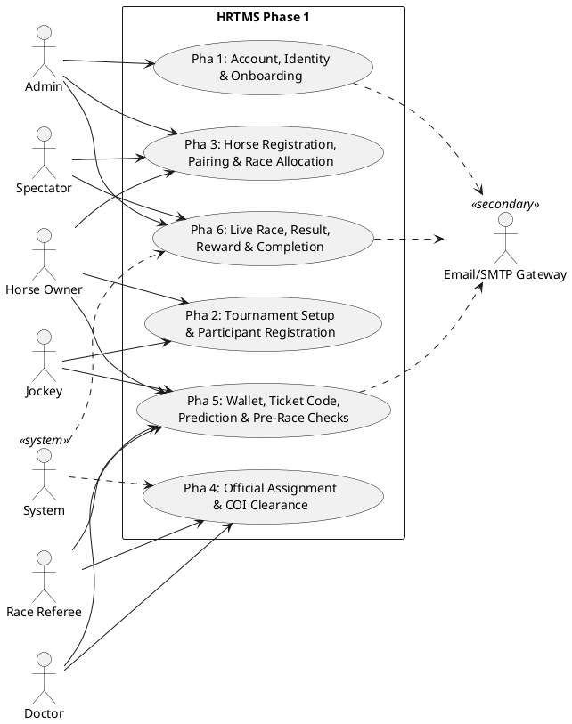

#### A.3.1 — Pha 1: Account, Identity & Onboarding

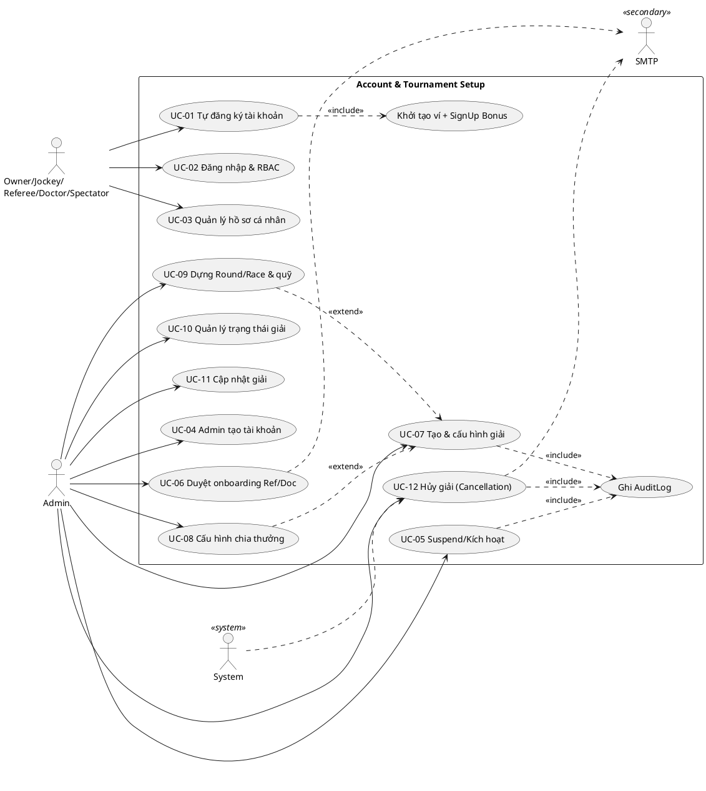

#### A.3.2 — Pha 2: Tournament Setup & Participant Registration

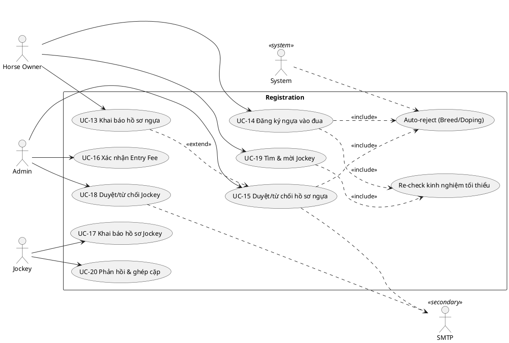

#### A.3.3 — Pha 3: Horse Registration, Pairing & Race Allocation

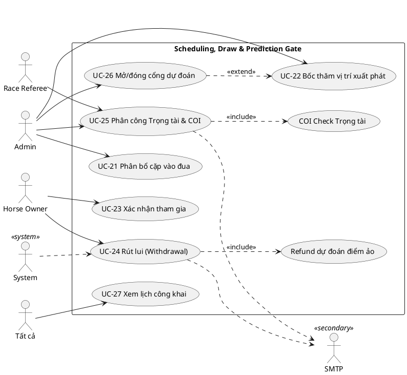

#### A.3.4 — Pha 4: Official Assignment & COI Clearance

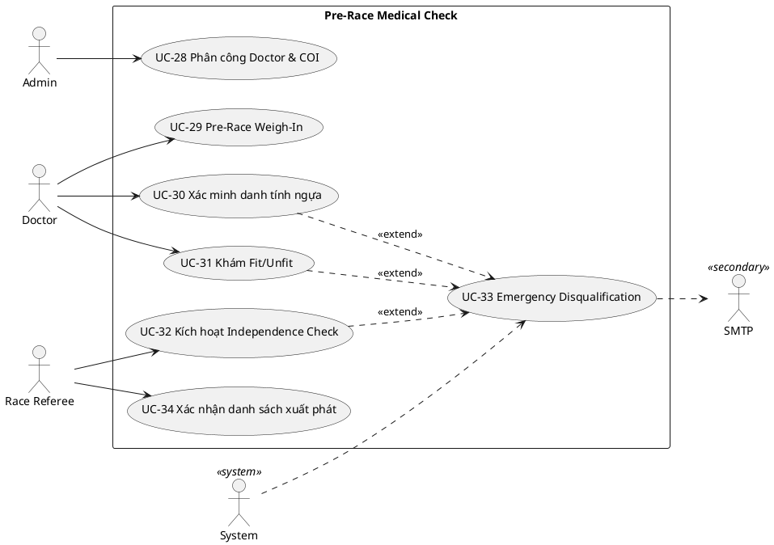

#### A.3.5 — Pha 5: Wallet, Ticket Reward Code, Prediction & Pre-Race Checks

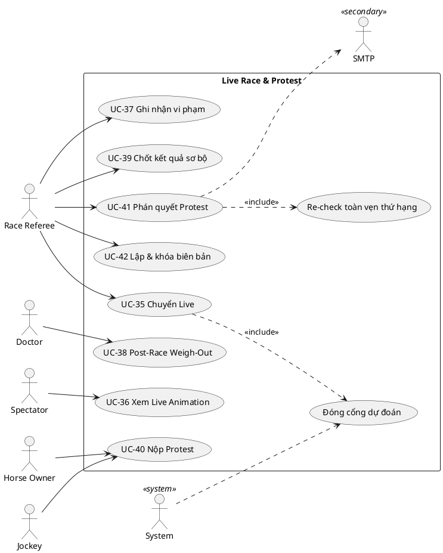

#### A.3.6 — Pha 6: Live Race, Result, Reward & Tournament Completion

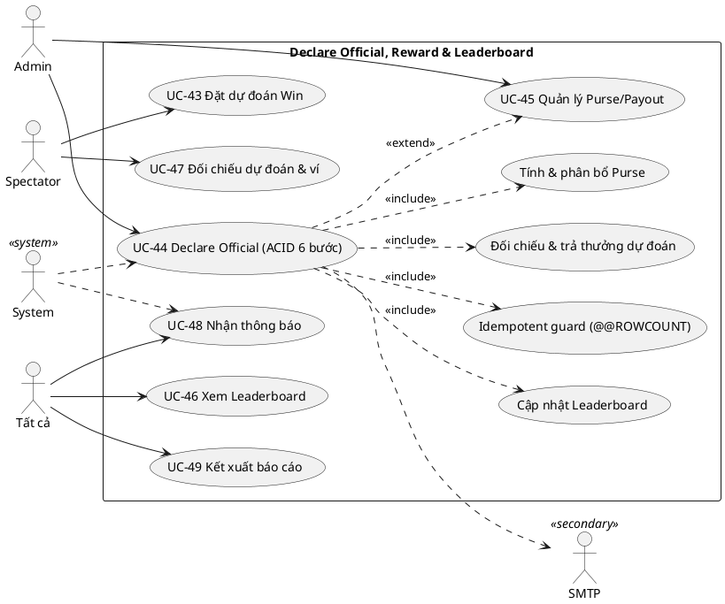

---

### A.4 Tóm tắt Use Case (Use Case Summary)

> Chi tiết từng UC (luồng chính, luồng thay thế, ngoại lệ, business rules) đã được tích hợp vào phần **3.2 Functional Requirements** tương ứng và ma trận truy vết **A.5**. Bảng dưới cung cấp tham chiếu nhanh cho 49 UC theo 6 pha nghiệp vụ.

| UC | Tên Use Case | Pha | Primary Actor | FR Chính |
| --- | --- | --- | --- | --- |
| UC-01 | Tự đăng ký tài khoản | 1 | Jockey / Horse Owner / Doctor / Referee | REQ-F-ACC.1 |
| UC-02 | Đăng nhập & RBAC Routing | 1 | Tất cả Actors | REQ-F-ACC.5, ACC.6 |
| UC-03 | Quản lý hồ sơ cá nhân & đổi mật khẩu | 1 | Tất cả Actors | REQ-F-ACC.3 |
| UC-04 | Admin tạo tài khoản | 1 | Admin | REQ-F-ACC.2 |
| UC-05 | Admin Suspend / Kích hoạt tài khoản | 1 | Admin | REQ-F-ACC.4 |
| UC-06 | Duyệt onboarding Jockey / Referee / Doctor | 1 | Admin | REQ-F-ACC.7, ACC.8 |
| UC-07 | Tạo & cấu hình giải đấu | 1 | Admin | REQ-F-TRN.1, TRN.2 |
| UC-08 | Cấu hình tỷ lệ chia thưởng | 1 | Admin | REQ-F-TRN.4 |
| UC-09 | Dựng cấu trúc Round/Race & quỹ thưởng | 1 | Admin | REQ-F-TRN.6, TRN.7 |
| UC-10 | Quản lý trạng thái giải (State Machine) | 1 | Admin | REQ-F-TRN.8 |
| UC-11 | Cập nhật giải trước khi bắt đầu | 1 | Admin | REQ-F-TRN.9 |
| UC-12 | Hủy giải đấu (Cancellation Flow) | 1 | Admin | REQ-F-TRN.10 |
| UC-13 | Khai báo & quản lý hồ sơ ngựa | 2 | Horse Owner | REQ-F-HRS.1, HRS.2 |
| UC-14 | Đăng ký ngựa vào Tournament | 2 | Horse Owner | REQ-F-HRS.3, HRS.4 |
| UC-15 | Duyệt / từ chối hồ sơ ngựa | 2 | Admin | REQ-F-HRS.5, HRS.6 |
| UC-16 | Xác nhận lệ phí Entry Fee | 2 | Admin | REQ-F-HRS.7 |
| UC-17 | Khai báo hồ sơ Jockey & quan hệ gia đình | 2 | Jockey | REQ-F-JOC.1, JOC.2 |
| UC-18 | Duyệt / từ chối hồ sơ Jockey | 2 | Admin | REQ-F-JOC.3 |
| UC-19 | Tìm & mời Jockey cùng Tournament | 2 | Horse Owner | REQ-F-JOC.4, JOC.5 |
| UC-20 | Phản hồi lời mời & xác nhận ghép cặp | 2 | Jockey | REQ-F-JOC.6 |
| UC-21 | Phân bổ cặp vào cuộc đua | 3 | Admin | REQ-F-SCH.1, SCH.2 |
| UC-22 | Bốc thăm vị trí xuất phát (Post Draw) | 3 | Admin | REQ-F-SCH.3 |
| UC-23 | Xác nhận tham gia trước Cut-off | 3 | Horse Owner | REQ-F-SCH.4 |
| UC-24 | Rút lui / quá hạn (Withdrawal Flow) | 3 | Horse Owner | REQ-F-SCH.5 |
| UC-25 | Phân công Trọng tài & COI Check | 3 | Admin | REQ-F-REF.1, REF.2, REF.3 |
| UC-26 | Cấu hình & mở/đóng cổng dự đoán | 3 | Admin | REQ-F-PRD.1 |
| UC-27 | Xem lịch công khai & Tournament Hub | 3 | Spectator | REQ-F-PUB.1 |
| UC-28 | Phân công Doctor & Doctor COI Check | 4 | Admin | REQ-F-MED.1 |
| UC-29 | Cân Jockey trước đua (Pre-Race Weigh-In) | 4 | Doctor | REQ-F-MED.2, MED.3 |
| UC-30 | Xác minh danh tính ngựa tại Paddock | 4 | Doctor | REQ-F-MED.4 |
| UC-31 | Khám lâm sàng Fit / Unfit | 4 | Doctor | REQ-F-MED.5 |
| UC-32 | Kích hoạt Jockey Independence Check | 4 | Race Referee | REQ-F-MED.6 |
| UC-33 | Loại ngựa khẩn cấp (Emergency DQ) | 4 | System | REQ-F-MED.7 |
| UC-34 | Xác nhận danh sách xuất phát chính thức | 4 | Race Referee | REQ-F-MED.8 |
| UC-35 | Chuyển cuộc đua sang Live | 5 | Race Referee | REQ-F-RACE.1 |
| UC-36 | Xem Live Race Animation | 5 | Spectator | REQ-F-RACE.2 |
| UC-37 | Ghi nhận vi phạm | 5 | Race Referee | REQ-F-RACE.3 |
| UC-38 | Cân Jockey sau đua (Post-Race Weigh-Out) | 5 | Doctor | REQ-F-RACE.4 |
| UC-39 | Chốt kết quả sơ bộ (Unofficial) | 5 | Race Referee | REQ-F-RES.1 |
| UC-40 | Nộp khiếu nại (Protest) | 5 | Horse Owner / Jockey | REQ-F-PRO.1, PRO.2 |
| UC-41 | Điều tra & phán quyết Protest | 5 | Race Referee | REQ-F-PRO.3, PRO.4 |
| UC-42 | Lập & khóa biên bản thi đấu | 5 | Race Referee | REQ-F-RES.2 |
| UC-43 | Nhập ticket reward code & đặt dự đoán Win | 5 | Spectator | REQ-F-PRD.2, PRD.3, PRD.5 |
| UC-44 | Công bố kết quả chính thức (Declare Official — ACID 6 bước) | 6 | Admin | REQ-F-RES.3 |
| UC-45 | Quản lý phân bổ & chi trả thưởng (Purse/Payout) | 6 | Admin | REQ-F-PRZ.1–PRZ.6 |
| UC-46 | Xem Bảng xếp hạng & Standings | 6 | Spectator | REQ-F-LDB.1, LDB.2 |
| UC-47 | Xem đối chiếu dự đoán & ví (Reconciliation) | 6 | Spectator | REQ-F-REC.1, REC.4 |
| UC-48 | Nhận thông báo (In-app + Email) | 1–6 | Tất cả Actors | REQ-F-NTF.1–NTF.5 |
| UC-49 | Kết xuất báo cáo (CSV/PDF/in) | 6 | Admin | REQ-F-RPT.1–RPT.4 |

### A.5 Ma trận Truy vết (Traceability Matrices)

#### A.5.1 — UC → Functional Requirements (bao phủ đủ 112 FR)

| Module | FR (3.2) | UC bao phủ |
| --- | --- | --- |
| A — ACC (9) | ACC.1 | UC-01 |
| | ACC.2 | UC-04 |
| | ACC.3 | UC-03 |
| | ACC.4 | UC-05 |
| | ACC.5 | UC-02 |
| | ACC.6 | UC-02 |
| | ACC.7 | UC-06 |
| | ACC.8 | UC-06 |
| | ACC.9 | UC-01 |
| B — TRN (10) | TRN.1, TRN.2, TRN.3, TRN.5 | UC-07 |
| | TRN.4 | UC-08 |
| | TRN.6, TRN.7 | UC-09 |
| | TRN.8 | UC-10 |
| | TRN.9 | UC-11 |
| | TRN.10 | UC-12 |
| C — HRS (8) | HRS.1, HRS.2, HRS.3, HRS.6 | UC-13 |
| | HRS.4 | UC-14, UC-15 |
| | HRS.5 | UC-15 |
| | HRS.7 | UC-14, UC-16 |
| | HRS.8 | UC-16, UC-24, UC-33, UC-12 |
| D — JOC (7) | JOC.1, JOC.2 | UC-17 |
| | JOC.3 | UC-18 |
| | JOC.4, JOC.5 | UC-19 |
| | JOC.6 | UC-20 |
| | JOC.7 | UC-19, UC-14 |
| E — SCH (9) | SCH.1 | UC-21 |
| | SCH.2 | UC-22 |
| | SCH.3 | UC-27 |
| | SCH.4 | UC-23 |
| | SCH.5 | UC-24 |
| | SCH.6 | UC-09, UC-21 |
| | SCH.7 | UC-14, UC-21 |
| | SCH.8 | UC-14, UC-21 |
| | SCH.9 | UC-11 (đóng băng cấu hình) |
| F — REF (5) | REF.1–REF.5 | UC-25 |
| G — MED (8) | MED.1 | UC-28 |
| | MED.2, MED.3 | UC-29 |
| | MED.4 | UC-30 |
| | MED.5 | UC-31 |
| | MED.6 | UC-32 |
| | MED.7 | UC-33 |
| | MED.8 | UC-34 |
| H — RACE (8) | RACE.1, RACE.2 | UC-35 |
| | RACE.3 | UC-36 |
| | RACE.4, RACE.5 | UC-37 |
| | RACE.6 | UC-40 |
| | RACE.7 | UC-38 |
| | RACE.8 | UC-39 |
| I — PRT (7) | PRT.1, PRT.2 | UC-40 |
| | PRT.3, PRT.4, PRT.5 | UC-41 |
| | PRT.6, PRT.7 | UC-42 |
| J — RES (5) | RES.1–RES.5 | UC-44 |
| K — PRZ (6) | PRZ.1, PRZ.5 | UC-09 |
| | PRZ.2 | UC-44 |
| | PRZ.3, PRZ.4, PRZ.6 | UC-45 |
| L — LDR (4) | LDR.1, LDR.2, LDR.3, LDR.4 | UC-46 (LDR.* cũng chạy trong UC-44 B4) |
| M — PRD (6) | PRD.1, PRD.2 | UC-26 |
| | PRD.3, PRD.4, PRD.5, PRD.6 | UC-43 |
| N — REC (5) | REC.1, REC.2 | UC-44 (B3) |
| | REC.3, REC.4, REC.5 | UC-47 |
| O — NOTI (3) | NOTI.1, NOTI.2, NOTI.3 | UC-48 |
| P — RPT (3) | RPT.1, RPT.2, RPT.3 | UC-49 |
| Q — SEC (6) | SEC.1 | UC-01 (hash), UC-02 |
| | SEC.2 | UC-02 |
| | SEC.3 | UC-05 |
| | SEC.4 | xuyên suốt (RBAC backend mọi UC) |
| | SEC.5 | UC-04, UC-05, UC-06, UC-12, UC-16, UC-22, UC-24, UC-25, UC-33, UC-44 (mọi thao tác nhạy cảm) |
| | SEC.6 | UC-44 / nền tảng (AuditLog append-only) |

> **Kết luận bao phủ:** 112/112 FR được trace bởi ≥ 1 UC. FR mang tính nền tảng/xuyên suốt (SEC.4 RBAC, SEC.6 audit immutability) được hiện thực như **ràng buộc chung** áp cho mọi UC thay vì một UC riêng (đúng Decision 1=B).

#### A.5.2 — UC → UI Screen (3.1)

| UC | UI chính | UC | UI chính |
| --- | --- | --- | --- |
| UC-01 | UI-S02 | UC-26 | UI-S15 |
| UC-02 | UI-S01 | UC-27 | UI-S05 |
| UC-03 | UI-S03 | UC-28 | UI-S11 |
| UC-04 | UI-S16 | UC-29 | UI-S31 |
| UC-05 | UI-S16 | UC-30 | UI-S31 |
| UC-06 | UI-S10 | UC-31 | UI-S31 |
| UC-07 | UI-S09 | UC-32 | UI-S28, UI-S31 |
| UC-08 | UI-S09 | UC-33 | UI-S31 |
| UC-09 | UI-S09 | UC-34 | UI-S28 |
| UC-10 | UI-S08, UI-S09 | UC-35 | UI-S28 |
| UC-11 | UI-S09 | UC-36 | UI-S07 |
| UC-12 | UI-S09 | UC-37 | UI-S28 |
| UC-13 | UI-S20 | UC-38 | UI-S31 |
| UC-14 | UI-S21 | UC-39 | UI-S28 |
| UC-15 | UI-S10 | UC-40 | UI-S23 |
| UC-16 | UI-S12 | UC-41 | UI-S29 |
| UC-17 | UI-S25 | UC-42 | UI-S29 |
| UC-18 | UI-S10 | UC-43 | UI-S33 |
| UC-19 | UI-S21 | UC-44 | UI-S13 |
| UC-20 | UI-S26, UI-S21 | UC-45 | UI-S14 |
| UC-21 | UI-S09 | UC-46 | UI-S06 |
| UC-22 | UI-S09, UI-S05 | UC-47 | UI-S34, UI-S35 |
| UC-23 | UI-S22 | UC-48 | UI-S04 |
| UC-24 | UI-S22 | UC-49 | UI-S18 |
| UC-25 | UI-S11, UI-S27 | | |

> **Bao phủ UI:** 35/35 màn hình được tham chiếu (UI-S01…UI-S35). Lưu ý:
> - **UI-S19/S24/S30/S32** là Dashboard nhóm (điểm vào workspace của Owner/Jockey/Doctor/Spectator) — thể hiện qua điều hướng RBAC ở UC-02 + các UC con của Role.
> - **UI-S17 (Audit Log Viewer)** là màn **read-only** phục vụ giám sát audit xuyên suốt (cross-cutting **REQ-F-SEC.5/SEC.6**): Admin tra cứu nhật ký do các UC ghi `AuditLogs` (UC-04, UC-05, UC-06, UC-12, UC-16, UC-22, UC-24, UC-25, UC-33, UC-44…). Vì là hành vi đọc của một yêu cầu nền tảng (không phải user-goal nghiệp vụ riêng), nó không tách thành UC độc lập theo Decision 1=B, mà gắn với cụm SEC trong ma trận A.5.1.

#### A.5.3 — UC → Actor (2.3.1) — Ma trận tham gia

Ký hiệu: **P** = Primary Actor · **S** = Secondary/Participating · **—** = không tham gia.

| UC | Admin | Owner | Jockey | Referee | Doctor | Spectator | System | SMTP |
| --- | :-: | :-: | :-: | :-: | :-: | :-: | :-: | :-: |
| UC-01 | — | P | P | P | P | P | S | S |
| UC-02 | P | P | P | P | P | P | S | — |
| UC-03 | P | P | P | P | P | P | S | — |
| UC-04 | P | — | — | — | — | — | S | — |
| UC-05 | P | — | — | — | — | — | S | — |
| UC-06 | P | — | — | S | S | — | S | S |
| UC-07–11 | P | — | — | — | — | — | S | — |
| UC-12 | P | — | — | — | — | — | S | S |
| UC-13 | — | P | — | — | — | — | S | — |
| UC-14 | — | P | — | — | — | — | S | — |
| UC-15 | P | — | — | — | — | — | S | S |
| UC-16 | P | — | — | — | — | — | S | — |
| UC-17 | — | — | P | — | — | — | S | — |
| UC-18 | P | — | — | — | — | — | S | S |
| UC-19 | — | P | S | — | — | — | S | — |
| UC-20 | — | S | P | — | — | — | S | — |
| UC-21 | P | — | — | — | — | — | S | — |
| UC-22 | P | — | — | — | — | — | S | — |
| UC-23 | — | P | — | — | — | — | S | — |
| UC-24 | — | P | — | — | — | — | S | S |
| UC-25 | P | — | — | S | — | — | S | S |
| UC-26 | P | — | — | — | — | — | S | — |
| UC-27 | R | R | R | R | R | R | S | — |
| UC-28 | P | — | — | — | — | — | S | — |
| UC-29 | — | — | — | — | P | — | S | — |
| UC-30 | — | — | — | — | P | — | S | — |
| UC-31 | — | — | — | — | P | — | S | — |
| UC-32 | — | — | — | P | — | — | S | — |
| UC-33 | — | S | S | S | S | — | P | S |
| UC-34 | — | — | — | P | — | — | S | — |
| UC-35 | — | — | — | P | — | — | S | — |
| UC-36 | R | R | R | R | R | P | S | — |
| UC-37 | — | — | — | P | — | — | S | — |
| UC-38 | — | — | — | — | P | — | S | — |
| UC-39 | — | — | — | P | — | — | S | — |
| UC-40 | — | P | P | — | — | — | S | — |
| UC-41 | — | S | S | P | — | — | S | S |
| UC-42 | — | — | — | P | — | — | S | — |
| UC-43 | — | — | — | — | — | P | S | — |
| UC-44 | P | — | — | — | — | — | S | S |
| UC-45 | P | — | — | — | — | — | S | — |
| UC-46 | R | R | R | R | R | R | S | — |
| UC-47 | — | — | — | — | — | P | S | — |
| UC-48 | R | R | R | R | R | R | P | S |
| UC-49 | P | R | R | R | R | R | S | — |

> *(R = tham gia ở mức xem/đọc theo quyền RBAC.)* Ma trận khớp với SRS 2.3.3 (Actor ↔ Module ↔ Pha).

---

### A.6 Mô tả nội dung Use Case Diagram (Diagram Descriptions)

- **Context Diagram (A.3.0):** Đặt **system boundary** "HRTMS Phase 1" bao quanh 6 gói Pha. 6 actor người dùng nối association tới các Pha mình tham gia (theo 2.3.3); **System** (`..>`) tham gia các Pha có lõi tự động (Pha 4, 6); **SMTP Gateway** (secondary) nhận luồng email từ Pha 1, 5, 6. Diagram này dùng giới thiệu tổng thể, không hiển thị từng UC.

- **Diagram Pha 1 (A.3.1):** Owner/Spectator đăng ký hợp lệ thì active ngay; Jockey/Referee/Doctor đi qua UC-06 Admin onboarding. Account onboarding không dùng `AutoEligible`. `«include»`: UC-01 → *Khởi tạo ví + SignUp Bonus* với Spectator; UC-06 → *Ghi AuditLog*. SMTP nhận notification từ UC-06 nếu có.

- **Diagram Pha 2 (A.3.2):** Owner đăng ký Tournament và được System auto-approved roster; Jockey/Referee/Doctor đăng ký Tournament thì System screen professional roster, `AutoEligible` vào bulk approval queue, `ManualReview` vào manual queue, `AutoRejected` bị reject. Admin UC-15 chỉ duyệt professional roster, không duyệt Owner roster.

- **Diagram Pha 3 (A.3.3):** Admin nối UC-21/22/25/26; Owner nối UC-23/24; "Tất cả" nối UC-27; Referee tham gia UC-25. `«include»`: UC-24 → *Refund dự đoán điểm ảo*; UC-25 → *COI Check Trọng tài*. `«extend»`: UC-26 mở rộng UC-22 (cổng chỉ mở sau bốc thăm). System primary cho lõi giao dịch UC-24.

- **Diagram Pha 4 (A.3.4):** Admin nối UC-28; Doctor nối UC-29/30/31; Referee nối UC-32/34. `«extend»` hội tụ về **UC-33 Emergency Disqualification** từ UC-30 (Mismatch), UC-31 (Unfit), UC-32 (Independence Fail) — thể hiện rõ UC-33 là hành vi điều kiện. System primary cho UC-33; SMTP nhận 3 thông báo khẩn.

- **Diagram Pha 5 (A.3.5):** Referee nối UC-35/37/39/41/42; Doctor nối UC-38; Spectator nối UC-36; Owner/Jockey nối UC-40. `«include»`: UC-35 → *Đóng cổng dự đoán*; UC-41 → *Re-check toàn vẹn thứ hạng*. SMTP nhận closed-loop từ UC-41.

- **Diagram Pha 6 (A.3.6):** Spectator nối UC-43/47; Admin nối UC-44/45; "Tất cả" nối UC-46/48/49. **UC-44** là trung tâm với 4 `«include»` (*Reconcile, Purse, Leaderboard, Idempotent guard*) + 1 `«extend»` (UC-45). System primary cho UC-44, UC-48; SMTP nhận từ UC-44.

> **Quy ước notation (Decision 14=B):** đường liền = association (actor—UC); `..>` kèm `«include»` = hành vi bắt buộc tách dùng chung; `..>` kèm `«extend»` = hành vi điều kiện; khung `rectangle` = system boundary. Stereotype actor: `<<system>>` cho System, `<<secondary>>` cho SMTP.

---

### A.7 Ghi chú & Khuyến nghị (Notes & Recommendations)

**Tính nhất quán (Consistency) đã đảm bảo:**
- Thuật ngữ & tên thực thể đồng nhất với 1.3 Definitions, 3.4 ERD (27 bảng): `RaceEntries`, `Pairings`, `PursePayouts`, `VirtualPointsTransactions`, `FamilyRelationshipDeclarations`…
- Mọi UC trace ngược tới FR (3.2), UI (3.1), Actor (2.3.1), BR/EC, NFR (3.3) — không có UC "mồ côi".
- Tách quyền (Separation of Concerns) tôn trọng bản cập nhật v1.2: **Independence Check do Race Referee kích hoạt** (UC-32), không phải Doctor.

**Khuyến nghị triển khai & kiểm thử:**
- **Nhóm UC giao dịch ACID** (UC-12, UC-24, UC-33, UC-44) là rủi ro cao nhất — ưu tiên viết **integration test** kiểm tra ROLLBACK toàn phần, idempotent guard (`@@ROWCOUNT`), và bất biến ví `Balance=SUM(transactions)`.
- **Server-side enforcement**: kiểm thử bypass Frontend cho UC-43 (gate đóng), UC-15 (Approve khi chưa Paid), UC-42 (sửa biên bản đã khóa) — phải bị chặn ở Backend/DB.
- **COI/Independence** (UC-25, UC-28, UC-32): test case người thân trực hệ ở các quan hệ Spouse/Parent/Child/Sibling + re-run khi khai báo thay đổi.
- **State machine** (UC-10, trạng thái Race): test chuyển sai trình tự phải bị chặn.
- Mỗi UC nên sinh **≥ 1 test scenario "happy path" + ≥ 1 cho mỗi Exception flow** (Decision 8 = B); UC giao dịch nên thêm test đồng thời (concurrency) cho double-click/đua điều kiện.

**Mở rộng tương lai (ngoài Phase 1):** Payment Gateway (entry fee/purse tiền thật), thông báo SMS, tích hợp phần cứng sân (Photo Finish/GPS), app native — sẽ phát sinh UC mới ở Phase 2; cấu trúc 6-Pha hiện tại cho phép chèn thêm mà không phá vỡ traceability.

---

### Phụ lục B — Design Decisions

**Quyết định thiết kế đã thống nhất (Confirmed Decisions):**

| # | Quyết định | Lựa chọn áp dụng |
| --- | --- | --- |
| D1 | Quy tắc tách UC | **B** — Gộp theo *user-goal*; FR validation/transaction/guard → business rule + alternate/exception flow. **49 UC** truy vết đủ 112 FR |
| D2 | Tổ chức section | **B** — Chia theo **6 Pha nghiệp vụ** (A.4.1 → A.4.6) |
| D3 | Phạm vi Actor | **B** — 6 actor người dùng + **System** + **Email/SMTP Gateway** (secondary) |
| D4 | Primary actor/UC | **A** — 1 UC = 1 primary actor (ngoại lệ ghi rõ cho UC dùng chung) |
| D5 | Mức chi tiết UC | **C — Comprehensive** cho **mọi** UC (main + nhiều alternate + exception đầy đủ + business rules) |
| D6 | Pre/Post-conditions | **B** chung, **C** (state/DB/side-effect) cho nhóm UC giao dịch |
| D7 | Main/Alternate flow | Main 7–14 bước; Alternate = lỗi + vi phạm BR + đường thay thế |
| D8 | Exception handling | **B** — exception cơ bản cho mọi UC |
| D9 | System interaction | **C — chi tiết tương tác UI** (màn hình, nút, field, thông điệp hệ thống ở từng bước) |
| D10 | UC ↔ FR | **B + C** — ghi inline mỗi UC **và** ma trận tổng (A.5.1) |
| D11 | UC ↔ UI | **B** — mỗi UC tham chiếu màn hình `UI-S*` |
| D12 | UC ↔ Actor | **B** — phân biệt quyền theo actor bằng precondition/rule |
| D13 | Tổ chức diagram | **B + context** — 1 context diagram + 6 diagram theo Pha |
| D14 | Quan hệ & boundary | **B** — System boundary + `«include»` / `«extend»` |
| D15 | Công cụ diagram | **B — PlantUML** (notation UML use-case chuẩn) |
| D16 | Business rule trong flow | **C** — validation ở **mọi bước** (tham chiếu BR/EC) |
| D17 | NFR & timing | **B** — tham chiếu `NF-*` và ràng buộc thời gian liên quan |

---

### Phụ lục C — Thuật ngữ & Viết tắt (Glossary)

Glossary đồng bộ với **SRS 1.3 (Definitions)**, **3.2 (FR)**, **3.4 (ERD)**. Mục đích: bảo đảm mọi thuật ngữ dùng trong đặc tả Use Case được định nghĩa thống nhất.

#### C.1 — Actor & Vai trò

| Thuật ngữ | Định nghĩa |
| --- | --- |
| **Actor** | Tác nhân tương tác với hệ thống trong một Use Case: người dùng (6 vai trò), **System**, hoặc secondary (SMTP). |
| **Primary Actor** | Actor khởi tạo Use Case để đạt mục tiêu (goal). |
| **Secondary / Participating Actor** | Actor tham gia/hỗ trợ nhưng không khởi tạo (vd System thực thi giao dịch, SMTP gửi email). |
| **Admin** | Administrator — quản trị toàn hệ thống; không qua luồng tự đăng ký. |
| **Horse Owner** | Chủ ngựa — quản lý hồ sơ ngựa, đăng ký giải, ghép cặp Jockey, nộp Protest. |
| **Jockey** | Nài ngựa — khai báo chứng chỉ/cân nặng/quan hệ gia đình, nhận lời mời, thi đấu. |
| **Race Referee** | Trọng tài — ghi vi phạm, kích hoạt Independence Check, chốt sơ bộ, xử lý Protest, khóa biên bản. |
| **Doctor** | Bác sĩ thú y — Weigh-In/Weigh-Out, xác minh danh tính ngựa, khám Fit/Unfit; chỉ trên Race được phân công. |
| **Spectator** | Khán giả/Người dự đoán — đặt dự đoán Win, nhận thưởng điểm ảo (phi tài chính). |
| **System** | Tác nhân hệ thống — thực thi tự động (auto-reject, COI/Independence Check, ACID transaction, server-side gate). |
| **SMTP / Email Gateway** | Secondary actor ngoài hệ thống — nhận yêu cầu gửi Email outbound (Module O). Không dùng SMS. |

#### C.2 — Use Case & Notation UML

| Thuật ngữ | Định nghĩa |
| --- | --- |
| **Use Case (UC)** | Một chuỗi tương tác giữa actor và hệ thống nhằm đạt một mục tiêu nghiệp vụ (user-goal). |
| **Main Flow** | Luồng thành công chính (happy path). |
| **Alternate Flow (Ax)** | Đường đi thay thế hợp lệ ngoài luồng chính. |
| **Exception Flow (Ex)** | Xử lý lỗi/vi phạm ràng buộc. |
| **Precondition / Postcondition** | Điều kiện phải đúng trước khi UC chạy / trạng thái hệ thống sau khi UC hoàn tất. |
| **Trigger** | Sự kiện châm ngòi UC. |
| **`«include»`** | Quan hệ UML: UC cơ sở **luôn** dùng lại hành vi của UC được include (bắt buộc, dùng chung). |
| **`«extend»`** | Quan hệ UML: UC mở rộng chạy **có điều kiện** bổ sung cho UC cơ sở. |
| **System Boundary** | Khung bao quanh các UC, phân tách bên trong hệ thống với actor bên ngoài. |
| **PlantUML** | Công cụ text-based vẽ sơ đồ UML (Decision 15). |

#### C.3 — Nghiệp vụ đua ngựa (Domain)

| Thuật ngữ | Định nghĩa |
| --- | --- |
| **Tournament / Round / Race** | Giải đấu → Vòng đua (Vòng loại/Bán kết/Chung kết) → Cuộc đua cụ thể. |
| **Pairing** | Cặp ghép Ngựa–Jockey trong một Tournament cụ thể; lưu `TournamentId`; `Confirmed` sau khi Owner xác nhận cuối. |
| **RaceEntry** | Bản ghi một cặp tham gia một Race cụ thể (mang `EntryFeeStatus`, `FinishPosition`…). |
| **AllowedBreed** | Giống ngựa duy nhất được phép/giải (single-select: Thoroughbred/Arabian/Quarter Horse/Mixed). |
| **Post Position Draw** | Bốc thăm vị trí xuất phát ngẫu nhiên, nguyên tử, `UNIQUE(RaceId, PostPosition)`. |
| **Confirmation Cut-off** | Hạn xác nhận tham gia (mặc định 24h trước giờ chạy); quá hạn → Withdrawal Flow. |
| **Withdrawal Flow** | Luồng rút lui/quá hạn → `RaceEntry=Cancelled`, giải phóng cổng, refund dự đoán. |
| **COI Check (Conflict-of-Interest)** | Kiểm tra Trọng tài/Doctor không là thân nhân trực hệ của Owner trong race. |
| **Jockey Independence Check** | Xác minh Jockey không có quan hệ gia đình ruột thịt với Owner đối thủ trong cùng race (do Referee kích hoạt). |
| **Pre-Race Weigh-In / Post-Race Weigh-Out** | Cân Jockey trước/sau đua (Doctor); chênh ngưỡng → cờ cảnh báo. |
| **Fit / Unfit** | Kết luận khám lâm sàng; Unfit cần lý do ≥ 20 ký tự → Emergency Disqualification. |
| **Emergency Disqualification** | Loại ngựa khẩn cấp nguyên tử (Unfit/Mismatch/Independence Fail). |
| **Protest** | Khiếu nại của Owner/Jockey trong cửa sổ Race `Unofficial` (deadline mặc định 120'). |
| **Declare Official** | Công bố kết quả chính thức — ACID transaction 6 bước (Admin). |
| **Purse / PrizeDistributions / Remainder** | Quỹ thưởng / tỷ lệ chia Top1–5 (tổng=100%) / phần dư khi <5 ngựa về đích. |
| **Leaderboard / Jockey Standings** | BXH ngựa (Points 10/5/3 ↔ Earnings) / xếp hạng Jockey (Wins, Win Rate, Income). |
| **Prediction (Win) / Form Score** | Dự đoán ngựa về Nhất (chỉ Win) / chỉ số phong độ tham khảo (SQL tĩnh 40/35/25, không AI/ML). |
| **Virtual Points / Wallet / Ledger** | Điểm ảo phi tài chính; ví giữ bất biến `Balance = SUM(VirtualPointsTransactions)`. |
| **RaceReport** | Biên bản thi đấu điện tử; sau Declare Official → `IsLocked=true`, immutable. |
| **Family Relationship Declaration** | Khai báo quan hệ gia đình (Jockey/Referee/Doctor) phục vụ COI/Independence. |

#### C.4 — Kỹ thuật & Mã tham chiếu

| Thuật ngữ | Định nghĩa |
| --- | --- |
| **RBAC** | Role-Based Access Control — phân quyền theo vai trò, cưỡng chế tại Backend API. |
| **ACID Transaction** | Giao dịch đảm bảo Atomicity/Consistency/Isolation/Durability; lỗi → ROLLBACK toàn bộ. |
| **Idempotent guard** | Cơ chế chống thực thi trùng (vd `UPDATE … WHERE Status='Unofficial'` + kiểm `@@ROWCOUNT`). |
| **Server-side gate** | Kiểm tra điều kiện ở Backend (không chỉ khóa Frontend) — vd cổng dự đoán. |
| **Soft-delete / Suspend** | Vô hiệu hóa thay vì xóa cứng, bảo toàn lịch sử & COI/audit. |
| **READ COMMITTED** | Mức cô lập đọc tối thiểu, chỉ thấy dữ liệu đã commit. |
| **HTTP Polling** | Cập nhật định kỳ (≥ 30s) thay cho WebSocket/SSE. |
| **REQ-F-`<MODULE>`.`<n>`** | Mã Functional Requirement (3.2), vd `REQ-F-RES.3`. |
| **UI-S`<nn>`** | Mã màn hình giao diện (3.1), `UI-S01`…`UI-S35`. |
| **BR-`<nn>`** | Business Rule (BR-01…BR-63). |
| **EC-`<nn>`** | Edge-case (EC-01…EC-48). |
| **NF-`<…>`** | Non-Functional Requirement (3.3), vd `NF-REL.1`, `NF-SEC.3`. |
| **PF** | Product Function = một Module A–Q (SRS 2.3.2). |
| **Pha (Phase) 1–6** | Sáu pha nghiệp vụ: Setup → Registration → Scheduling/Draw → Pre-Race Check → Live & Protest → Declare/Reward. |

---

*PHỤ LỤC (Use Case Diagram, Design Decisions, Glossary)


